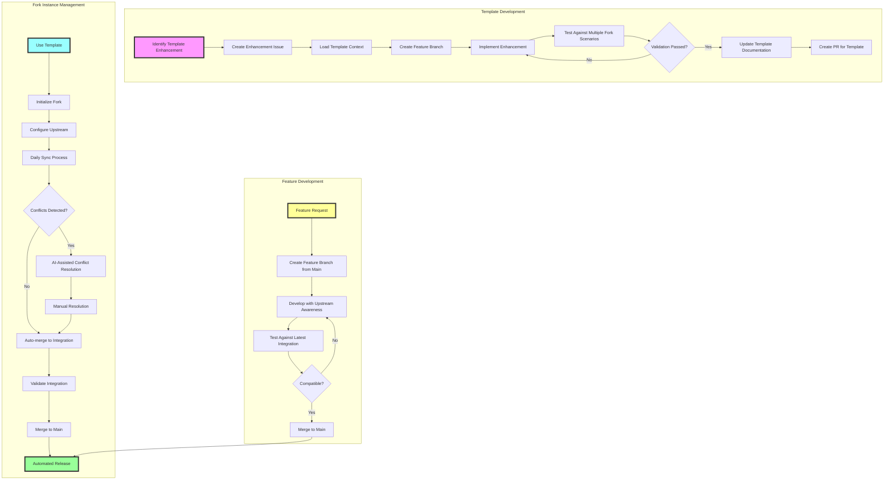

# Contributing to Fork Management Template

This guide explains how to contribute to and use the Fork Management Template. For historical context and architectural reasoning, see [AI_EVOLUTION.md](AI_EVOLUTION.md).

> Follow the structured workflow to ensure quality contributions and successful fork management.

## Quick Reference

**Template vs Instance**: Template (this repo) provides patterns; Instance manages specific upstream fork
**Branch Flow**: `fork_upstream` → `fork_integration` → `main`
**AI Context**: See [CLAUDE.md](CLAUDE.md) and [AI_EVOLUTION.md](AI_EVOLUTION.md) for agent guidance

## Contribution Workflows

### 1. Template Improvements (Contributing to this repository)

When enhancing the fork management template itself:

#### Issue Creation
Create issues for template enhancements, workflow improvements, or documentation updates.

```bash
gh issue create -t "Enhance sync workflow" -l enhancement,template
```

#### Implementation Process
1. **Context Loading**: Review ADRs, existing workflows, and template patterns
2. **Branch Creation**: `git checkout -b agent/<issue>-<description>`
3. **Development**: Follow existing patterns in `.github/workflows/` and documentation
4. **Validation**: Test workflows don't break existing template functionality
5. **Documentation**: Update relevant ADRs and workflow documentation

### 2. Fork Instance Creation (Using this template)

When creating a new fork management repository:

#### Initialization Workflow
1. **Template Usage**: Click "Use this template" to create new repository
2. **Automated Setup**: The `init.yml` workflow automatically:
   - Creates the three-branch structure
   - Sets up branch protection rules
   - Configures upstream repository connection
   - Initializes sync schedules
3. **Manual Configuration**: Complete setup following initialization issue instructions

#### Configuration Requirements
- Set `UPSTREAM_REPO` repository variable
- Configure `GH_TOKEN` secret for automation (optional but recommended)
- Review and adjust sync schedule in `sync-config.json`

### 3. Upstream Synchronization Management

The daily sync process maintains currency with upstream changes:

#### Automated Sync Process
1. **Daily Trigger**: Sync workflow runs automatically
2. **Change Detection**: Compares `fork_upstream` with upstream repository
3. **Conflict Analysis**: AI-enhanced conflict detection and PR description
4. **Integration PR**: Creates PR from `fork_upstream` to `fork_integration`
5. **Validation**: Build and test workflows validate integration

#### Manual Sync Process
```bash
# Trigger manual sync via GitHub Actions
gh workflow run sync.yml
```

#### Conflict Resolution Workflow
When sync conflicts occur:

1. **Conflict Detection**: Automated identification and categorization
2. **Resolution Branch**: Create resolution branch from `fork_integration`
3. **AI-Assisted Analysis**: Use conflict analysis to understand impact
4. **Manual Resolution**: Resolve conflicts maintaining local enhancements
5. **Validation**: Ensure tests pass and functionality preserved
6. **Integration**: Merge resolution back to `fork_integration`

### 4. Feature Development

Regular feature development on fork instances:

#### Branch Strategy
```bash
git checkout -b feature/<feature-name> main
```

#### Development Process
1. **Context Loading**: Understand current fork state and upstream changes
2. **Implementation**: Develop features compatible with upstream evolution
3. **Testing**: Ensure features work with latest integrated upstream changes
4. **Documentation**: Update fork-specific documentation
5. **Integration**: Merge to main branch

#### Conventional Commits
Use conventional commits for automated release management:

```bash
git commit -m "feat: add new data validation"
git commit -m "fix: resolve upstream compatibility issue"
git commit -m "feat!: breaking change for new upstream API"
```

### 5. Release Management

Automated versioning and changelog generation:

#### Release Process
1. **Automated Versioning**: Release Please analyzes conventional commits
2. **Changelog Generation**: Automatic changelog with upstream version tracking
3. **Tag Creation**: Semantic versioning tags with upstream correlation
4. **Release Notes**: Include both local changes and upstream updates

#### Release Strategy
- **Patch**: Bug fixes and minor updates
- **Minor**: New features compatible with current upstream
- **Major**: Breaking changes or major upstream version integration

### 6. Working with AI Agents

This template is optimized for AI-agent collaboration:

#### Context Loading for AI Agents
Before starting work, AI agents must review:
- [AI_EVOLUTION.md](AI_EVOLUTION.md) for historical patterns and lessons
- Current sync state and recent conflict patterns
- ADRs relevant to the planned changes

#### AI Agent Task Assignment
Label issues appropriately for AI assignment:

```bash
gh issue create -t "Resolve sync conflict" -l copilot,conflict-resolution
gh issue create -t "Update integration tests" -l copilot,testing
```

#### Best AI Tasks
- Conflict resolution analysis and suggestions
- Integration test updates for upstream changes
- Documentation updates for workflow changes
- Automated sync issue triage
- Release note generation and formatting

#### Avoid AI Assignment For
- Initial template configuration decisions
- Upstream repository selection and setup
- Security token and access management
- Major architectural workflow changes

## Development Workflow Overview



## Quality Assurance

### Pre-Commit Checklist
- [ ] Workflows validate successfully
- [ ] No breaking changes to existing instances
- [ ] Documentation updated (ADRs if architectural)
- [ ] AI context preserved in CLAUDE.md/AI_EVOLUTION.md

### AI Session Logging
After completing work, update [AI_EVOLUTION.md](AI_EVOLUTION.md) with:
- New patterns discovered
- Conflict resolution strategies that worked
- Template improvements and their impact
- Lessons for future AI agents