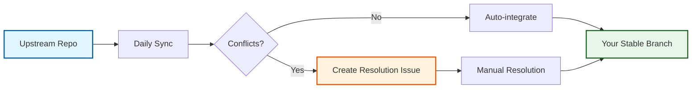

# OSDU SPI Fork Management Template

> **Automated management for long-lived forks with AI-enhanced workflows**

## What This Template Provides

A complete automation system for maintaining forks of upstream OSDU repositories that:

- 🔄 **Automatically syncs** upstream changes daily with conflict detection
- 🤖 **AI-enhanced analysis** provides intelligent PR descriptions and conflict guidance  
- 🛡️ **Three-branch safety** prevents upstream changes from breaking your stable branch
- 📈 **Release correlation** tracks your versions against upstream releases
- 🎯 **Zero-maintenance** operations after initial setup

**Perfect for**: OSDU teams needing Azure SPI customizations while staying current with upstream.

## Quick Start

### 1. Create Your Fork Repository

Click **"Use this template"** → Choose repository name → **Create repository**

### 2. Initialize Your Fork

1. Go to **Actions** → **"Repository Initialization"** → **"Run workflow"**
2. Follow the setup instructions in the automatically created issue
3. Provide your upstream repository URL when prompted
4. Wait 2-5 minutes for complete setup

### 3. Configure Secrets (Optional but Recommended)

For full automation, add these secrets in **Settings** → **Secrets and variables** → **Actions**:

| Secret | Purpose | Required |
|--------|---------|----------|
| `GH_TOKEN` | Repository automation | For branch protection & full automation |
| `ANTHROPIC_API_KEY` | AI-enhanced PR descriptions | Optional but recommended |

### 4. Start Using

- **Daily sync** happens automatically at midnight UTC
- **Manual sync** available in Actions → "Upstream Synchronization"  
- **Conflicts** create detailed issues with resolution guidance
- **Releases** are automatically versioned and correlated with upstream

## How It Works

**Three-Branch Strategy**: Changes flow through `fork_upstream` → `fork_integration` → `main` with validation at each stage.

## Documentation

📚 **[Complete Documentation](https://danielscholl-osdu.github.io/osdu-fork-template/)** - Comprehensive guides covering:

- **[System Concepts](https://danielscholl-osdu.github.io/osdu-fork-template/concepts/)** - Understanding OSDU SPI fork challenges
- **[Architecture Overview](https://danielscholl-osdu.github.io/osdu-fork-template/architecture/overview/)** - System design and components
- **[Workflow Guides](https://danielscholl-osdu.github.io/osdu-fork-template/workflows/synchronization/)** - Detailed workflow explanations
- **[Architecture Decisions](https://danielscholl-osdu.github.io/osdu-fork-template/decisions/)** - Design rationale and evolution

## AI-Enhanced Development

This template is designed for AI-assisted development:

- 🤖 **Claude Code Ready** - Optimized for Claude Code CLI with [MCP integration](https://danielscholl-osdu.github.io/osdu-fork-template/architecture/ai_integration/)
- 🤝 **GitHub Copilot Compatible** - Includes [Copilot instructions](.github/copilot-instructions.md) for seamless collaboration
- 📋 **AI Task Management** - Comment `@copilot` in issues for agent assistance
- 🔄 **AI-Enhanced Workflows** - Intelligent PR descriptions and conflict analysis

## Common Use Cases

### OSDU Energy Platform Forks
- Maintain Azure SPI customizations while syncing upstream security fixes
- Track OSDU community releases with your deployment versions
- Automated conflict resolution for community contributions

### Enterprise Repository Management
- Keep internal forks current with public upstream repositories
- Maintain compliance while adopting upstream improvements
- Automated dependency and security updates

### Multi-Repository Coordination
- Coordinate updates across related fork repositories
- Template-driven consistency across team repositories
- Centralized monitoring and health reporting

## Support and Contributing

- **Issues**: [Report bugs or request features](https://github.com/danielscholl-osdu/osdu-fork-template/issues)
- **Discussions**: [Community support and questions](https://github.com/danielscholl-osdu/osdu-fork-template/discussions)
- **Contributing**: See [CONTRIBUTING.md](CONTRIBUTING.md) for development guidelines
- **Security**: Report security issues privately via [GitHub security advisories](https://github.com/danielscholl-osdu/osdu-fork-template/security/advisories)

## License

This project is licensed under the Apache License 2.0 - see the [LICENSE](LICENSE) file for details.

---

**Need help?** Check the [documentation](https://danielscholl-osdu.github.io/osdu-fork-template/) or [open an issue](https://github.com/danielscholl-osdu/osdu-fork-template/issues/new).