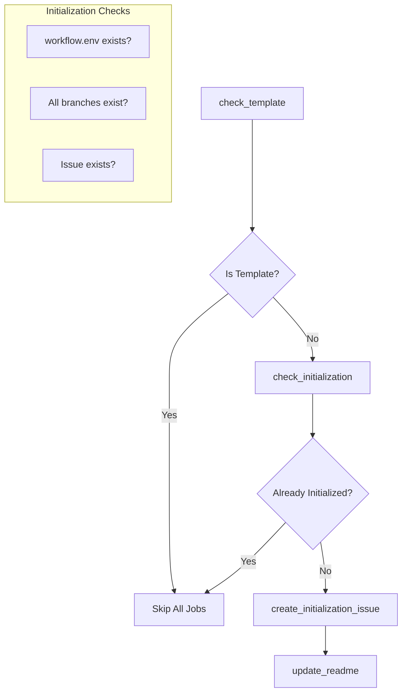
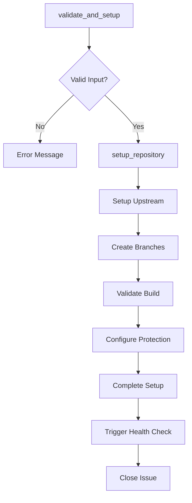

# Fork Management Initialization Workflow Specification

This document specifies the two-workflow initialization pattern for the Fork Management Template, implementing ADR-006 for improved user experience and maintainability.

## Overview

The initialization process is split into two focused workflows that handle distinct phases:

1. **`init.yml`** - User interface and issue management (222 lines)
2. **`init-complete.yml`** - Repository setup and configuration (180 lines)

This separation provides better error handling, clearer user communication, and improved maintainability compared to the previous single-workflow approach.

## Architecture Decision

**Reference**: [ADR-006: Two-Workflow Initialization Pattern](adr/006-two-workflow-initialization.md)

**Key Benefits**:
- **Separation of Concerns**: User interaction vs. system setup
- **Better UX**: Friendly messages with progress updates
- **Maintainability**: Focused workflows easier to debug and modify
- **State Management**: Clear initialization indicators

## Workflow 1: init.yml - User Interface

### Purpose
Creates user-friendly initialization issue and manages initial repository state for template instances.

### Triggers
```yaml
on:
  push:
    branches: [main]  # Template creation detection
```

### Jobs Overview



### State Detection Logic

**Primary Indicator**: `.github/workflow.env` file
- Contains `INITIALIZATION_COMPLETE=true`
- Most reliable indicator of completed setup

**Secondary Checks**:
- Existence of all three branches (`main`, `fork_upstream`, `fork_integration`)
- Existing initialization issues with `initialization` label

### User Experience Features

**Welcome Message**:
```markdown
# 🚀 Welcome to the OSDU Fork Management Template!

## Supported Formats
**GitHub Repository:** `owner/repository-name`
**GitLab Repository:** `https://gitlab.company.com/group/repository-name`

### Instructions
1. Reply to this issue with just the repository reference
2. Automation will validate and begin setup
3. You'll receive progress updates
4. Issue closes automatically when complete
```

**README Integration**:
- Adds initialization status banner to README
- Provides direct link to initialization issue
- Removed automatically upon completion

## Workflow 2: init-complete.yml - Repository Setup

### Purpose
Validates user input, creates repository structure, and completes initialization setup.

### Triggers
```yaml
on:
  issue_comment:
    types: [created]
```

### Conditional Execution
```yaml
if: |
  github.event.issue.state == 'open' &&
  contains(github.event.issue.labels.*.name, 'initialization')
```

### Jobs Overview



### Validation Logic

**GitHub Format**: `^[A-Za-z0-9_.-]+/[A-Za-z0-9_.-]+$`
- Example: `microsoft/OSDU`, `Azure/osdu-infrastructure`

**GitLab Format**: `^https?://[^/]+/[^/]+/[^/]+(/.*)?$`
- Example: `https://gitlab.company.com/group/repository-name`

**Error Handling**:
```yaml
# User-friendly error messages
echo "❌ Invalid repository format. Expected 'owner/repo' but got '$REPO'" | 
  gh issue comment "${{ github.event.issue.number }}" --body-file -
```

### Repository Setup Process

```mermaid
sequenceDiagram
    participant U as User
    participant W as Workflow
    participant R as Repository
    participant I as Issue

    U->>I: Provide upstream repo
    W->>I: ✅ Repository validated
    W->>I: 🔧 Setting up upstream connection...
    W->>R: Add upstream remote
    W->>R: Fetch upstream content
    W->>I: 🌿 Creating branch structure...
    W->>R: Create fork_upstream
    W->>R: Create fork_integration
    W->>I: 🔍 Validating upstream code builds...
    W->>R: Test compilation (Java projects)
    W->>I: 🔀 Updating main branch...
    W->>R: Merge changes to main
    W->>I: 🛡️ Setting up branch protection...
    W->>R: Apply protection rules
    W->>I: 🔒 Enabling security features...
    W->>R: Configure security settings
    W->>I: 🎉 Initialization Complete!
    W->>I: 🔄 Starting comprehensive health check...
    W->>R: Trigger post-init validation workflow
    W->>I: Health check results posted
    W->>I: Close issue
```



### Branch Creation Strategy

1. **fork_upstream**: Created from upstream's default branch (main/master)
   ```bash
   git checkout -b fork_upstream upstream/$DEFAULT_BRANCH
   git push -u origin fork_upstream
   ```

2. **fork_integration**: Created from fork_upstream
   ```bash
   git checkout -b fork_integration fork_upstream
   # Add workflow.env and copy essential files
   git commit -m "chore: add workflow environment and copy workflows"
   git push -u origin fork_integration
   ```

3. **Build Validation**: Validates upstream code quality
   ```bash
   # For Java projects: Set up JDK and test compilation
   mvn clean compile -q -B
   # Provides user feedback on build status and requirements
   ```

4. **main**: Updated via merge from fork_integration
   ```bash
   git checkout main
   git merge fork_integration --no-ff -m "chore: complete repository initialization"
   git push origin main
   ```

### Build Validation Strategy

Before merging upstream code to the main branch, the workflow validates that the code can be built successfully. This prevents broken code from being merged and provides early feedback about potential issues.

**Java Project Detection**:
```bash
# Check for Maven projects
if [ -f "pom.xml" ] || [ -n "$(find . -name 'pom.xml' -type f)" ]; then
  # Java project detected
fi
```

**Build Validation Process**:
1. **Setup**: Configure JDK 17 with Maven caching
2. **Dependencies**: Copy community Maven settings if available
3. **Compilation**: Run `mvn clean compile` with 5-minute timeout
4. **Feedback**: Provide detailed status and guidance

**Success Scenarios**:
- ✅ **Compilation Success**: Code compiles without errors
- ⚠️ **Compilation Warnings**: Code has issues but initialization continues

**User Guidance on Build Issues**:
- Check upstream README for build requirements
- Verify dependency accessibility
- Review Maven settings configuration
- Manual build verification recommended post-init

**Non-Java Projects**:
- Skips build validation with informational message
- Recommends manual verification after initialization

### Post-Initialization Health Check

After the main initialization completes, a comprehensive health check workflow is automatically triggered to perform full validation of the repository.

**Workflow**: `post-init-validation.yml`

**Trigger**: Automatically dispatched by `init-complete.yml` using `workflow_dispatch`

**Health Check Process**:

1. **Repository Structure Verification**
   ```bash
   # Verify all required branches exist
   for branch in main fork_upstream fork_integration; do
     git rev-parse --verify origin/$branch
   done
   
   # Check workflow environment file
   source .github/workflow.env
   test "$INITIALIZATION_COMPLETE" = "true"
   ```

2. **Project Type Detection**
   - Identifies Java/Maven projects vs. other project types
   - Configures appropriate validation strategy

3. **Full Build Validation** (Java Projects)
   ```bash
   # Complete Maven build with tests
   mvn clean install -B -Dmaven.test.failure.ignore=true
   
   # Extract test results and build status
   grep "Tests run:" build_output
   grep "BUILD SUCCESS" build_output
   ```

4. **Comprehensive Reporting**
   - ✅ **Success**: Full build and tests pass
   - ⚠️ **Warnings**: Build succeeds with warnings
   - ❌ **Issues**: Build fails with detailed guidance

**Issue Resolution Guidance**:
When build issues are detected, the health check provides specific guidance:

- **Missing Dependencies**: Repository access and authentication issues
- **Test Failures**: Environment-specific test problems
- **Configuration Issues**: Setup requirements from upstream
- **Network Issues**: Private repository access problems

**User Experience**:
- All progress posted to the initialization issue
- Detailed error analysis and next steps
- Issue automatically closed when health check completes
- Full logs available in Actions tab for troubleshooting

### State Management

**Environment File**: `.github/workflow.env`
```bash
INITIALIZATION_COMPLETE=true
UPSTREAM_REPO_URL=$UPSTREAM_URL
```

**Secrets Configuration**:
```bash
echo "$UPSTREAM_URL" | gh secret set UPSTREAM_REPO_URL
```

### Branch Protection Configuration

```json
{
  "required_status_checks": {
    "strict": true,
    "contexts": []
  },
  "enforce_admins": false,
  "required_pull_request_reviews": {
    "required_approving_review_count": 1,
    "dismiss_stale_reviews": true
  },
  "restrictions": null,
  "allow_force_pushes": false,
  "allow_deletions": false
}
```

Applied to all three branches: `main`, `fork_upstream`, `fork_integration`

### Security Features

**Repository Security Settings**:
- Secret scanning enabled
- Dependency vulnerability alerts
- Security advisory database updates

**Configuration File**: `.github/security-on.json`

### Completion Messaging

**Success Summary**:
```markdown
🎉 **Initialization Complete!**

✅ **Branch Structure:**
- `main` - Your stable development branch
- `fork_upstream` - Tracks upstream changes  
- `fork_integration` - Integration and conflict resolution

✅ **Branch Protection:** All branches protected with PR requirements
✅ **Upstream Connection:** Connected to `upstream/repo`
✅ **Automated Workflows:** Sync, validation, and release workflows active
✅ **Build Validation:** Upstream code validated during initialization
✅ **Security Features:** Secret scanning and dependency updates enabled

## Next Steps
1. Review workflows in Actions tab
2. Check documentation in `doc/` folder
3. Start developing with feature branches from `main`
4. Upstream sync happens automatically via sync workflow
```

## Concurrency Control

```yaml
concurrency:
  group: ${{ github.workflow }}-${{ github.event.issue.number }}
  cancel-in-progress: false
```

Prevents multiple initialization attempts on the same issue while allowing parallel processing of different repositories.

## Error Recovery

**Validation Failures**:
- Clear error messages with expected format examples
- No repository changes made on validation failure
- User can immediately retry with correct format

**Setup Failures**:
- Detailed error context in issue comments
- State preserved for manual intervention if needed
- Logs available in Actions tab for debugging

## Performance Characteristics

**Execution Time**:
- Issue creation: < 30 seconds
- Full setup: 2-5 minutes (depending on upstream size)
- README updates: < 15 seconds

**Resource Usage**:
- Standard GitHub Actions runner
- No external dependencies
- Minimal network usage (GitHub API + git operations)

## Testing Strategy

**Unit Testing**:
- Validation logic testing with various input formats
- State detection logic verification
- Error message accuracy

**Integration Testing**:
- End-to-end template creation and initialization
- Multi-provider upstream repository testing
- Branch protection and security feature verification

**User Acceptance Testing**:
- Non-technical user initialization flow
- Error recovery and retry scenarios
- Documentation clarity and completeness

## Maintenance Considerations

**Monitoring**:
- Issue creation success rate
- Setup completion rate
- User error patterns
- Performance metrics

**Evolution**:
- Template customization support
- Additional validation rules
- Enhanced progress reporting
- Multi-language repository support

## References

- [ADR-006: Two-Workflow Initialization Pattern](adr/006-two-workflow-initialization.md)
- [Product Architecture: Initialization](product-architecture.md#42-two-workflow-initialization-architecture-adr-006)
- [Sync Workflow Specification](sync-workflow.md)
- [Build Workflow Specification](build-workflow.md)