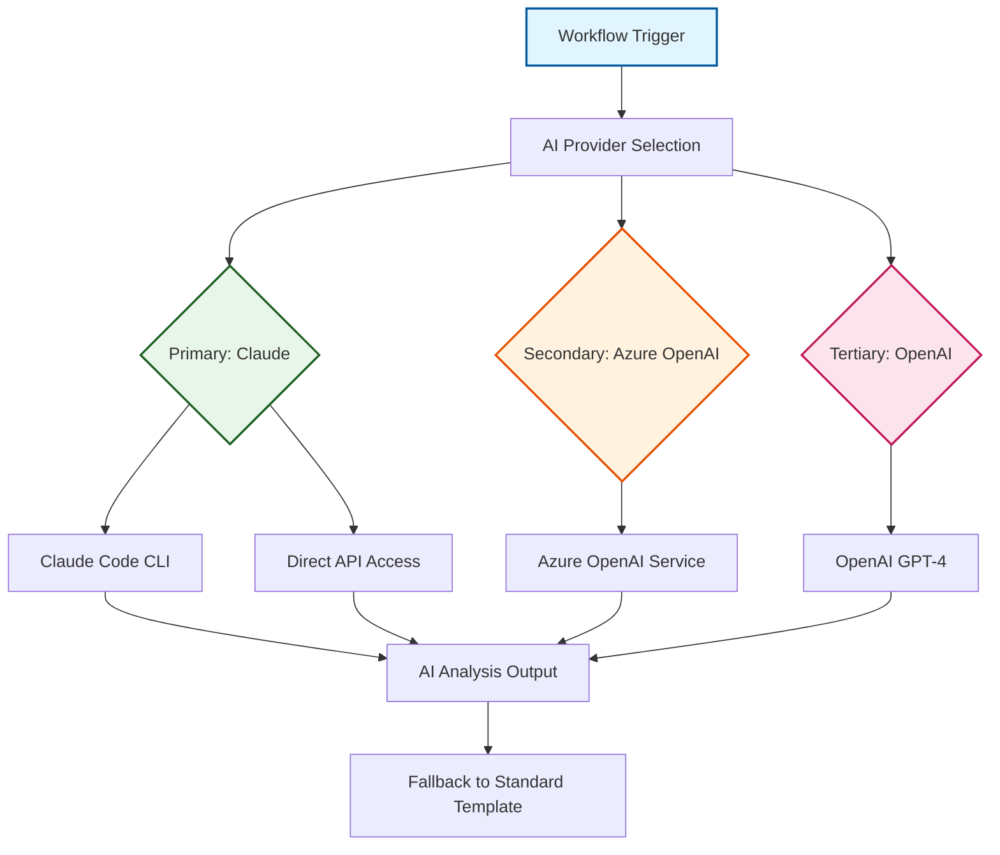
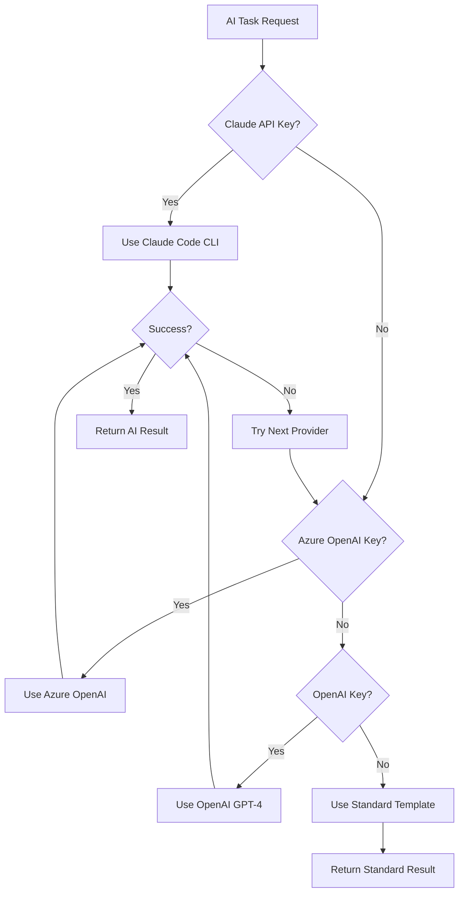

# AI Integration Architecture

The OSDU SPI Fork Management system incorporates sophisticated AI capabilities to enhance development workflows while maintaining reliability and cost-effectiveness. This integration provides intelligent analysis, automated documentation generation, and enhanced decision-making support throughout the fork management lifecycle.

## AI Integration Philosophy

<div class="grid cards" markdown>

-   :material-robot-outline:{ .lg .middle } **Enhancement, Not Dependency**

    ---

    AI capabilities enhance existing workflows without creating dependencies. All core functionality operates normally when AI services are unavailable, ensuring system reliability.

</div>

<div class="grid cards" markdown>

-   :material-swap-horizontal:{ .lg .middle } **Multi-Provider Architecture**

    ---

    Support for multiple AI providers prevents vendor lock-in and enables intelligent provider selection based on availability, cost, and capability requirements.

</div>

<div class="grid cards" markdown>

-   :material-shield-star:{ .lg .middle } **Secure by Design**

    ---

    API keys and sensitive data are handled through secure GitHub secrets management with proper access controls and audit trails.

</div>

<div class="grid cards" markdown>

-   :material-cash-multiple:{ .lg .middle } **Cost-Conscious Usage**

    ---

    Intelligent usage patterns, caching, and fallback strategies control API costs while maximizing value from AI capabilities.

</div>

## AI Provider Architecture



### Provider Hierarchy

| Provider | Priority | Integration | Key Strengths | Best Use Case |
|----------|----------|-------------|---------------|---------------|
| :material-brain: **Claude (Anthropic)** | Primary | Claude Code CLI + MCP | Code analysis, reasoning, large context | Complex analysis and generation tasks |
| :material-microsoft-azure: **Azure OpenAI** | Secondary | Azure API + Enterprise features | Enterprise integration, compliance | Microsoft-aligned environments |
| :material-openai: **OpenAI** | Tertiary | Direct API access | Broad model availability, baselines | Comprehensive fallback coverage |

!!! info "Provider Selection Strategy"
    The system automatically selects the highest-priority available provider, with intelligent fallback to ensure reliable operation even when primary services are unavailable.

## AI-Enhanced Capabilities

<div class="grid cards" markdown>

-   :material-text-box-search:{ .lg .middle } **Intelligent Change Analysis**

    ---

    AI-powered analysis of upstream changes and merge conflicts with structured impact assessment and intelligent resolution guidance

    - **Change Classification**: Automatic categorization of changes (feat, fix, breaking, etc.)
    - **Impact Assessment**: Analysis of potential effects on Azure SPI implementations
    - **Conflict Resolution**: Intelligent guidance for merge conflict resolution strategies
    - **Risk Evaluation**: Identification of high-risk changes requiring careful review

</div>

<div class="grid cards" markdown>

-   :material-file-document-edit:{ .lg .middle } **Automated Documentation Generation**

    ---

    AI-generated pull request descriptions and conventional commit messages that integrate seamlessly with semantic versioning workflows

    - **PR Enhancement**: Comprehensive pull request descriptions with structured summaries
    - **Conventional Commits**: Standardized commit messages with proper scope detection
    - **Breaking Change Detection**: Automatic identification and marking of breaking changes
    - **Release Integration**: Messages designed for automated changelog generation

</div>

!!! example "AI-Generated PR Description Sample"
    ```markdown
    ## Summary
    This sync integrates 12 commits from upstream with primarily dependency updates and security fixes.
    
    ## Key Changes
    - **Security**: Updated Jackson dependency to resolve CVE-2023-35116
    - **Enhancement**: Improved error handling in data processing pipeline
    
    ## Impact Assessment
    - **Breaking Changes**: None detected
    - **Testing**: All upstream tests passing
    ```

<div class="grid cards" markdown>

-   :material-security:{ .lg .middle } **AI-Enhanced Security Analysis**

    ---

    AI-powered security analysis that provides contextual vulnerability assessment, intelligent secret detection, and actionable remediation guidance

    - **Vulnerability Triage**: Contextual risk assessment with intelligent priority ranking
    - **Secret Detection**: Advanced pattern recognition with false positive reduction
    - **Remediation Guidance**: Specific recommendations for vulnerability and secret resolution
    - **Risk Assessment**: Deployment context analysis for accurate threat evaluation

</div>

!!! success "AI Integration Benefits"
    These AI capabilities work together to create an intelligent development environment that reduces manual effort, improves code quality, and accelerates the development lifecycle while maintaining security and reliability standards.

## Technical Implementation

### :material-console: Claude Code CLI Integration

#### **Installation and Configuration**
Automated setup in GitHub Actions workflows:

```yaml
# Claude Code CLI Installation
- name: Install Claude Code CLI
  run: npm install -g @anthropic-ai/claude-code

# MCP Configuration for Maven Projects  
- name: Configure MCP Servers
  run: |
    cat > .mcp.json << 'EOF'
    {
      "mcpServers": {
        "mvn-mcp-server": {
          "type": "stdio",
          "command": "uvx",
          "args": ["--from", "git+https://github.com/danielscholl-osdu/mvn-mcp-server@main", "mvn-mcp-server"]
        }
      }
    }
    EOF
```

#### **Model Context Protocol (MCP) Integration**
Specialized tool integration for enhanced AI capabilities:

- **Maven MCP Server**: Dependency analysis and management recommendations
- **Git Integration**: Repository history and change pattern analysis
- **Security Scanning**: Vulnerability database integration and analysis
- **Documentation Tools**: Automated documentation generation and validation

### :material-api: Multi-Provider Fallback Strategy

#### **Provider Selection Logic**


!!! warning "Graceful Degradation"
    When AI services are unavailable, the system automatically falls back to proven alternatives:
    
    ✓ **Standard Templates** for PR descriptions and commit messages  
    ✓ **Rule-based Analysis** for conflict detection and categorization  
    ✓ **Manual Workflows** with clear guidance for AI-enhanced tasks  
    ✓ **Informative Error Messages** about service availability

### :material-lightning-bolt: Performance Optimization

| Strategy | Implementation | Benefit | Control Mechanism |
|----------|----------------|---------|-------------------|
| **Response Caching** | Cache similar change patterns | Reduced API calls | Intelligent cache invalidation |
| **Model Selection** | Task complexity analysis | Optimized costs | Automatic provider selection |
| **Batch Processing** | Group related tasks | Improved efficiency | Smart batching algorithms |
| **Usage Monitoring** | Track API costs | Budget visibility | Real-time cost tracking |
| **Intelligent Routing** | Cost-effective providers | Optimized spending | Provider cost comparison |
| **Context Optimization** | Minimize token usage | Reduced costs | Smart content summarization |
| **Budget Controls** | Configurable limits | Cost management | Automated alerts and limits |

## Security and Compliance

=== "🔐 API Security"

    **Secure Storage & Access Control:**
    
    - **GitHub Secrets**: Encrypted storage of all AI provider API keys
    - **Environment Isolation**: Separate keys for different environments  
    - **Access Controls**: Limited access based on repository permissions
    - **Audit Logging**: Complete audit trail of AI service usage

=== "📊 Data Protection"

    **Privacy & Compliance:**
    
    - **Minimal Data Exposure**: Only necessary code changes sent to AI services
    - **No Persistent Storage**: AI providers don't retain workflow data
    - **Regional Compliance**: Data residency support through Azure OpenAI
    - **Encryption**: All API communications use TLS encryption

=== "✅ Quality Assurance"

    **Output Validation & Reliability:**
    
    - **Format Verification**: Ensure AI outputs meet expected formats
    - **Content Filtering**: Validate appropriate content in AI-generated text
    - **Consistency Checks**: Verify consistency across related AI outputs
    - **Human Review**: Require human approval for critical AI-generated content
    - **Timeout Handling**: Appropriate timeouts for AI service calls
    - **Error Recovery**: Robust error handling with informative messages
    - **Service Monitoring**: Track AI service availability and performance
    - **Fallback Testing**: Regular validation of fallback mechanisms

---

*This AI integration architecture enhances the fork management system with intelligent capabilities while maintaining reliability, security, and cost-effectiveness through thoughtful design and implementation.*