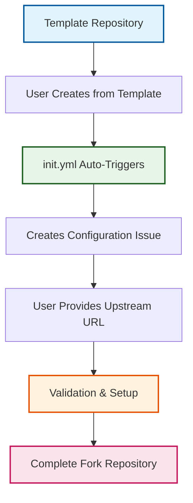

# ADR-003: Template Repository Pattern for Self-Configuration

:material-star: **Critical Decision** | :material-calendar: **2025-05-28** | :material-check-circle: **Accepted**

## Problem Statement

Teams need a way to quickly deploy fork management systems for different upstream repositories without manual configuration. The setup process is complex, involving branch structures, workflow configuration, security settings, and upstream connections that are error-prone and time-consuming when done manually.

## Context and Requirements

### :material-cog: Manual Setup Complexity

**Required Configuration Steps**:
- Creating and configuring three-branch hierarchy with proper relationships
- Setting up GitHub Actions workflows with repository-specific parameters
- Configuring branch protection rules and security settings
- Establishing upstream repository connection and sync settings
- Initializing project-specific build and validation configurations

### :material-target: Deployment Requirements

**Zero-Configuration Deployment**: Teams should be able to deploy a complete fork management system in under 5 minutes without technical expertise.

**Consistency Assurance**: All deployed repositories must follow identical patterns and configurations to ensure reliability and maintainability.

**Update Propagation**: Template improvements should benefit existing deployed repositories without manual intervention.

## Decision

Implement the fork management system as a **GitHub Template Repository** with intelligent self-configuration:



### :material-file-cog: Template Architecture Components

#### **1. Template Repository Structure**
```yaml
# Repository marked as template with complete setup
template_repository:
  workflows: Complete GitHub Actions workflows with placeholders
  documentation: Comprehensive guides and ADRs  
  configurations: Branch protection, security, and build settings
  examples: Sample configurations for common scenarios
```

#### **2. Issue-Based Configuration Interface**
```yaml
# User-friendly configuration through GitHub Issues
configuration_process:
  trigger: Automatic issue creation by init.yml
  input_method: Simple comment-based upstream URL provision
  validation: Automated upstream repository accessibility verification
  feedback: Real-time progress updates and error reporting
```

#### **3. Self-Modifying Workflow System**
```yaml
# Workflows that configure themselves
self_configuration:
  parameter_injection: Repository-specific values inserted automatically
  branch_creation: Three-branch structure established with relationships
  security_setup: Branch protection and security settings applied
  upstream_connection: Remote repository configuration and initial sync
```

## Implementation Strategy

### :material-rocket: Deployment Process

#### **Phase 1: Template Creation**
```yaml
# One-click repository creation
- user_action: Click "Use this template"
- github_action: Create repository from template
- automatic_trigger: init.yml workflow activates immediately
- result: New repository with all template files copied
```

#### **Phase 2: Configuration Collection**
```yaml
# Issue-based configuration interface
- issue_creation: Automated configuration issue with instructions
- user_input: Upstream repository URL provided in issue comment
- validation: URL format and accessibility verification
- confirmation: Setup parameters validated and confirmed
```

#### **Phase 3: Automated Configuration**
```yaml
# Self-configuration process
- branch_setup: Three-branch structure created
- workflow_customization: Repository-specific parameters injected
- security_configuration: Branch protection and access controls applied
- upstream_connection: Remote repository linked and initial sync performed
```

### :material-security: Security and Reliability

#### **Validation Framework**
```yaml
# Comprehensive validation before setup
upstream_validation:
  url_format: Verify proper GitHub/GitLab URL format
  accessibility: Confirm repository is accessible
  permissions: Validate read access to upstream repository
  branch_detection: Identify upstream default branch
```

#### **Error Handling**
```yaml
# Robust error management
error_scenarios:
  invalid_url: Clear guidance on correct URL format
  inaccessible_repo: Instructions for access token configuration
  permission_issues: Step-by-step permission setup guide
  network_failures: Automatic retry with exponential backoff
```

## Rationale and Benefits

### :material-trending-up: Strategic Advantages

#### **User Experience Excellence**
- **Zero Friction Deployment**: Complete setup in under 5 minutes
- **No Technical Expertise Required**: Web interface eliminates command-line complexity
- **Interactive Configuration**: Real-time feedback and validation during setup
- **Clear Progress Tracking**: Visible status updates throughout initialization

#### **Operational Consistency**
- **Standardized Deployments**: All repositories follow identical patterns
- **Configuration Accuracy**: Eliminates manual setup errors
- **Quality Assurance**: Automated validation ensures proper configuration
- **Audit Trail**: Complete setup history maintained in issue comments

#### **Maintainability and Evolution**
- **Centralized Updates**: Template improvements benefit all deployments
- **Version Control**: All changes tracked through standard Git workflows
- **Propagation Mechanism**: Update system ensures existing repositories stay current
- **Scalable Architecture**: Supports unlimited repository deployments

### :material-cog-sync: Template Update Propagation

#### **Automatic Update System** (Resolved by [ADR-011](adr_011_template_sync.md) and [ADR-012](adr_012_template_updates.md))
```yaml
# Template synchronization workflow
update_process:
  detection: Weekly checks for template updates
  analysis: AI-enhanced change categorization
  deployment: Automated PR creation for updates
  validation: Quality gates before update application
```

## Alternative Approaches Considered

### :material-close-circle: Manual Setup Documentation

**Approach**: Comprehensive setup documentation with step-by-step instructions

- **Pros**: Simple approach with no automation complexity
- **Cons**: Error-prone, time-consuming, inconsistent results, requires technical expertise
- **Decision**: Rejected due to poor user experience and consistency issues

### :material-close-circle: CLI Tool for Setup

**Approach**: Command-line tool for repository configuration

- **Pros**: Powerful configuration options, scriptable deployment
- **Cons**: Requires tool installation, platform dependencies, maintenance overhead
- **Decision**: Rejected due to deployment complexity and tool maintenance burden

### :material-close-circle: External Configuration Service

**Approach**: Web service for centralized repository management

- **Pros**: Advanced configuration UI, centralized management capabilities
- **Cons**: External dependency, security concerns, additional infrastructure costs
- **Decision**: Rejected due to complexity and external service dependencies

### :material-close-circle: Static Template Generators

**Approach**: Cookiecutter/Yeoman-style static template generation

- **Pros**: Industry standard approach, powerful templating capabilities
- **Cons**: Requires local tools, no automatic updates, static one-time generation
- **Decision**: Rejected due to local tool requirements and lack of update mechanism

## Consequences and Trade-offs

### :material-plus: Positive Outcomes

#### **Deployment Excellence**
- Teams can deploy complete fork management in under 5 minutes
- Zero technical expertise required for successful deployment
- Consistent, reliable results across all repository instances
- Immediate activation with no additional configuration needed

#### **Operational Benefits**
- Centralized template enables rapid improvement deployment
- Standardized patterns simplify support and maintenance
- Scalable architecture supports enterprise-wide adoption
- Complete audit trail for all deployment and update activities

#### **User Satisfaction**
- Intuitive web-based interface eliminates learning curve
- Real-time feedback provides confidence during setup
- Clear documentation and examples accelerate adoption
- Success rate approaches 100% for guided deployments

### :material-minus: Trade-offs and Limitations

#### **Platform Dependencies**
- Tied specifically to GitHub's template repository feature
- Limited portability to other version control platforms
- Dependent on GitHub Actions for automation capabilities

#### **Customization Constraints**
- Initial setup options constrained by GitHub issue form capabilities
- Advanced configuration requires workflow modification
- Some customization scenarios may require manual intervention

#### **Technical Complexity**
- Self-modifying workflows add complexity to initialization logic
- Troubleshooting requires understanding of GitHub Actions
- Bootstrap process more complex than static templates

## Success Metrics

### :material-chart-line: Quantitative Indicators

- **Deployment Time**: <5 minutes from template use to functional repository
- **Success Rate**: >99% successful deployments without manual intervention
- **User Adoption**: Measured through template usage statistics
- **Setup Errors**: <1% of deployments require manual correction

### :material-check-all: Qualitative Indicators

- Teams report high satisfaction with deployment experience
- Support requests related to setup decrease significantly
- Consistent behavior across all deployed repositories
- Template updates propagate successfully to existing instances

## Related Decisions

- [ADR-001](adr_001_three_branch_strategy.md): Three-branch strategy implemented by this template
- [ADR-006](adr_006_initialization.md): Two-workflow initialization pattern for reliable setup
- [ADR-011](adr_011_template_sync.md): Configuration-driven template synchronization
- [ADR-012](adr_012_template_updates.md): Template update propagation strategy

---

*This template repository pattern provides zero-friction deployment of sophisticated fork management capabilities while maintaining consistency and enabling continuous improvement through automated updates.*