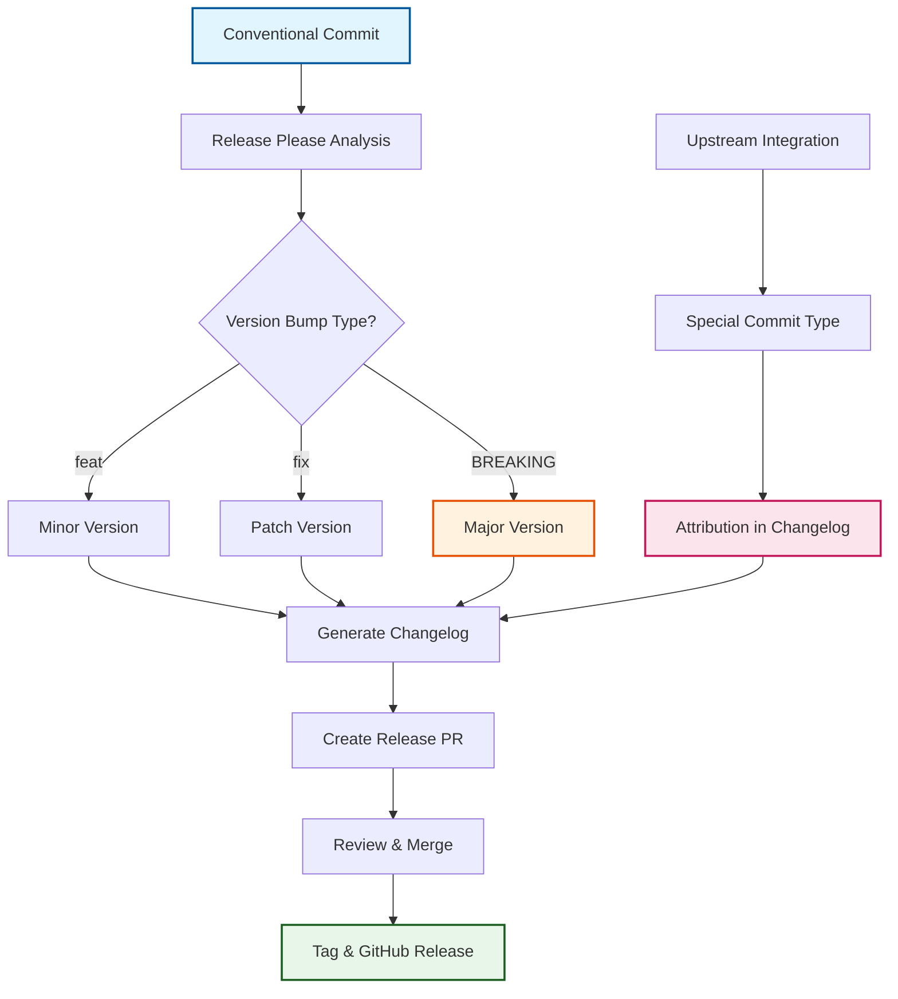

# ADR-004: Release Please for Automated Version Management

:material-star: **Critical Decision** | :material-calendar: **2025-05-28** | :material-check-circle: **Accepted**

## Problem Statement

Fork repositories require sophisticated automated version management that can handle both local modifications and upstream integration while maintaining semantic versioning principles and generating clear changelog documentation. Traditional fork versioning approaches often fail to distinguish between local changes and upstream integration, creating unclear version histories and confusing release documentation.

## Context and Requirements

### :material-alert-circle: Fork Version Management Challenges

**Dual-Source Change Complexity**:
- Need to distinguish between local enhancements and upstream integration changes
- Version numbers must reflect both fork evolution and upstream alignment
- Changelog generation requires attribution of changes to local vs upstream sources
- Release tags should reference both local and upstream version relationships

**Automation Requirements**:
- Semantic versioning based on standardized commit message conventions
- Automated changelog generation with meaningful categorization and formatting
- Release process automation without manual intervention or human approval gates
- Integration with three-branch fork management strategy for consistent workflow

**Documentation and Transparency**:
- Meaningful changelogs that clearly communicate change impact and source
- Release tags that maintain relationship between fork and upstream versions
- Clear audit trail for all version decisions and change attribution
- Team communication improvements through standardized commit messaging

### :material-target: Version Management Requirements

**Conventional Commit Integration**: Standardized commit message format enabling automated version determination and change categorization.

**Fork-Aware Versioning**: Version management system that understands and handles fork-specific versioning needs including upstream references.

**Automated Release Pipeline**: Complete automation from commit to release without manual intervention while maintaining quality and accuracy.

## Decision

Adopt **Google's Release Please action** for automated version management with Conventional Commits integration:



### :material-format-text Conventional Commits Foundation

#### **Standardized Commit Format**
```yaml
# Conventional commit structure
commit_format:
  pattern: "<type>[optional scope]: <description>"
  body: "[optional body explaining the change]"
  footer: "[optional footer(s) with breaking changes]"
  
  examples:
    feature: "feat(auth): add OAuth integration for upstream sync"
    bugfix: "fix(cascade): resolve conflict detection in merge workflow"
    breaking: "feat!: migrate to new upstream API (BREAKING CHANGE)"
    upstream: "upstream: integrate v2.3.1 changes from upstream repository"
```

#### **Version Bump Mapping**
```yaml
# Semantic version determination rules
version_bumps:
  major: "BREAKING CHANGE footer or ! after type"
  minor: "feat type commits"
  patch: "fix type commits"
  
  no_bump:
    - docs: Documentation only changes
    - style: Code style/formatting changes
    - refactor: Code refactoring without feature changes
    - test: Test additions or modifications
    - chore: Maintenance tasks and tooling updates
```

### :material-auto-fix Release Please Configuration

#### **Fork-Optimized Setup**
```yaml
# .github/workflows/release.yml configuration
release_please_config:
  release_type: "simple"
  package_name: "fork-management-template"
  
  changelog_types:
    features: 
      type: "feat"
      section: "✨ New Features"
      hidden: false
    
    fixes:
      type: "fix" 
      section: "🐛 Bug Fixes"
      hidden: false
      
    upstream:
      type: "upstream"
      section: "🔄 Upstream Integration"
      hidden: false
      
    maintenance:
      type: "chore"
      section: "🛠️ Maintenance"
      hidden: false
```

#### **Fork-Specific Enhancements**
```yaml
# Enhanced release management for forks
fork_enhancements:
  upstream_tags: "Release tags include upstream version references"
  change_attribution: "Commits marked with source (local vs upstream)"
  integration_notes: "Special handling for upstream integration commits"
  version_correlation: "Changelog includes upstream version relationship"
```

## Implementation Strategy

### :material-cog-sync Automated Workflow Integration

#### **Release Please Workflow**
```yaml
# Complete release automation pipeline
name: Release Please

on:
  push:
    branches: [main]

jobs:
  release-please:
    runs-on: ubuntu-latest
    outputs:
      release_created: ${{ steps.release.outputs.release_created }}
      tag_name: ${{ steps.release.outputs.tag_name }}
    steps:
      - uses: googleapis/release-please-action@v4
        id: release
        with:
          config-file: .release-please-config.json
          manifest-file: .release-please-manifest.json
```

#### **Enhanced Changelog Generation**
```yaml
# Fork-aware changelog configuration
changelog_enhancements:
  upstream_integration:
    title: "🔄 Upstream Integration"
    description: "Changes integrated from upstream repository"
    commits: "upstream: integrate upstream changes from version X.Y.Z"
    
  local_features:
    title: "✨ Fork-Specific Features" 
    description: "New capabilities developed specifically for this fork"
    commits: "feat: enhance cascade workflow with monitoring"
    
  compatibility:
    title: "🔧 Compatibility Updates"
    description: "Changes to maintain upstream compatibility"
    commits: "fix: update API calls for upstream compatibility"
```

### :material-check-circle-outline Commit Message Validation

#### **Automated Enforcement**
```yaml
# Conventional commit validation workflow
name: Validate Commits

on: [pull_request]

jobs:
  validate-commits:
    runs-on: ubuntu-latest
    steps:
      - uses: wagoid/commitlint-github-action@v5
        with:
          configFile: .commitlintrc.json
          failOnWarnings: true
          helpURL: "https://www.conventionalcommits.org"
```

#### **Validation Configuration**
```yaml
# .commitlintrc.json
{
  "extends": ["@commitlint/config-conventional"],
  "rules": {
    "type-enum": [2, "always", [
      "feat", "fix", "docs", "style", "refactor", 
      "test", "chore", "upstream", "revert"
    ]],
    "subject-case": [2, "always", "lower-case"],
    "subject-max-length": [2, "always", 100],
    "body-max-line-length": [2, "always", 100]
  }
}
```

## Benefits and Rationale

### :material-trending-up Strategic Advantages

#### **Automation Excellence**
- Complete release automation eliminates manual version management overhead
- Semantic versioning ensures predictable, standards-compliant version progression
- Automated changelog generation provides comprehensive change documentation
- GitHub-native integration leverages platform capabilities for release management

#### **Fork-Specific Value**
- Clear attribution distinguishes local enhancements from upstream integration
- Upstream version references maintain relationship visibility in release tags
- Specialized commit types enable sophisticated change categorization
- Version correlation tracking provides complete fork evolution audit trail

#### **Team Productivity Enhancement**
- Standardized commit messages improve team communication and code review quality
- Automated release process eliminates manual tasks and potential human errors
- Clear change documentation accelerates onboarding and knowledge transfer
- Conventional commits enable automated tooling integration and analysis

### :material-cog-outline Technical Architecture Benefits

#### **Industry Standard Adoption**
- Release Please widely adopted by Google and major open-source projects
- Conventional Commits specification provides established, proven patterns
- GitHub Actions native integration ensures reliable, scalable automation
- Semantic versioning compliance enables ecosystem tool compatibility

#### **Quality Assurance Integration**
- Commit message validation prevents release pipeline issues
- Breaking change detection ensures appropriate version bump handling
- Automated testing integration through release workflow triggering
- Change impact analysis through commit type categorization

## Alternative Approaches Considered

### :material-close-circle: Manual Version Management

**Approach**: Human-managed version numbers and changelog maintenance

- **Pros**: Complete control over versioning decisions, simple initial implementation
- **Cons**: Error-prone, time-consuming, inconsistent results, requires constant human intervention
- **Decision**: Rejected due to automation requirements and scalability concerns

### :material-close-circle: Semantic Release

**Approach**: Popular alternative with extensive plugin ecosystem

- **Pros**: Flexible configuration, comprehensive plugin system, established community
- **Cons**: Node.js dependency, complex configuration management, less GitHub-native integration
- **Decision**: Rejected in favor of GitHub-native solution with simpler maintenance

### :material-close-circle: Custom Versioning Script

**Approach**: Fork-specific versioning logic implementation

- **Pros**: Complete customization for fork requirements, specific business logic integration
- **Cons**: Significant maintenance overhead, testing requirements, reinventing established patterns
- **Decision**: Rejected due to long-term maintenance complexity and reliability concerns

### :material-close-circle: GitVersion or Branch-Based Tools

**Approach**: Sophisticated branch-based versioning systems

- **Pros**: Powerful versioning logic, complex branching strategy support
- **Cons**: Complex configuration, steep learning curve, limited automation-friendly interfaces
- **Decision**: Rejected due to complexity and automation integration challenges

## Consequences and Trade-offs

### :material-plus: Positive Outcomes

#### **Release Management Excellence**
- Zero manual intervention required for standard release processes
- Consistent, predictable semantic versioning across all releases
- Comprehensive, automatically-generated changelogs with clear categorization
- GitHub-native releases with proper asset management and discoverability

#### **Development Workflow Enhancement**
- Improved commit message quality through enforced conventional format
- Clear communication of change intent and impact through standardized messaging
- Automated validation prevents release pipeline issues from commit message problems
- Complete audit trail of all version decisions and change attribution

#### **Fork-Specific Value Delivery**
- Clear distinction between local enhancements and upstream integration in releases
- Upstream version references maintain visibility into fork-upstream relationship
- Specialized changelog sections for different types of fork-related changes
- Version correlation tracking enables complete fork evolution understanding

### :material-minus Trade-offs and Limitations

#### **Team Process Requirements**
- Team must adopt and consistently follow Conventional Commits format
- Commit message discipline required for accurate version determination
- Learning curve for understanding commit type impact on version bumps
- Breaking change detection relies on proper commit message formatting

#### **System Dependencies**
- GitHub-specific implementation limits portability to other platforms
- Release Please configuration changes require understanding of tool internals
- Version determination constrained by commit message parsing rules
- Limited flexibility for non-standard versioning requirements

#### **Operational Considerations**
- Failed releases may require manual intervention and troubleshooting
- Commit message mistakes can lead to incorrect version bumps
- Complex changes may require multiple commits to properly categorize impact

## Success Metrics

### :material-chart-line: Quantitative Indicators

- **Release Automation**: 100% of releases generated automatically without manual intervention
- **Version Accuracy**: Semantic versioning compliance for all releases
- **Changelog Quality**: Complete change documentation with proper categorization
- **Commit Format Compliance**: >95% of commits following Conventional Commits format

### :material-check-all: Qualitative Indicators

- Team reports improved clarity in communicating change intent through commits
- Release notes provide clear understanding of changes and their impact
- Breaking changes clearly identified and documented for users
- Version correlation with upstream maintained and visible in release documentation

## Integration Points

### :material-source-branch Workflow Integration

#### **Three-Branch Strategy Alignment**
- Release Please operates on main branch following successful cascade integration
- Release tags created after changes have been validated through fork_integration
- Upstream integration commits properly categorized and attributed in changelogs

#### **Validation Workflow Coordination**
- Commit message validation integrated into PR validation workflow
- Release pipeline triggered by validated commits reaching main branch
- Quality gates ensure only properly formatted commits contribute to releases

### :material-label-outline Change Attribution System

#### **Commit Type Extensions**
- `upstream`: Special type for upstream integration commits
- Enhanced change attribution in generated changelogs
- Fork-specific sections in release notes highlighting local vs upstream changes

## Related Decisions

- [ADR-001](adr_001_three_branch_strategy.md): Three-branch strategy provides foundation for release timing
- [ADR-023](adr_023_meta_commit.md): Meta-commit strategy for Release Please coordination
- Validation Workflow Updates: Commit message validation integration
- Release Workflow Implementation: Complete automated release pipeline

---

*This Release Please integration provides sophisticated, automated version management specifically designed for fork repositories, ensuring clear change attribution while maintaining industry-standard semantic versioning and comprehensive release documentation.*