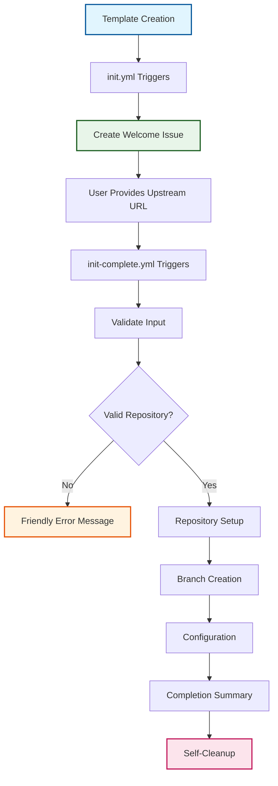

# ADR-006: Two-Workflow Initialization Pattern

:material-star: **Critical Decision** | :material-calendar: **2025-05-28** | :material-check-circle: **Accepted**

## Problem Statement

The original initialization system used a single, monolithic workflow (`init.yml`) handling everything from user interface to repository setup in one 492-line file. This approach created significant maintainability, usability, and reliability challenges that hindered the template's effectiveness and user experience.

## Context and Requirements

### :material-alert-circle: Single Workflow Architecture Problems

**Complexity Issues**:
- Monolithic 492-line workflow handling multiple concerns simultaneously
- Complex nested conditions with numerous failure points
- Overlapping initialization checks and complex cleanup processes
- Technical error messages unsuitable for non-expert users

**Maintainability Challenges**:
- Large, complex workflow difficult to debug and modify
- Interconnected logic making isolated changes risky
- No clear separation between user interaction and system setup
- Error handling scattered throughout complex conditional blocks

**User Experience Issues**:
- Technical GitHub Actions error messages exposed to users
- No clear progress indication during initialization process
- Confusing status updates mixed with technical implementation details
- Poor error recovery with limited actionable feedback

### :material-target: Architectural Requirements

**Clear Separation of Concerns**: Distinct phases for user interaction and system configuration with minimal interdependencies.

**Enhanced User Experience**: Friendly, progress-aware interface with clear guidance and actionable error messages.

**Maintainable Implementation**: Focused, understandable workflows that developers can confidently modify and extend.

## Decision

Implement a **two-workflow initialization pattern** with clear separation between user interface and system setup:



### :material-account-circle: Phase 1: User Interface Workflow (`init.yml`)

#### **Streamlined User Interaction** (~40 lines)
```yaml
# Focused responsibilities
user_interface:
  purpose: Create friendly initialization experience
  triggers: Push to main branch (template creation)
  responsibilities:
    - Template vs. instance detection
    - Welcome issue creation with clear instructions
    - User guidance and communication
  removed_complexity:
    - README status updates (unnecessary noise)
    - Complex validation logic
    - Repository setup operations
```

#### **Enhanced User Communication**
```yaml
# User-friendly messaging
communication_pattern:
  welcome_message: Emoji-enhanced instructions with clear steps
  guidance: Step-by-step process explanation
  expectations: Clear timeline and requirements
  accessibility: Web interface only, no technical prerequisites
```

### :material-cog: Phase 2: Repository Setup Workflow (`init-complete.yml`)

#### **Comprehensive System Configuration** (~300 lines)
```yaml
# Focused system setup
repository_setup:
  purpose: Complete repository configuration and initialization
  triggers: Issue comments (user providing upstream repository)
  responsibilities:
    - Input validation with clear error messages
    - Repository variable state management
    - Branch structure creation and configuration
    - Security and protection rule setup
    - Automatic validation workflow triggering
  enhanced_features:
    - Self-cleanup of initialization workflows
    - Consolidated commit strategy
    - Comprehensive completion summary
```

#### **Advanced State Management**
```yaml
# Centralized initialization tracking
state_management:
  primary_indicator: .github/workflow.env file
  initialization_flag: INITIALIZATION_COMPLETE=true
  repository_metadata: UPSTREAM_REPO_URL and configuration
  concurrency_control: Issue-based locking mechanism
```

## Implementation Strategy

### :material-timeline-check: Workflow Separation Architecture

#### **Clear Trigger Patterns**
```yaml
# init.yml - Template creation detection
init_workflow:
  trigger: push to main branch
  purpose: User interface and initial setup
  output: Initialization issue with instructions

# init-complete.yml - User response handling  
complete_workflow:
  trigger: issue_comment created
  purpose: Repository setup and configuration
  output: Configured repository ready for use
```

#### **State Management Framework**
```yaml
# Primary initialization state tracking
state_indicators:
  completion_flag: .github/workflow.env with INITIALIZATION_COMPLETE=true
  repository_variables: Upstream URL and configuration metadata
  issue_tracking: GitHub issue for coordination and communication
  concurrency_control: Workflow-level locking per issue
```

### :material-shield-check: Enhanced User Experience Design

#### **Progress Communication Pattern**
```yaml
# Real-time user feedback
progress_updates:
  welcome: "🎉 Welcome! Setting up your fork management repository..."
  validation: "🔍 Validating upstream repository access..."
  setup: "🔧 Creating branch structure and configuration..."
  completion: "✅ Repository successfully configured and ready!"
```

#### **Error Handling and Recovery**
```yaml
# User-friendly error management
error_handling:
  validation_errors: Clear explanation of URL format requirements
  access_errors: Step-by-step guidance for access token setup
  network_errors: Automatic retry with progress updates
  format_errors: Examples of correct input formats
```

### :material-lock: Concurrency and Safety Controls

#### **Workflow Isolation**
```yaml
# Prevent concurrent initialization attempts
concurrency_control:
  group: ${{ github.workflow }}-${{ github.event.issue.number }}
  cancel_in_progress: false
  scope: Per-issue isolation for safety
```

#### **Self-Cleanup Mechanism**
```yaml
# Automatic cleanup of initialization workflows
cleanup_process:
  trigger: Successful repository setup completion
  actions:
    - Remove initialization workflows from .github/workflows/
    - Commit cleanup with descriptive message
    - Close initialization issue with summary
    - Update repository variables with final state
```

## Benefits and Rationale

### :material-trending-up User Experience Excellence

#### **Friendly Interface Design**
- Emoji-enhanced communication creates welcoming experience
- Step-by-step guidance eliminates confusion and uncertainty
- Real-time progress updates provide confidence during setup
- Clear error messages with actionable resolution steps

#### **Simplified User Journey**  
- Single upstream URL input required from user
- Web-based interface requires no technical tools or expertise
- Automatic validation prevents common configuration mistakes
- Comprehensive completion summary confirms successful setup

### :material-cog-outline: Technical Architecture Benefits

#### **Maintainable Code Structure**
- Each workflow has single, clear responsibility and purpose
- Reduced complexity enables confident modification and debugging
- Isolated concerns allow independent testing and validation
- Clear interfaces between workflows minimize coupling

#### **Enhanced Reliability**
- Fewer complex operations reduce potential failure points
- Better error handling with user-friendly feedback mechanisms
- Improved state management with single source of truth
- Concurrency controls prevent race conditions and conflicts

#### **Simplified State Management**
- `.github/workflow.env` serves as primary initialization indicator
- Repository variables provide metadata persistence
- Issue-based coordination enables clear communication tracking
- Self-cleanup eliminates maintenance overhead

## Alternative Approaches Considered

### :material-close-circle: Maintain Single Workflow with Refactoring

**Approach**: Refactor existing 492-line workflow for better organization

- **Pros**: Fewer files to manage, all logic in single location
- **Cons**: Fundamental complexity issues remain unaddressed, difficult to properly separate concerns
- **Decision**: Rejected due to inability to resolve core architectural problems

### :material-close-circle: Three-Workflow Pattern (Init + Validate + Setup)

**Approach**: Further subdivision into initialization, validation, and setup workflows

- **Pros**: Maximum granular separation of concerns
- **Cons**: Over-engineering for current requirements, excessive coordination complexity
- **Decision**: Rejected as unnecessary complexity without proportional benefits

### :material-close-circle: Composite Actions for Reusable Components

**Approach**: Extract common functionality into reusable composite actions

- **Pros**: Code reuse opportunities, modular component architecture
- **Cons**: Doesn't address fundamental workflow architecture issues
- **Decision**: Considered for future enhancement but not primary solution

### :material-close-circle: External Service Integration

**Approach**: Use external service for configuration management

- **Pros**: Advanced UI capabilities, centralized management features
- **Cons**: External dependencies, security concerns, additional infrastructure costs
- **Decision**: Rejected due to template simplicity and self-contained requirements

## Consequences and Trade-offs

### :material-plus: Positive Outcomes

#### **Dramatically Improved User Experience**
- Users receive friendly, emoji-enhanced guidance throughout initialization
- Clear progress indication eliminates uncertainty during setup process
- Actionable error messages enable users to resolve issues independently
- Comprehensive completion summary confirms successful configuration

#### **Enhanced Developer Experience**
- Developers can quickly understand and confidently modify focused workflows
- Isolated concerns enable safe changes without unintended side effects
- Clear interfaces between workflows minimize debugging complexity
- Better error handling reduces support burden and user frustration

#### **Increased System Reliability**
- Reduced complexity eliminates numerous potential failure points
- Better state management prevents race conditions and conflicts
- Enhanced error recovery improves success rates across edge cases
- Self-cleanup mechanism eliminates manual maintenance requirements

### :material-minus: Trade-offs and Limitations

#### **Additional Workflow Files**
- Two workflows instead of one (mitigated by dramatically simpler content per file)
- Cross-workflow dependencies require understanding coordination pattern
- Team learning curve for two-workflow pattern adoption

#### **Coordination Complexity**
- `init-complete.yml` depends on issue created by `init.yml`
- Issue-based communication adds coordination overhead
- State management across workflows requires careful design

#### **Debugging Considerations**
- Issues may span multiple workflows requiring end-to-end understanding
- GitHub Actions limitations in cross-workflow debugging capabilities

## Success Metrics

### :material-chart-line: Quantitative Indicators

- **Initialization Success Rate**: >99% successful template deployments
- **User Completion Time**: <10 minutes from template creation to functional repository
- **Error Resolution Rate**: >95% of errors resolved by users without support
- **Maintenance Effort**: <2 hours per month for workflow maintenance

### :material-check-all: Qualitative Indicators

- Team members can confidently modify workflows without GitHub Actions expertise
- Users report positive experience with initialization process
- Error messages provide clear, actionable guidance for common issues
- Documentation and code are self-explanatory for new contributors

## Related Decisions

- [ADR-003](adr_003_template_pattern.md): Template repository pattern provides foundation for this initialization approach
- [ADR-007](adr_007_bootstrap.md): Initialization workflow bootstrap complements this pattern
- [ADR-016](adr_016_security.md): Initialization security handling ensures safe template deployment
- [ADR-020](adr_020_human_labels.md): Human-required labeling coordinates initialization activities

---

*This two-workflow initialization pattern provides maintainable, user-friendly template deployment while ensuring reliable repository setup through clear separation of concerns and enhanced user experience design.*