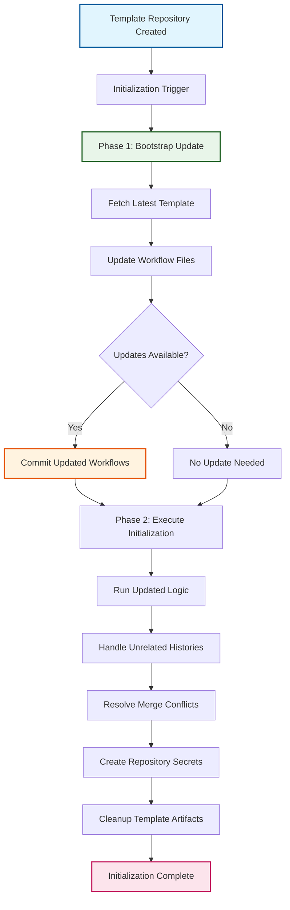

# ADR-007: Initialization Workflow Bootstrap Pattern

:material-star: **Critical Decision** | :material-calendar: **2025-05-29** | :material-check-circle: **Accepted**

## Problem Statement

During OSDU repository testing, a critical bootstrap problem was discovered in the template initialization process: when repositories are created from the template, initialization workflows run from the template's initial commit rather than the current version, preventing critical fixes and improvements from being available during actual initialization.

## Context and Requirements

### :material-alert-circle: The Bootstrap Problem Discovery

**GitHub Actions Execution Model**:
- GitHub Actions runs workflows from the commit that triggered the event
- For template-created repositories, this is the initial commit containing potentially outdated workflow logic
- Creates a chicken-and-egg problem where fixes to initialization aren't available during initialization
- Results in users encountering already-fixed issues in new repository deployments

**Specific Failure Scenarios Encountered**:
```yaml
# Original failure sequence
failure_timeline:
  step_1: "User creates repository from template"
  step_2: "Initialization workflow runs from commit b40474835cd53d4e78bf20108e18ac6178af6842"
  step_3: "Workflow fails at: git merge fork_integration --no-ff"
  step_4: "Error: fatal: refusing to merge unrelated histories"
  step_5: "Current template already has fix: --allow-unrelated-histories flag"
  step_6: "But fix isn't available to running workflow"
```

**Additional Technical Challenges**:
- Merge conflicts in common files (`.gitignore`, `README.md`) between template and upstream versions
- Built-in `GITHUB_TOKEN` lacks permissions for repository secret creation operations
- Need for `-X theirs` merge strategy to automatically resolve template/upstream conflicts
- Requirement for Personal Access Token (PAT) with enhanced permissions for full initialization

### :material-target Bootstrap Solution Requirements

**Self-Updating Capability**: Initialization workflows must be able to update themselves to the latest version before executing core logic.

**Fix Propagation**: Critical fixes and improvements must immediately reach new repository deployments without manual intervention.

**Graceful Degradation**: System must handle edge cases like template unavailability or permission issues with appropriate fallbacks.

## Decision

Implement a **Self-Updating Initialization Workflow Bootstrap Pattern** with two-phase execution:



### :material-update Phase 1: Bootstrap Update Process

#### **Self-Updating Workflow Logic**
```yaml
# Two-phase initialization with self-update
bootstrap_update:
  name: "Update initialization workflow to latest version"
  
  implementation: |
    # Phase 1: Bootstrap Update
    update-workflow:
      name: Update initialization workflow
      runs-on: ubuntu-latest
      steps:
        - name: Checkout current repository
          uses: actions/checkout@v4
          with:
            token: ${{ secrets.GITHUB_TOKEN }}
            
        - name: Fetch latest workflow from template
          run: |
            # Add template as remote source
            git remote add template https://github.com/danielscholl-osdu/osdu-fork-template.git
            git fetch template main
            
            # Update workflows to latest version
            git checkout template/main -- .github/workflows/init.yml
            git checkout template/main -- .github/workflows/init-complete.yml
            
            # Commit only if changes exist
            if git diff --staged --quiet; then
              echo "Workflows are already up to date"
            else
              git config user.name "github-actions[bot]"
              git config user.email "github-actions[bot]@users.noreply.github.com"
              git commit -m "chore: update initialization workflows to latest version"
              git push
            fi
```

#### **Enhanced Error Handling and Fallbacks**
```yaml
# Robust error handling for bootstrap process
error_handling:
  template_unavailable: |
    # Graceful fallback if template repository inaccessible
    if ! git fetch template main 2>/dev/null; then
      echo "⚠️ Template repository unavailable, proceeding with current workflow version"
      echo "template_update_failed=true" >> $GITHUB_OUTPUT
    fi
    
  permission_issues: |
    # Handle permission limitations gracefully
    if ! git push 2>/dev/null; then
      echo "⚠️ Insufficient permissions to update workflows, proceeding with current version"
      echo "workflow_update_skipped=true" >> $GITHUB_OUTPUT
    fi
    
  conflict_prevention: |
    # Check for local modifications before updating
    if ! git diff --quiet .github/workflows/; then
      echo "⚠️ Local workflow modifications detected, skipping update to prevent conflicts"
      echo "local_modifications_detected=true" >> $GITHUB_OUTPUT
    fi
```

### :material-cogs Phase 2: Enhanced Initialization Execution

#### **Updated Initialization Logic with Latest Fixes**
```yaml
# Enhanced initialization with all latest fixes
enhanced_initialization:
  unrelated_histories_fix: |
    # Handle unrelated histories during merge
    git merge fork_integration --no-ff --allow-unrelated-histories -X theirs \
      -m "chore: complete repository initialization"
      
  merge_conflict_resolution: |
    # Automatic conflict resolution strategy
    git merge fork_integration --no-ff --allow-unrelated-histories -X theirs \
      -m "chore: integrate upstream with template"
      
  enhanced_permissions: |
    # Use PAT token for enhanced operations when available
    if [ -n "${{ secrets.GH_TOKEN }}" ]; then
      echo "Using enhanced PAT token for repository operations"
      export GITHUB_TOKEN="${{ secrets.GH_TOKEN }}"
    else
      echo "⚠️ PAT token not available, using default token (limited permissions)"
      export GITHUB_TOKEN="${{ secrets.GITHUB_TOKEN }}"
    fi
    
  template_cleanup: |
    # Remove template-specific content after initialization
    rm -rf doc/ .claude/ CLAUDE.md
    git add -A
    git commit -m "chore: clean up template-specific content"
```

## Implementation Strategy

### :material-shield-check Key Design Elements

#### **Idempotent Operations**
```yaml
# Safe to run multiple times without issues
idempotent_design:
  update_checking: "Only updates workflows if template version is newer"
  change_detection: "git diff --staged --quiet prevents unnecessary commits"
  conflict_avoidance: "Checks for local modifications before attempting updates"
  graceful_skipping: "Skips operations that would cause conflicts or errors"
```

#### **Transparent Process**
```yaml
# Visible workflow update process
transparency:
  commit_history: "Workflow updates appear as commits in repository history"
  update_messages: "Clear commit messages explain what was updated and why"
  user_communication: "Initialization issue documents bootstrap process"
  error_reporting: "Clear error messages when bootstrap operations fail"
```

#### **Security and Reliability**
```yaml
# Secure and reliable bootstrap process
security_reliability:
  same_permissions: "Uses existing repository permissions, no external dependencies"
  template_verification: "Verifies template repository authenticity before updates"
  fallback_execution: "Proceeds with current version if updates fail"
  audit_trail: "Complete record of bootstrap operations in git history"
```

## Benefits and Rationale

### :material-trending-up Strategic Advantages

#### **Automatic Fix Distribution**
- All template improvements immediately available to new repository deployments
- Critical fixes like `--allow-unrelated-histories` and merge conflict resolution reach users automatically
- Enhanced permission handling and secret creation capabilities distributed seamlessly
- Template cleanup and customization improvements available without manual intervention

#### **Enhanced User Experience**
- Initialization "just works" with latest fixes, reducing user friction significantly
- Users don't encounter previously-fixed issues, eliminating support burden
- Transparent update process maintains user confidence in initialization reliability
- Clear error messages and fallbacks provide guidance when issues occur

#### **Maintainability Excellence**
- Single source of truth for initialization logic eliminates version management complexity
- Simplified support process as old version issues are automatically resolved
- Traceable updates provide complete audit trail of initialization improvements
- Self-updating capability reduces manual coordination overhead for template improvements

### :material-cog-outline Technical Architecture Benefits

#### **Bootstrap Problem Resolution**
- Eliminates chicken-and-egg problem inherent in template-based initialization
- Ensures latest initialization logic available regardless of template creation timing
- Provides systematic mechanism for propagating critical fixes to new deployments
- Maintains template repository as authoritative source for initialization improvements

#### **Robust Error Handling**
- Graceful degradation when template repository unavailable or inaccessible
- Permission-aware operations that adapt to available token capabilities
- Conflict prevention through local modification detection before updates
- Clear communication of bootstrap status and any limitations encountered

## Alternative Approaches Considered

### :material-close-circle: Manual Workaround Documentation

**Approach**: Document manual commands for users when initialization fails

- **Pros**: Simple implementation, no code changes required
- **Cons**: Poor user experience, requires technical knowledge, defeats automation purpose
- **Decision**: Rejected - Goes against template's automation and user experience goals

### :material-close-circle: Pre-create All Branches in Template

**Approach**: Include fork_upstream and fork_integration branches in template repository

- **Pros**: Might avoid unrelated histories issue during initialization
- **Cons**: Pollutes template with upstream-specific content, doesn't solve workflow updates
- **Decision**: Rejected - Doesn't address root cause and compromises template cleanliness

### :material-close-circle: External Initialization Script

**Approach**: Separate script hosted externally that gets downloaded and executed

- **Pros**: Always runs latest version, complete control over initialization process
- **Cons**: External dependency, security concerns, network reliability issues
- **Decision**: Rejected - Adds unnecessary external dependencies and security complexity

### :material-close-circle: Versioned Workflow Pinning

**Approach**: Pin workflows to specific versions with manual update process

- **Pros**: Predictable behavior, controlled update timing
- **Cons**: Requires manual intervention, doesn't solve immediate fix propagation
- **Decision**: Rejected - Doesn't address automatic fix distribution requirement

## Consequences and Trade-offs

### :material-plus: Positive Outcomes

#### **Initialization Reliability Excellence**
- New repositories always use latest initialization workflow with all fixes
- Critical fixes immediately available without manual coordination or user intervention
- Users don't encounter previously-fixed initialization issues, improving satisfaction
- Template improvements automatically benefit all future repository deployments

#### **Support and Maintenance Efficiency**
- Simplified support process as old version issues are automatically resolved
- Reduced coordination overhead for template improvements and fix distribution
- Clear audit trail through git history shows workflow update progression
- Self-contained process requires no external dependencies or infrastructure

#### **User Experience Enhancement**
- Transparent workflow update process maintains user confidence and understanding
- Graceful error handling provides clear guidance when issues occur
- Automatic cleanup and customization improvements enhance repository initialization
- Consistent behavior across all repository deployments regardless of creation timing

### :material-minus: Trade-offs and Limitations

#### **Process Complexity**
- Two-phase initialization adds complexity compared to single-step process
- Additional commit created in repository history documenting workflow updates
- Potential for conflicts if users modify workflows before initialization completes
- Dependency on template repository remaining accessible for bootstrap updates

#### **Edge Case Considerations**
- Bootstrap process may fail if template repository becomes unavailable
- Permission limitations may prevent workflow updates in some repository contexts
- Local workflow modifications may prevent automatic updates to avoid conflicts
- Network issues during template fetch may delay or prevent bootstrap updates

## Success Metrics

### :material-chart-line: Quantitative Indicators

- **Fix Propagation Speed**: 100% of new repositories receive latest initialization fixes
- **Bootstrap Success Rate**: >99% successful workflow bootstrap operations
- **User Issue Reduction**: Zero user reports of previously-fixed initialization problems
- **Template Cleanup Success**: 100% of repositories receive proper template artifact cleanup

### :material-check-all: Qualitative Indicators

- Users report smooth initialization experience without manual intervention required
- Clear understanding of bootstrap process through transparent workflow updates
- Effective error handling provides actionable guidance when issues occur
- Consistent initialization behavior across all repository deployments

## Integration Points

### :material-source-branch Initialization Workflow Integration

#### **Two-Workflow Initialization Pattern** (per [ADR-006](adr_006_initialization.md))
- Bootstrap pattern builds upon two-workflow pattern with self-update capability
- Phase separation enables clean bootstrap update before core initialization logic
- Enhanced error handling coordinates with user interface and repository setup workflows

#### **Template Repository Pattern** (per [ADR-003](adr_003_template_pattern.md))
- Self-updating capability aligns with template-based architecture principles
- Bootstrap process maintains template repository as authoritative source
- Automatic fix distribution extends template benefits to initialization process

### :material-update Template Improvement Distribution

#### **Template Update Propagation** (per [ADR-012](adr_012_template_updates.md))
- Bootstrap pattern complements template sync for ongoing repository maintenance
- Self-update capability provides immediate fix distribution for new repositories
- Coordinates with systematic template update propagation for existing repositories

## Related Decisions

- [ADR-006](adr_006_initialization.md): Two-workflow initialization pattern provides foundation for bootstrap enhancement
- [ADR-003](adr_003_template_pattern.md): Template repository pattern aligns with self-updating architecture
- [ADR-012](adr_012_template_updates.md): Template update propagation coordinates with bootstrap for comprehensive fix distribution

---

*This initialization workflow bootstrap pattern ensures that all template improvements and critical fixes immediately reach new repository deployments through self-updating workflows, eliminating the bootstrap problem while maintaining user experience and system reliability.*