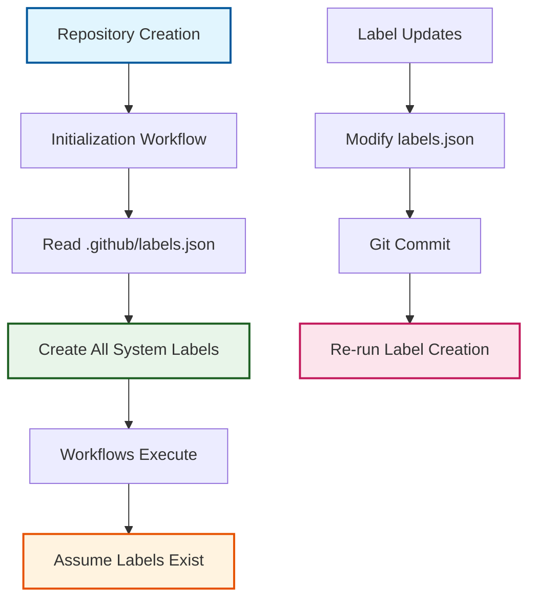

# ADR-008: Centralized Label Management Strategy

:material-star: **Critical Decision** | :material-calendar: **2025-05-28** | :material-check-circle: **Accepted**

## Problem Statement

The Fork Management Template uses GitHub labels extensively to track workflow states, issue types, and PR statuses across multiple automated workflows. The original distributed approach where each workflow created its own labels created reliability, consistency, and maintainability challenges that undermined automation effectiveness.

## Context and Requirements

### :material-alert-circle: Distributed Label Management Problems

**Workflow Dependencies and Reliability**:
- Labels didn't exist until specific workflows executed, potentially breaking automation
- New workflows couldn't reliably depend on required labels being available
- Race conditions when multiple workflows tried to create the same labels
- Failed workflows could leave label creation incomplete, breaking subsequent automation

**Consistency and Maintenance Issues**:
- No single source of truth for label definitions across the system
- Inconsistent label colors, descriptions, and naming conventions
- Difficult to maintain and document comprehensive label usage patterns
- Each workflow implementation contained its own label creation logic

**Distributed Creation Pattern Problems**:
```yaml
# Problematic distributed approach
sync_workflow: "Creates sync-related labels during first run"
init_workflow: "Creates initialization labels when triggered"
dependabot_workflow: "Creates dependency labels as needed"
cascade_workflow: "Requires additional state-tracking labels"
```

### :material-target: Label Management Requirements

**Centralized Definition**: Single source of truth for all system labels with consistent formatting and documentation.

**Initialization Guarantee**: All required labels available from repository initialization without workflow execution dependencies.

**Automation Reliability**: Workflows can assume label existence and focus on core functionality rather than infrastructure setup.

## Decision

Implement a **centralized label management strategy** with comprehensive initialization and maintenance:



### :material-file-document-outline Centralized Configuration Architecture

#### **Single Source of Truth**
```yaml
# .github/labels.json structure
label_configuration:
  location: ".github/labels.json"
  format: "Structured JSON with name, description, color"
  versioning: "Git-tracked with complete change history"
  documentation: "Self-documenting through descriptive names and descriptions"
```

#### **Comprehensive Label Taxonomy**
```json
{
  "labels": [
    {
      "name": "upstream-sync",
      "description": "Issues related to upstream repository synchronization",
      "color": "1976d2"
    },
    {
      "name": "cascade-active", 
      "description": "Currently processing through cascade integration pipeline",
      "color": "0e8a16"
    },
    {
      "name": "human-required",
      "description": "Requires human intervention or review",
      "color": "d73a49"
    },
    {
      "name": "conflict",
      "description": "Merge conflicts requiring manual resolution",
      "color": "e53e3e"
    }
  ]
}
```

### :material-cog Automated Label Creation Process

#### **Initialization Workflow Integration**
```yaml
# Enhanced initialization with label creation
name: "Create all system labels"
implementation: |
  # Read and parse label configuration
  labels=$(cat .github/labels.json | jq -r '.labels[] | @base64')
  
  for label in $labels; do
    # Decode and extract label properties
    decoded=$(echo $label | base64 --decode)
    name=$(echo $decoded | jq -r '.name')
    description=$(echo $decoded | jq -r '.description')  
    color=$(echo $decoded | jq -r '.color')
    
    # Create or update label with full properties
    gh label create "$name" \
      --description "$description" \
      --color "$color" \
      --force
  done
```

#### **Workflow Assumption Pattern**
```yaml
# Workflows now operate with label assumptions
workflow_pattern:
  assumption: "All required labels exist from initialization"
  usage: "Direct label application without creation logic"
  reliability: "No workflow failures due to missing labels"
  
  example: |
    # Simple, reliable label application
    gh issue create \
      --title "Upstream sync ready for review" \
      --body "$NOTIFICATION_BODY" \
      --label "upstream-sync,human-required"
```

## Implementation Strategy

### :material-timeline-check Label Lifecycle Management

#### **Complete Label Taxonomy**
```yaml
# Comprehensive system label categories
label_categories:
  workflow_state:
    - cascade-active: Integration pipeline in progress
    - cascade-blocked: Integration blocked by conflicts
    - production-ready: Ready for production deployment
    - validated: Integration complete and validated
    
  issue_types:
    - upstream-sync: Upstream synchronization activities
    - conflict: Merge conflicts requiring resolution
    - escalation: Issues exceeding SLA timeouts
    - template-sync: Template update activities
    
  priority_levels:
    - high-priority: Urgent items requiring immediate attention
    - emergency: Critical system issues needing escalation
    
  human_interaction:
    - human-required: Requires human intervention or review
    - review-needed: Code review or validation required
```

#### **Color Scheme Standardization**
```yaml
# Consistent color palette
color_scheme:
  workflow_active: "0e8a16" # Green - active processes
  workflow_blocked: "e53e3e" # Red - blocked or failed states  
  human_required: "d73a49" # Dark red - human intervention needed
  information: "1976d2" # Blue - informational or tracking
  priority_high: "ff6b35" # Orange - high priority items
  emergency: "b71c1c" # Dark red - emergency situations
```

### :material-refresh Label Maintenance Process

#### **Update Workflow**
```yaml
# Label modification process
update_process:
  modify: "Edit .github/labels.json with new definitions"
  commit: "Git commit tracks all label changes"
  deploy: "Re-run label creation during next initialization"
  verify: "Confirm labels applied correctly across repository"
```

#### **Migration Strategy**
```yaml
# Existing repository migration
migration_approach:
  audit: "Identify existing labels and their usage"
  consolidate: "Map existing labels to centralized definitions"
  update: "Apply new label configuration"
  cleanup: "Remove orphaned or deprecated labels"
```

## Benefits and Rationale

### :material-trending-up Strategic Advantages

#### **System Reliability Enhancement**
- All labels exist from repository initialization, eliminating dependency failures
- Workflows can assume label availability and focus on core functionality
- Automation reliability improves through consistent infrastructure setup
- Race conditions eliminated through initialization-time label creation

#### **Maintainability and Consistency**
- Single source of truth for all label definitions simplifies management
- Consistent naming conventions and color schemes across entire system
- Git-tracked changes provide complete audit trail for label evolution
- Self-documenting configuration through descriptive names and descriptions

#### **Development Experience Improvement**
- Workflows simplified through elimination of label creation logic
- New workflow development accelerated by guaranteed label availability
- Clear documentation of available labels for development planning
- Reduced debugging complexity through consistent label infrastructure

### :material-cog-outline Operational Benefits

#### **Documentation and Visibility**
- Complete label set visible from repository creation
- Self-documenting configuration eliminates need for separate documentation
- Label usage patterns clearly visible through centralized definitions
- Easy customization for specific organizational requirements

#### **Automation Architecture**
- Workflows can depend on label existence without conditional logic
- Simplified workflow code through infrastructure assumption patterns
- Better error handling focus on business logic rather than setup issues
- Consistent automation behavior across all template deployments

## Alternative Approaches Considered

### :material-close-circle: Distributed Workflow-Specific Creation

**Approach**: Each workflow manages its own required labels

- **Pros**: Self-contained workflows, no external dependencies
- **Cons**: Reliability issues, inconsistent definitions, maintenance overhead
- **Decision**: Rejected due to fundamental reliability and consistency problems

### :material-close-circle: External Label Management Service

**Approach**: Third-party service for label management across repositories

- **Pros**: Advanced management capabilities, cross-repository coordination
- **Cons**: External dependency, additional complexity, cost considerations
- **Decision**: Rejected due to template self-containment requirements

### :material-close-circle: Manual Label Creation Documentation

**Approach**: Documentation-based label setup requiring manual configuration

- **Pros**: Simple approach, complete control over implementation
- **Cons**: Error-prone, inconsistent application, manual maintenance burden
- **Decision**: Rejected due to automation goals and user experience requirements

### :material-close-circle: Dynamic Label Creation with Caching

**Approach**: Workflows create labels with intelligent caching and checking

- **Pros**: Automated creation with some reliability improvements
- **Cons**: Still complex, potential race conditions, distributed logic
- **Decision**: Rejected in favor of simpler centralized approach

## Consequences and Trade-offs

### :material-plus: Positive Outcomes

#### **Enhanced System Reliability**
- Zero workflow failures due to missing label dependencies
- Consistent automation behavior across all repository instances
- Simplified workflow logic through infrastructure assumption patterns
- Improved error handling focus on business logic rather than setup

#### **Improved Maintainability**
- Single location for all label definitions simplifies management
- Git-tracked changes provide complete audit trail for modifications
- Easy addition, updating, or removal of labels through configuration
- Self-documenting system through descriptive label properties

#### **Better Development Experience**
- Workflows can assume label availability without conditional checking
- New workflow development accelerated by guaranteed infrastructure
- Clear visibility into available labels for development planning
- Consistent behavior across different template deployment contexts

### :material-minus: Trade-offs and Limitations

#### **Initialization Dependencies**
- Workflows depend on initialization running successfully before execution
- Slightly longer repository setup process due to comprehensive label creation
- Migration required for existing repositories to adopt centralized approach

#### **Configuration Management**
- Label changes require modifying configuration file rather than ad-hoc creation
- Need to understand JSON configuration format for label modifications
- Coordination required when multiple developers need to add labels simultaneously

## Success Metrics

### :material-chart-line: Quantitative Indicators

- **Workflow Reliability**: 100% workflow success rate (zero label-related failures)
- **Setup Time**: Repository initialization completion within expected timeframe
- **Label Consistency**: All labels follow standardized naming and color conventions
- **Maintenance Effort**: Reduced time spent on label-related workflow debugging

### :material-check-all: Qualitative Indicators

- Developers report improved confidence in workflow reliability
- Simplified workflow code through elimination of label creation logic
- Clear understanding of available labels for new workflow development
- Consistent behavior across all template repository deployments

## Integration Points

### :material-source-branch Workflow Integration

#### **Initialization Workflow Coordination**
- Label creation integrated into repository setup process
- All system labels available before other workflows execute
- Template deployment includes complete label infrastructure

#### **Cross-Workflow Dependencies**
- All workflows assume label existence without creation logic
- Consistent label usage patterns across different automation workflows
- Simplified error handling through guaranteed infrastructure availability

### :material-label-multiple-outline Label Usage Patterns

#### **State Management Integration**
- Workflow state tracking through lifecycle labels
- Issue and PR status coordination through consistent labeling
- Human intervention coordination through human-required labeling

## Related Decisions

- [ADR-006](adr_006_initialization.md): Two-workflow initialization pattern provides foundation for label creation
- [ADR-020](adr_020_human_labels.md): Human-required label strategy builds on centralized management
- [ADR-019](adr_019_cascade_monitor.md): Cascade monitor pattern relies on centralized label definitions
- [ADR-022](adr_022_lifecycle.md): Issue lifecycle tracking uses centralized label taxonomy

---

*This centralized label management strategy provides reliable, maintainable infrastructure for GitHub automation through consistent label definitions and guaranteed availability, enabling sophisticated workflow coordination while simplifying development and maintenance.*