# ADR-009: Asymmetric Cascade Review Strategy

:material-star: **Critical Decision** | :material-calendar: **2025-05-28** | :material-check-circle: **Accepted** | :material-refresh: **Revised** 2025-06-29

## Problem Statement

The cascade workflow moves upstream changes through a three-branch hierarchy requiring careful balance between automation efficiency and safety controls. With human-centric cascade triggering and issue lifecycle tracking implemented, a strategic review approach was needed to ensure proper validation while minimizing unnecessary manual intervention.

## Context and Requirements

### :material-alert-circle: Cascade Review Challenges

**Multi-Stage Risk Assessment**:
- Upstream changes are external and potentially breaking, requiring careful evaluation
- Integration branch serves as testing ground but needs validation to be meaningful
- Main branch represents production and must maintain absolute stability
- Different risk profiles exist at each cascade stage requiring tailored approaches

**Human Control and Automation Balance**:
- Manual cascade triggering provides explicit human control over integration timing
- Conflict resolution always requires human intervention regardless of automation
- Issue tracking provides visibility but teams need clear review expectations
- Validation failures must be clearly communicated with actionable resolution guidance

**Quality Assurance Integration**:
- Comprehensive validation (build, test, lint) needed before production deployment
- Early detection of issues prevents problems from reaching production branch
- Clear quality gates required to maintain integration branch integrity
- Detailed failure tracking with logs and resolution steps for troubleshooting

### :material-target Review Strategy Requirements

**Safety-First Architecture**: External changes receive appropriate human review at critical decision points while maintaining efficiency.

**Production Protection**: All production changes require final human oversight with comprehensive validation before deployment.

**Efficient Workflow**: Minimize unnecessary manual intervention while maintaining safety and quality standards.

## Decision

Implement an **Asymmetric Cascade Review Strategy** with differentiated approaches for each cascade stage:

```mermaid
graph TD
    A[Upstream Sync PR] --> B[Human Review & Merge]
    B --> C[Manual Cascade Trigger]
    C --> D[fork_upstream → fork_integration]
    D --> E[Comprehensive Validation]
    E --> F{Validation Pass?}
    F -->|Yes| G[Create Production PR]
    F -->|No| H[Block Cascade]
    H --> I[Create Failure Issue]
    I --> J[Human Resolution]
    J --> K[Retry Cascade]
    K --> E
    G --> L[fork_integration → main]
    L --> M[Human Review Required]
    M --> N[Manual Approval & Merge]
    N --> O[Production Deployment]
    
    style A fill:#e1f5fe,stroke:#01579b,stroke-width:2px
    style C fill:#e8f5e9,stroke:#1b5e20,stroke-width:2px
    style E fill:#fff3e0,stroke:#e65100,stroke-width:2px
    style M fill:#fce4ec,stroke:#c2185b,stroke-width:2px
```



### :material-shield-check Phase 1: Human-Initiated Integration with Comprehensive Validation

#### **Manual Trigger with Issue Tracking Integration**
```yaml
# Human-initiated cascade after upstream sync review
phase_1_integration:
  trigger: "Manual cascade trigger after sync PR review and merge"
  
  process_flow: |
    # Human triggers cascade workflow manually
    # Cascade workflow updates issue tracking immediately
    gh issue edit "$ISSUE_NUMBER" \
      --remove-label "human-required" \
      --add-label "cascade-active"
    
    # Progress notification
    gh issue comment "$ISSUE_NUMBER" --body "🚀 **Cascade Integration Started** - $(date -u +%Y-%m-%dT%H:%M:%SZ)
    
    Integration workflow triggered manually and now processing upstream changes.
    
    **Phase 1:** Merging \`fork_upstream\` → \`fork_integration\`
    **Validation:** Comprehensive build, test, and lint checks will run"
```

#### **Comprehensive Validation Framework**
```yaml
# Extensive validation on integration branch
validation_framework:
  merge_validation: |
    # Attempt merge with conflict detection
    if git merge origin/fork_upstream --no-edit; then
      echo "✅ Clean merge of upstream changes achieved"
      echo "conflicts=false" >> $GITHUB_OUTPUT
    else
      echo "🚨 Merge conflicts detected - human resolution required"
      echo "conflicts=true" >> $GITHUB_OUTPUT
      # Update issue tracking and create conflict issue
    fi
    
  build_validation: |
    # Comprehensive build validation
    if ./scripts/build.sh; then
      echo "✅ Build validation passed"
      echo "build_success=true" >> $GITHUB_OUTPUT
    else
      echo "❌ Build validation failed"
      echo "build_success=false" >> $GITHUB_OUTPUT
      # Capture build logs for failure issue
    fi
    
  test_validation: |
    # Complete test suite execution
    if ./scripts/test.sh; then
      echo "✅ Test validation passed"  
      echo "test_success=true" >> $GITHUB_OUTPUT
    else
      echo "❌ Test validation failed"
      echo "test_success=false" >> $GITHUB_OUTPUT
      # Capture test logs for failure issue
    fi
    
  lint_validation: |
    # Code quality and style validation
    if ./scripts/lint.sh; then
      echo "✅ Lint validation passed"
      echo "lint_success=true" >> $GITHUB_OUTPUT
    else
      echo "❌ Lint validation failed"
      echo "lint_success=false" >> $GITHUB_OUTPUT
      # Capture lint logs for failure issue
    fi
```

#### **Validation Failure Handling**
```yaml
# Detailed failure tracking and resolution guidance
validation_failure_handling:
  failure_detection: |
    # Check if any validation failed
    if [[ "${{ steps.validation.outputs.conflicts }}" == "true" ]] || \
       [[ "${{ steps.validation.outputs.build_success }}" == "false" ]] || \
       [[ "${{ steps.validation.outputs.test_success }}" == "false" ]] || \
       [[ "${{ steps.validation.outputs.lint_success }}" == "false" ]]; then
      echo "validation_failed=true" >> $GITHUB_OUTPUT
    fi
    
  failure_issue_creation: |
    # Create detailed failure issue with logs and resolution steps
    FAILURE_BODY="## 🚨 Cascade Validation Failure
    
    Integration validation failed during cascade process. Manual resolution required.
    
    **Failure Summary:**
    - **Conflicts:** ${{ steps.validation.outputs.conflicts }}
    - **Build:** ${{ steps.validation.outputs.build_success }}
    - **Tests:** ${{ steps.validation.outputs.test_success }}
    - **Lint:** ${{ steps.validation.outputs.lint_success }}
    
    **Resolution Steps:**
    1. Checkout the fork_integration branch locally
    2. Address the specific validation failures listed above
    3. Commit and push fixes to fork_integration
    4. Remove 'human-required' label from tracking issue to retry cascade
    
    **Logs and Details:**
    [Detailed failure logs attached]"
    
    gh issue create \
      --title "🚨 Cascade Validation Failure - $(date +%Y-%m-%d)" \
      --body "$FAILURE_BODY" \
      --label "cascade-failed,human-required,high-priority"
```

### :material-security Phase 2: Production PR Creation with Human Review Requirement

#### **Conditional Production PR Creation**
```yaml
# Production PR only created after successful validation
phase_2_production:
  condition: "Only proceeds if all validation passes and no conflicts detected"
  
  pr_creation: |
    # Only create production PR if integration validation successful
    if [[ "${{ steps.validation.outputs.validation_failed }}" != "true" ]]; then
      # Create production release branch
      RELEASE_BRANCH="release/upstream-$(date +%Y%m%d-%H%M%S)"
      git checkout -b "$RELEASE_BRANCH" fork_integration
      git push origin "$RELEASE_BRANCH"
      
      # Create production PR with human review requirement
      PR_URL=$(gh pr create \
        --base main \
        --head "$RELEASE_BRANCH" \
        --title "🚀 Production Release: Upstream Integration - $(date +%Y-%m-%d)" \
        --body "$PRODUCTION_PR_BODY" \
        --label "upstream-sync,human-required,production")
        
      echo "production_pr_created=true" >> $GITHUB_OUTPUT
      echo "production_pr_url=$PR_URL" >> $GITHUB_OUTPUT
    else
      echo "Skipping production PR creation due to validation failures"
      echo "production_pr_created=false" >> $GITHUB_OUTPUT
    fi
```

#### **Production PR Content and Guidance**
```yaml
# Comprehensive production PR with review guidance
production_pr_content:
  pr_body_template: |
    ## 🚀 Production Release: Upstream Integration
    
    This PR contains upstream changes that have been successfully validated in the integration branch.
    
    **Integration Validation Results:**
    - ✅ **Merge:** Clean merge without conflicts
    - ✅ **Build:** All build processes completed successfully
    - ✅ **Tests:** Complete test suite passed
    - ✅ **Lint:** Code quality checks passed
    
    **Changes Summary:**
    - **Upstream Commits:** $(git rev-list --count fork_integration..origin/fork_upstream)
    - **Files Modified:** $(git diff --name-only origin/main..fork_integration | wc -l)
    - **Integration Period:** $(calculate_integration_period)
    
    **Review Checklist:**
    - [ ] Review upstream changes for business impact
    - [ ] Verify integration validation results
    - [ ] Confirm deployment timing is appropriate
    - [ ] Check for any additional testing requirements
    
    **Deployment Notes:**
    Changes have been thoroughly validated in integration branch and are ready for production deployment.
    
  auto_merge_policy: |
    # All production PRs require explicit human review
    # No auto-merge enabled for production deployments
    # Human approval required before merge to main branch
```

## Implementation Strategy

### :material-timeline-check Validation Quality Gates

#### **Integration Branch Validation**
```yaml
# Comprehensive validation framework
integration_validation:
  purpose: "Ensure integration branch maintains high quality before production PR creation"
  
  validation_categories:
    conflict_resolution:
      description: "Detect and handle merge conflicts"
      blocking: true
      human_required: "Always for conflict resolution"
      
    build_verification:
      description: "Ensure all build processes complete successfully"
      blocking: true
      automated: true
      logs_captured: true
      
    test_execution:
      description: "Run complete test suite to verify functionality"
      blocking: true
      automated: true
      coverage_tracking: true
      
    code_quality:
      description: "Lint and style checks for code quality"
      blocking: true
      automated: true
      standards_enforcement: true
```

#### **Production Review Framework**
```yaml
# Human review requirements for production
production_review:
  purpose: "Final human oversight before production deployment"
  
  review_requirements:
    business_impact:
      description: "Assess business and operational impact of changes"
      reviewer: "Team lead or designated reviewer"
      
    deployment_timing:
      description: "Confirm appropriate timing for production deployment"
      considerations: ["Maintenance windows", "Business operations", "Team availability"]
      
    additional_testing:
      description: "Determine if additional testing required before deployment"
      scope: ["Performance testing", "Security validation", "User acceptance"]
      
    rollback_planning:
      description: "Ensure rollback procedures are understood and available"
      documentation: "Rollback steps documented and tested"
```

## Benefits and Rationale

### :material-trending-up Strategic Advantages

#### **Safety-First Architecture**
- External upstream changes receive appropriate human review at critical entry point
- Production branch protected by comprehensive validation and final human approval
- Clear quality gates prevent problematic changes from reaching production
- Risk mitigation through human oversight at both critical decision points

#### **Quality Assurance Excellence**
- Comprehensive validation (build, test, lint) on integration branch catches issues early
- Detailed failure tracking with logs and resolution steps enables efficient troubleshooting
- Integration branch serves its intended purpose as true validation gate
- Complete audit trail of human review history and validation logs for compliance

#### **Efficient Workflow Management**
- Human-initiated cascade provides explicit control over integration timing
- Automated validation reduces manual review burden while maintaining safety
- Clear boundaries between integration testing and production deployment
- Issue tracking provides visibility into review status and progress

### :material-cog-outline Operational Benefits

#### **Early Issue Detection**
- Integration validation catches problems before production PR creation
- Comprehensive failure reporting with actionable resolution guidance
- Blocked cascades prevent invalid changes from reaching production review
- Clear escalation path for validation failures requiring human intervention

#### **Production Deployment Confidence**
- All production changes validated and proven stable in integration branch
- Human review ensures appropriate business and operational considerations
- Clear deployment readiness indicators through validation results
- Systematic approach reduces deployment risk and improves reliability

## Alternative Approaches Considered

### :material-close-circle: Fully Automated Cascade

**Approach**: Auto-merge at both cascade stages when validation passes

- **Pros**: Maximum automation efficiency, minimal manual intervention required
- **Cons**: Too risky for external changes reaching production without human oversight
- **Decision**: Rejected due to safety requirements for production deployment

### :material-close-circle: Conditional Auto-Merge Based on Change Size

**Approach**: Auto-merge production stage based on change size or complexity

- **Pros**: Reduced manual overhead for routine updates
- **Cons**: Even clean changes benefit from human oversight before production
- **Decision**: Rejected - human review provides value beyond validation results

### :material-close-circle: Reversed Asymmetry

**Approach**: Auto-merge integration stage, require manual review for production

- **Pros**: Focuses human attention on final production deployment decision
- **Cons**: Backwards from safety perspective - external changes need early review
- **Decision**: Rejected - safety requires human oversight at upstream integration point

### :material-close-circle: Symmetric Manual Review

**Approach**: Require manual review and approval at both cascade stages

- **Pros**: Maximum human oversight and control over all changes
- **Cons**: Excessive manual overhead, slows routine updates unnecessarily
- **Decision**: Rejected - asymmetric approach balances safety with efficiency

## Consequences and Trade-offs

### :material-plus: Positive Outcomes

#### **Enhanced Safety and Reliability**
- External changes receive human review at critical entry point
- Production deployments protected by comprehensive validation and final approval
- Clear quality gates prevent problematic changes from reaching production
- Risk mitigation through multiple validation checkpoints and human oversight

#### **Quality Assurance Integration**
- Early detection of issues through integration branch validation
- Detailed failure tracking with actionable resolution guidance
- Complete audit trail for compliance and troubleshooting
- Systematic approach improves overall deployment reliability

#### **Efficient Review Process**
- Human-initiated cascade provides explicit control over timing
- Automated validation reduces manual review burden while maintaining safety
- Clear role definition for integration testing vs production approval
- Issue tracking provides visibility and coordination for review activities

### :material-minus: Trade-offs and Limitations

#### **Manual Review Overhead**
- All production PRs require human review and approval
- Manual review may slow deployment of routine updates
- Teams need to develop efficient review processes for common scenarios
- Review fatigue possible if update frequency is high

#### **Process Coordination Requirements**
- Teams must understand asymmetric review responsibilities
- Monitoring required to track manual review timing and identify bottlenecks
- Emergency procedures needed for critical fixes requiring expedited review
- Training required for effective use of validation results in review decisions

## Success Metrics

### :material-chart-line: Quantitative Indicators

- **Validation Success Rate**: >95% of integration validations pass before production PR creation
- **Production Review Time**: Average <24 hours for production PR review and approval
- **Issue Detection Rate**: 90%+ of problems caught in integration validation before production
- **Cascade Completion Rate**: >98% of initiated cascades successfully complete

### :material-check-all: Qualitative Indicators

- Teams report confidence in production deployment safety through validation
- Clear understanding of review responsibilities at each cascade stage
- Effective use of validation results to inform production review decisions
- Efficient coordination between integration validation and production approval

## Integration Points

### :material-source-branch Cascade Workflow Integration

#### **Human-Centric Cascade Pattern** (per [ADR-019](adr_019_cascade_monitor.md))
- Asymmetric review strategy coordinates with manual cascade triggering
- Issue tracking integration provides visibility into review status and progress
- Human control points align with validation and approval requirements

#### **Issue Lifecycle Tracking** (per [ADR-022](adr_022_lifecycle.md))
- Review strategy integrates with issue-based progress tracking
- Validation results and approval status reflected in issue updates
- Clear communication of review requirements and status to team

### :material-shield-check Quality and Safety Integration

#### **Conflict Management Strategy** (per [ADR-005](adr_005_conflict_management.md))
- Conflict detection integrated into validation framework
- Human resolution required for conflicts regardless of automation
- Clear escalation path from validation failure to conflict resolution

## Related Decisions

- [ADR-001](adr_001_three_branch_strategy.md): Three-branch strategy defines cascade stages requiring review
- [ADR-005](adr_005_conflict_management.md): Conflict management integrates with validation framework
- [ADR-019](adr_019_cascade_monitor.md): Human-centric cascade triggering coordinates with review strategy
- [ADR-022](adr_022_lifecycle.md): Issue lifecycle tracking provides visibility into review progress

---

*This asymmetric cascade review strategy balances automation efficiency with safety requirements through differentiated approaches at each cascade stage, ensuring comprehensive validation while maintaining human oversight for critical decisions.*