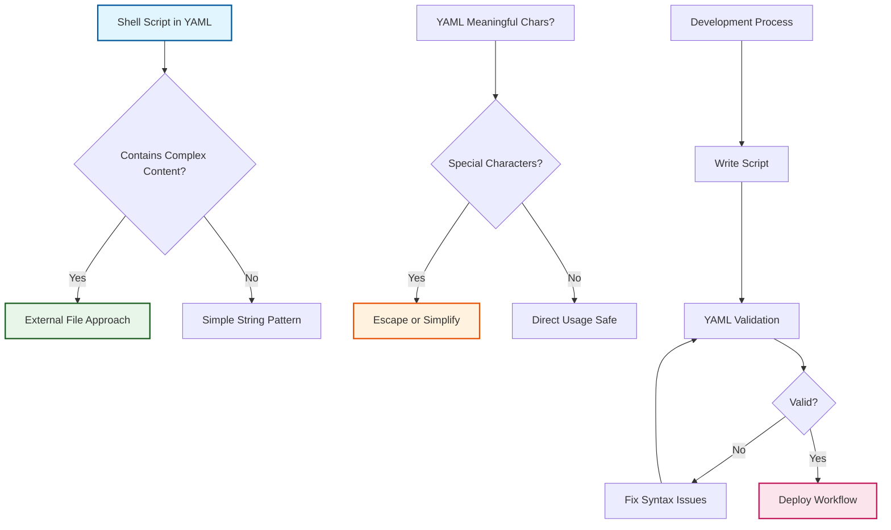

# ADR-010: YAML-Safe Shell Scripting in GitHub Actions

:material-star: **Critical Decision** | :material-calendar: **2025-06-03** | :material-check-circle: **Accepted**

## Problem Statement

GitHub Actions workflows use YAML syntax to define shell scripts, creating potential conflicts when shell scripts contain YAML-meaningful characters. During initialization workflow development, YAML parsing errors were encountered that prevented workflow execution and blocked critical automation processes.

## Context and Requirements

### :material-alert-circle: YAML-Shell Script Conflict Issues

**Syntax Collision Problems**:
- Shell scripts containing YAML-meaningful characters (colons, quotes, backticks) break YAML parsing
- Heredocs with complex content cause YAML parser confusion and failure
- Multiline string assignments within YAML run blocks create parsing ambiguity
- Special characters in shell variable assignments interfere with YAML structure

**Specific Failure Patterns Encountered**:
```yaml
# Problematic YAML-shell script interaction
parsing_failures:
  heredoc_conflicts: |
    # ❌ This breaks YAML parsing
    MANUAL_STEPS="## Manual Configuration Required
    
    Since no GH_TOKEN was provided, please complete these steps:
    
    ### 1. Branch Protection  
    - Go to Settings → Branches
    - For each branch (`main`, `fork_upstream`, `fork_integration`):
      - Require pull request reviews before merging"
      
  yaml_parser_errors:
    - "line 351: could not find expected ':'"
    - "line 353: mapping values are not allowed in this context"
    - "invalid YAML: found unexpected character that cannot start any token"
```

**Development Impact**:
- Workflow failures during critical automation processes
- Time-consuming debugging of complex YAML-shell script interactions
- Inconsistent behavior across different YAML parsers and GitHub Actions contexts
- Difficulty validating workflow syntax during development and testing

### :material-target: Safe Scripting Requirements

**Reliable Workflow Execution**: Shell scripts must not interfere with YAML parsing or cause workflow failures.

**Maintainable Development Patterns**: Clear, consistent patterns that team members can follow confidently.

**Validation and Testing**: Easy validation of workflow syntax during development to prevent deployment issues.

## Decision

Establish **YAML-Safe Shell Scripting Patterns** for GitHub Actions workflows with comprehensive guidelines:



### :material-code-tags Core Safe Scripting Patterns

#### **1. Avoid Complex Heredocs in Variable Assignments**
```yaml
# Pattern guidelines for heredoc usage
heredoc_guidelines:
  problematic_pattern: |
    # ❌ Don't: Complex heredocs in YAML
    VARIABLE=$(cat << 'EOF'
    Multi-line content with: colons
    And other YAML-meaningful characters
    EOF
    )
    
  safe_pattern: |
    # ✅ Do: Simple single-line assignments
    VARIABLE="Simple single-line message without YAML conflicts"
    
    # ✅ Alternative: Build content through concatenation
    VARIABLE="Line 1. "
    VARIABLE+="Line 2. "
    VARIABLE+="Line 3."
```

#### **2. External Files for Complex Content**
```yaml
# Content management strategies
external_content_approach:
  problematic: |
    # ❌ Don't: Embed complex markdown in shell variables
    run: |
      COMPLEX_MESSAGE="## Complex Title
      - Item 1: Details
      - Item 2: More details
      ### Section: Information"
      
  safe_approach: |
    # ✅ Do: Store complex content in separate files
    run: |
      # Reference external template files
      TEMPLATE_FILE=".github/templates/manual-steps.md"
      if [ -f "$TEMPLATE_FILE" ]; then
        COMPLEX_MESSAGE=$(cat "$TEMPLATE_FILE")
      else
        COMPLEX_MESSAGE="Manual configuration required. See documentation."
      fi
```

#### **3. Escape YAML-Meaningful Characters**
```yaml
# Character escaping guidelines
character_handling:
  problematic_chars:
    - "colons_in_content: 'Here's what was set up:'"
    - "apostrophes: 'Here's the result'"
    - "backticks: '`command` execution'"
    - "quotes: 'Use \"double quotes\" properly'"
    
  safe_alternatives:
    - "colons_avoided: 'Here is what was set up'"
    - "apostrophes_avoided: 'Here is the result'"
    - "backticks_escaped: 'command execution'"
    - "quotes_simplified: 'Use double quotes properly'"
```

#### **4. Simple String Concatenation Approach**
```yaml
# Safe string building patterns
string_building:
  complex_approach: |
    # ❌ Don't: Complex multiline assignments in YAML
    MESSAGE="Line 1
    Line 2: with colons
    Line 3"
    
  safe_approach: |
    # ✅ Do: Build using simple concatenation
    MESSAGE="Line 1. "
    MESSAGE+="Line 2 with details. "
    MESSAGE+="Line 3."
    
  template_approach: |
    # ✅ Alternative: Use printf for formatted content
    MESSAGE=$(printf "Line 1\nLine 2 with details\nLine 3")
```

### :material-check-circle Validation and Testing Framework

#### **YAML Validation Command**
```yaml
# Required validation during development
yaml_validation:
  command: "yq eval '.github/workflows/workflow-name.yml' >/dev/null"
  success_message: "✅ YAML is valid"
  failure_message: "❌ YAML has errors"
  
  validation_script: |
    # Complete validation script for all workflows
    for file in .github/workflows/*.yml; do
      echo "Validating $file..."
      if yq eval "$file" >/dev/null 2>&1; then
        echo "✅ $file is valid"
      else
        echo "❌ $file has errors"
        yq eval "$file" 2>&1 | head -5
      fi
    done
```

#### **Development Process Integration**
```yaml
# Integrated development workflow
development_process:
  code_review_requirement: "All workflow changes must pass YAML validation"
  pre_commit_validation: "YAML checking integrated into development process"
  ci_validation: "Automated YAML validation in pull request workflows"
  
  pre_commit_hook: |
    # Pre-commit hook for YAML validation
    #!/bin/bash
    echo "Validating GitHub Actions workflows..."
    for file in .github/workflows/*.yml; do
      if ! yq eval "$file" >/dev/null 2>&1; then
        echo "❌ YAML validation failed for $file"
        exit 1
      fi
    done
    echo "✅ All workflow YAML files are valid"
```

## Implementation Strategy

### :material-wrench-cog Immediate Remediation Actions

#### **Fixed Initialization Workflow**
```yaml
# Corrected init-complete.yml patterns
corrected_patterns:
  before: |
    # ❌ Problematic heredoc causing YAML parsing errors
    MANUAL_STEPS="## Manual Configuration Required
    
    Since no GH_TOKEN was provided, please complete these steps:
    
    ### 1. Branch Protection  
    - Go to Settings → Branches"
    
  after: |
    # ✅ Simple, safe string assignment
    MANUAL_STEPS="Manual configuration required. See repository settings for branch protection setup."
    
    # ✅ Alternative: Build comprehensive message safely
    MANUAL_STEPS="Manual configuration required. "
    MANUAL_STEPS+="Go to Settings → Branches to configure protection rules. "
    MANUAL_STEPS+="Repeat for main, fork_upstream, and fork_integration branches."
```

#### **Template Updates Applied**
```yaml
# Systematic application of safe patterns
template_updates:
  affected_workflows:
    - "init-complete.yml: Simplified manual steps messaging"
    - "cascade.yml: Removed complex heredoc assignments"
    - "sync.yml: Updated notification content patterns"
    
  validation_integration:
    - "Added YAML validation to development process"
    - "Created pre-commit hooks for syntax checking"
    - "Updated documentation with safe patterns"
```

### :material-school-outline Team Adoption Framework

#### **Pattern Documentation and Training**
```yaml
# Comprehensive team guidance
team_adoption:
  documentation:
    - "This ADR serves as reference for safe scripting patterns"
    - "Examples provided for common scenarios and use cases"
    - "Troubleshooting guide for YAML-shell script conflicts"
    
  training_materials:
    - "Workshop on YAML-safe shell scripting in GitHub Actions"
    - "Code review checklist including YAML validation requirements"
    - "Common pitfalls and resolution strategies documentation"
```

## Benefits and Rationale

### :material-trending-up Strategic Advantages

#### **Workflow Reliability Enhancement**
- Eliminates YAML parsing errors that block critical automation processes
- Consistent behavior across different YAML parsers and GitHub Actions environments
- Predictable workflow execution without syntax-related failures
- Reduced debugging time for workflow syntax issues

#### **Development Productivity Improvement**
- Clear patterns reduce time spent on complex YAML-shell script interactions
- Faster development cycles through early validation and error prevention
- Team productivity gains through standardized, reliable scripting approaches
- Simplified maintenance and modification of existing workflows

#### **Quality Assurance Integration**
- YAML validation integrated into development process prevents deployment issues
- Code review requirements ensure consistent application of safe patterns
- Pre-commit hooks catch syntax issues before they reach shared repositories
- Systematic testing of workflow syntax during development

### :material-cog-outline Technical Architecture Benefits

#### **Maintainable Workflow Design**
- Simpler patterns easier to debug, modify, and extend
- Clear separation between complex content and workflow logic
- External file approach enables sophisticated content without YAML conflicts
- Standardized approaches reduce cognitive load for workflow development

#### **Robust Error Prevention**
- Proactive pattern adoption prevents entire class of syntax errors
- Validation framework catches issues early in development cycle
- Clear guidelines enable confident workflow modification
- Reduced risk of production workflow failures due to syntax issues

## Alternative Approaches Considered

### :material-close-circle: External Template Files Only

**Approach**: Store all complex content in separate template files

- **Pros**: Complete separation of complex content from YAML, maximum flexibility
- **Cons**: Additional file management overhead, less self-contained workflows
- **Decision**: Rejected as primary approach - hybrid approach balances simplicity with flexibility

### :material-close-circle: JSON-Encoded Strings

**Approach**: Encode complex content as JSON strings within YAML

- **Pros**: Guaranteed YAML compatibility through proper escaping
- **Cons**: Significantly reduced readability, complex escaping requirements
- **Decision**: Rejected due to poor developer experience and maintenance complexity

### :material-close-circle: GitHub Actions Expressions Only

**Approach**: Use native GitHub Actions expressions for all dynamic content

- **Pros**: Native GitHub syntax, platform-specific optimization
- **Cons**: Limited formatting capabilities, expression complexity for advanced scenarios
- **Decision**: Rejected as insufficient for complex workflow content requirements

### :material-close-circle: YAML Block Scalar Styles

**Approach**: Use different YAML block scalar styles (| and >) for content

- **Pros**: Native YAML features for multiline content
- **Cons**: Still vulnerable to content containing YAML-meaningful characters
- **Decision**: Rejected as incomplete solution to character conflict issues

## Consequences and Trade-offs

### :material-plus: Positive Outcomes

#### **Enhanced Workflow Reliability**
- Elimination of YAML parsing errors that block critical automation
- Consistent, predictable workflow execution across all environments
- Reduced debugging time for syntax-related workflow failures
- Improved confidence in workflow deployment and maintenance

#### **Development Experience Improvement**
- Clear patterns reduce learning curve for workflow development
- Faster development cycles through early error prevention
- Standardized approaches enable efficient code review processes
- Comprehensive validation framework catches issues before deployment

#### **Team Productivity Enhancement**
- Reduced time spent debugging complex YAML-shell script interactions
- Clear guidelines enable confident workflow modification and extension
- Systematic testing prevents workflow failures in critical automation
- Knowledge sharing through documented patterns and best practices

### :material-minus Trade-offs and Limitations

#### **Content Complexity Constraints**
- Complex formatted messages require external files or simplified approaches
- Some advanced shell scripting patterns may need modification for YAML safety
- Limitation on inline documentation and extensive help text within workflows

#### **Development Process Changes**
- Team needs to adopt new development patterns and validation requirements
- Additional validation steps in development process add minor overhead
- Learning curve for understanding YAML-shell script interaction patterns

## Success Metrics

### :material-chart-line: Quantitative Indicators

- **Workflow Failure Reduction**: 100% elimination of YAML parsing errors in workflows
- **Development Speed**: Reduced debugging time for workflow syntax issues
- **Validation Coverage**: 100% of workflows pass YAML validation before deployment
- **Team Adoption**: All team members follow safe scripting patterns consistently

### :material-check-all: Qualitative Indicators

- Teams report improved confidence in workflow development and modification
- Clear understanding of safe patterns and validation requirements
- Effective integration of YAML validation into development workflow
- Reduced support requests related to workflow syntax issues

## Integration Points

### :material-source-branch Workflow Development Integration

#### **Two-Workflow Initialization Pattern** (per [ADR-006](adr_006_initialization.md))
- Safe scripting patterns applied to initialization workflow complexity
- YAML validation ensures reliable initialization process execution
- Simplified content patterns maintain workflow clarity and reliability

#### **Template Repository Pattern** (per [ADR-003](adr_003_template_pattern.md))
- Safe scripting patterns propagated through template updates
- Validation requirements ensure template workflows remain reliable
- Pattern documentation becomes part of template guidance

### :material-quality-assurance Quality Assurance Integration

#### **Development Process Enhancement**
- YAML validation integrated into code review requirements
- Pre-commit hooks prevent syntax issues from reaching shared repositories
- Continuous integration validates workflow syntax automatically

## Related Decisions

- [ADR-006](adr_006_initialization.md): Two-workflow initialization pattern benefits from safe scripting
- [ADR-003](adr_003_template_pattern.md): Template repository pattern propagates safe scripting practices
- [ADR-002](adr_002_github_actions.md): GitHub Actions automation enhanced by reliable scripting patterns

---

*This YAML-safe shell scripting standard ensures reliable GitHub Actions workflow execution by establishing clear patterns that prevent YAML parsing conflicts while maintaining development productivity and workflow maintainability.*