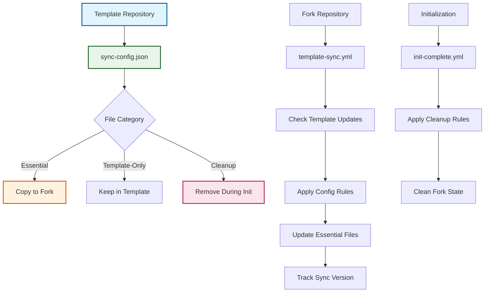

# ADR-011: Configuration-Driven Template Synchronization

:material-star: **Critical Decision** | :material-calendar: **2025-06-04** | :material-check-circle: **Accepted**

## Problem Statement

The original template repository pattern created a critical bootstrap problem: once repositories were created from the template, there was no systematic way to propagate template improvements, security patches, or new features to existing forked repositories. This led to significant template drift and inconsistent infrastructure across deployments.

## Context and Requirements

### :material-alert-circle: Static Template Limitations

**Template Drift Challenges**:
- Forked repositories became outdated as the template evolved with improvements
- No automated mechanism to propagate workflow updates to existing deployments
- Inconsistent infrastructure as repositories diverged from template standards
- Security improvements in template didn't reach existing fork repositories

**Manual Update Burden**:
- Teams required manual tracking and application of template changes
- Error-prone process copying changes between template and fork repositories
- No visibility into which template version each fork was synchronized to
- Coordination overhead for applying updates across multiple repository instances

**Maintenance and Consistency Issues**:
- Difficulty distinguishing between template infrastructure and project-specific content
- No systematic cleanup of template development artifacts during initialization
- Unclear boundaries between template-management files and project-essential files
- Risk of accidentally over-syncing or under-syncing critical infrastructure

### :material-target: Synchronization Requirements

**Systematic Sync Management**: Clear definition of which files should be synchronized between template and forks with explicit categorization.

**Selective Update Mechanism**: Automated propagation of essential infrastructure while preserving project-specific customizations.

**Clean Repository State**: Systematic cleanup of template-specific content during initialization with documented rationale.

## Decision

Implement a **Configuration-Driven Template Synchronization System** using structured configuration to manage selective file synchronization:



### :material-file-document-outline Configuration Architecture

#### **Comprehensive Sync Configuration (.github/sync-config.json)**
```json
{
  "sync_rules": {
    "directories": [
      {
        "path": ".github/ISSUE_TEMPLATE",
        "reason": "Standard issue templates for consistent project management"
      },
      {
        "path": ".github/PULL_REQUEST_TEMPLATE", 
        "reason": "PR templates ensuring proper review processes"
      }
    ],
    "files": [
      {
        "path": ".github/dependabot.yml",
        "reason": "Automated dependency management configuration"
      },
      {
        "path": ".github/labels.json",
        "reason": "Centralized label definitions for workflow automation"
      }
    ],
    "workflows": {
      "essential": [
        ".github/workflows/sync.yml",
        ".github/workflows/validate.yml",
        ".github/workflows/build.yml",
        ".github/workflows/release.yml",
        ".github/workflows/template-sync.yml"
      ],
      "template_only": [
        ".github/workflows/init.yml",
        ".github/workflows/init-complete.yml",
        ".github/workflows/cascade.yml",
        ".github/workflows/cascade-monitor.yml"
      ]
    },
    "tracking_files": [
      ".github/.template-sync-commit"
    ]
  },
  "cleanup_rules": {
    "directories": [
      {
        "path": "doc/",
        "reason": "Template documentation replaced by upstream project docs"
      },
      {
        "path": ".claude/",
        "reason": "Claude configuration specific to template development"
      }
    ],
    "files": [
      {
        "path": "CLAUDE.md",
        "reason": "Template-specific Claude instructions"
      },
      {
        "path": ".github/copilot-instructions.md",
        "reason": "Template-specific AI instructions"
      }
    ],
    "workflows": [
      {
        "path": ".github/workflows/init.yml",
        "reason": "One-time initialization workflow"
      },
      {
        "path": ".github/workflows/init-complete.yml",
        "reason": "One-time setup workflow"
      }
    ]
  },
  "exclusions": [
    "project-specific-config.yml",
    "custom-workflows/",
    ".env.local"
  ]
}
```

### :material-cog-sync Configuration-Aware Workflow Integration

#### **Initialization Cleanup Process**
```yaml
# Enhanced init-complete.yml with configuration-driven cleanup
initialization_cleanup:
  sync_configuration: "Read .github/sync-config.json for cleanup rules"
  
  directory_cleanup: |
    # Remove template-specific directories with documented reasons
    CLEANUP_DIRS=$(jq -r '.cleanup_rules.directories[]? | .path' .github/sync-config.json)
    for dir in $CLEANUP_DIRS; do
      if [ -d "$dir" ]; then
        echo "Removing template directory: $dir"
        rm -rf "$dir"
      fi
    done
    
  file_cleanup: |
    # Remove template-specific files with clear rationale
    CLEANUP_FILES=$(jq -r '.cleanup_rules.files[]? | .path' .github/sync-config.json)
    for file in $CLEANUP_FILES; do
      if [ -f "$file" ]; then
        echo "Removing template file: $file"
        rm -f "$file"
      fi
    done
    
  workflow_cleanup: |
    # Remove initialization workflows after completion
    CLEANUP_WORKFLOWS=$(jq -r '.cleanup_rules.workflows[]? | .path' .github/sync-config.json)
    for workflow in $CLEANUP_WORKFLOWS; do
      if [ -f "$workflow" ]; then
        echo "Removing initialization workflow: $workflow"
        rm -f "$workflow"
      fi
    done
```

#### **Template Synchronization Process**
```yaml
# Configuration-driven template-sync.yml implementation
template_synchronization:
  change_detection: "Check only configured sync paths for template updates"
  
  sync_path_collection: |
    # Build sync path list from configuration
    SYNC_PATHS=""
    
    # Add configured directories
    DIRECTORIES=$(jq -r '.sync_rules.directories[]? | .path' temp-sync-config.json)
    for dir in $DIRECTORIES; do
      SYNC_PATHS="$SYNC_PATHS $dir"
    done
    
    # Add configured files
    FILES=$(jq -r '.sync_rules.files[]? | .path' temp-sync-config.json)
    for file in $FILES; do
      SYNC_PATHS="$SYNC_PATHS $file"
    done
    
    # Add essential workflows
    ESSENTIAL_WORKFLOWS=$(jq -r '.sync_rules.workflows.essential[]?' temp-sync-config.json)
    for workflow in $ESSENTIAL_WORKFLOWS; do
      SYNC_PATHS="$SYNC_PATHS $workflow"
    done
    
  change_analysis: |
    # Check for changes only in configured paths
    for path in $SYNC_PATHS; do
      CHANGES=$(git diff --name-only $LAST_SYNC_COMMIT..$TEMPLATE_COMMIT template/main -- "$path")
      if [ -n "$CHANGES" ]; then
        echo "Changes detected in $path"
        # Process updates for this path
      fi
    done
```

## Implementation Strategy

### :material-folder-sync Selective File Categorization

#### **Essential Infrastructure Files**
```yaml
# Files that must stay synchronized across all forks
essential_infrastructure:
  templates:
    - .github/ISSUE_TEMPLATE/: "Standardized issue reporting"
    - .github/PULL_REQUEST_TEMPLATE/: "Consistent PR review process"
  
  configuration:
    - .github/dependabot.yml: "Automated dependency management"
    - .github/labels.json: "Centralized label definitions"
    - .github/branch-protection.json: "Repository security settings"
    
  actions:
    - .github/actions/: "Reusable workflow components"
    
  security:
    - .github/security-on.json: "Security scanning configuration"
    - .github/security-patterns.txt: "Security pattern definitions"
```

#### **Essential vs Template-Only Workflows**
```yaml
# Clear separation of workflow purposes
workflow_categorization:
  essential_workflows:
    purpose: "Core fork management functionality required in all deployments"
    workflows:
      - sync.yml: "Upstream synchronization automation"
      - validate.yml: "PR validation and quality gates"
      - build.yml: "Project build and test automation"
      - release.yml: "Automated semantic versioning and releases"
      - template-sync.yml: "Template update propagation"
      - dependabot-validation.yml: "Dependency update validation"
      
  template_only_workflows:
    purpose: "Template development and initialization, not needed in forks"
    workflows:
      - init.yml: "One-time repository initialization"
      - init-complete.yml: "Repository setup completion"
      - cascade.yml: "Fork-specific cascade integration"
      - cascade-monitor.yml: "Cascade monitoring and recovery"
```

### :material-track-changes Version Tracking and History

#### **Synchronization State Management**
```yaml
# Comprehensive tracking of template synchronization state
sync_tracking:
  commit_tracking: ".github/.template-sync-commit stores last synced template version"
  
  sync_history: |
    # Track synchronization events with metadata
    echo "Last synced: $(date -u +%Y-%m-%dT%H:%M:%SZ)" >> .github/.template-sync-history
    echo "Template commit: $TEMPLATE_COMMIT" >> .github/.template-sync-history
    echo "Files updated: $UPDATED_FILES" >> .github/.template-sync-history
    
  version_correlation: |
    # Maintain relationship between fork and template versions
    gh issue create \
      --title "📦 Template Sync $(date +%Y-%m-%d)" \
      --body "Template updated to $TEMPLATE_COMMIT. Files synchronized: $SYNC_SUMMARY" \
      --label "template-sync,automated"
```

## Benefits and Rationale

### :material-trending-up Strategic Advantages

#### **Template Drift Elimination**
- Automated propagation ensures forked repositories stay current with template improvements
- Selective synchronization prevents overwriting project-specific customizations
- Version tracking provides clear visibility into template synchronization state
- Consistent infrastructure maintenance across all repository deployments

#### **Maintainable Synchronization Architecture**
- Single configuration file controls all sync behavior with clear documentation
- Explicit categorization eliminates ambiguity about file synchronization requirements
- JSON-based configuration enables programmatic processing and validation
- Git-tracked configuration changes provide complete audit trail

#### **Clean Repository State Management**
- Systematic cleanup removes template development artifacts during initialization
- Documented cleanup rationale provides clear understanding of removal decisions
- Consistent clean starting state across all forked repository deployments
- Future-proof cleanup behavior through configurable rules

### :material-cog-outline Operational Benefits

#### **Conflict Prevention and Boundary Management**
- Clear separation between template infrastructure and project-specific content
- Explicit exclusion rules prevent accidental synchronization of custom files
- Selective update mechanism preserves project customizations while updating infrastructure
- Documented boundaries enable confident customization without sync conflicts

#### **Development and Maintenance Efficiency**
- Easy addition of new files to synchronization process through configuration updates
- Transparent sync process with clear documentation of what gets synchronized
- Reduced manual coordination overhead for template improvements
- Self-documenting configuration with rationale for each synchronization decision

## Alternative Approaches Considered

### :material-close-circle: Manual Synchronization Documentation

**Approach**: Comprehensive documentation with step-by-step synchronization instructions

- **Pros**: Simple approach with no automation complexity
- **Cons**: Error-prone manual process, poor adoption rates, inconsistent application
- **Decision**: Rejected due to fundamental reliability and consistency issues

### :material-close-circle: Git Subtree/Submodule Integration

**Approach**: Native Git functionality for template integration

- **Pros**: Leverages standard Git features, well-understood by developers
- **Cons**: Complex user experience, doesn't handle selective file synchronization
- **Decision**: Rejected due to user experience complexity and selective sync limitations

### :material-close-circle: Hardcoded Synchronization Lists

**Approach**: Direct file lists embedded in workflow code

- **Pros**: Direct implementation, no additional configuration complexity
- **Cons**: Difficult to maintain, poor documentation of synchronization decisions
- **Decision**: Rejected due to maintainability concerns and lack of transparency

### :material-close-circle: External Synchronization Service

**Approach**: Dedicated service for sophisticated synchronization management

- **Pros**: Powerful capabilities, could handle complex synchronization scenarios
- **Cons**: External dependency, additional infrastructure requirements, complexity overhead
- **Decision**: Rejected due to template self-containment requirements

## Consequences and Trade-offs

### :material-plus: Positive Outcomes

#### **Infrastructure Consistency Excellence**
- Template improvements automatically reach all forked repositories
- Selective synchronization preserves project customizations while updating infrastructure
- Clean repository state eliminates template development artifacts
- Consistent behavior across unlimited repository deployments

#### **Maintainability and Transparency**
- Single configuration file controls all synchronization behavior
- Clear documentation of what gets synchronized and rationale for decisions
- Easy addition of new files to synchronization process
- Git-tracked configuration provides complete audit trail

#### **Conflict Prevention and Reliability**
- Explicit boundaries between template and project content
- Automated cleanup prevents template artifact accumulation
- Version tracking enables troubleshooting and rollback capabilities
- Self-updating configuration ensures consistency across deployments

### :material-minus: Trade-offs and Limitations

#### **Configuration Management Complexity**
- Additional JSON configuration file requires maintenance and understanding
- Bootstrap dependency: sync configuration must exist before synchronization works
- JSON syntax knowledge required for configuration modifications
- Learning curve for understanding configuration structure and options

#### **Implementation Dependencies**
- Synchronization workflows depend on configuration file accuracy
- Changes to sync behavior require configuration file updates
- Need for configuration validation to prevent sync failures
- Coordination required when multiple developers modify configuration

## Success Metrics

### :material-chart-line: Quantitative Indicators

- **Template Drift Elimination**: 100% of essential files synchronized across deployments
- **Synchronization Success Rate**: >99% successful template synchronization operations
- **Clean State Achievement**: Zero template artifacts remaining after initialization
- **Configuration Accuracy**: All synchronization rules properly documented and categorized

### :material-check-all: Qualitative Indicators

- Teams report confidence in template update propagation
- Clear understanding of file synchronization categories and rationale
- Effective separation between template infrastructure and project content
- Reduced manual coordination overhead for template improvements

## Integration Points

### :material-source-branch Template and Initialization Integration

#### **Template Repository Pattern** (per [ADR-003](adr_003_template_pattern.md))
- Configuration-driven approach enhances template repository with systematic update mechanism
- Selective synchronization preserves template self-configuration benefits
- Clean initialization process improved through documented cleanup rules

#### **Two-Workflow Initialization** (per [ADR-006](adr_006_initialization.md))
- Initialization workflows enhanced with configuration-driven cleanup
- Systematic removal of template artifacts during repository setup
- Clear documentation of cleanup rationale for maintenance

### :material-update Template Update Propagation

#### **Template Update Strategy** (per [ADR-012](adr_012_template_updates.md))
- Configuration provides foundation for systematic update propagation
- Version tracking enables sophisticated update management
- Selective synchronization rules prevent project customization conflicts

## Related Decisions

- [ADR-003](adr_003_template_pattern.md): Template repository pattern enhanced by this synchronization system
- [ADR-006](adr_006_initialization.md): Two-workflow initialization enhanced by sync configuration
- [ADR-012](adr_012_template_updates.md): Template update propagation depends on this configuration system
- Template Sync Workflow Implementation: Leverages configuration for selective file synchronization

---

*This configuration-driven template synchronization system provides systematic, maintainable propagation of template improvements while preserving project customizations, ensuring consistent infrastructure across all repository deployments through selective file synchronization and documented cleanup processes.*