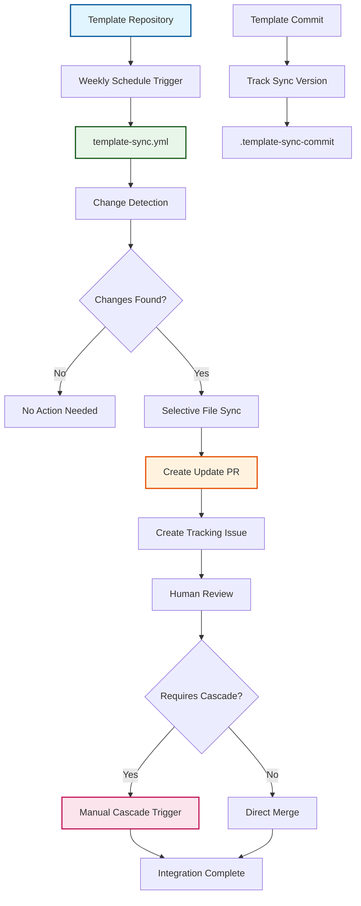

# ADR-012: Template Update Propagation Strategy

:material-star: **Critical Decision** | :material-calendar: **2025-06-04** | :material-check-circle: **Accepted** | :material-refresh: **Revised** 2025-06-29

## Problem Statement

Following the implementation of configuration-driven template synchronization, a critical gap remained: while sync configuration defined what should be synchronized, there was no systematic strategy for how and when template updates actually reach existing forked repositories. This created a template update propagation problem that limited the value of template improvements.

## Context and Requirements

### :material-alert-circle: Template Update Propagation Challenges

**Automatic Update Requirements**:
- Template improvements should reach forks without manual intervention from teams
- Only template infrastructure should be updated, preserving project-specific content
- Change visibility must provide clear understanding of what updates are being applied
- Review process required to validate updates before integration into fork repositories

**Change Management Complexity**:
- Bootstrap problem: how do forked repositories initially gain template sync capability
- Change detection: identifying which template changes are relevant to each fork
- Update scheduling: determining optimal timing for template update checks and application
- Conflict resolution: handling cases where template changes conflict with local modifications

**Integration and Coordination**:
- Version tracking: maintaining visibility into which template version each fork uses
- Human-centric flow: providing clear guidance when template changes require manual actions
- Cascade integration: coordinating template updates with upstream synchronization workflows
- Manual override capability: enabling immediate updates for critical security fixes

### :material-target Update Propagation Requirements

**Automated Template Benefits**: Template improvements reach forks systematically without manual coordination overhead.

**Selective and Safe Updates**: Only template infrastructure updated while preserving project customizations with conflict detection.

**Human-Centric Integration**: Clear guidance for when template changes require manual cascade triggering or other interventions.

## Decision

Implement **Template Update Propagation Strategy** through dedicated `template-sync.yml` workflow with intelligent change detection:



### :material-schedule Template Sync Workflow Architecture

#### **Predictable Update Schedule**
```yaml
# template-sync.yml trigger configuration
update_schedule:
  primary_trigger:
    schedule: "Weekly on Monday at 8 AM (0 8 * * 1)"
    rationale: "Predictable timing allows teams to expect and prepare for updates"
    
  manual_override:
    workflow_dispatch: "Manual trigger for critical security updates"
    use_cases: ["Security patches", "Critical bug fixes", "Urgent feature deployments"]
    
  batching_benefits:
    - "Multiple template improvements delivered together"
    - "Reduced PR noise compared to immediate propagation"
    - "Predictable team workflow integration"
    - "Consolidated review and testing effort"
```

#### **Intelligent Change Detection Process**
```yaml
# Sophisticated change detection with sync configuration
change_detection:
  template_commit_tracking: |
    # Get latest template state
    TEMPLATE_COMMIT=$(git rev-parse template/main)
    
    # Read last synchronized commit
    LAST_SYNC_COMMIT=$(cat .github/.template-sync-commit)
    
    # Get current sync configuration from template
    git show template/main:.github/sync-config.json > temp-sync-config.json
    
  sync_path_analysis: |
    # Build comprehensive list of paths to monitor
    SYNC_PATHS=""
    
    # Add configured directories
    DIRECTORIES=$(jq -r '.sync_rules.directories[]? | .path' temp-sync-config.json)
    for dir in $DIRECTORIES; do
      SYNC_PATHS="$SYNC_PATHS $dir"
    done
    
    # Add configured files
    FILES=$(jq -r '.sync_rules.files[]? | .path' temp-sync-config.json)
    for file in $FILES; do
      SYNC_PATHS="$SYNC_PATHS $file"
    done
    
    # Add essential workflows
    ESSENTIAL_WORKFLOWS=$(jq -r '.sync_rules.workflows.essential[]?' temp-sync-config.json)
    for workflow in $ESSENTIAL_WORKFLOWS; do
      SYNC_PATHS="$SYNC_PATHS $workflow"
    done
    
  change_analysis: |
    # Check for changes only in configured paths
    CHANGES=$(git diff --name-only $LAST_SYNC_COMMIT..$TEMPLATE_COMMIT template/main -- $SYNC_PATHS)
    
    if [ -n "$CHANGES" ]; then
      echo "Template changes detected in: $CHANGES"
      # Proceed with synchronization process
    else
      echo "No template changes in synchronized paths"
      exit 0
    fi
```

### :material-file-sync Selective File Synchronization Implementation

#### **Configuration-Driven Sync Process**
```yaml
# Comprehensive selective synchronization
selective_sync_implementation:
  directory_sync: |
    # Sync entire directories that should be kept identical
    DIRECTORIES=$(jq -r '.sync_rules.directories[]? | .path' temp-sync-config.json)
    for dir in $DIRECTORIES; do
      if [[ $CHANGES == *"$dir"* ]]; then
        echo "Syncing directory: $dir"
        rm -rf "$dir"
        git archive template/main "$dir" | tar -x
        git add "$dir"
      fi
    done
    
  file_sync: |
    # Sync individual files with precise control
    FILES=$(jq -r '.sync_rules.files[]? | .path' temp-sync-config.json)
    for file in $FILES; do
      if [[ $CHANGES == *"$file"* ]]; then
        echo "Syncing file: $file"
        git show template/main:"$file" > "$file"
        git add "$file"
      fi
    done
    
  workflow_sync: |
    # Sync essential workflows while preserving fork-specific ones
    WORKFLOWS=$(jq -r '.sync_rules.workflows.essential[]?' temp-sync-config.json)
    for workflow in $WORKFLOWS; do
      if [[ $CHANGES == *"$workflow"* ]]; then
        echo "Syncing essential workflow: $workflow"
        git show template/main:"$workflow" > "$workflow"
        git add "$workflow"
      fi
    done
```

#### **Version Tracking and State Management**
```yaml
# Comprehensive tracking of synchronization state
version_tracking:
  commit_tracking: |
    # Update tracking file with latest template commit
    echo "$TEMPLATE_COMMIT" > .github/.template-sync-commit
    git add .github/.template-sync-commit
    
  sync_metadata: |
    # Create comprehensive synchronization record
    cat > .github/.template-sync-metadata <<EOF
    last_sync_date: $(date -u +%Y-%m-%dT%H:%M:%SZ)
    template_commit: $TEMPLATE_COMMIT
    sync_branch: $SYNC_BRANCH
    changed_files: $(echo "$CHANGES" | wc -l)
    files_list: |
    $(echo "$CHANGES" | sed 's/^/  - /')
    EOF
    git add .github/.template-sync-metadata
```

## Implementation Strategy

### :material-bootstrap Auto-Bootstrap Strategy for Existing Repositories

#### **Seamless Migration Support**
```yaml
# Sophisticated auto-bootstrap for existing repositories
auto_bootstrap:
  problem: "Repositories created before template sync lack tracking files"
  
  detection_logic: |
    # Smart detection of missing or invalid tracking
    if [ -f "$LAST_SYNC_FILE" ] && [ -s "$LAST_SYNC_FILE" ]; then
      LAST_SYNC_COMMIT=$(cat "$LAST_SYNC_FILE")
      echo "Using existing sync commit: $LAST_SYNC_COMMIT"
    else
      echo "Auto-bootstrap required: missing or empty tracking file"
      
      # Find earliest template infrastructure commit as baseline
      BASELINE_COMMIT=$(git log template/main --reverse --oneline -- .github/ | head -1 | cut -d' ' -f1)
      
      if [ -n "$BASELINE_COMMIT" ]; then
        echo "Auto-bootstrap baseline: $BASELINE_COMMIT"
        echo "$BASELINE_COMMIT" > .github/.template-sync-commit
        LAST_SYNC_COMMIT="$BASELINE_COMMIT"
      else
        echo "Error: Could not determine bootstrap baseline"
        exit 1
      fi
    fi
    
  benefits:
    - "Seamless migration: existing repositories adopt template sync automatically"
    - "Smart baseline: uses earliest template infrastructure, not arbitrary date"
    - "Immediate tracking: creates tracking file to prevent future bootstrap issues"
    - "Comprehensive updates: first sync includes all improvements since baseline"
```

### :material-account-supervisor-circle Human-Centric Integration Workflow

#### **Template Update Issue Creation**
```yaml
# Enhanced issue creation with cascade guidance
template_update_issue:
  trigger: "After successful template sync PR creation"
  
  issue_content: |
    NOTIFICATION_BODY="## 📋 Template Updates Ready for Review
    
    New template infrastructure updates are available for integration.
    
    **Update Details:**
    - **PR:** $PR_URL
    - **Template Version:** $TEMPLATE_COMMIT
    - **Changed Files:** $(git diff --name-only main...$SYNC_BRANCH | wc -l) files
    - **Changes:** Template infrastructure improvements
    
    **Change Categories:**
    $(analyze_changes_and_categorize)
    
    **Next Steps:**
    1. 🔍 **Review the template update PR** for infrastructure changes
    2. ✅ **Merge the PR** when satisfied with the updates
    3. 🚀 **Manually trigger 'Cascade Integration' workflow** if changes affect workflows
    4. 📊 **Monitor integration progress** in Actions tab
    
    **Cascade Integration Required?**
    $(determine_cascade_requirement)
    
    **Timeline:**
    - Template sync detected: $(date -u +%Y-%m-%dT%H:%M:%SZ)
    - Action required: Human review, merge, and potential cascade trigger"
    
  issue_creation: |
    gh issue create \
      --title "📋 Template Updates Ready for Review - $(date +%Y-%m-%d)" \
      --body "$NOTIFICATION_BODY" \
      --label "template-sync,human-required"
```

#### **Cascade Integration Determination**
```yaml
# Intelligent cascade requirement analysis
cascade_analysis:
  workflow_changes: |
    # Check if essential workflows were modified
    WORKFLOW_CHANGES=$(echo "$CHANGES" | grep "\.github/workflows/")
    if [ -n "$WORKFLOW_CHANGES" ]; then
      echo "⚠️ **Workflow changes detected** - Cascade integration recommended"
      echo "Modified workflows: $WORKFLOW_CHANGES"
    fi
    
  configuration_changes: |
    # Check if configuration files were modified
    CONFIG_CHANGES=$(echo "$CHANGES" | grep -E "\.(json|yml|yaml)$")
    if [ -n "$CONFIG_CHANGES" ]; then
      echo "🔧 **Configuration changes detected** - Review for cascade impact"
      echo "Modified configs: $CONFIG_CHANGES"
    fi
    
  guidance_generation: |
    # Provide specific guidance based on change analysis
    if [[ -n "$WORKFLOW_CHANGES" || -n "$CONFIG_CHANGES" ]]; then
      echo "**Cascade Integration Required:** Yes - Workflow or configuration changes detected"
    else
      echo "**Cascade Integration Required:** Likely not needed - Only template/documentation changes"
    fi
```

## Benefits and Rationale

### :material-trending-up Strategic Advantages

#### **Automatic Template Benefits Delivery**
- Teams automatically receive template improvements without manual coordination
- Consistent infrastructure maintenance across all repository deployments
- Security improvements automatically propagate from template to all forks
- New capabilities and features become available without migration effort

#### **Predictable and Manageable Update Process**
- Weekly schedule provides predictable timing for template update reviews
- Batched changes reduce PR noise compared to immediate propagation approaches
- Clear review process enables teams to validate updates before integration
- Manual override capability enables immediate updates for critical security fixes

#### **Intelligent Change Management**
- Configuration-driven sync ensures only relevant template changes propagate
- Change categorization helps teams understand update impact and requirements
- Cascade integration determination provides clear guidance for workflow changes
- Version tracking enables troubleshooting and rollback capabilities

### :material-cog-outline Operational Benefits

#### **Reduced Maintenance Overhead**
- Minimal manual work required for teams to stay current with template
- Auto-bootstrap enables seamless adoption for existing repositories
- Self-updating sync configuration ensures process consistency
- Clear documentation of changes enables efficient review processes

#### **Enhanced System Reliability**
- Selective syncing preserves project customizations while updating infrastructure
- Conflict detection through PR process prevents integration issues
- Human review checkpoints ensure appropriate validation before changes
- Comprehensive tracking enables effective troubleshooting and analysis

## Alternative Approaches Considered

### :material-close-circle: Push-Based Updates from Template

**Approach**: Central template repository pushes updates directly to all forks

- **Pros**: Immediate propagation, centralized control over update timing
- **Cons**: Requires write access to all forks, significant security concerns, bypass review
- **Decision**: Rejected due to security implications and access complexity

### :material-close-circle: Manual Update Documentation Process

**Approach**: Comprehensive documentation with manual update instructions

- **Pros**: Full team control over update timing and implementation
- **Cons**: Poor adoption rates, inconsistent application, maintenance burden
- **Decision**: Rejected due to historical poor adoption and consistency issues

### :material-close-circle: Webhook-Based Real-Time Updates

**Approach**: Immediate template synchronization on every template change

- **Pros**: Zero delay between template improvement and fork availability
- **Cons**: Complex setup, potential for update spam, disruptive to team workflows
- **Decision**: Rejected in favor of predictable scheduled batching approach

### :material-close-circle: Git Submodule Template Infrastructure

**Approach**: Template infrastructure as Git submodule in each fork

- **Pros**: Native Git functionality, well-understood by developers
- **Cons**: Complex team experience, doesn't handle selective synchronization requirements
- **Decision**: Rejected due to user experience complexity and sync limitations

## Consequences and Trade-offs

### :material-plus: Positive Outcomes

#### **Systematic Template Benefits Delivery**
- Automatic propagation ensures teams receive template improvements consistently
- Reduced maintenance overhead through elimination of manual update processes
- Security currency through automatic propagation of security improvements
- Feature adoption acceleration through automated availability of new capabilities

#### **Enhanced Change Management**
- Clear visibility into template changes through comprehensive PR descriptions
- Review process enables validation and testing before integration
- Human control over cascade integration timing based on change impact
- Comprehensive version tracking enables troubleshooting and rollback

#### **Improved System Consistency**
- All repositories maintain current template infrastructure automatically
- Consistent behavior across unlimited repository deployments
- Auto-bootstrap enables seamless adoption for existing repositories
- Self-updating configuration ensures process consistency

### :material-minus Trade-offs and Limitations

#### **Process Overhead and Coordination**
- Weekly template update PRs and tracking issues require team attention
- Manual integration steps for workflow changes may require cascade triggering
- Potential conflicts when template changes intersect with local modifications
- Learning curve for understanding cascade integration requirements

#### **Update Timing and Dependencies**
- Template improvements take up to one week to reach all forks (mitigated by manual override)
- Dependency on template repository availability for synchronization
- Update lag may delay adoption of critical security fixes (mitigated by manual trigger)

## Success Metrics

### :material-chart-line: Quantitative Indicators

- **Update Propagation Speed**: Template improvements reach 100% of forks within one week
- **Adoption Rate**: >90% of template update PRs successfully merged by teams
- **Security Update Speed**: Critical security updates propagated within 24 hours via manual trigger
- **Auto-Bootstrap Success**: 100% of existing repositories successfully adopt template sync

### :material-check-all: Qualitative Indicators

- Teams report high satisfaction with template update predictability and clarity
- Effective change categorization and cascade integration guidance
- Successful elimination of template drift across all repository deployments
- Clear understanding of when template changes require additional manual actions

## Integration Points

### :material-source-branch Template and Configuration Integration

#### **Configuration-Driven Synchronization** (per [ADR-011](adr_011_template_sync.md))
- Template update strategy builds on sync configuration foundation
- Selective synchronization rules prevent project customization conflicts
- Self-updating configuration ensures consistent process across deployments

#### **Template Repository Pattern** (per [ADR-003](adr_003_template_pattern.md))
- Update propagation extends template repository with systematic improvement delivery
- Auto-bootstrap enables seamless adoption without manual configuration
- Preserves template self-configuration benefits while adding update capabilities

### :material-account-supervisor-circle Human-Centric Workflow Integration

#### **Cascade Monitor Pattern** (per [ADR-019](adr_019_cascade_monitor.md))
- Template updates integrate with human-centric cascade triggering approach
- Clear guidance provided for when template changes require cascade integration
- Issue-based coordination enables effective communication and tracking

## Related Decisions

- [ADR-011](adr_011_template_sync.md): Configuration-driven template synchronization provides foundation
- [ADR-003](adr_003_template_pattern.md): Template repository pattern extended by update propagation
- [ADR-013](adr_013_reusable_actions.md): Reusable GitHub Actions pattern enables consistent PR creation
- [ADR-019](adr_019_cascade_monitor.md): Human-centric cascade pattern coordinates with template updates

---

*This template update propagation strategy provides systematic, automated delivery of template improvements while preserving project customizations, enabling predictable maintenance workflows through intelligent change detection, selective synchronization, and human-centric integration guidance.*