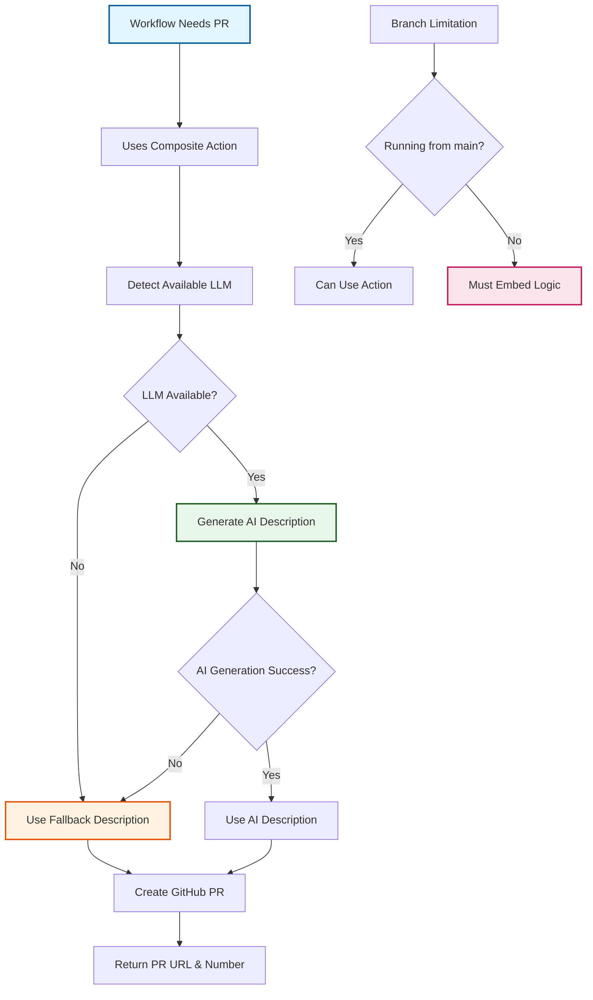

# ADR-013: Reusable GitHub Actions Pattern for PR Creation

:material-star: **Critical Decision** | :material-calendar: **2025-06-04** | :material-check-circle: **Accepted**

## Problem Statement

During template synchronization workflow implementation, significant code duplication was identified in PR creation logic across multiple workflows. Each workflow requiring pull request creation had to implement identical functionality for LLM detection, AI-enhanced description generation, fallback handling, and GitHub API integration, creating maintenance burden and consistency risks.

## Context and Requirements

### :material-alert-circle: Code Duplication and Maintenance Issues

**Duplicated PR Creation Components**:
- LLM detection logic checking for available API keys (Anthropic, Azure OpenAI, OpenAI)
- aipr integration for generating AI-enhanced PR descriptions with multiple provider support
- Fallback handling when AI generation fails or API keys are unavailable
- Diff size management to avoid token limits with large changes
- GitHub PR creation with proper parameters and error handling
- Output management returning PR URLs and numbers for workflow coordination

**Affected Workflows with Similar Requirements**:
```yaml
affected_workflows:
  sync_workflow:
    purpose: "Creates upstream synchronization PRs with vulnerability analysis"
    complexity: "80+ lines of PR creation logic with AI enhancement"
    
  template_sync_workflow:
    purpose: "Creates template update PRs with change summaries"
    complexity: "75+ lines of similar PR creation logic"
    
  future_workflows:
    purpose: "Additional automation requiring AI-enhanced PR descriptions"
    complexity: "Would require duplicating existing patterns"
```

**Problems with Current Approach**:
- Maintenance burden: changes to PR creation logic required updates in multiple locations
- Inconsistency risk: implementations could drift apart over time without coordination
- Testing complexity: each workflow implementation needed separate testing and validation
- Feature lag: improvements to one workflow didn't automatically benefit others

### :material-target: Reusable Pattern Requirements

**Centralized Logic**: Single implementation of PR creation with AI enhancement to eliminate duplication.

**Configurable Interface**: Flexible parameters supporting different use cases while maintaining consistency.

**AI Integration**: Built-in aipr integration with multiple LLM providers and intelligent fallback handling.

## Decision

Implement **Reusable GitHub Actions Pattern** through custom composite action for common PR creation functionality:



### :material-package Custom Composite Action Architecture

#### **Centralized Implementation (.github/actions/create-enhanced-pr/action.yml)**
```yaml
# Comprehensive composite action structure
composite_action:
  name: "Create Enhanced PR"
  description: "Creates GitHub PR with AI-enhanced descriptions using multiple LLM providers"
  
  runs:
    using: 'composite'
    steps:
      - name: Detect available LLM provider
        shell: bash
        run: |
          # Priority order: Anthropic → Azure OpenAI → OpenAI → Fallback
          if [ -n "${{ inputs.anthropic-api-key }}" ]; then
            echo "provider=anthropic" >> $GITHUB_OUTPUT
            echo "model=claude-4" >> $GITHUB_OUTPUT
          elif [ -n "${{ inputs.azure-api-key }}" ] && [ -n "${{ inputs.azure-api-base }}" ]; then
            echo "provider=azure" >> $GITHUB_OUTPUT
            echo "model=azure/gpt-4o" >> $GITHUB_OUTPUT
          elif [ -n "${{ inputs.openai-api-key }}" ]; then
            echo "provider=openai" >> $GITHUB_OUTPUT
            echo "model=gpt-4.1" >> $GITHUB_OUTPUT
          else
            echo "provider=fallback" >> $GITHUB_OUTPUT
          fi
          
      - name: Check diff size and generate description
        shell: bash
        run: |
          # Intelligent diff size management
          DIFF_LINES=$(git diff --name-only ${{ inputs.base-branch }}...${{ inputs.head-branch }} | wc -l)
          MAX_LINES=${{ inputs.max-diff-lines || '20000' }}
          
          if [ "$DIFF_LINES" -gt "$MAX_LINES" ]; then
            echo "Diff too large ($DIFF_LINES lines), using fallback description"
            echo "description=${{ inputs.fallback-description }}" >> $GITHUB_OUTPUT
            echo "used-aipr=false" >> $GITHUB_OUTPUT
          elif [ "${{ steps.detect-llm.outputs.provider }}" = "fallback" ]; then
            echo "No LLM provider available, using fallback description"
            echo "description=${{ inputs.fallback-description }}" >> $GITHUB_OUTPUT
            echo "used-aipr=false" >> $GITHUB_OUTPUT
          else
            # Generate AI-enhanced description
            aipr_generate_and_output_description
          fi
```

#### **Comprehensive Input Interface**
```yaml
# Flexible configuration supporting multiple use cases
input_interface:
  required_inputs:
    github-token: "GitHub token for API access and PR creation"
    base-branch: "Target branch for pull request"
    head-branch: "Source branch containing changes"
    pr-title: "Title for the pull request"
    fallback-description: "Description to use if AI generation fails"
    
  optional_inputs:
    anthropic-api-key: "Anthropic Claude API key for AI enhancement"
    azure-api-key: "Azure OpenAI API key"
    azure-api-base: "Azure OpenAI endpoint URL"
    azure-api-version: "Azure OpenAI API version"
    openai-api-key: "OpenAI API key"
    max-diff-lines: "Maximum diff size for AI processing (default: 20000)"
    use-vulns-flag: "Enable vulnerability analysis (default: true)"
    target-branch-for-aipr: "Branch for aipr analysis (defaults to base-branch)"
    additional-description: "Extra content to append to generated description"
```

#### **Standardized Output Interface**
```yaml
# Comprehensive outputs for workflow coordination
output_interface:
  pr-url: "Complete URL to created pull request"
  pr-number: "Pull request number for further processing"
  used-aipr: "Boolean indicating if AI enhancement was successfully used"
  provider-used: "LLM provider used for description generation"
  description-length: "Character count of generated description"
```

### :material-artificial-intelligence AI Enhancement Pipeline

#### **Multi-Provider LLM Detection**
```yaml
# Sophisticated provider priority and fallback system
llm_provider_system:
  priority_order:
    1: "Anthropic Claude (if ANTHROPIC_API_KEY provided)"
    2: "Azure OpenAI (if AZURE_API_KEY and AZURE_API_BASE provided)"
    3: "OpenAI (if OPENAI_API_KEY provided)"
    4: "Fallback to provided description"
    
  model_configuration:
    anthropic: "claude-4 for advanced code analysis"
    azure: "azure/gpt-4o for enterprise environments"
    openai: "gpt-4.1 for general use cases"
    
  intelligent_fallback:
    diff_size_limit: "Skip AI generation for diffs >20,000 lines"
    api_failure_handling: "Graceful degradation to fallback description"
    timeout_management: "AI generation timeout with fallback"
```

#### **Content Generation Strategy**
```yaml
# Advanced AI-enhanced description generation
content_generation:
  analysis_capabilities:
    code_changes: "Detailed analysis of code modifications"
    vulnerability_assessment: "Security impact analysis when enabled"
    dependency_updates: "Package and dependency change summaries"
    breaking_changes: "Detection and documentation of breaking changes"
    
  description_structure:
    summary: "High-level overview of changes"
    technical_details: "Specific implementation changes"
    impact_assessment: "Business and operational impact"
    testing_notes: "Recommended testing approaches"
    additional_content: "Custom content appended to generated description"
```

## Implementation Strategy

### :material-workflow Usage Patterns and Limitations

#### **Main Branch Workflows (Can Use Action)**
```yaml
# Workflows that can leverage the reusable action
main_branch_workflows:
  template_sync_workflow:
    usage: |
      - name: Create enhanced template sync PR
        uses: ./.github/actions/create-enhanced-pr
        with:
          base-branch: main
          head-branch: ${{ env.SYNC_BRANCH }}
          pr-title: "🔄 Sync template updates $(date +%Y-%m-%d)"
          fallback-description: ${{ env.FALLBACK_DESCRIPTION }}
          use-vulns-flag: 'false'
          target-branch-for-aipr: main
          
  build_workflow:
    usage: "Can use action for automated release PRs"
    
  validation_workflow:
    usage: "Can use action for validation result PRs"
```

#### **Branch Limitation Handling**
```yaml
# Critical discovery: GitHub Actions branch dependency
branch_limitations:
  problem: "GitHub Actions can only reference actions on the same branch where workflow runs"
  
  affected_workflows:
    sync_workflow:
      issue: "Runs from fork_upstream branch where action doesn't exist"
      solution: "Embed PR creation logic directly in workflow"
      
  implementation_strategy:
    primary_pattern: "Use reusable action for main branch workflows"
    fallback_pattern: "Embed logic directly when branch limitations prevent action usage"
    consistency_approach: "Maintain identical AI enhancement logic in both patterns"
```

#### **Sync Workflow Embedded Logic**
```yaml
# Required embedded implementation for sync workflow
sync_workflow_embedded:
  reason: "Action not available on fork_upstream branch"
  
  implementation: |
    # ❌ This DOES NOT work in sync.yml
    - name: Create enhanced sync PR
      uses: ./.github/actions/create-enhanced-pr  # Action doesn't exist on fork_upstream
      
    # ✅ This works in sync.yml (embedded logic)
    - name: Create enhanced sync PR
      env:
        GITHUB_TOKEN: ${{ secrets.GH_TOKEN }}
        ANTHROPIC_API_KEY: ${{ secrets.ANTHROPIC_API_KEY }}
      run: |
        # Detect available LLM provider
        if [ -n "$ANTHROPIC_API_KEY" ]; then
          PROVIDER="anthropic"
          MODEL="claude-4"
        elif [ -n "$AZURE_API_KEY" ] && [ -n "$AZURE_API_BASE" ]; then
          PROVIDER="azure"
          MODEL="azure/gpt-4o"
        else
          PROVIDER="fallback"
        fi
        
        # Generate AI-enhanced description with same logic as action
        [embedded aipr generation logic]
```

### :material-shield-check Error Handling and Reliability

#### **Graceful Degradation Framework**
```yaml
# Comprehensive error handling ensuring PR creation always succeeds
error_handling:
  ai_generation_failure:
    detection: "Monitor aipr command exit codes and output"
    response: "Log warning and proceed with fallback description"
    
  api_key_validation:
    detection: "Verify API key format and availability"
    response: "Skip AI generation and use fallback description"
    
  network_issues:
    detection: "Timeout handling for AI API calls"
    response: "Automatic fallback after 30-second timeout"
    
  github_api_issues:
    detection: "GitHub PR creation API failures"
    response: "Retry with exponential backoff, detailed error logging"
```

#### **Comprehensive Logging and Debugging**
```yaml
# Enhanced observability for troubleshooting
logging_framework:
  provider_detection: "Log which LLM provider was selected and why"
  ai_generation: "Log AI generation success/failure with timing"
  fallback_usage: "Clear indication when fallback description used"
  pr_creation: "Detailed logging of GitHub API interactions"
  output_validation: "Verify all expected outputs are generated"
```

## Benefits and Rationale

### :material-trending-up Strategic Advantages

#### **Code Duplication Elimination**
- Single implementation of 80+ lines of PR creation logic eliminates maintenance burden
- Consistent AI enhancement across all workflows using the reusable action
- Centralized improvements benefit all consuming workflows automatically
- Reduced testing complexity through single action testing instead of multiple implementations

#### **Enhanced Maintainability and Consistency**
- Changes to PR creation behavior only need to be made in one location
- Standardized interface ensures consistent behavior across different workflows
- Better error handling through centralized error management and logging
- Enhanced flexibility enabling easy addition of new parameters or features

#### **Development Experience Improvement**
- Workflows can focus on business logic rather than PR creation implementation details
- Clear separation of concerns between workflow logic and PR creation functionality
- Improved readability as workflows become more focused and easier to understand
- Easier debugging with issues isolated to single action implementation

### :material-cog-outline Operational Benefits

#### **AI Integration Excellence**
- Consistent aipr configuration across all workflows using the action
- Provider flexibility with support for multiple LLM providers and automatic fallback
- Centralized configuration management for API keys and parameters
- Performance optimization through shared diff size management and token limit handling

#### **Workflow Simplification**
- Reduced complexity as workflows delegate PR creation to specialized action
- Standardized outputs enable consistent workflow coordination patterns
- Enhanced error resilience through graceful degradation and fallback mechanisms
- Better testing capability through isolated action testing

## Alternative Approaches Considered

### :material-close-circle: Shared Shell Functions

**Approach**: Extract common functionality into shared shell scripts

- **Pros**: Lightweight approach, easy to understand and modify
- **Cons**: Limited parameter handling, no type safety, harder to test effectively
- **Decision**: Rejected due to limited flexibility and maintainability concerns

### :material-close-circle: External Action from GitHub Marketplace

**Approach**: Use existing community-maintained action for PR creation

- **Pros**: Maintained by community, potentially more features and wider adoption
- **Cons**: External dependency, less control over behavior, may not support aipr integration
- **Decision**: Rejected due to specific requirements for AI enhancement and control needs

### :material-close-circle: Copy-Paste with Documentation

**Approach**: Maintain documented copy-paste patterns for PR creation

- **Pros**: Simple approach with no abstraction complexity
- **Cons**: Significant maintenance burden, high inconsistency risk, violates DRY principle
- **Decision**: Rejected due to long-term maintenance concerns and consistency requirements

### :material-close-circle: NPM Package for PR Creation

**Approach**: Create external NPM package for PR creation functionality

- **Pros**: Version management capabilities, external reusability across projects
- **Cons**: External dependency, requires Node.js setup in workflows, additional complexity
- **Decision**: Rejected due to complexity and external dependencies for internal use case

## Consequences and Trade-offs

### :material-plus: Positive Outcomes

#### **Maintenance and Consistency Excellence**
- Eliminated 80+ lines of duplicated PR creation logic across multiple workflows
- Consistent AI enhancement ensuring identical behavior across all PR creation
- Single location for updates reducing coordination overhead and consistency risks
- Improved testing through independent action testing and validation

#### **Enhanced Development Experience**
- Workflows simplified to focus on core business logic rather than PR creation details
- Better error handling through centralized error management and graceful degradation
- Enhanced flexibility enabling easy customization for specific use cases
- Clear interface documentation reducing learning curve for new team members

#### **AI Integration and Reliability**
- Centralized AI enhancement logic ensuring consistent behavior across workflows
- Multiple LLM provider support with intelligent fallback handling
- Comprehensive error handling ensuring PR creation succeeds regardless of AI generation
- Performance optimization through shared diff size management and timeout handling

### :material-minus: Trade-offs and Limitations

#### **Abstraction and Complexity**
- Additional abstraction layer between workflows and GitHub API
- Learning curve for team members to understand action interface and capabilities
- Composite action complexity with multiple steps and conditional logic
- Local development challenges for testing workflows using the action

#### **Branch Dependency Limitations**
- Critical limitation: actions can only be used by workflows running from same branch
- Sync workflow must embed logic directly due to running from fork_upstream branch
- Partial code duplication remains for workflows that cannot use the action
- Need to maintain consistency between action and embedded implementations

## Success Metrics

### :material-chart-line: Quantitative Indicators

- **Code Duplication Reduction**: 80%+ reduction in PR creation logic duplication (limited by branch constraints)
- **Maintenance Efficiency**: Single location updates for most PR creation behavior
- **Consistency Achievement**: 100% identical enhancement logic for workflows using action
- **Integration Success**: New main-branch workflows easily adopt enhanced PR creation

### :material-check-all: Qualitative Indicators

- Teams report improved workflow development experience and reduced complexity
- Clear understanding of when to use action versus embedded logic approach
- Effective AI enhancement providing value in PR descriptions and review process
- Successful maintenance of functionality while improving code organization

## Integration Points

### :material-source-branch Template and Workflow Integration

#### **Template Update Propagation** (per [ADR-012](adr_012_template_updates.md))
- Template sync workflow leverages reusable action for consistent PR creation
- AI-enhanced descriptions improve template update visibility and review
- Standardized interface enables easy customization for template-specific requirements

#### **AI-Enhanced Development** (per [ADR-014](adr_014_ai_integration.md))
- Reusable action implements AI capabilities defined in AI integration strategy
- Multiple LLM provider support aligns with AI integration architecture
- Fallback handling ensures reliability regardless of AI service availability

### :material-quality-assurance Quality and Testing Integration

#### **Workflow Simplification**
- Clear separation between business logic and PR creation concerns
- Enhanced testability through isolated action testing
- Improved debugging with centralized error handling and logging

## Related Decisions

- [ADR-011](adr_011_template_sync.md): Configuration-driven template synchronization benefits from consistent PR creation
- [ADR-012](adr_012_template_updates.md): Template update propagation uses this action for enhanced PR descriptions
- [ADR-014](adr_014_ai_integration.md): AI-enhanced development workflow implements AI capabilities used by this action
- [ADR-010](adr_010_yaml_scripting.md): YAML-safe scripting patterns applied in action implementation

---

*This reusable GitHub Actions pattern eliminates code duplication while providing consistent, AI-enhanced PR creation across workflows, with intelligent handling of branch limitations and comprehensive fallback mechanisms ensuring reliable operation.*