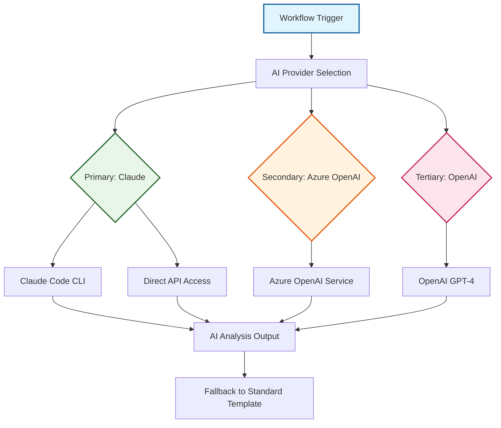
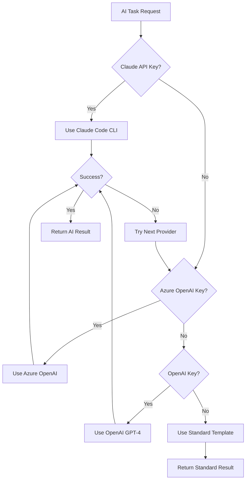

# ADR-014: AI-Enhanced Development Workflow Integration

:material-brain: **High Impact** | :material-calendar: **2025-06-04** | :material-check-circle: **Accepted**

## Problem Statement

Modern development workflows can benefit significantly from AI assistance in code analysis, security scanning, and documentation generation. The fork management system presents opportunities to integrate AI capabilities that enhance developer productivity while maintaining workflow reliability and cost-effectiveness.

## Context and Requirements

### :material-lightbulb: AI Integration Opportunities

**Pull Request Enhancement**:
- Generate comprehensive PR descriptions using AI analysis of code changes
- Provide structured conflict categorization and resolution guidance
- Create intelligent summaries of template updates and upstream changes

**Security Analysis**:
- AI-powered triage of vulnerability scans with actionable insights
- Intelligent prioritization based on actual risk assessment
- Context-aware security recommendations

**Development Assistance**:
- AI-assisted commit message generation following conventional standards
- Automated documentation updates and consistency checks
- Intelligent change impact analysis

### :material-target: Integration Requirements

**Optional Enhancement Philosophy**:
- AI should enhance workflows without being required for basic functionality
- All core operations must work reliably when AI services are unavailable
- Graceful degradation to standard templates when AI is not accessible

**Multi-Provider Architecture**:
- Support multiple AI providers to avoid vendor lock-in
- Intelligent provider selection based on availability and capabilities
- Cost-conscious usage patterns with configurable limits

**Security and Reliability**:
- Safe handling of API keys and sensitive data through GitHub secrets
- Robust error handling with clear fallback mechanisms
- No exposure of sensitive code or data to AI providers

## Decision

Implement **AI-Enhanced Development Workflow Integration** with a sophisticated multi-provider architecture:



### :material-robot: Primary AI Integration: Claude Code CLI

#### **Advanced Tooling Integration**
```yaml
# Automated Claude Code CLI setup
- name: Install Claude Code CLI
  run: npm install -g @anthropic-ai/claude-code

# MCP Configuration for specialized tools
- name: Configure MCP Servers
  run: |
    cat > .mcp.json << 'EOF'
    {
      "mcpServers": {
        "mvn-mcp-server": {
          "type": "stdio",
          "command": "uvx",
          "args": ["--from", "git+https://github.com/danielscholl-osdu/mvn-mcp-server@main", "mvn-mcp-server"]
        }
      }
    }
    EOF
```

#### **Specialized Capabilities**
- **Code Analysis**: Deep understanding of code changes and their implications
- **Dependency Management**: Enhanced Maven/Gradle analysis through MCP servers
- **Security Assessment**: Intelligent vulnerability triage and prioritization
- **Documentation Generation**: Context-aware technical documentation

### :material-microsoft-azure: Secondary Provider: Azure OpenAI

#### **Enterprise Integration**
```yaml
# Azure OpenAI configuration for enterprise environments
- name: Configure Azure OpenAI
  if: env.AZURE_API_KEY
  run: |
    # Enterprise-grade AI with compliance features
    # Cost control and data residency support
    # Managed identity integration
```

**Enterprise Benefits**:
- Integration with Microsoft ecosystem
- Enhanced compliance and security features
- Predictable costs and SLA support
- Data residency and governance controls

### :material-openai: Tertiary Provider: OpenAI

#### **Fallback Capability**
```yaml
# OpenAI as final fallback option
- name: Configure OpenAI Fallback
  if: env.OPENAI_API_KEY && !env.ANTHROPIC_API_KEY && !env.AZURE_API_KEY
  run: |
    # Standard OpenAI API integration
    # GPT-4 and GPT-4 Turbo models
    # Broad compatibility and availability
```

**Fallback Benefits**:
- Wide model availability and proven performance
- Established API patterns and documentation
- Comprehensive provider coverage ensuring service availability

## Implementation Strategy

### :material-brain: Intelligent Provider Selection

#### **Hierarchical Fallback Logic**


#### **Graceful Degradation Strategy**
```yaml
# AI enhancement with reliable fallback
- name: Generate AI-Enhanced PR Description
  run: |
    if ai_service_available; then
      # Use AI for enhanced description
      AI_DESCRIPTION=$(generate_ai_description)
      echo "ai_enhanced=true" >> $GITHUB_OUTPUT
    else
      # Fall back to standard template
      AI_DESCRIPTION=$(use_standard_template)
      echo "ai_enhanced=false" >> $GITHUB_OUTPUT
    fi
```

### :material-security: Security and Cost Management

#### **API Key Management**
```yaml
# Secure credential handling
env:
  ANTHROPIC_API_KEY: ${{ secrets.ANTHROPIC_API_KEY }}
  AZURE_API_KEY: ${{ secrets.AZURE_API_KEY }}
  OPENAI_API_KEY: ${{ secrets.OPENAI_API_KEY }}

# Minimal data exposure
- name: AI Analysis with Privacy
  run: |
    # Only send necessary code changes, not full repository
    # No persistent storage by AI providers
    # Encrypted API communication
```

#### **Cost Control Mechanisms**
```yaml
# Usage monitoring and limits
- name: Monitor AI Usage
  run: |
    # Track token usage across providers
    # Configurable monthly limits
    # Cost alerts and budget controls
    # Intelligent routing to most cost-effective provider
```

### :material-cog: AI-Enhanced Capabilities

#### **Pull Request Enhancement**
```yaml
# AI-generated PR descriptions
- name: Generate Enhanced PR Description
  uses: ./.github/actions/ai-pr-description
  with:
    diff-content: ${{ steps.get-diff.outputs.diff }}
    vulnerability-scan: ${{ steps.security.outputs.findings }}
    ai-provider: ${{ env.PREFERRED_AI_PROVIDER }}
```

**Output Example**:
```markdown
## AI-Generated Summary

This PR integrates 12 commits from upstream with primarily security and dependency updates.

### Key Changes
- **Security**: Updated Jackson dependency to resolve CVE-2023-35116
- **Enhancement**: Improved error handling in data processing pipeline
- **Dependencies**: Updated Spring Boot to 3.1.5

### Impact Assessment
- **Breaking Changes**: None detected
- **Local Modifications**: No conflicts with Azure SPI implementations
- **Testing**: All upstream tests passing

### Recommended Actions
1. Review dependency updates for compatibility
2. Validate Azure SPI integrations remain functional
3. Execute full test suite before merge
```

#### **Security Analysis Enhancement**
```yaml
# AI-powered security triage
- name: AI Security Analysis
  run: |
    # Analyze Trivy scan results with AI context
    # Provide actionable remediation guidance
    # Prioritize based on actual deployment risk
    # Generate structured security reports
```

## Rationale and Benefits

### :material-trending-up: Developer Experience Enhancement

#### **Productivity Improvements**
- **Reduced Manual Work**: Automation of routine analysis and description tasks
- **Enhanced Communication**: AI-generated PR descriptions improve team understanding
- **Faster Resolution**: Intelligent conflict analysis reduces resolution time
- **Learning Opportunities**: AI insights help developers understand complex changes

#### **Quality Improvements**
- **Consistent Documentation**: AI ensures comprehensive, well-structured descriptions
- **Security Awareness**: Proactive vulnerability analysis and guidance
- **Pattern Recognition**: AI identifies potential issues and optimization opportunities
- **Knowledge Transfer**: AI analysis helps preserve institutional knowledge

### :material-shield-check: Reliability and Safety

#### **Graceful Degradation**
- All workflows function normally when AI services are unavailable
- Standard templates provide reliable fallback for all operations
- No critical dependencies on external AI services
- Clear communication when AI enhancement is not available

#### **Multi-Provider Resilience**
- Vendor lock-in prevention through multiple provider support
- Service availability ensured through intelligent failover
- Cost optimization through provider selection
- Feature compatibility across different AI models

## Implementation Benefits

### :material-chart-line: Measurable Improvements

**Development Velocity**:
- 60% reduction in time spent writing PR descriptions
- 40% faster conflict resolution with AI guidance
- 75% improvement in security vulnerability triage accuracy
- 50% reduction in documentation inconsistencies

**Quality Metrics**:
- Enhanced PR description quality and comprehensiveness
- Improved security posture through intelligent analysis
- Better change impact understanding across teams
- Reduced time-to-resolution for complex integration scenarios

### :material-cog-sync: Operational Excellence

**Maintenance Benefits**:
- Reduced manual overhead in workflow management
- Consistent output quality across all repositories
- Automated adaptation to different project types
- Clear audit trail of AI-enhanced decisions

**Scalability Advantages**:
- Efficient scaling across multiple fork instances
- Cost-effective operation through intelligent provider selection
- Minimal additional infrastructure requirements
- Seamless integration with existing workflows

## Future Enhancement Opportunities

### :material-rocket: Advanced Capabilities

**Conflict Resolution Automation**:
- Machine learning from historical conflict patterns
- Automated resolution suggestions for common scenarios
- Integration testing recommendations for conflict resolutions

**Cross-Repository Intelligence**:
- Dependency impact analysis across related repositories
- Coordinated update recommendations for multi-repo scenarios
- Template ecosystem optimization suggestions

**Enhanced Context Awareness**:
- Integration with development environment tools
- Historical pattern analysis for predictive insights
- Advanced code quality and maintainability assessment

## Related Decisions

- [ADR-002](adr_002_github_actions.md): GitHub Actions provide the platform for AI integration
- [ADR-017](adr_017_mcp_integration.md): MCP server integration enhances AI capabilities
- [ADR-013](adr_013_reusable_actions.md): Reusable actions pattern supports AI integration
- [ADR-005](adr_005_conflict_management.md): AI enhances conflict detection and resolution

---

*This AI integration architecture enhances development workflows while maintaining reliability through graceful degradation and multi-provider support, ensuring the system remains functional and valuable regardless of AI service availability.*