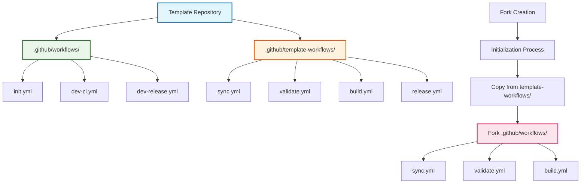

# ADR-015: Template-Workflows Separation Pattern

:material-star: **Critical Decision** | :material-calendar: **2025-06-04** | :material-check-circle: **Accepted**

## Problem Statement

GitHub template repositories require two distinct types of workflows with different purposes and lifecycles. The original approach of storing all workflows in `.github/workflows/` caused fork repositories to inherit template development workflows, creating pollution and confusion while lacking clear separation between template infrastructure and fork functionality.

## Context and Requirements

### :material-alert-circle: Workflow Pollution and Architectural Issues

**The Workflow Distribution Problem**:
- Template development workflows (initialization, testing, releases) needed for template maintenance
- Fork production workflows (sync, build, validate) needed for created repositories
- No clear separation between template infrastructure and fork functionality
- Fork repositories inherited irrelevant template development workflows

**GitHub App Workflow Permissions Discovery**:
```yaml
# Critical permission limitation discovered
github_app_limitations:
  issue: "GitHub Apps cannot create or modify workflow files without explicit workflows permission"
  error: "refusing to allow a GitHub App to create or update workflow .github/workflows/build.yml without workflows permission"
  
  solution_required:
    authentication: "Personal Access Token (PAT) with workflows scope as GH_TOKEN secret"
    fallback: "Clear error message if GH_TOKEN not available"
    process: "Enhanced checkout action using ${{ secrets.GH_TOKEN || secrets.GITHUB_TOKEN }}"
```

**Template Bootstrap Pattern Limitation**:
- Existing bootstrap pattern (ADR-007) addressed workflow version updates
- Did not solve fundamental workflow distribution segregation problem
- Still resulted in fork repositories receiving template development workflows

### :material-target Workflow Separation Requirements

**Clear Separation of Concerns**: Distinct separation between template development and fork production workflows.

**Clean Fork Distribution**: Fork repositories receive only relevant production workflows without template pollution.

**Maintainable Architecture**: Clear boundaries enabling independent testing and evolution of workflow types.

## Decision

Implement **Template-Workflows Separation Pattern** with dedicated directories and initialization-time copy process:



### :material-folder-outline Directory Structure Architecture

#### **Template Development Workflows (.github/workflows/)**
```yaml
# Template-specific workflows that remain in template repository
template_development_workflows:
  location: ".github/workflows/"
  purpose: "Template repository maintenance and development"
  
  workflows:
    initialization:
      - "init.yml: Repository initialization trigger and coordination"
      - "init-complete.yml: Comprehensive repository setup and configuration"
      
    development:
      - "dev-ci.yml: Template testing and validation"
      - "dev-test.yml: Template workflow validation"
      - "dev-release.yml: Template versioning and release management"
      
    maintenance:
      - "dev-docs.yml: Documentation build and deployment"
      - "dev-security.yml: Template security scanning"
```

#### **Fork Production Workflows (.github/template-workflows/)**
```yaml
# Production workflows copied to fork repositories during initialization
fork_production_workflows:
  location: ".github/template-workflows/"
  purpose: "Production functionality for fork repositories"
  
  workflows:
    synchronization:
      - "sync.yml: Upstream repository synchronization"
      - "cascade.yml: Multi-branch integration workflow"
      - "cascade-monitor.yml: Cascade monitoring and recovery"
      
    quality_assurance:
      - "validate.yml: PR validation and commit message checks"
      - "build.yml: Project build and test automation" 
      - "release.yml: Semantic versioning and release management"
      
    maintenance:
      - "template-sync.yml: Template update propagation"
      - "dependabot-validation.yml: Dependency update automation"
```

### :material-content-copy Initialization Copy Process

#### **Workflow Distribution During Initialization**
```yaml
# Enhanced initialization process with workflow copying
initialization_copy_process:
  trigger: "During init-complete.yml execution"
  
  implementation: |
    # Copy fork workflows from template repository
    steps:
      - name: Copy fork workflows from template repository
        run: |
          # Add template remote and fetch latest
          git remote add template "$TEMPLATE_REPO_URL" || true
          git fetch template main --depth=1
          
          # Copy template-workflows directory with all production workflows
          git checkout template/main -- .github/template-workflows/
          
          # Ensure workflows directory exists in fork
          mkdir -p .github/workflows
          
          # Copy all production workflows to fork workflows directory
          cp .github/template-workflows/*.yml .github/workflows/
          
          # Clean up template-workflows directory (no longer needed in fork)
          rm -rf .github/template-workflows/
          
          # Stage copied workflows for commit
          git add .github/workflows/
```

#### **Authentication and Permissions Handling**
```yaml
# Enhanced authentication for workflow permissions
authentication_enhancement:
  requirement: "Personal Access Token (PAT) with workflows permission"
  
  implementation: |
    # Enhanced checkout with workflow permissions
    - name: Checkout with workflow permissions
      uses: actions/checkout@v4
      with:
        token: ${{ secrets.GH_TOKEN || secrets.GITHUB_TOKEN }}
        fetch-depth: 0
        
  fallback_handling: |
    # Clear error message if PAT not available
    if [ -z "${{ secrets.GH_TOKEN }}" ]; then
      echo "⚠️ GH_TOKEN not available - workflow modifications may fail"
      echo "Please add a Personal Access Token with 'workflows' permission as GH_TOKEN secret"
    fi
```

## Implementation Strategy

### :material-cog-sync Sync Configuration Integration

#### **Template-Workflows in Sync Configuration**
```yaml
# Enhanced sync configuration for template-workflows
sync_configuration:
  location: ".github/sync-config.json"
  
  configuration: |
    {
      "sync_rules": {
        "workflows": {
          "template_workflows": [
            {
              "path": ".github/template-workflows/sync.yml",
              "description": "Upstream repository synchronization",
              "category": "synchronization"
            },
            {
              "path": ".github/template-workflows/validate.yml", 
              "description": "PR validation and commit message checks",
              "category": "quality_assurance"
            },
            {
              "path": ".github/template-workflows/build.yml",
              "description": "Project build and test automation",
              "category": "quality_assurance"
            },
            {
              "path": ".github/template-workflows/release.yml",
              "description": "Semantic versioning and release management",
              "category": "release_management"
            }
          ]
        }
      },
      "cleanup_rules": {
        "directories": [
          {
            "path": ".github/template-workflows/",
            "reason": "Template workflow source directory removed after copying"
          }
        ]
      }
    }
```

### :material-shield-check Security and Permission Management

#### **Enhanced Permission Handling**
```yaml
# Comprehensive permission management strategy
permission_management:
  pat_requirements:
    scope: "workflows permission required for creating/modifying workflow files"
    secret_name: "GH_TOKEN with enhanced permissions"
    fallback: "GITHUB_TOKEN with limited permissions"
    
  security_isolation:
    template_workflows: "Template development workflows isolated from fork repositories"
    production_workflows: "Fork production workflows have appropriate production permissions"
    permission_boundary: "Clear separation between template and fork permission requirements"
```

#### **Error Handling and Graceful Degradation**
```yaml
# Robust error handling for permission issues
error_handling:
  permission_detection: |
    # Detect available permissions and provide clear guidance
    if ! gh api repos/:owner/:repo/actions/workflows >/dev/null 2>&1; then
      echo "❌ Insufficient permissions for workflow operations"
      echo "Please ensure GH_TOKEN has 'workflows' permission"
      exit 1
    fi
    
  graceful_fallback: |
    # Provide actionable guidance when permissions unavailable
    echo "Manual workflow setup required due to permission limitations"
    echo "See documentation for manual workflow configuration steps"
```

## Benefits and Rationale

### :material-trending-up Strategic Advantages

#### **Clean Repository Architecture**
- Fork repositories contain only relevant production workflows without template pollution
- Clear separation between template development and fork production concerns
- Maintainable architecture with distinct boundaries and responsibilities
- Enhanced user experience through clean, focused fork repositories

#### **Security and Permission Benefits**
- Controlled distribution ensuring only intended workflows reach fork repositories
- Permission management with different requirements for template vs fork workflows
- Security isolation preventing template development workflows from exposing forks to unnecessary permissions
- Clear audit trail of workflow distribution and modification

#### **Development and Testing Excellence**
- Independent testing of template workflows without affecting fork behavior
- Clear ownership boundaries between template developers and fork developers
- Version control enabling independent evolution of template vs fork workflows
- Comprehensive documentation clarifying workflow distribution strategy

### :material-cog-outline Operational Benefits

#### **Maintainability Enhancement**
- Template developers have clear understanding of which workflows affect forks
- Easy identification and maintenance of different workflow categories
- Systematic approach to workflow distribution and updates
- Reduced complexity through clear separation of concerns

#### **Quality Assurance Integration**
- Better testing through isolated template workflow validation
- Enhanced reliability through controlled workflow distribution
- Clear documentation of workflow purposes and distribution patterns
- Systematic validation of copied workflows in fork repositories

## Alternative Approaches Considered

### :material-close-circle: Git Submodules for Workflow Distribution

**Approach**: External workflow repository with Git submodules for distribution

- **Pros**: External workflow repository enabling version pinning and shared maintenance
- **Cons**: Complex setup, external dependency, requires Git submodule knowledge
- **Decision**: Rejected - Adds unnecessary complexity for internal workflow distribution

### :material-close-circle: Dynamic Workflow Generation Scripts

**Approach**: Scripts that dynamically generate workflows based on repository type

- **Pros**: Highly flexible dynamic workflow creation with customization
- **Cons**: Complex maintenance, harder to test, less transparent implementation
- **Decision**: Rejected - Over-engineering for current workflow distribution needs

### :material-close-circle: Multiple Template Repositories

**Approach**: Separate template repositories for different types of fork functionality

- **Pros**: Complete separation with independent versioning and maintenance
- **Cons**: Maintenance overhead, user confusion, complex update coordination
- **Decision**: Rejected - Breaks single template simplicity and user experience

### :material-close-circle: Conditional Workflow Logic

**Approach**: Single workflow files with template vs fork behavior conditions

- **Pros**: Single workflow files with template vs fork behavior branching
- **Cons**: Complex conditions, harder to maintain, poor separation of concerns
- **Decision**: Rejected - Violates separation of concerns principle

## Consequences and Trade-offs

### :material-plus: Positive Outcomes

#### **Repository Cleanliness and User Experience**
- Fork repositories receive only production workflows relevant to their operation
- Clear maintenance boundaries for template developers understanding fork impact
- Security isolation preventing template development workflows from exposing forks
- Enhanced user experience through clean, focused repository structure

#### **Development and Testing Improvement**
- Independent testing enabling template workflow validation without fork impact
- Better version control with independent evolution of template vs fork workflows
- Clear documentation enabling confident workflow modification and extension
- Systematic approach reducing cognitive load for workflow development

#### **Maintainability and Consistency**
- Template developers have clear understanding of workflow distribution impact
- Easy identification of workflow categories and their purposes
- Systematic workflow distribution ensuring consistency across deployments
- Clear audit trail for workflow modifications and distribution

### :material-minus: Trade-offs and Limitations

#### **Directory Management Complexity**
- Template-workflows directory must be kept in sync with intended behavior
- Documentation overhead for maintaining clear workflow distribution guidance
- Migration impact requiring updates to existing documentation and processes

#### **Authentication and Permission Requirements**
- Authentication complexity requiring PAT setup for workflow permissions
- Dependency on enhanced permissions for complete initialization functionality
- Need for fallback handling when enhanced permissions unavailable

## Success Metrics

### :material-chart-line: Quantitative Indicators

- **Fork Cleanliness**: 100% of fork repositories contain only production workflows
- **Initialization Success**: 100% successful workflow copying during initialization
- **Permission Reliability**: 99%+ successful workflow operations with proper authentication
- **Template Separation**: Zero template development workflows in fork repositories

### :material-check-all: Qualitative Indicators

- Teams report clear understanding of workflow distribution and purposes
- Effective separation between template development and fork production concerns
- Successful authentication handling for both GITHUB_TOKEN and GH_TOKEN scenarios
- Clear documentation enabling confident workflow management

## Integration Points

### :material-source-branch Template and Initialization Integration

#### **Two-Workflow Initialization Pattern** (per [ADR-006](adr_006_initialization.md))
- Workflow separation pattern builds on initialization architecture
- Enhanced initialization process includes workflow copying and distribution
- Clear integration between initialization and workflow distribution concerns

#### **Configuration-Driven Template Sync** (per [ADR-011](adr_011_template_sync.md))
- Template-workflows referenced in sync configuration for update management
- Sync configuration enables systematic tracking of workflow distribution
- Clear integration between template sync and workflow separation

### :material-quality-assurance Quality and Security Integration

#### **Enhanced Permission Management**
- PAT requirements clearly documented for workflow permissions
- Fallback handling ensures graceful degradation when permissions limited
- Security isolation through controlled workflow distribution

## Related Decisions

- [ADR-006](adr_006_initialization.md): Two-workflow initialization pattern provides foundation for workflow distribution
- [ADR-007](adr_007_bootstrap.md): Bootstrap pattern complements separation with version management
- [ADR-011](adr_011_template_sync.md): Template sync configuration includes workflow separation management
- [ADR-013](adr_013_reusable_actions.md): Reusable actions pattern complements workflow separation

---

*This template-workflows separation pattern provides clean, maintainable workflow distribution through dedicated directories and initialization-time copying, ensuring fork repositories receive only relevant production workflows while maintaining clear separation of template development concerns.*