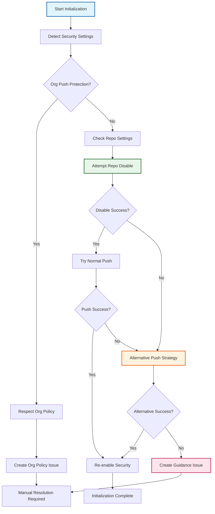

# ADR-016: Initialization Security Handling

:material-star: **Critical Decision** | :material-calendar: **2025-05-28** | :material-check-circle: **Accepted**

## Problem Statement

Many upstream repositories contain secrets or sensitive data in their git history that trigger GitHub's push protection feature, blocking initialization workflows from creating the `fork_upstream` branch during repository setup. Organization-level push protection enforcement adds additional complexity that cannot be overridden by repository-level settings.

## Context and Requirements

### :material-alert-circle: Push Protection Challenges

**GitHub Push Protection Mechanisms**:
- Repository-level push protection detecting secrets in commit history
- Organization-level push protection enforcement that cannot be repository-overridden
- Automated secret scanning blocking push operations during initialization
- Historical commits containing sensitive data preventing branch creation

**Initialization Impact**:
- Fork_upstream branch creation fails when upstream contains secrets in git history
- Organization-level protection policies cannot be bypassed through repository settings
- Initialization workflow blocks on push operations containing flagged content
- Manual intervention required without clear guidance or automated alternatives

**Security Policy Considerations**:
- Need to respect organization security policies and not circumvent protection
- Temporary security adjustments must be properly restored after initialization
- Clear audit trail required for any security setting modifications
- Alternative approaches needed when automated mitigation fails

### :material-target Security Handling Requirements

**Multi-Layered Detection**: Comprehensive detection of both repository and organization-level push protection configurations.

**Respectful Mitigation**: Attempt automated resolution while respecting organization security policies.

**Clear Resolution Guidance**: Detailed instructions for manual resolution when automated approaches fail.

## Decision

Implement **Multi-Layered Security Handling** with detection, mitigation, alternatives, and clear guidance:



### :material-radar Enhanced Security Detection

#### **Comprehensive Protection Analysis**
```yaml
# Multi-level security setting detection
security_detection:
  organization_level: |
    # Check organization-level push protection status
    ORG_NAME=$(echo "${{ github.repository }}" | cut -d'/' -f1)
    ORG_PUSH_PROTECTION="unknown"
    
    if ORG_SETTINGS=$(gh api "/orgs/$ORG_NAME" 2>/dev/null); then
      ORG_PUSH_PROTECTION=$(echo "$ORG_SETTINGS" | jq -r '.security_and_analysis.secret_scanning_push_protection.status // "unknown"')
      echo "::notice::Organization-level push protection: $ORG_PUSH_PROTECTION"
      
      if [ "$ORG_PUSH_PROTECTION" = "enabled" ]; then
        echo "organization_protection_enforced=true" >> $GITHUB_OUTPUT
        echo "⚠️ Organization-level push protection is enforced"
      fi
    fi
    
  repository_level: |
    # Check repository-level security settings
    REPO_SETTINGS=$(gh api "/repos/${{ github.repository }}")
    REPO_PUSH_PROTECTION=$(echo "$REPO_SETTINGS" | jq -r '.security_and_analysis.secret_scanning_push_protection.status // "unknown"')
    
    echo "Repository-level push protection: $REPO_PUSH_PROTECTION"
    echo "repo_protection_status=$REPO_PUSH_PROTECTION" >> $GITHUB_OUTPUT
```

#### **Security Configuration Management**
```yaml
# Intelligent security setting modification
security_management:
  disable_attempt: |
    # Attempt to disable repository-level push protection temporarily
    if [ "${{ steps.detect.outputs.organization_protection_enforced }}" != "true" ]; then
      echo "Attempting to disable repository-level push protection for initialization"
      
      # Apply security-off configuration
      if gh api --method PATCH "/repos/${{ github.repository }}" \
         --input .github/security-off.json; then
        echo "security_disabled=true" >> $GITHUB_OUTPUT
        echo "✅ Repository-level push protection disabled for initialization"
      else
        echo "security_disabled=false" >> $GITHUB_OUTPUT
        echo "⚠️ Could not disable repository-level push protection"
      fi
    else
      echo "security_disabled=false" >> $GITHUB_OUTPUT
      echo "⚠️ Organization-level protection enforced - cannot disable at repository level"
    fi
    
  restore_security: |
    # Re-enable security settings after successful initialization
    if [ "${{ steps.security.outputs.security_disabled }}" = "true" ]; then
      echo "Re-enabling repository security settings"
      
      gh api --method PATCH "/repos/${{ github.repository }}" \
        --input .github/security-on.json
        
      echo "✅ Repository security settings restored"
    fi
```

### :material-shield-check Alternative Push Strategies

#### **Progressive Push Strategy**
```yaml
# Multi-stage push approach when normal push fails
alternative_push_strategy:
  minimal_history_approach: |
    # Create minimal branch first to establish upstream reference
    echo "Attempting alternative push strategy with minimal history"
    
    # Create temporary branch with reduced history
    git checkout -b temp_upstream upstream/$DEFAULT_BRANCH
    
    # Reset to minimal history (recent commits only)
    git reset --soft HEAD~1000 2>/dev/null || git reset --soft $(git rev-list --max-parents=0 HEAD)
    git commit -m "chore: initial upstream reference for fork setup"
    
    # Attempt push with minimal history
    if git push -u origin temp_upstream; then
      echo "✅ Minimal history push successful"
      echo "minimal_push_success=true" >> $GITHUB_OUTPUT
      
      # Try to update to full history
      git checkout -b fork_upstream upstream/$DEFAULT_BRANCH
      if git push -u origin fork_upstream --force; then
        echo "✅ Full history push successful"
        echo "full_push_success=true" >> $GITHUB_OUTPUT
        # Clean up temporary branch
        git push origin --delete temp_upstream
      else
        echo "⚠️ Full history push failed, using minimal history"
        git checkout temp_upstream
        git branch -m fork_upstream
        echo "full_push_success=false" >> $GITHUB_OUTPUT
      fi
    else
      echo "❌ Minimal history push failed"
      echo "minimal_push_success=false" >> $GITHUB_OUTPUT
    fi
    
  error_analysis: |
    # Extract specific error information for guidance
    if ! git push -u origin fork_upstream 2>push_error.log; then
      # Extract secret allowlist URLs from error output
      if grep -q "allowlist" push_error.log; then
        ALLOWLIST_URLS=$(grep -o 'https://[^[:space:]]*allowlist[^[:space:]]*' push_error.log || echo "")
        echo "allowlist_urls=$ALLOWLIST_URLS" >> $GITHUB_OUTPUT
      fi
      
      # Extract blocked secret information
      BLOCKED_SECRETS=$(grep -o "secret.*detected" push_error.log || echo "Generic secret detection")
      echo "blocked_secrets=$BLOCKED_SECRETS" >> $GITHUB_OUTPUT
    fi
```

## Implementation Strategy

### :material-lifebuoy Enhanced Error Handling and User Guidance

#### **Comprehensive Issue Creation for Manual Resolution**
```yaml
# Detailed guidance when automated approaches fail
manual_resolution_guidance:
  organization_policy_issue: |
    # Issue created when organization-level protection prevents initialization
    GUIDANCE_BODY="## 🔒 Organization Security Policy Prevents Initialization
    
    Your organization has enforced push protection policies that prevent automated initialization of the fork_upstream branch.
    
    **Detected Configuration:**
    - **Organization Push Protection:** ${{ steps.detect.outputs.organization_protection_enforced }}
    - **Repository Push Protection:** ${{ steps.detect.outputs.repo_protection_status }}
    
    **Resolution Options:**
    
    ### Option 1: Organization Admin Action (Recommended)
    Contact your organization administrator to temporarily disable push protection:
    1. Navigate to Organization Settings → Code security and analysis
    2. Temporarily disable 'Push protection for repositories'
    3. Re-run the initialization workflow
    4. Re-enable push protection after initialization completes
    
    ### Option 2: Secret Allowlist (If Applicable)
    If specific secrets are detected, use GitHub's allowlist mechanism:
    $(if [ -n '${{ steps.alternative.outputs.allowlist_urls }}' ]; then echo '- Allowlist URLs: ${{ steps.alternative.outputs.allowlist_urls }}'; fi)
    
    ### Option 3: Manual Local Initialization
    As a last resort, perform initialization locally:
    1. Clone this repository locally
    2. Add upstream remote: \`git remote add upstream [UPSTREAM_URL]\`
    3. Fetch upstream: \`git fetch upstream\`
    4. Create fork_upstream branch: \`git checkout -b fork_upstream upstream/main\`
    5. Push with bypass: \`git push origin fork_upstream --no-verify\`
    
    **Security Note:** This issue will be automatically closed once initialization completes successfully."
    
    gh issue create \
      --title "🔒 Organization Security Policy Blocks Initialization" \
      --body "$GUIDANCE_BODY" \
      --label "initialization,security-policy,human-required,high-priority"
      
  secret_detection_issue: |
    # Issue created when specific secrets are detected
    SECRET_GUIDANCE_BODY="## 🚨 Secret Detection Prevents Initialization
    
    Push protection has detected secrets in the upstream repository history, preventing fork_upstream branch creation.
    
    **Detected Issues:**
    - **Blocked Secrets:** ${{ steps.alternative.outputs.blocked_secrets }}
    $(if [ -n '${{ steps.alternative.outputs.allowlist_urls }}' ]; then echo '- **Allowlist URLs:** ${{ steps.alternative.outputs.allowlist_urls }}'; fi)
    
    **Resolution Strategies:**
    
    ### Strategy 1: Use GitHub Secret Allowlist
    If these are false positives or acceptable secrets:
    $(if [ -n '${{ steps.alternative.outputs.allowlist_urls }}' ]; then echo '1. Visit: ${{ steps.alternative.outputs.allowlist_urls }}'; else echo '1. Contact your organization admin for allowlist access'; fi)
    2. Add the detected secrets to the allowlist
    3. Re-run the initialization workflow
    
    ### Strategy 2: Repository-Level Bypass (If Permitted)
    If you have admin access and organization policy allows:
    1. Go to Repository Settings → Code security and analysis
    2. Temporarily disable 'Push protection'
    3. Re-run initialization workflow
    4. Re-enable push protection after completion
    
    ### Strategy 3: Contact Upstream Repository
    If secrets should be removed from upstream history:
    1. Contact upstream repository maintainers
    2. Request secret removal from git history
    3. Wait for upstream cleanup before initialization
    
    **Next Steps:** Choose the most appropriate strategy for your security policy and re-run initialization."
    
    gh issue create \
      --title "🚨 Secret Detection Blocks Fork Initialization" \
      --body "$SECRET_GUIDANCE_BODY" \
      --label "initialization,secret-detection,human-required,high-priority"
```

### :material-security Security Configuration Files

#### **Security Toggle Configurations**
```yaml
# Predefined security configurations for temporary modification
security_configurations:
  security_off_json: |
    # .github/security-off.json
    {
      "security_and_analysis": {
        "secret_scanning": {
          "status": "enabled"
        },
        "secret_scanning_push_protection": {
          "status": "disabled"
        }
      }
    }
    
  security_on_json: |
    # .github/security-on.json  
    {
      "security_and_analysis": {
        "secret_scanning": {
          "status": "enabled"
        },
        "secret_scanning_push_protection": {
          "status": "enabled"
        }
      }
    }
```

## Benefits and Rationale

### :material-trending-up Strategic Advantages

#### **Comprehensive Security Respect**
- Handles both repository-level and organization-level push protection appropriately
- Respects organization security policies without attempting unauthorized bypasses
- Maintains security for all future operations after initialization
- Clear audit trail for any temporary security setting modifications

#### **Automated Resolution with Fallbacks**
- Multiple fallback strategies when automated approaches fail
- Progressive push strategy handles different types of secret detection
- Intelligent error analysis extracting actionable information from failures
- Comprehensive user guidance enabling manual resolution when required

#### **Enhanced User Experience**
- Clear detection and communication of security setting status
- Actionable issues with multiple resolution options and clear instructions
- Automatic extraction and presentation of secret allowlist URLs
- Detailed guidance tailored to specific security policy configurations

### :material-cog-outline Operational Benefits

#### **Reliable Initialization Process**
- Robust handling of common security-related initialization failures
- Multiple resolution strategies increasing initialization success rate
- Clear escalation path when automated approaches insufficient
- Comprehensive error handling preventing unclear failure states

#### **Security Policy Compliance**
- Temporary security modifications properly restored after initialization
- Organization-level policies respected and not circumvented
- Users guided to official GitHub secret allowlist mechanisms
- Clear documentation of security considerations and trade-offs

## Alternative Approaches Considered

### :material-close-circle: Simple Retry Logic

**Approach**: Basic retry mechanism for push operations

- **Pros**: Simple implementation, handles transient issues
- **Cons**: Insufficient for organization-level protection, no secret handling
- **Decision**: Rejected - doesn't address root causes of security blocking

### :material-close-circle: History Rewriting for Secret Removal

**Approach**: Automatically rewrite git history to remove detected secrets

- **Pros**: Could eliminate secret detection triggers
- **Cons**: Would break synchronization with upstream, data loss risk
- **Decision**: Rejected - compromises upstream relationship integrity

### :material-close-circle: Forking Without History

**Approach**: Create fork branches without upstream git history

- **Pros**: Avoids secret detection in historical commits
- **Cons**: Loses valuable commit history, breaks upstream relationship
- **Decision**: Rejected - defeats purpose of maintaining upstream connection

### :material-close-circle: Require Pre-Initialization Setup

**Approach**: Require users to configure security settings before using template

- **Pros**: Eliminates initialization-time security conflicts
- **Cons**: Significantly complicates user experience, manual overhead
- **Decision**: Rejected - conflicts with template automation goals

## Consequences and Trade-offs

### :material-plus: Positive Outcomes

#### **Enhanced Security Handling**
- Comprehensive detection and handling of both repository and organization-level protection
- Multiple fallback strategies increasing initialization success rate
- Clear guidance enabling manual resolution with actionable steps
- Automatic security setting restoration maintaining protection after initialization

#### **Improved User Experience**
- Automatic extraction and presentation of secret allowlist URLs
- Detailed issues providing multiple resolution options
- Clear documentation of security considerations and requirements
- Respectful handling of organization security policies

#### **Operational Reliability**
- Robust error handling preventing unclear failure states
- Progressive push strategy handling different types of secret detection
- Comprehensive logging and status reporting for troubleshooting
- Clear escalation path when automated approaches insufficient

### :material-minus: Trade-offs and Limitations

#### **Implementation Complexity**
- More complex implementation than simple push operations
- Multiple code paths requiring comprehensive testing
- Dependency on GitHub API for security setting management

#### **Manual Intervention Requirements**
- May require manual intervention for organization-level protection
- Alternative push strategy might not work in all secret detection cases
- Users may need to coordinate with organization administrators

## Success Metrics

### :material-chart-line: Quantitative Indicators

- **Initialization Success Rate**: >95% successful initialization despite security policies
- **Automated Resolution Rate**: 80%+ of security conflicts resolved automatically
- **Issue Resolution Time**: Clear guidance enables <24 hour manual resolution
- **Security Restoration Rate**: 100% proper security setting restoration after initialization

### :material-check-all: Qualitative Indicators

- Users report clear understanding of security policy interactions
- Effective guidance enabling successful manual resolution when required
- Organization administrators comfortable with temporary security modifications
- Clear audit trail satisfying compliance and security review requirements

## Integration Points

### :material-source-branch Initialization Workflow Integration

#### **Two-Workflow Initialization Pattern** (per [ADR-006](adr_006_initialization.md))
- Security handling integrated into initialization workflow architecture
- Clear coordination between security detection and initialization completion
- Enhanced error handling coordinated with initialization issue tracking

#### **Template Repository Pattern** (per [ADR-003](adr_003_template_pattern.md))
- Security configurations included in template repository structure
- Clear documentation of security handling for template users
- Integration with template update propagation for security improvements

### :material-shield-check Quality and Compliance Integration

#### **Issue Lifecycle Tracking** (per [ADR-022](adr_022_lifecycle.md))
- Security issues integrated with comprehensive issue lifecycle tracking
- Clear status progression for security-related initialization problems
- Coordination with human-required labeling for manual intervention

## Related Decisions

- [ADR-006](adr_006_initialization.md): Two-workflow initialization provides foundation for security handling
- [ADR-003](adr_003_template_pattern.md): Template repository includes security configuration files
- [ADR-022](adr_022_lifecycle.md): Issue lifecycle tracking coordinates with security issue management
- [ADR-020](adr_020_human_labels.md): Human-required labeling used for security policy issues

---

*This initialization security handling strategy provides comprehensive, respectful management of GitHub push protection policies through multi-layered detection, automated mitigation, alternative strategies, and clear manual resolution guidance while maintaining security compliance and user experience.*