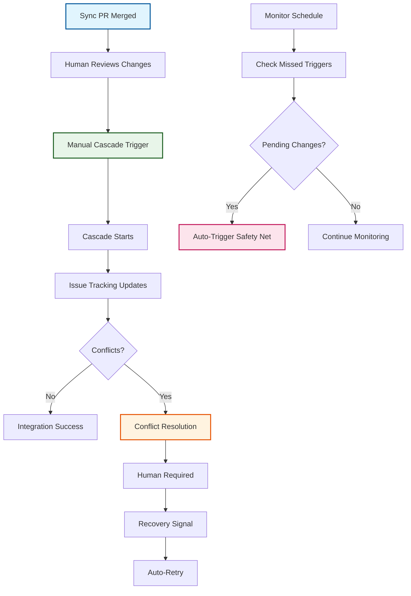

# ADR-019: Cascade Monitor Pattern

:material-star: **Critical Decision** | :material-calendar: **2025-06-20** | :material-check-circle: **Accepted** | :material-refresh: **Revised** 2025-06-29

## Problem Statement

The cascade workflow needs reliable triggering when upstream changes are merged into the `fork_upstream` branch. However, automatic triggering approaches created significant reliability and usability challenges that undermined the system's effectiveness and team adoption.

## Context and Requirements

### :material-alert-circle: Automatic Triggering Challenges

**GitHub Event Limitations**:
- `pull_request_target` events require workflows to exist on target branch (`fork_upstream`)
- Pure mirror branches don't contain workflow files, breaking event-based triggering
- Complex conditional logic needed to filter relevant events from noise
- Poor error handling for edge cases and missed triggers

**Team Control Requirements**:
- Teams want explicit control over integration timing, not automatic triggering
- Need ability to batch multiple changes or time integrations appropriately
- Desire for clear audit trails and progress tracking throughout cascade lifecycle
- Requirements for reliable error recovery and missed trigger detection

**Visibility and Reliability Issues**:
- Unreliable triggering due to workflow file availability constraints
- Poor visibility into cascade progress and state management
- Complex error handling scattered across multiple workflow conditions
- No comprehensive tracking of issue lifecycle and resolution status

### :material-target: Architectural Requirements

**Human-Centric Control**: Explicit human decision points with clear instructions and visible progress tracking.

**Reliable Safety Net**: Automated detection and recovery of missed triggers without complex event dependencies.

**Comprehensive State Management**: Complete audit trail from sync detection through production deployment with issue-based coordination.

## Decision

Implement a **Human-Centric Cascade Pattern** with intelligent monitor-based safety net:



### :material-account-circle: Primary Path: Human-Controlled Integration

#### **Manual Trigger Process**
```yaml
# Human-centric workflow pattern
human_control:
  sync_completion: Clear instructions provided in sync workflow completion
  review_step: Explicit human review of upstream changes required
  manual_trigger: Cascade Integration workflow triggered manually
  progress_tracking: Real-time updates through issue comments
```

#### **Enhanced User Guidance**
```yaml
# Sync workflow completion instructions
next_steps:
  review: "🔍 Review the sync PR for breaking changes or conflicts"
  merge: "✅ Merge the PR when satisfied with changes"
  trigger: "🚀 Manually trigger 'Cascade Integration' workflow"
  monitor: "📊 Monitor cascade progress in Actions tab"
```

### :material-shield-check: Safety Net: Monitor-Based Detection

#### **Automated Missed-Trigger Detection**
```yaml
# cascade-monitor.yml safety net
monitor_schedule:
  frequency: Every 6 hours (safety net detection)
  manual_trigger: workflow_dispatch for health checking
  detection_logic: Git-based branch comparison for pending changes
  recovery_action: Automatic cascade triggering with issue tracking
```

#### **Intelligent Branch Comparison**
```yaml
# Reliable git-based detection
detection_algorithm:
  comparison: git rev-list --count fork_integration..fork_upstream
  threshold: UPSTREAM_COMMITS > 0 indicates pending changes
  issue_lookup: Find tracking issue using label-based search
  auto_trigger: Cascade workflow triggered with issue context
```

### :material-timeline-check: Comprehensive Issue Lifecycle Tracking

#### **State Management Through Labels**
```yaml
# Label-based state progression
lifecycle_states:
  initial: upstream-sync (sync completed, awaiting review)
  active: cascade-active (integration in progress)
  blocked: cascade-blocked (conflicts requiring resolution)
  failed: cascade-failed + human-required (needs intervention)
  ready: production-ready (PR created, ready for deployment)
  complete: Issue closed (changes deployed to production)
```

#### **Real-Time Progress Updates**
```yaml
# Issue comment updates throughout cascade
progress_communication:
  start: "🚀 Cascade Integration Started - [timestamp]"
  conflicts: "🚨 Conflicts detected - manual resolution required"
  production: "🎯 Production PR Created - ready for final review"
  completion: "✅ Changes successfully deployed to production"
```

## Implementation Strategy

### :material-cog-sync: Monitor Safety Net Architecture

#### **Scheduled Detection System**
```yaml
# cascade-monitor.yml structure
name: Cascade Monitor
on:
  schedule:
    - cron: '0 */6 * * *'  # Safety net every 6 hours
  workflow_dispatch:        # Manual health checks

jobs:
  detect-missed-cascade:
    steps:
      - name: Check for missed triggers
        run: |
          # Check if fork_upstream has commits fork_integration lacks
          UPSTREAM_COMMITS=$(git rev-list --count origin/fork_integration..origin/fork_upstream)
          
          if [ "$UPSTREAM_COMMITS" -gt 0 ]; then
            # Find active tracking issue
            ISSUE_NUMBER=$(gh issue list \
              --label "upstream-sync" \
              --state open \
              --limit 1 \
              --json number \
              --jq '.[0].number // empty')
            
            if [ -n "$ISSUE_NUMBER" ]; then
              # Auto-trigger cascade as safety net
              gh workflow run "Cascade Integration" \
                --repo ${{ github.repository }} \
                -f issue_number="$ISSUE_NUMBER"
            fi
          fi
```

### :material-autorenew: Automated Failure Recovery System

#### **Self-Healing Recovery Pattern**
```yaml
# Recovery detection and automatic retry
recovery_system:
  detection: Issues with cascade-failed but NOT human-required
  label_transition: cascade-failed → cascade-active
  auto_retry: Workflow triggered automatically
  human_signal: Removing human-required label indicates readiness
```

#### **Recovery Workflow Logic**
```yaml
# Failure recovery detection
detect-recovery-ready:
  steps:
    - name: Check for recovery-ready issues
      run: |
        # Find issues ready for automated retry
        RECOVERY_ISSUES=$(gh issue list \
          --label "cascade-failed" \
          --state open \
          --jq '.[] | select(.labels | contains(["cascade-failed"]) and (contains(["human-required"]) | not))')
        
        # For each recovery-ready issue
        echo "$RECOVERY_ISSUES" | jq -r '.number' | while read ISSUE_NUMBER; do
          # Update state: cascade-failed → cascade-active
          gh issue edit "$ISSUE_NUMBER" \
            --remove-label "cascade-failed" \
            --add-label "cascade-active"
          
          # Trigger automatic retry
          gh workflow run "Cascade Integration" \
            --repo ${{ github.repository }} \
            -f issue_number="$ISSUE_NUMBER"
        done
```

### :material-account-supervisor-circle: Human Recovery Workflow

#### **Failure-to-Recovery Process**
```yaml
# Human intervention workflow
failure_recovery:
  failure_detection: Cascade fails, issue gets cascade-failed + human-required
  failure_issue: Technical details in separate high-priority issue
  human_investigation: Developer reviews failure and implements fixes
  recovery_signal: Human removes human-required label from tracking issue
  auto_retry: Monitor detects label removal and retries cascade
  outcome: Either success or new failure issue creation
```

## Benefits and Rationale

### :material-trending-up: Strategic Advantages

#### **Enhanced Team Control and Predictability**
- Teams have explicit control over integration timing and batching
- Predictable, documented process eliminates surprising automatic triggers
- Clear instructions and guidance reduce cognitive load during operations
- Flexible timing allows batching changes or avoiding maintenance windows

#### **Improved Reliability and Visibility**
- No dependencies on complex GitHub event triggering edge cases
- Git-based detection provides reliable branch state comparison
- Complete audit trail through issue lifecycle tracking
- Clear error recovery path with obvious next steps

#### **Self-Healing System Architecture**
- Automatic detection and recovery of missed manual triggers
- Label-based state management enables sophisticated failure recovery
- Human-automation handoff points clearly defined and tracked
- Robust error handling with multiple failure attempts tracked separately

### :material-cog-outline: Technical Architecture Benefits

#### **Simplified Event Handling**
- Eliminates complex conditional logic in workflow triggering
- Removes dependencies on workflow file availability in target branches
- Git-based detection more reliable than GitHub event filtering
- Clear separation between detection, triggering, and execution

#### **Comprehensive State Management**
- Issue-based coordination provides persistent state tracking
- Label-based state machine enables sophisticated workflow control
- Comment-based progress updates provide real-time visibility
- Complete failure/recovery history maintained in tracking issues

## Alternative Approaches Considered

### :material-close-circle: Direct Push Triggers

**Approach**: Simple push-based triggering on fork_upstream branch

```yaml
on:
  push:
    branches: [fork_upstream]
```

- **Pros**: Simple implementation, immediate triggering response
- **Cons**: Fires on all pushes, no filtering by intent, no human control
- **Decision**: Rejected due to unwanted triggers and lack of control

### :material-close-circle: Combined PR and Push Triggers

**Approach**: Complex multi-trigger system with conditional logic

```yaml
on:
  push:
    branches: [fork_upstream, fork_integration]
  pull_request:
    types: [closed]
    branches: [fork_upstream, fork_integration]
```

- **Pros**: Handles various trigger scenarios comprehensively
- **Cons**: Complex conditional logic, difficult debugging, poor error handling
- **Decision**: Rejected due to complexity and reliability concerns

### :material-close-circle: External Webhook System

**Approach**: External service for centralized trigger management

- **Pros**: Maximum flexibility, sophisticated control capabilities
- **Cons**: Additional infrastructure, security concerns, maintenance overhead
- **Decision**: Rejected due to complexity without proportional benefits

### :material-close-circle: High-Frequency Scheduled Polling

**Approach**: Frequent scheduled checks for changes

```yaml
on:
  schedule:
    - cron: '*/5 * * * *'  # Every 5 minutes
```

- **Pros**: Guaranteed to catch changes eventually
- **Cons**: Up to 5-minute delay, inefficient resource usage, doesn't scale
- **Decision**: Rejected as primary approach (kept as backup in monitor)

## Consequences and Trade-offs

### :material-plus: Positive Outcomes

#### **Enhanced Human Experience**
- Explicit control over integration timing builds team confidence
- Clear instructions eliminate confusion about next steps
- Complete visibility into cascade progress through issue tracking
- Predictable process enables reliable team adoption

#### **System Reliability Improvements**
- No dependency on complex GitHub event triggering mechanisms
- Git-based detection provides robust change identification
- Automated safety net prevents missed triggers from blocking progress
- Self-healing recovery system reduces manual intervention requirements

#### **Operational Excellence**
- Complete audit trail for all cascade decisions and outcomes
- Clear error recovery path with obvious resolution steps
- Sophisticated failure/recovery tracking through issue labels
- Flexible timing control enables operational best practices

### :material-minus: Trade-offs and Limitations

#### **Manual Process Requirements**
- Humans must remember to trigger cascades after sync completion
- Potential delays up to 6 hours if manual trigger is forgotten
- Team learning curve for understanding manual trigger process

#### **System Complexity**
- Issue lifecycle tracking adds workflow coordination complexity
- Cross-workflow dependencies require understanding of interaction patterns
- Monitor workflow dependency for safety net functionality

#### **Operational Considerations**
- Additional workflow file increases maintenance surface area
- Testing requires both trigger detection and cascade execution validation
- Debugging may span multiple workflows requiring end-to-end understanding

## Success Metrics

### :material-chart-line: Quantitative Indicators

- **Manual Trigger Adoption**: >90% of sync merges followed by manual cascade triggers within 2 hours
- **Safety Net Effectiveness**: 100% of missed manual triggers detected by monitor within 6 hours
- **Issue Lifecycle Completeness**: 95%+ of cascades with complete issue tracking
- **Conflict Resolution SLA**: 48 hours with automatic escalation for conflicts

### :material-check-all: Qualitative Indicators

- Team reports high confidence in cascade triggering process
- Clear understanding of manual trigger requirements across all team members
- Effective error recovery with minimal support intervention required
- Complete audit trail satisfaction for operational compliance requirements

## Integration Points

### :material-source-branch: Workflow Integration

#### **Sync Workflow Coordination**
- Sync workflow creates PRs with `upstream-sync` label for identification
- Tracking issues created with explicit manual trigger instructions
- Human review, merge, and manual cascade trigger workflow

#### **Cascade Workflow Enhancement**
- Cascade runs on `workflow_dispatch` (manual or monitor-triggered)
- Issue label updates and progress comments throughout process
- Conflict handling, integration, and production PR creation coordination

#### **Label Management Integration** (per [ADR-008](adr_008_labels.md))
- Predefined labels: `upstream-sync`, `cascade-trigger-failed`, `human-required`
- Existing label-based notification system leverage
- Consistency with other workflow patterns maintained

## Related Decisions

- [ADR-001](adr_001_three_branch_strategy.md): Three-branch strategy defines cascade target branches
- [ADR-005](adr_005_conflict_management.md): Conflict handling within cascade workflows
- [ADR-008](adr_008_labels.md): Centralized label management for state tracking
- [ADR-009](adr_009_review_strategy.md): Asymmetric cascade review requirements
- [ADR-020](adr_020_human_labels.md): Human-required labeling coordinates activities

---

*This cascade monitor pattern provides reliable, human-controlled integration with automated safety nets, ensuring predictable operations while maintaining system reliability through comprehensive state management and self-healing recovery capabilities.*