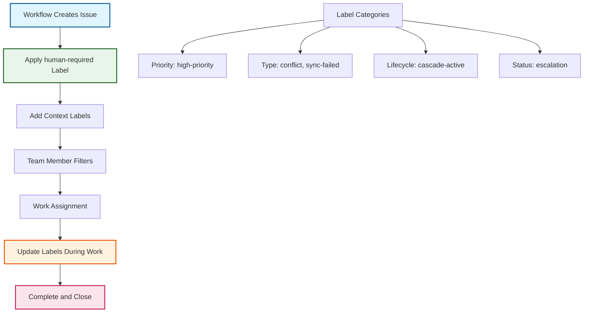

# ADR-020: Human-Required Label Strategy

:material-star: **Critical Decision** | :material-calendar: **2025-06-20** | :material-check-circle: **Accepted** | :material-refresh: **Revised** 2025-06-29

## Problem Statement

GitHub workflows frequently need to create issues and pull requests requiring human attention. Traditional assignee-based approaches create significant reliability, maintainability, and scalability challenges that block critical automation processes and limit template repository effectiveness.

## Context and Requirements

### :material-alert-circle: Assignee-Based Task Management Problems

**Username Resolution Issues**:
- GitHub's GraphQL API requires exact usernames for assignment operations
- Organization names cannot be assigned to issues, causing API validation failures
- Different workflows run in varying contexts with different triggering users
- Template repositories need flexible assignment across multiple instances

**Workflow Reliability Challenges**:
- Invalid usernames cause workflow failures with cryptic GraphQL errors
- Error messages like "Could not resolve to a User with the login of 'organization-name'"
- Hardcoded usernames become stale and require constant maintenance
- Cross-repository template complexity when deployment contexts vary

**Problematic Implementation Patterns**:
```yaml
# Common failing patterns
--assignee "${{ github.repository_owner }}"  # Organization name (invalid)
--assignee "hardcoded-username"              # Brittle and unmaintainable  
--assignee "${{ github.actor }}"             # Context-dependent failures
```

### :material-target: Task Management Requirements

**Reliable Workflow Execution**: Task assignment should never cause workflow failures or block critical automation processes.

**Template Repository Compatibility**: Assignment approach must work identically across all template instances without configuration.

**Flexible Team Organization**: Support various team structures and workflows without hardcoded assumptions about users or roles.

## Decision

Replace assignee-based task management with a **Human-Required Label Strategy** using GitHub's robust label system for task visibility and workflow coordination:



### :material-label-outline: Core Label Strategy

#### **Primary Human-Required Label**
```yaml
# Core task identification
human_required_label:
  name: "human-required"
  description: "Requires human intervention or review"
  color: "D73A49"
  usage: Applied to all issues/PRs needing human attention
  reliability: Never fails - no username validation required
```

#### **Supporting Classification Labels**
```yaml
# Enhanced task categorization
classification_labels:
  priority:
    - high-priority: Urgent items requiring immediate attention
    - emergency: Critical system issues requiring escalation
  
  type:
    - conflict: Merge conflicts requiring manual resolution
    - sync-failed: Failed synchronization operations
    - escalation: Issues that have exceeded SLA timeouts
    - cascade-trigger-failed: Failed cascade workflow triggers
  
  lifecycle:
    - upstream-sync: Issues related to upstream synchronization
    - cascade-active: Cascade integration currently in progress
    - cascade-blocked: Cascade blocked by conflicts or issues
    - production-ready: Ready for production deployment
    - validated: Integration complete, validation successful
```

### :material-workflow: Enhanced Workflow Implementation

#### **Robust Issue Creation Pattern**
```yaml
# Before: Problematic assignee-based approach
problematic_pattern:
  validation: Complex username resolution logic
  assignment: --assignee validation with multiple fallbacks
  failure_points: API validation, username resolution, context issues
  maintenance: Hardcoded usernames requiring updates

# After: Label-based approach
robust_pattern:
  creation: Simple issue creation with human-required label
  classification: Context-appropriate additional labels
  reliability: No username validation or API failures
  maintenance: Zero hardcoded user dependencies
```

#### **Lifecycle Management Through Labels**
```yaml
# Dynamic label updates during workflow progression
lifecycle_management:
  initial_state: upstream-sync + human-required
  work_begins: Remove human-required, add cascade-active
  conflicts_detected: Add cascade-blocked + conflict
  resolution_complete: Update to production-ready
  deployment_finished: Close issue, remove all lifecycle labels
```

## Implementation Strategy

### :material-cog-sync-outline Enhanced Workflow Patterns

#### **Issue Creation Replacement**
```yaml
# New robust issue creation pattern
issue_creation:
  before: |
    # Complex validation logic (prone to failures)
    ASSIGNEE="${{ github.actor }}"
    if gh api users/"$ASSIGNEE" >/dev/null 2>&1; then
      ASSIGNEE_FLAG="--assignee $ASSIGNEE"
    else
      ASSIGNEE_FLAG=""
    fi
    
    gh issue create \
      --title "Issue requiring attention" \
      --body "Issue details..." \
      --label "some-label" \
      $ASSIGNEE_FLAG

  after: |
    # Simple, reliable label-based approach
    gh issue create \
      --title "📥 Upstream Sync Ready for Review - $(date +%Y-%m-%d)" \
      --body "$NOTIFICATION_BODY" \
      --label "upstream-sync,human-required"
```

#### **Dynamic Label Management**
```yaml
# Real-time label updates during workflow execution
label_updates:
  cascade_start: |
    gh issue edit "$ISSUE_NUMBER" \
      --remove-label "human-required" \
      --add-label "cascade-active"
      
  conflict_detection: |
    gh issue edit "$ISSUE_NUMBER" \
      --remove-label "cascade-active" \
      --add-label "cascade-blocked,conflict,high-priority"
      
  production_ready: |
    gh issue edit "$ISSUE_NUMBER" \
      --remove-label "cascade-active" \
      --add-label "production-ready"
```

### :material-filter-outline Team Workflow Integration

#### **GitHub Issue Filtering Patterns**
```yaml
# Efficient team filtering strategies
filtering_patterns:
  daily_queue: "label:human-required label:high-priority"
  conflict_focus: "label:human-required label:conflict"
  cascade_monitoring: "label:upstream-sync label:cascade-active"
  emergency_response: "label:human-required label:emergency"
  
  lifecycle_tracking:
    needs_trigger: "label:upstream-sync label:human-required"
    in_progress: "label:upstream-sync label:cascade-active"
    blocked: "label:upstream-sync label:cascade-blocked"
    ready_deploy: "label:upstream-sync label:production-ready"
```

#### **Project Board Automation**
```yaml
# Automated project board organization
project_automation:
  needs_attention: "label:human-required → 'Needs Attention' column"
  urgent_items: "label:high-priority → 'Urgent' column"
  conflicts: "label:conflict → 'Conflicts' column"
  in_progress: "Remove human-required when work starts"
```

### :material-account-supervisor-circle Team Adoption Framework

#### **Individual Developer Workflows**
```yaml
# Efficient developer workflow patterns
developer_workflows:
  morning_review: |
    # Check high-priority items first
    https://github.com/org/repo/issues?q=is:open+label:human-required+label:high-priority
    
  weekly_triage: |
    # Review all human-required items
    https://github.com/org/repo/issues?q=is:open+label:human-required
    
  conflict_specialization: |
    # Focus on conflict resolution
    https://github.com/org/repo/issues?q=is:open+label:conflict+label:human-required
```

## Benefits and Rationale

### :material-trending-up Reliability and Maintainability

#### **Workflow Reliability Improvements**
- **Zero Username Failures**: Labels never fail due to user validation issues
- **Template Compatibility**: Works identically across all repository instances
- **API Resilience**: No dependency on GitHub user resolution APIs
- **Universal Compatibility**: Functions in all organizational contexts

#### **Maintenance Elimination**
- **No Hardcoded Users**: Eliminates need to maintain username lists
- **Self-Contained Templates**: Template repositories require no user configuration
- **Context Independence**: Works regardless of triggering user or repository owner
- **Simplified Logic**: Removes complex validation and fallback patterns

### :material-cog-outline Enhanced Team Organization

#### **Flexible Workflow Management**
- **Better Filtering**: Teams create custom views using label combinations
- **Priority Systems**: Multiple priority levels through label combinations
- **Type Classification**: Clear categorization of work through descriptive labels
- **Load Balancing**: Natural distribution as any team member can pick up work

#### **Scalable Process Architecture**
- **Team Size Independence**: Works regardless of team structure or size
- **Clear Ownership**: Labels indicate type and urgency without specific assignment
- **Automated Processing**: Workflows can reliably query and act on labels
- **Audit Trail**: Complete visibility into issue classification and progression

## Alternative Approaches Considered

### :material-close-circle: Enhanced User Validation

**Approach**: Complex validation logic with multiple fallback strategies

```yaml
# Multi-stage user resolution attempt
if gh api users/"${{ github.actor }}" >/dev/null 2>&1; then
  ASSIGNEE_FLAG="--assignee ${{ github.actor }}"
elif gh api users/"${{ github.repository_owner }}" >/dev/null 2>&1; then
  ASSIGNEE_FLAG="--assignee ${{ github.repository_owner }}"
else
  ASSIGNEE_FLAG="--assignee $(gh api /repos/:owner/:repo/collaborators --jq '.[0].login')"
fi
```

- **Pros**: Maintains traditional assignment approach
- **Cons**: Complex logic, API rate limiting, still fails in edge cases, fragile
- **Decision**: Rejected due to complexity and fundamental reliability issues

### :material-close-circle: Configuration-Based Assignment

**Approach**: Repository variables for assignee configuration

```yaml
# Configurable assignment approach
--assignee "${{ vars.DEFAULT_ASSIGNEE }}"
```

- **Pros**: Configurable per repository deployment
- **Cons**: Still requires username validation, manual setup overhead, maintenance burden
- **Decision**: Rejected due to configuration complexity and maintenance requirements

### :material-close-circle: External Assignment Service

**Approach**: Dedicated service for sophisticated assignment logic

- **Pros**: Could handle complex assignment rules and validation
- **Cons**: Additional infrastructure, external dependencies, single point of failure
- **Decision**: Rejected as over-engineering for task assignment requirements

### :material-close-circle: Hybrid Assignment and Labels

**Approach**: Attempt assignment with label fallback

```yaml
# Best-of-both-worlds attempt
if [[ -n "${{ vars.DEFAULT_ASSIGNEE }}" ]]; then
  --assignee "${{ vars.DEFAULT_ASSIGNEE }}"
fi
--label "human-required"
```

- **Pros**: Combines benefits of both approaches
- **Cons**: Still susceptible to assignment failures, increased complexity
- **Decision**: Rejected in favor of label-only simplicity and reliability

## Consequences and Trade-offs

### :material-plus: Positive Outcomes

#### **System Reliability Excellence**
- Workflows never fail due to username resolution issues
- Template repositories work identically across all deployment contexts
- Simplified workflow code eliminates complex validation logic
- Zero maintenance overhead for user assignment management

#### **Enhanced Team Workflow**
- Teams can organize work according to their preferred processes
- Better filtering capabilities through label combination strategies
- Natural load balancing as any team member can address labeled items
- Clear audit trail through label progression tracking

#### **Operational Scalability**
- Works across any team size or organizational structure
- Supports multiple concurrent template repository deployments
- Enables sophisticated workflow automation through label queries
- Facilitates integration with external project management tools

### :material-minus: Trade-offs and Limitations

#### **Process Adaptation Requirements**
- Teams must adapt from assignment-based to label-based workflows
- Individual accountability requires discipline rather than automatic assignment
- Team members need to learn effective label filtering strategies
- No automatic assignment notifications (replaced by label-based filtering)

#### **Organizational Considerations**
- Different workflow approach may initially feel unfamiliar
- Requires team agreement on label-based work distribution
- Learning curve for optimizing label filtering and project board setup

## Success Metrics

### :material-chart-line: Quantitative Indicators

- **Workflow Reliability**: 100% workflow success (zero assignment-related failures)
- **Issue Resolution Time**: Average <48 hours for human-required items
- **Team Adoption**: 100% team members using label-based filtering within 2 weeks
- **Template Compatibility**: Identical behavior across all repository instances

### :material-check-all: Qualitative Indicators

- Team reports improved clarity in work identification and prioritization
- Reduced support burden for workflow failures and assignment issues
- Effective integration with existing project management and notification systems
- Clear audit trail satisfaction for operational compliance requirements

## Integration Points

### :material-label-multiple-outline Label Management Integration

#### **Centralized Label Definitions** (per [ADR-008](adr_008_labels.md))
- Leverages centralized label management through `.github/labels.json`
- Consistent label definitions across all repository instances
- Automated label creation during repository initialization

#### **Workflow Pattern Integration**
- **Sync Workflow**: Uses `upstream-sync,human-required` for manual cascade triggering
- **Cascade Workflow**: Uses lifecycle labels (`cascade-active`, `cascade-blocked`, `production-ready`)
- **Monitor Workflow**: Uses `human-required` for trigger failure notifications
- **Template Sync**: Uses `template-sync,human-required` for template updates

### :material-integration External System Integration

#### **Project Board Automation**
- Automatic card movement based on label combinations
- Custom project views organized by priority and type labels
- Workflow automation rules triggered by label changes

#### **Notification System Integration**
- Slack/Teams integration filtered by label combinations
- Email notifications for high-priority labeled items
- GitHub Apps querying issues by label patterns

## Related Decisions

- [ADR-008](adr_008_labels.md): Centralized label management strategy provides foundation
- [ADR-019](adr_019_cascade_monitor.md): Cascade monitor pattern uses human-required labels
- [ADR-022](adr_022_lifecycle.md): Issue lifecycle tracking defines label progression patterns
- Sync Workflow Updates: Implements label-based task management throughout
- Cascade Workflow Updates: Uses labels for conflict and progress management

---

*This human-required label strategy provides reliable, scalable task management through GitHub's robust label system, eliminating workflow failures while enabling flexible team organization and sophisticated automation capabilities.*