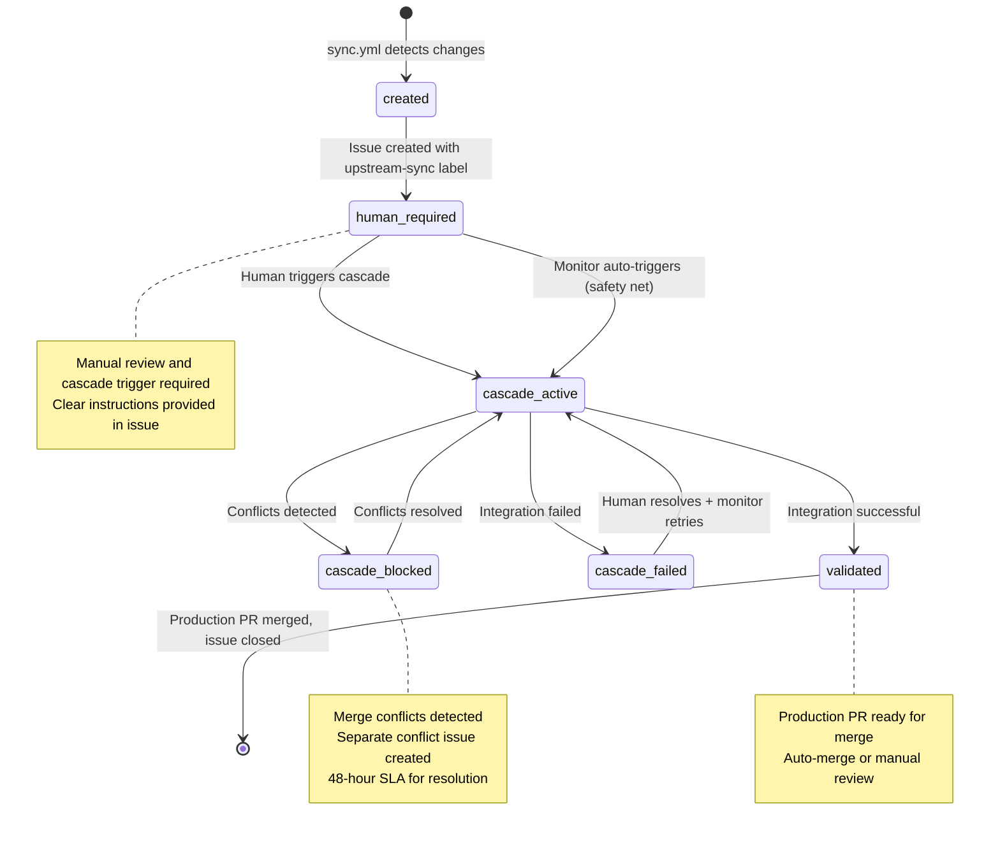

# ADR-022: Issue Lifecycle Tracking Pattern

:material-star: **Critical Decision** | :material-calendar: **2025-06-29** | :material-check-circle: **Accepted**

## Problem Statement

The fork management template's three-branch cascade strategy and human-centric cascade pattern require comprehensive visibility into upstream integration workflow state and progress. Teams need clear understanding of cascade status, error conditions, and required actions without diving into complex workflow logs or GitHub Actions details.

## Context and Requirements

### :material-alert-circle: Cascade Visibility Challenges

**Poor State Visibility**:
- No central location to check current cascade status for specific upstream changes
- Integration progress scattered across multiple workflow runs and branch states
- Difficult to understand relationship between sync, cascade, and production deployment
- Hard to track which upstream changesets are in what stage of integration

**Communication and Coordination Issues**:
- Unclear when human intervention is required and what actions should be taken
- Error conditions buried in workflow logs, not prominently visible to team
- Lost context about what specific changes are being integrated through the system
- Difficult to coordinate team activities around specific upstream integration cycles

**Audit and Historical Tracking**:
- No complete audit trail of how upstream changes flowed through the system
- Difficult to trace decision points and timing for troubleshooting
- Poor visibility into cascade performance metrics and bottlenecks
- Limited ability to learn from historical integration patterns and issues

### :material-target: Lifecycle Tracking Requirements

**Single Source of Truth**: One location per upstream changeset providing complete cascade status and history.

**Real-Time State Management**: Live updates reflecting current cascade state with clear next actions for team members.

**Machine-Readable Automation**: Label-based state management enabling sophisticated workflow automation and tooling integration.

## Decision

Implement **Issue Lifecycle Tracking Pattern** creating and maintaining GitHub issues throughout the complete cascade process:



### :material-file-document-edit Issue Creation and Management

#### **Comprehensive Issue Creation in Sync Workflow**
```yaml
# Enhanced issue creation with complete context
issue_creation_pattern:
  trigger: "sync.yml after successful PR creation"
  title: "📥 Upstream Sync Ready for Review - $(date +%Y-%m-%d)"
  labels: "upstream-sync,human-required"
  
  body_content: |
    ## 📥 Upstream Sync Ready for Review
    
    New upstream changes are available and ready for review.
    
    **Sync Details:**
    - **PR:** $PR_URL  
    - **Upstream Version:** $UPSTREAM_VERSION
    - **Commits:** $COMMIT_COUNT new commits from upstream
    - **Branch:** `$SYNC_BRANCH` → `fork_upstream`
    
    **Next Steps:**
    1. 🔍 **Review the sync PR** for breaking changes or conflicts
    2. ✅ **Merge the PR** when satisfied with changes  
    3. 🚀 **Manually trigger 'Cascade Integration' workflow**
    4. 📊 **Monitor cascade progress** in Actions tab
    
    **Timeline:**
    - Sync detected: $(date -u +%Y-%m-%dT%H:%M:%SZ)
    - Action required: Human review, merge, and cascade trigger
```

#### **Direct Issue Number Integration**
```yaml
# Cascade workflow input parameter
cascade_workflow_input:
  issue_number:
    description: 'GitHub issue number for upstream sync tracking (e.g., 123)'
    required: true
    type: 'string'
    
  usage: |
    # Eliminates complex issue searching logic
    ISSUE_NUMBER="${{ github.event.inputs.issue_number }}"
    
    # Direct issue updates throughout cascade process
    gh issue edit "$ISSUE_NUMBER" --remove-label "human-required" --add-label "cascade-active"
```

### :material-state-machine Label-Based State Management

#### **Comprehensive State Transition Table**
```yaml
# Complete label-based state machine
state_transitions:
  initial_state:
    labels: "upstream-sync, human-required"
    meaning: "Upstream sync complete, awaiting manual cascade trigger"
    human_action: "Review sync PR, merge, trigger cascade"
    next_state: "cascade-active"
    
  processing_state:
    labels: "upstream-sync, cascade-active"
    meaning: "Cascade integration in progress"
    human_action: "Monitor progress, wait for completion"
    next_states: ["validated", "cascade-blocked", "cascade-failed"]
    
  conflict_state:
    labels: "upstream-sync, cascade-blocked"
    meaning: "Conflicts detected, manual resolution needed"
    human_action: "Resolve conflicts, commit fixes"
    next_state: "cascade-active"
    
  failure_state:
    labels: "upstream-sync, cascade-failed, human-required"
    meaning: "Integration failed, human intervention required"
    human_action: "Review failure issue, fix problems, remove human-required label"
    next_state: "cascade-active (automatic retry)"
    
  completion_state:
    labels: "upstream-sync, validated"
    meaning: "Production PR created, ready for final review"
    human_action: "Review and merge production PR"
    final_state: "Issue closed"
```

#### **Real-Time Progress Updates**
```yaml
# Comprehensive progress communication pattern
progress_updates:
  cascade_start: |
    🚀 **Cascade Integration Started** - $(date -u +%Y-%m-%dT%H:%M:%SZ)
    
    Integration workflow has been triggered and is processing upstream changes.
    
    **Status:** Merging `fork_upstream` → `fork_integration` → `main`
    **Workflow:** [View Progress](${{ github.server_url }}/${{ github.repository }}/actions/runs/${{ github.run_id }})
    
  conflict_detection: |
    🚨 **Conflicts Detected** - $(date -u +%Y-%m-%dT%H:%M:%SZ)
    
    Merge conflicts were detected during integration. Manual resolution required.
    
    **Status:** Cascade blocked - manual conflict resolution required
    **SLA:** 48 hours for resolution
    **Conflict Issue:** [Details](#conflict-issue-url)
    
  production_ready: |
    🎯 **Production PR Created** - $(date -u +%Y-%m-%dT%H:%M:%SZ)
    
    Integration completed successfully! Production PR ready for final review.
    
    **Production PR:** $PR_URL
    **Auto-merge:** $([ "$BREAKING_CHANGES" == "false" ] && echo "✅ Enabled" || echo "❌ Manual review required")
    
    **Final Steps:**
    1. Review and merge the production PR
    2. This issue will be closed when changes reach main
```

## Implementation Strategy

### :material-workflow Workflow Integration Architecture

#### **Sync Workflow Issue Creation**
```yaml
# Complete sync workflow issue creation implementation
sync_issue_creation:
  location: "sync.yml after successful PR creation"
  
  implementation: |
    # Build comprehensive notification body
    NOTIFICATION_BODY="## 📥 Upstream Sync Ready for Review
    
    New upstream changes are available and ready for review.
    
    **Sync Details:**
    - **PR:** $PR_URL  
    - **Upstream Version:** $UPSTREAM_VERSION
    - **Commits:** $COMMIT_COUNT new commits from upstream
    - **Branch:** \`$SYNC_BRANCH\` → \`fork_upstream\`
    
    **Next Steps:**
    1. 🔍 **Review the sync PR** for any breaking changes or conflicts
    2. ✅ **Merge the PR** when satisfied with the changes  
    3. 🚀 **Manually trigger 'Cascade Integration' workflow** to integrate changes
    4. 📊 **Monitor cascade progress** in Actions tab
    
    **Timeline:**
    - Sync detected: $(date -u +%Y-%m-%dT%H:%M:%SZ)
    - Action required: Human review, merge, and cascade trigger"
    
    # Create tracking issue
    gh issue create \
      --title "📥 Upstream Sync Ready for Review - $(date +%Y-%m-%d)" \
      --body "$NOTIFICATION_BODY" \
      --label "upstream-sync,human-required"
```

#### **Cascade Workflow State Updates**
```yaml
# Comprehensive cascade workflow issue updates
cascade_state_management:
  issue_parameter: "Direct issue number input eliminates search complexity"
  
  state_updates: |
    # Use provided issue number directly
    ISSUE_NUMBER="${{ github.event.inputs.issue_number }}"
    
    if [ -n "$ISSUE_NUMBER" ]; then
      # Update state: human-required → cascade-active
      gh issue edit "$ISSUE_NUMBER" \
        --remove-label "human-required" \
        --add-label "cascade-active"
      
      # Add detailed progress comment
      gh issue comment "$ISSUE_NUMBER" --body "🚀 **Cascade Integration Started** - $(date -u +%Y-%m-%dT%H:%M:%SZ)
      
      Integration workflow has been triggered and is now processing upstream changes.
      
      **Status:** Merging \`fork_upstream\` → \`fork_integration\` → \`main\`
      **Workflow:** [View Progress](${{ github.server_url }}/${{ github.repository }}/actions/runs/${{ github.run_id }})"
    fi
```

### :material-alert-circle-outline Error and Conflict Handling

#### **Conflict State Management**
```yaml
# Sophisticated conflict handling with issue tracking
conflict_handling:
  detection: "Conflicts detected during cascade integration"
  
  implementation: |
    # Update tracking issue state
    TRACKING_ISSUE="${{ github.event.inputs.issue_number }}"
    if [ -n "$TRACKING_ISSUE" ]; then
      gh issue edit "$TRACKING_ISSUE" \
        --remove-label "cascade-active" \
        --add-label "cascade-blocked"
      
      # Create detailed conflict notification
      gh issue comment "$TRACKING_ISSUE" --body "🚨 **Conflicts Detected** - $(date -u +%Y-%m-%dT%H:%M:%SZ)
      
      Merge conflicts were detected during integration. A separate conflict resolution issue has been created.
      
      **Status:** Cascade blocked - manual conflict resolution required
      **SLA:** 48 hours for resolution
      **Conflicted Files:** [View Details](conflict-files-url)
      
      **Resolution Steps:**
      1. Checkout the fork_integration branch locally
      2. Resolve conflicts in the listed files
      3. Commit and push the resolution
      4. The cascade will automatically continue once conflicts are resolved"
    fi
```

#### **Failure Recovery Integration**
```yaml
# Enhanced failure recovery with issue coordination
failure_recovery:
  failure_detection: "cascade-failed + human-required labels applied"
  
  recovery_process: |
    # Human signals resolution readiness by removing human-required label
    # Monitor detects recovery-ready issues automatically
    RECOVERY_ISSUES=$(gh issue list \
      --label "cascade-failed" \
      --state open \
      --jq '.[] | select(.labels | contains(["cascade-failed"]) and (contains(["human-required"]) | not))')
    
    # For each recovery-ready issue
    echo "$RECOVERY_ISSUES" | jq -r '.number' | while read ISSUE_NUMBER; do
      # Update state: cascade-failed → cascade-active
      gh issue edit "$ISSUE_NUMBER" \
        --remove-label "cascade-failed" \
        --add-label "cascade-active"
      
      # Trigger automatic retry with issue context
      gh workflow run "Cascade Integration" \
        --repo ${{ github.repository }} \
        -f issue_number="$ISSUE_NUMBER"
    done
```

## Benefits and Rationale

### :material-trending-up Strategic Advantages

#### **Enhanced Visibility and Communication**
- Single source of truth for each upstream changeset's cascade status
- Real-time state updates eliminate need to check multiple workflow logs
- Clear next actions reduce coordination overhead and team confusion
- Prominent error display ensures critical issues receive immediate attention

#### **Comprehensive Audit Trail**
- Complete history of how upstream changes flowed through integration system
- Detailed timestamps showing cascade stage duration and bottlenecks
- Decision point documentation for troubleshooting and process improvement
- Historical pattern analysis for optimizing integration performance

#### **Automation-Friendly Architecture**
- Label-based state management enables sophisticated tooling and reporting
- Machine-readable state transitions support automated workflow coordination
- Direct issue number integration eliminates complex search logic
- Clean integration with existing GitHub automation and notification systems

### :material-cog-outline Operational Benefits

#### **Team Productivity Enhancement**
- Reduced cognitive load through centralized status information
- Clear escalation paths for conflicts and failures
- Efficient team coordination around specific upstream integration cycles
- Self-documenting process through comprehensive issue content

#### **Quality Assurance Integration**
- Forced documentation of all cascade decisions and interventions
- Clear SLA tracking for conflict resolution and error handling
- Complete visibility into integration performance metrics
- Easy identification of process bottlenecks and improvement opportunities

## Alternative Approaches Considered

### :material-close-circle: Workflow-Only Status Tracking

**Approach**: Track cascade status only through GitHub Actions workflow logs

- **Pros**: No additional GitHub resources, simple implementation
- **Cons**: Poor visibility, information scattered across workflow runs, difficult team coordination
- **Decision**: Rejected due to fundamental visibility and usability issues

### :material-close-circle: Multiple Issues Per Cascade Stage

**Approach**: Create separate issues for sync, integration, and production stages

- **Pros**: Very detailed stage-specific tracking, clear separation of concerns
- **Cons**: Issue proliferation, difficult to follow overall changeset story, coordination complexity
- **Decision**: Rejected due to management complexity and fragmented visibility

### :material-close-circle: External Project Management Integration

**Approach**: Use external tools like Jira or Asana for cascade tracking

- **Pros**: More powerful project management capabilities, advanced reporting
- **Cons**: Additional infrastructure, poor GitHub integration, context switching overhead
- **Decision**: Rejected due to complexity and integration maintenance burden

### :material-close-circle: PR-Based Tracking Only

**Approach**: Use sync PR for complete cascade lifecycle tracking

- **Pros**: Leverages existing PR infrastructure, no additional resources
- **Cons**: Sync PR lifecycle doesn't match cascade duration, loses tracking after merge
- **Decision**: Rejected because PR closure terminates tracking before cascade completion

## Consequences and Trade-offs

### :material-plus: Positive Outcomes

#### **Exceptional Visibility and Control**
- Teams can see complete cascade status at a glance without technical expertise
- Clear action items eliminate confusion about required next steps
- Prominent error and conflict display ensures immediate team attention
- Complete audit trail enables effective troubleshooting and process improvement

#### **Enhanced Team Coordination**
- Single source of truth eliminates information fragmentation and confusion
- Real-time updates enable effective coordination around integration activities
- Clear state transitions support predictable team workflows and planning
- Searchable history provides valuable context for similar future situations

#### **Automation and Integration Excellence**
- Label-based state management enables sophisticated automated tooling
- Direct issue number integration eliminates complex workflow search logic
- Clean integration with GitHub's native notification and project management
- Machine-readable state transitions support advanced reporting and analytics

### :material-minus: Trade-offs and Limitations

#### **Resource and Maintenance Considerations**
- Additional GitHub issues created for each upstream integration cycle
- Workflow changes require corresponding issue tracking implementation updates
- Potential for stale issues if workflow failures prevent proper closure
- Label management complexity requires coordination with centralized strategy

#### **Process Adaptation Requirements**
- Team must adopt issue-centric workflow for cascade coordination
- Learning curve for understanding label-based state management approach
- Need for consistent workflow patterns across different team members
- Dependency on proper workflow implementation for accurate issue tracking

## Success Metrics

### :material-chart-line: Quantitative Indicators

- **Issue Creation Rate**: 100% of upstream syncs create tracking issues
- **State Accuracy**: 95%+ of issue labels accurately reflect cascade state
- **Update Timeliness**: Issue updates within 2 hours of state changes
- **Completion Rate**: Zero stale issues open longer than 30 days

### :material-check-all: Qualitative Indicators

- Team reports improved cascade visibility and coordination confidence
- Reduced time spent searching for cascade status information
- Clear understanding of required actions during integration processes
- Effective error escalation and resolution through issue-based communication

## Integration Points

### :material-source-branch Workflow System Integration

#### **Human-Centric Cascade Coordination** (per [ADR-019](adr_019_cascade_monitor.md))
- Issues provide clear instructions for manual cascade triggering
- Safety net monitor updates issues when auto-triggering cascades
- Both manual and automatic error scenarios tracked through centralized issues

#### **Label Management Strategy** (per [ADR-020](adr_020_human_labels.md))
- Leverages predefined label strategy for consistent state management
- Uses specific label combinations for sophisticated cascade state tracking
- Automated label management through workflow state transitions

### :material-shield-check Conflict and Error Management

#### **Conflict Management Integration** (per [ADR-005](adr_005_conflict_management.md))
- Issues prominently display conflict status with clear resolution guidance
- Conflict resolution progress tracked through issue state transitions
- 48-hour SLA enforcement through issue-based escalation management

## Related Decisions

- [ADR-001](adr_001_three_branch_strategy.md): Three-branch strategy defines cascade process being tracked
- [ADR-019](adr_019_cascade_monitor.md): Human-centric cascade approach supported by this tracking
- [ADR-020](adr_020_human_labels.md): Human-required label strategy provides foundation for state management
- [ADR-005](adr_005_conflict_management.md): Conflict handling tracked through this issue lifecycle
- [ADR-008](adr_008_labels.md): Centralized label management enables consistent state tracking

---

*This issue lifecycle tracking pattern provides comprehensive visibility, coordination, and audit capabilities for the fork management cascade process, enabling effective team collaboration while maintaining complete historical context for troubleshooting and process improvement.*