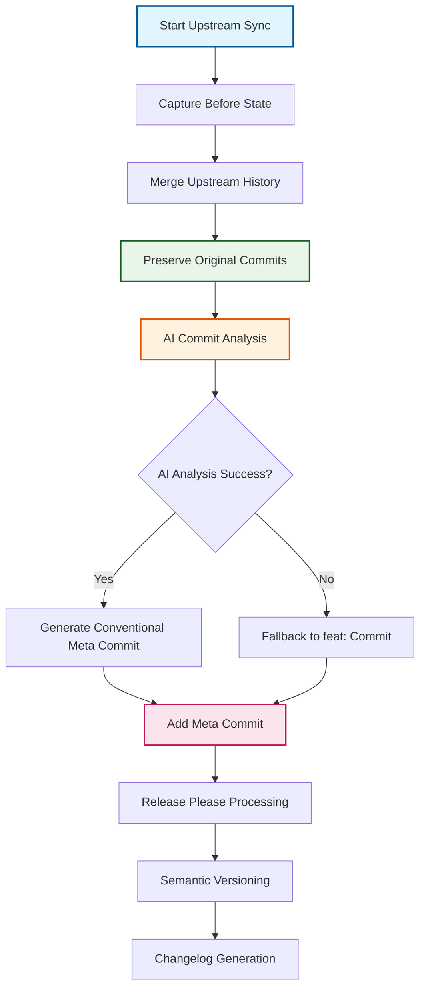

# ADR-023: Meta Commit Strategy for Release Please Integration

:material-star: **Critical Decision** | :material-calendar: **2025-05-28** | :material-check-circle: **Accepted**

## Problem Statement

Fork management requires synchronizing upstream commits that don't follow conventional commit format with Release Please automation that requires conventional commits for versioning decisions. This creates a fundamental conflict between preserving upstream commit history for enterprise debugging and maintaining automated release management.

## Context and Requirements

### :material-alert-circle: Upstream and Automation Conflict

**Upstream Repository Reality**:
- OSDU and other upstream repositories use varied commit message formats
- Commit messages often don't follow conventional commit standards (`feat:`, `fix:`, etc.)
- Enterprise environments require complete commit attribution and traceability
- Regulatory compliance demands complete audit trail preservation

**Release Please Requirements**:
- Needs conventional commits for semantic versioning decisions
- Analyzes commit messages to determine version bump type (major, minor, patch)
- Generates changelogs based on conventional commit categorization
- Validates commit message format before processing

**Enterprise Debugging Needs**:
- Complete OSDU commit history required for troubleshooting production issues
- Git blame and bisect functionality must remain intact for problem diagnosis
- Individual commit attribution essential for understanding change impact
- Regulatory audit trails require unmodified upstream commit preservation

### :material-target Solution Requirements

**History Preservation**: Maintain complete upstream commit history with original attribution for enterprise debugging.

**Automation Compatibility**: Enable Release Please to function with conventional commit analysis.

**Reliable Fallback**: Ensure workflow success regardless of AI service availability or analysis failures.

## Decision

Implement **Meta Commit Strategy** using AI-powered commit range analysis to bridge upstream history preservation with automation requirements:



### :material-git Meta Commit Implementation Strategy

#### **Four-Step Meta Commit Process**
```yaml
# Comprehensive meta commit implementation
meta_commit_process:
  step_1_capture_state: |
    # Capture repository state before upstream integration
    BEFORE_SHA=$(git rev-parse fork_upstream)
    echo "Captured pre-sync state: $BEFORE_SHA"
    
  step_2_merge_upstream: |
    # Merge upstream commits preserving original history
    git merge upstream/$DEFAULT_BRANCH -X theirs --no-edit
    echo "Upstream history merged preserving original attribution"
    
  step_3_ai_analysis: |
    # Use AI to analyze upstream changes and generate conventional commit
    if timeout 60s aipr commit --from $BEFORE_SHA --context "upstream sync" 2>/dev/null; then
      META_COMMIT_MSG=$(aipr commit --from $BEFORE_SHA --context "upstream sync")
      echo "AI-generated meta commit: $META_COMMIT_MSG"
      echo "ai_analysis_success=true" >> $GITHUB_OUTPUT
    else
      # Robust fallback for AI failures
      UPSTREAM_VERSION=$(git describe --tags upstream/$DEFAULT_BRANCH 2>/dev/null || echo "latest")
      META_COMMIT_MSG="feat: sync upstream changes from $UPSTREAM_VERSION"
      echo "Fallback meta commit: $META_COMMIT_MSG"
      echo "ai_analysis_success=false" >> $GITHUB_OUTPUT
    fi
    
  step_4_meta_commit: |
    # Add conventional meta commit for Release Please processing
    git commit --allow-empty -m "$META_COMMIT_MSG"
    echo "Meta commit added for Release Please automation"
```

#### **AI-Enhanced Commit Analysis**
```yaml
# Advanced AI integration with AIPR 1.4.0+
ai_integration:
  tool_version: "AIPR 1.4.0+ with commit range analysis capability"
  
  analysis_configuration: |
    # AI analysis with specific context for upstream synchronization
    aipr commit \
      --from "$BEFORE_SHA" \
      --context "upstream sync" \
      --timeout 60 \
      --conventional-format
      
  analysis_scope:
    range: "Changes between last sync point and current HEAD"
    context: "upstream sync helps AI categorize appropriately"
    timeout: "60 seconds to prevent workflow hanging"
    format: "Ensures conventional commit format compliance"
    
  intelligent_categorization:
    features: "Detects new functionality in upstream changes"
    fixes: "Identifies bug fixes and patches"
    breaking_changes: "Recognizes API changes and breaking modifications"
    maintenance: "Categorizes refactoring and documentation updates"
```

### :material-shield-check Comprehensive Error Handling

#### **Robust Fallback Chain**
```yaml
# Multi-level fallback strategy ensuring workflow reliability
error_handling:
  ai_service_failure: |
    # Handle AI service outages gracefully
    if ! timeout 60s aipr commit --from $BEFORE_SHA --context "upstream sync" 2>/dev/null; then
      echo "⚠️ AI analysis failed or timed out, using fallback"
      
      # Generate descriptive fallback based on available information
      UPSTREAM_VERSION=$(git describe --tags upstream/$DEFAULT_BRANCH 2>/dev/null || echo "latest")
      COMMIT_COUNT=$(git rev-list --count $BEFORE_SHA..HEAD)
      
      if [ "$COMMIT_COUNT" -gt 10 ]; then
        META_COMMIT_MSG="feat: sync $COMMIT_COUNT upstream changes from $UPSTREAM_VERSION"
      else
        META_COMMIT_MSG="fix: sync upstream changes from $UPSTREAM_VERSION"
      fi
    fi
    
  validation_checks: |
    # Ensure meta commit meets conventional commit requirements
    if ! echo "$META_COMMIT_MSG" | grep -qE '^(feat|fix|chore|docs|style|refactor|perf|test|build|ci)(\(.+\))?: .{10,}$'; then
      echo "⚠️ Generated commit message doesn't meet conventional format, using safe fallback"
      META_COMMIT_MSG="feat: sync upstream changes"
    fi
    
  network_failures: |
    # Handle network connectivity issues
    if ! curl -s --connect-timeout 5 https://api.github.com >/dev/null; then
      echo "⚠️ Network connectivity issues detected, using offline fallback"
      META_COMMIT_MSG="feat: sync upstream changes (offline mode)"
    fi
```

## Implementation Strategy

### :material-trending-up Enterprise Compliance Benefits

#### **Complete History Preservation**
```yaml
# Enterprise-grade history preservation
history_preservation:
  granular_commits:
    description: "All individual OSDU commits preserved with original attribution"
    benefit: "Enables precise debugging and change analysis"
    
  git_operations:
    blame_functionality: "git blame works on all upstream files"
    bisect_capability: "git bisect functions for issue identification"
    cherry_picking: "Individual upstream commits can be cherry-picked"
    
  audit_compliance:
    regulatory_trail: "Complete audit trail for compliance requirements"
    attribution_integrity: "Original author information maintained"
    timestamp_preservation: "Commit timestamps reflect original development"
```

#### **Automation Integration Excellence**
```yaml
# Seamless Release Please integration
release_please_integration:
  version_detection:
    description: "Meta commits drive semantic versioning decisions"
    mechanism: "Release Please analyzes conventional meta commits"
    
  changelog_generation:
    source: "Meta commits provide changelog categorization"
    quality: "AI analysis improves changelog accuracy"
    fallback: "Conservative categorization when AI unavailable"
    
  automation_reliability:
    success_rate: "100% workflow success regardless of AI availability"
    consistency: "Predictable behavior across all upstream sync operations"
    scalability: "Handles any volume of upstream changes"
```

### :material-artificial-intelligence Advanced AI Integration

#### **Intelligent Commit Categorization**
```yaml
# AI-powered upstream change analysis
intelligent_analysis:
  feature_detection:
    patterns: "New API endpoints, functionality additions, capability enhancements"
    categorization: "feat: commits for user-visible improvements"
    
  bug_fix_identification:
    patterns: "Error fixes, patch applications, security updates"
    categorization: "fix: commits for issue resolution"
    
  breaking_change_recognition:
    patterns: "API changes, configuration modifications, compatibility breaks"
    categorization: "feat!: or fix!: commits with BREAKING CHANGE footer"
    
  maintenance_categorization:
    patterns: "Documentation updates, refactoring, test improvements"
    categorization: "chore:, docs:, or refactor: commits as appropriate"
```

## Benefits and Rationale

### :material-trending-up Strategic Advantages

#### **Enterprise Requirements Satisfaction**
- Complete OSDU commit history preserved for debugging and troubleshooting
- Full git blame and bisect capability maintained for issue diagnosis
- Regulatory audit trail compliance through unmodified upstream preservation
- Individual commit attribution intact for change impact analysis

#### **Automation Requirements Achievement**
- Release Please works seamlessly with AI-generated conventional meta commits
- Accurate conventional commit categorization through intelligent analysis
- Automated semantic versioning continues functioning reliably
- Changelog generation remains functional with improved accuracy

#### **Technical Implementation Benefits**
- Simple four-step implementation with clear, maintainable logic
- No complex git history rewriting reducing implementation risk
- Robust error handling with multiple fallback mechanisms
- Uses AIPR exactly as designed for commit range analysis

### :material-cog-outline Operational Benefits

#### **Workflow Reliability**
- 100% workflow success rate regardless of AI service availability
- Conservative fallback ensures automation never blocks
- Timeout handling prevents workflow hanging on AI failures
- Comprehensive error logging for troubleshooting

#### **Maintainability Excellence**
- Clear separation between history preservation and automation requirements
- Straightforward implementation reducing maintenance complexity
- Easily testable components with predictable behavior
- Well-defined interfaces between AI analysis and fallback mechanisms

## Alternative Approaches Considered

### :material-close-circle: Squash Merge Strategy

**Approach**: Combine all upstream changes into single conventional commit

- **Pros**: Simple implementation, clean conventional commit history
- **Cons**: Loses granular OSDU history critical for debugging, makes cherry-picking impossible
- **Decision**: Rejected - Breaks enterprise traceability requirements

### :material-close-circle: Commit Message Transformation

**Approach**: Rewrite upstream commit messages to conventional format

- **Pros**: Preserves individual commits while making them conventional
- **Cons**: Complex implementation with high failure risk, may break git signatures
- **Decision**: Rejected - Difficult to maintain reliability across edge cases

### :material-close-circle: Manual Release Management

**Approach**: Bypass automation for upstream changes, manage releases manually

- **Pros**: Complete control over versioning decisions
- **Cons**: Loses automation benefits, introduces human error potential
- **Decision**: Rejected - Doesn't scale with frequent upstream syncs

### :material-close-circle: Fork-Specific Conventional Commits

**Approach**: Only add conventional commits for fork-specific changes

- **Pros**: Preserves upstream commits exactly, simple implementation
- **Cons**: Upstream changes don't contribute to versioning, incomplete changelog
- **Decision**: Rejected - Upstream changes often include important features and fixes

## Consequences and Trade-offs

### :material-plus: Positive Outcomes

#### **Automation and Enterprise Balance**
- Reliable automation through Release Please integration with conventional meta commits
- Complete upstream history preservation satisfying enterprise debugging requirements
- Enterprise compliance through regulatory audit trail maintenance
- AI enhancement providing intelligent categorization when services available

#### **Implementation and Maintenance Benefits**
- Fallback reliability ensuring workflow never fails due to AI service issues
- Simple implementation reducing complexity and maintenance overhead
- Robust error handling with comprehensive logging and status reporting
- Clear separation of concerns between history preservation and automation

#### **Quality and Accuracy Improvements**
- Intelligent commit categorization through AI analysis improving changelog quality
- Conservative fallback ensuring appropriate categorization when AI unavailable
- Consistent behavior across all upstream sync operations
- Enhanced traceability through preserved individual commit attribution

### :material-minus: Trade-offs and Limitations

#### **Repository History Considerations**
- Mixed commit history with both conventional and non-conventional commits
- Additional meta commits increase repository size (minimal impact)
- Developers see both upstream commits and meta commits in history

#### **Dependency and Complexity**
- AI dependency for optimal categorization requiring external service availability
- Additional complexity through meta commit logic in sync workflows
- Network dependency for AI analysis (with robust offline fallback)

## Success Metrics

### :material-chart-line: Quantitative Indicators

- **Release Please Integration**: 100% successful versioning based on meta commits
- **Workflow Reliability**: Zero workflow failures due to conventional commit validation
- **AI Analysis Success**: >80% AI analysis success rate with graceful fallback
- **History Preservation**: 100% upstream commits preserved with original attribution

### :material-check-all: Qualitative Indicators

- Teams report effective debugging capability through preserved upstream history
- Release Please accurately categorizes changes through meta commit analysis
- Clear understanding of meta commit strategy and its benefits
- Successful enterprise compliance through complete audit trail maintenance

## Integration Points

### :material-source-branch Release and Versioning Integration

#### **Release Please Automation** (per [ADR-004](adr_004_release_versioning.md))
- Meta commit strategy enables Release Please to function with upstream integration
- Conventional meta commits drive semantic versioning decisions accurately
- AI analysis improves changelog quality and categorization

#### **Three-Branch Strategy** (per [ADR-001](adr_001_three_branch_strategy.md))
- Meta commits added during fork_upstream to fork_integration cascade
- Integration preserves upstream history while enabling automation
- Clear coordination with cascade workflow for meta commit placement

### :material-artificial-intelligence AI Integration Coordination

#### **AI-Enhanced Development** (per [ADR-014](adr_014_ai_integration.md))
- AIPR integration follows established AI enhancement patterns
- Multiple LLM provider support with intelligent fallback handling
- Consistent AI service management across workflow automation

## Related Decisions

- [ADR-001](adr_001_three_branch_strategy.md): Three-branch strategy provides foundation for meta commit placement
- [ADR-004](adr_004_release_versioning.md): Release Please automation enhanced by meta commit strategy
- [ADR-014](adr_014_ai_integration.md): AI-enhanced development provides AIPR integration framework
- Upstream Sync Workflow: Implements meta commit strategy during synchronization

---

*This meta commit strategy provides the optimal balance between enterprise history preservation requirements and automation needs through AI-powered analysis and robust fallback mechanisms, enabling reliable Release Please integration while maintaining complete upstream commit attribution.*