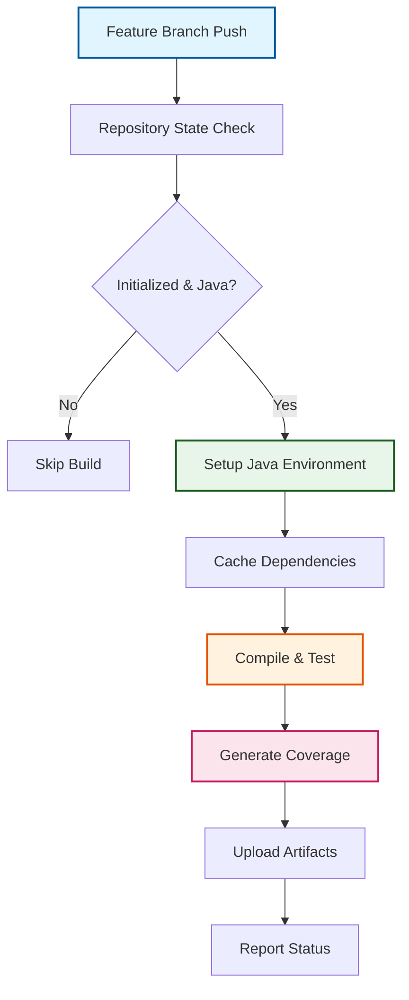

# Build and Test Workflow

:material-hammer-wrench: **Feature branch builds** | :material-test-tube: **Coverage analysis** | :material-trending-up: **Performance optimization**

The build and test workflow provides automated build verification and comprehensive code coverage analysis for feature branch development. This workflow complements the validation workflow by focusing specifically on rapid feedback for developers working on new features while ensuring code quality standards.

## Build Philosophy

### :material-lightning-bolt: Rapid Developer Feedback
Immediate build verification for feature branches enables developers to catch issues early in the development cycle, reducing integration problems and improving code quality.

### :material-chart-line: Comprehensive Quality Metrics
Detailed code coverage analysis and build metrics provide insight into code quality trends and help maintain high standards throughout development.

### :material-cached: Performance-Optimized Execution
Intelligent caching strategies and parallel execution reduce build times while maintaining thorough validation coverage.

## Build Architecture

### :material-workflow: Feature Branch Focus



### :material-target: Selective Execution Strategy

**Targeted Branch Scope**:
```yaml
# Triggers only on feature branches
on:
  push:
    branches-ignore:
      - main                    # Handled by validation workflow
      - fork_integration        # Handled by cascade workflow
      - fork_upstream          # Handled by sync workflow
      - 'dependabot/**'        # Handled by dependabot validation
```

**Repository State Validation**:
- Verification of repository initialization status
- Java project detection through multiple criteria
- Build eligibility assessment based on project type

## Workflow Configuration

### :material-security: Minimal Permissions Model
```yaml
permissions:
  contents: read        # Repository file access
  actions: read         # Workflow context access
```

**Security Benefits**:
- Read-only access prevents accidental modifications
- Minimal permission scope reduces security risk
- Clear audit trail for all build operations

### :material-cog: Environment Specifications

#### **Java Development Kit**
```yaml
# Standardized Java environment
- name: Set up JDK 17
  uses: actions/setup-java@v4
  with:
    java-version: '17'          # Long-term support version
    distribution: 'temurin'     # Eclipse Temurin distribution
```

#### **Build Tool Configuration**
```yaml
# Maven optimization for performance
env:
  MAVEN_OPTS: >-
    -Xmx2g                      # Increase heap size
    -XX:+UseG1GC               # G1 garbage collector
    -XX:+UseStringDeduplication # Memory optimization
    -Dmaven.compiler.fork=true # Parallel compilation
```

## Build Process

### :material-check-circle: Phase 1: Repository State Analysis

#### **Initialization Verification**
```yaml
- name: Check repository initialization
  run: |
    if [ ! -f ".github/workflow.env" ]; then
      echo "::notice::Repository not initialized - skipping build"
      echo "initialized=false" >> $GITHUB_OUTPUT
      exit 0
    fi
    echo "initialized=true" >> $GITHUB_OUTPUT
```

#### **Java Project Detection**
```yaml
- name: Detect Java project type
  run: |
    # Multiple detection criteria for robust identification
    if [ -f "pom.xml" ] || [ -f "build.gradle" ] || [ -d "src/main/java" ]; then
      echo "is_java_project=true" >> $GITHUB_OUTPUT
      echo "📋 Java project detected - proceeding with build"
    else
      echo "is_java_project=false" >> $GITHUB_OUTPUT
      echo "::notice::Non-Java project - skipping build workflow"
      exit 0
    fi
```

**Detection Methods**:
- **Maven Projects**: `pom.xml` file presence
- **Gradle Projects**: `build.gradle` file presence
- **Source Structure**: `src/main/java` directory existence

### :material-hammer-wrench: Phase 2: Build and Compilation

#### **Dependency Management**
```yaml
- name: Setup Maven Cache
  uses: actions/cache@v4
  with:
    path: ~/.m2/repository
    key: ${{ runner.os }}-maven-${{ hashFiles('**/pom.xml') }}
    restore-keys: |
      ${{ runner.os }}-maven-
```

**Caching Strategy Benefits**:
- Significant build time reduction through dependency caching
- Fallback keys ensure cache hits even with partial matches
- Multi-level cache optimization for different project configurations

#### **Compilation and Testing**
```yaml
- name: Compile and Test
  run: |
    # Parallel compilation for performance
    mvn clean compile test -T 1C
    
    # Extract build metrics
    echo "BUILD_STATUS=success" >> $GITHUB_ENV
    
    # Capture test execution metrics
    if [ -f "target/surefire-reports/TEST-*.xml" ]; then
      TESTS_RUN=$(grep -o 'tests="[0-9]*"' target/surefire-reports/TEST-*.xml | \
                  sed 's/tests="//g' | sed 's/"//g' | \
                  awk '{sum += $1} END {print sum}')
      echo "TESTS_RUN=$TESTS_RUN" >> $GITHUB_ENV
    fi
```

**Build Outputs**:
- Compiled classes in `target/classes`
- Test classes in `target/test-classes`
- Surefire test reports for analysis

### :material-chart-bar: Phase 3: Code Coverage Analysis

#### **JaCoCo Integration**
```yaml
- name: Generate Coverage Report
  if: steps.build.outcome == 'success'
  run: |
    mvn jacoco:report
    
    # Verify successful report generation
    if [ -f "target/site/jacoco/index.html" ]; then
      echo "COVERAGE_GENERATED=true" >> $GITHUB_ENV
      echo "📊 Coverage report generated successfully"
    fi
```

#### **Coverage Metrics Extraction**
```yaml
- name: Extract Coverage Metrics
  if: env.COVERAGE_GENERATED == 'true'
  run: |
    # Parse JaCoCo CSV report for precise metrics
    if [ -f "target/site/jacoco/jacoco.csv" ]; then
      # Calculate instruction coverage percentage
      INSTRUCTION_COVERAGE=$(awk -F',' 'NR>1 {missed+=$4; covered+=$5} END {
        if(missed+covered > 0) print int(covered/(missed+covered)*100)
        else print 0
      }' target/site/jacoco/jacoco.csv)
      
      # Calculate branch coverage percentage
      BRANCH_COVERAGE=$(awk -F',' 'NR>1 {missed+=$6; covered+=$7} END {
        if(missed+covered > 0) print int(covered/(missed+covered)*100)
        else print 0
      }' target/site/jacoco/jacoco.csv)
      
      echo "INSTRUCTION_COVERAGE=$INSTRUCTION_COVERAGE" >> $GITHUB_ENV
      echo "BRANCH_COVERAGE=$BRANCH_COVERAGE" >> $GITHUB_ENV
      echo "📈 Coverage: ${INSTRUCTION_COVERAGE}% instructions, ${BRANCH_COVERAGE}% branches"
    fi
```

#### **Quality Gate Evaluation**
```yaml
- name: Evaluate Coverage Quality
  run: |
    INSTRUCTION_THRESHOLD=70
    BRANCH_THRESHOLD=60
    
    # Assess instruction coverage
    if [ "${INSTRUCTION_COVERAGE:-0}" -lt "$INSTRUCTION_THRESHOLD" ]; then
      echo "::warning::Instruction coverage ${INSTRUCTION_COVERAGE}% below threshold ${INSTRUCTION_THRESHOLD}%"
    else
      echo "✅ Instruction coverage meets quality standards"
    fi
    
    # Assess branch coverage  
    if [ "${BRANCH_COVERAGE:-0}" -lt "$BRANCH_THRESHOLD" ]; then
      echo "::warning::Branch coverage ${BRANCH_COVERAGE}% below threshold ${BRANCH_THRESHOLD}%"
    else
      echo "✅ Branch coverage meets quality standards"
    fi
```

### :material-package-variant: Phase 4: Artifact Management

#### **Build Artifacts Preservation**
```yaml
- name: Upload Build Artifacts
  if: always()
  uses: actions/upload-artifact@v4
  with:
    name: build-artifacts-${{ github.run_number }}
    path: |
      target/*.jar
      target/maven-archiver/
      target/classes/
    retention-days: 2
```

#### **Coverage Report Artifacts**
```yaml
- name: Upload Coverage Reports
  if: env.COVERAGE_GENERATED == 'true'
  uses: actions/upload-artifact@v4
  with:
    name: coverage-reports-${{ github.run_number }}
    path: |
      target/site/jacoco/
      target/jacoco.exec
    retention-days: 2
```

#### **Test Result Preservation**
```yaml
- name: Upload Test Results
  if: always()
  uses: actions/upload-artifact@v4
  with:
    name: test-results-${{ github.run_number }}
    path: |
      target/surefire-reports/
      target/failsafe-reports/
    retention-days: 2
```

**Artifact Strategy Benefits**:
- Short retention period (2 days) optimizes storage costs
- Comprehensive artifact collection enables detailed analysis
- Always-upload policy ensures availability even on build failures

## Performance Optimization

### :material-cached: Advanced Caching Strategy

#### **Multi-Level Dependency Caching**
```yaml
# Primary Maven repository cache
- name: Cache Maven Repository
  uses: actions/cache@v4
  with:
    path: ~/.m2/repository
    key: ${{ runner.os }}-maven-${{ hashFiles('**/pom.xml') }}
    restore-keys: |
      ${{ runner.os }}-maven-

# Compiled classes cache for incremental builds
- name: Cache Compiled Classes
  uses: actions/cache@v4
  with:
    path: target/classes
    key: ${{ runner.os }}-classes-${{ github.sha }}
```

### :material-trending-up: Parallel Execution

#### **Maven Parallel Build Configuration**
```yaml
- name: Parallel Build Execution
  run: |
    # Use one thread per CPU core for optimal performance
    mvn clean compile test -T 1C
    
    # Enable parallel test execution
    mvn test -Dparallel=methods -DthreadCount=4
```

#### **JVM Performance Tuning**
```yaml
# Optimized JVM settings for build performance
env:
  MAVEN_OPTS: >-
    -Xmx2g                        # Increase heap size
    -XX:+UseG1GC                 # Use G1 garbage collector
    -XX:+UseStringDeduplication  # Reduce memory usage
    -Dmaven.compiler.fork=true   # Enable parallel compilation
```

## Integration and Monitoring

### :material-link: Workflow Integration

#### **Validation Workflow Coordination**
- Build results available for PR validation workflows
- Coverage metrics feed into quality gate decisions
- Artifact sharing enables comprehensive integration testing

#### **Composite Action Reuse**
```yaml
# Standardized build actions for consistency
- name: Java Build Process
  uses: ./.github/actions/java-build
  with:
    java-version: '17'
    cache-key: ${{ hashFiles('**/pom.xml') }}
    
- name: Build Status Reporting
  uses: ./.github/actions/java-build-status
  with:
    build-outcome: ${{ steps.build.outcome }}
    coverage-percent: ${{ env.INSTRUCTION_COVERAGE }}
```

### :material-chart-line: Comprehensive Monitoring

#### **Build Metrics Collection**
```yaml
- name: Generate Build Summary
  run: |
    # Create comprehensive build report
    cat > build-summary.md << EOF
    # Build Summary for ${{ github.ref_name }}
    
    ## Build Results
    - **Status**: ${{ env.BUILD_STATUS }}
    - **Tests Executed**: ${{ env.TESTS_RUN }}
    - **Instruction Coverage**: ${{ env.INSTRUCTION_COVERAGE }}%
    - **Branch Coverage**: ${{ env.BRANCH_COVERAGE }}%
    
    ## Performance Metrics
    - **Build Duration**: ${{ job.duration }}
    - **Cache Hit Rate**: ${{ steps.cache.outputs.cache-hit }}
    - **Artifacts Generated**: Available for 2 days
    
    ## Quality Assessment
    - Coverage thresholds: ${INSTRUCTION_COVERAGE:-0}% ≥ 70% instructions
    - Branch coverage: ${BRANCH_COVERAGE:-0}% ≥ 60% branches
    EOF
```

#### **Failure Analysis and Diagnostics**
```yaml
- name: Analyze Build Failures
  if: failure()
  run: |
    echo "::group::Build Failure Analysis"
    
    # Check for common failure patterns
    if grep -q "OutOfMemoryError" target/surefire-reports/*.txt 2>/dev/null; then
      echo "::error::Memory issue detected - consider increasing heap size"
    fi
    
    if grep -q "compilation error" *.log 2>/dev/null; then
      echo "::error::Compilation errors found - review source code changes"
    fi
    
    if grep -q "test.*failed" target/surefire-reports/*.txt 2>/dev/null; then
      echo "::error::Test failures detected - review test results"
    fi
    
    echo "::endgroup::"
```

## Configuration and Customization

### :material-tune: Environment Variables

```yaml
# Customizable build behavior
env:
  JAVA_VERSION: '17'                    # JDK version
  MAVEN_OPTS: '-Xmx2g'                 # JVM optimization options
  BUILD_TIMEOUT: '15'                   # Build timeout (minutes)
  COVERAGE_THRESHOLD: '70'              # Minimum instruction coverage
  BRANCH_COVERAGE_THRESHOLD: '60'      # Minimum branch coverage
  ARTIFACT_RETENTION: '2'               # Artifact retention (days)
```

### :material-matrix: Multi-Version Testing Support

```yaml
# Optional matrix strategy for comprehensive testing
strategy:
  matrix:
    java-version: [17, 21]              # Multiple JDK versions
    os: [ubuntu-latest, windows-latest] # Cross-platform testing
  fail-fast: false                      # Complete all combinations
```

## Troubleshooting Guide

### :material-alert-circle: Common Issues and Solutions

#### **Build Timeouts**
```yaml
# Increase timeout for large projects
timeout-minutes: 30

# Optimize build performance
env:
  MAVEN_OPTS: '-Xmx4g -XX:+UseG1GC'
```

#### **Memory Issues**
```yaml
# Increase JVM heap size for large projects
env:
  MAVEN_OPTS: '-Xmx4g -XX:MaxMetaspaceSize=512m'
```

#### **Cache Corruption**
```yaml
# Clear cache and rebuild
- name: Clear Maven Cache
  run: rm -rf ~/.m2/repository
```

### :material-console-line: Diagnostic Commands

```bash
# Build environment diagnosis
mvn --version
java -version
echo $MAVEN_OPTS

# Dependency analysis
mvn dependency:tree
mvn dependency:analyze

# Test debugging
mvn test -X -Dmaven.surefire.debug
```

## Related Workflows

- [Validation Workflow](validation.md): Comprehensive PR quality gates
- [Cascade Workflow](cascade.md): Integration workflow coordination
- [Release Workflow](release.md): Production release management
- [Synchronization Workflow](synchronization.md): Upstream integration

---

*The build and test workflow provides rapid feedback for feature development while maintaining comprehensive quality standards through coverage analysis and performance optimization.*