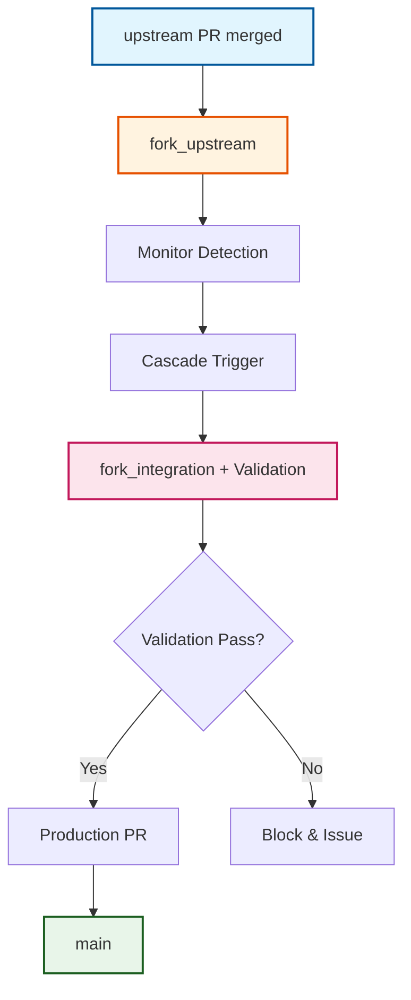

# Cascade Integration Workflow

:material-sitemap: **Automated propagation** | :material-shield-check: **Comprehensive validation** | :material-monitor: **Intelligent monitoring**

The cascade integration workflow automates the progressive propagation of upstream changes through the repository's three-branch hierarchy. This sophisticated system ensures proper validation and conflict resolution at each stage, implementing a human-centric pattern with automated safety nets for reliable integration management.

## Cascade Architecture

### :material-source-branch: Three-Branch Propagation Strategy

The cascade system implements the core three-branch strategy defined in our architecture:



**Progressive Validation Gates**:
- **fork_upstream → fork_integration**: Conflict detection and build validation
- **fork_integration → main**: Manual review and production readiness

### :material-monitor: Human-Centric Pattern with Monitor Safety Net

#### **Primary Path: Human-Controlled Triggers**
Teams manually trigger cascades after reviewing and merging sync PRs, providing explicit control over integration timing while maintaining complete traceability through GitHub issue tracking.

#### **Safety Net: Automated Monitoring**
The cascade monitor (`cascade-monitor.yml`) runs every 6 hours to detect missed triggers and auto-initiate cascades, ensuring no upstream changes are forgotten while preserving team control.

## Workflow Components

### :material-cog: Core Cascade Workflow (`cascade.yml`)

#### **Triggers and Configuration**
```yaml
on:
  workflow_dispatch:
    inputs:
      issue_number:
        description: 'GitHub issue number for the upstream sync (e.g., 123)'
        required: true
        type: 'string'

permissions:
  contents: write
  pull-requests: write
  issues: write

concurrency:
  group: cascade-${{ github.workflow }}-${{ github.ref }}
  cancel-in-progress: false  # Never cancel cascade operations
```

#### **Phase 1: Integration Branch Validation**

**Preparation and Conflict Detection**:
```bash
# Ensure fork_integration has latest from main
git checkout fork_integration
git merge origin/main --no-edit

# Create timestamped integration branch
INTEGRATION_BRANCH="integrate/upstream-$(date +%Y%m%d-%H%M%S)"
git checkout -b $INTEGRATION_BRANCH

# Attempt merge and detect conflicts
git merge origin/fork_upstream --no-edit
if git diff --check; then
  CONFLICTS_FOUND=false
else
  CONFLICTS_FOUND=true
  # Create conflict PR for manual resolution
fi
```

**Comprehensive Integration Validation**:
When no conflicts are detected, the workflow performs comprehensive validation directly on the `fork_integration` branch:

```yaml
# Project detection and validation
IS_JAVA_PROJECT=false
if [ -f "pom.xml" ] || [ -n "$(find . -name 'pom.xml' -type f 2>/dev/null)" ]; then
  IS_JAVA_PROJECT=true
fi

# Java-specific validation
if [ "$IS_JAVA_PROJECT" = "true" ]; then
  # Setup Maven settings if available
  if [ -f ".mvn/community-maven.settings.xml" ]; then
    mkdir -p ~/.m2
    cp .mvn/community-maven.settings.xml ~/.m2/settings.xml
  fi
  
  # Run comprehensive Maven build and test
  if mvn -B clean install 2>&1; then
    echo "✅ Maven build and tests passed"
    VALIDATION_SUCCESS=true
  else
    echo "❌ Maven build or tests failed"
    VALIDATION_SUCCESS=false
  fi
fi
```

**Validation Failure Handling**:
- Creates detailed validation failure issue with complete build logs
- Updates tracking issue to `cascade-blocked` status
- Blocks production PR creation until resolution
- Provides clear resolution guidance and links to workflow logs

#### **Phase 2: Production PR Creation**

Only executes when Phase 1 validation passes completely:

```yaml
# Create temporary release branch to preserve fork_integration
RELEASE_BRANCH="release/upstream-$(date +%Y%m%d-%H%M%S)"
git checkout fork_integration
git checkout -b $RELEASE_BRANCH
git push origin $RELEASE_BRANCH

# Create PR to main using temporary release branch
gh pr create \
  --base main \
  --head $RELEASE_BRANCH \
  --title "🚀 Production Release: Upstream Integration - $(date +%Y-%m-%d)" \
  --body "$PR_BODY" \
  --label "upstream-sync,human-required"
```

**Branch Preservation Strategy**: The `fork_integration` branch is never used directly for PRs to `main` to prevent accidental deletion. Temporary release branches preserve the core three-branch structure while enabling safe PR workflows.

### :material-monitor-dashboard: Cascade Monitor Workflow (`cascade-monitor.yml`)

#### **Intelligent Trigger Detection**

**Event-Driven Monitoring**:
```yaml
on:
  schedule:
    - cron: '0 */6 * * *'  # Health monitoring every 6 hours
  pull_request_target:    # Uses main branch workflow, solving missing YAML issues
    types: [closed]
    branches:
      - fork_upstream
  workflow_dispatch:      # Manual health checks
```

**Smart Trigger Logic**:
```yaml
# Detect upstream sync merges and trigger cascades
if: >
  github.event.pull_request.merged == true &&
  github.event.pull_request.base.ref == 'fork_upstream' &&
  (contains(github.event.pull_request.labels.*.name, 'upstream-sync') ||
   contains(github.event.pull_request.labels.*.name, 'sync'))
```

#### **Automatic Cascade Triggering**

When a sync PR is merged into `fork_upstream`, the monitor:

1. **Triggers Cascade Workflow**: Uses `gh workflow run "Cascade Integration"`
2. **Creates Tracking Comment**: Adds progress tracking to the merged PR
3. **Handles Failures**: Creates issues for failed triggers with clear manual recovery steps

```yaml
# Success path - add tracking comment
gh pr comment ${{ github.event.pull_request.number }} \
  --body "🔄 **Cascade Triggered**
  
  This PR merge has automatically triggered the cascade integration workflow.
  
  **Next Steps:**
  1. Monitor the cascade workflow for completion
  2. Review any integration conflicts if they arise  
  3. Validate the final integration before production merge"

# Failure path - create notification issue
gh issue create \
  --title "🚨 Failed to trigger cascade workflow" \
  --body "Manual Action Required: Go to Actions → Cascade Integration" \
  --label "cascade-trigger-failed,human-required,high-priority"
```

#### **Proactive Health Monitoring**

**Stale Conflict Detection**:
The monitor automatically escalates conflicts that exceed SLA timeouts:

```yaml
# Find conflict PRs older than 48 hours
stale_prs=$(gh pr list \
  --label "conflict,cascade-blocked" \
  --json number,createdAt,title,url \
  --jq '.[] | select((now - (.createdAt | fromdateiso8601)) > 172800)')

# Create escalation issues for each stale conflict
gh issue create \
  --title "🚨 ESCALATION: Cascade conflict unresolved for 48+ hours" \
  --body "URGENT: PR has unresolved conflicts blocking the cascade pipeline" \
  --label "escalation,high-priority,cascade-escalated,human-required"
```

**Comprehensive Health Reporting**:
- **Active Cascades**: Current in-progress operations
- **Blocked Cascades**: Conflicts or validation failures requiring attention  
- **Escalated Issues**: Items exceeding SLA requiring immediate action
- **Overall Status**: Health classification (HEALTHY/WARNING/CRITICAL)

## Advanced Conflict Management

### :material-alert-circle: Conflict Detection and Resolution

#### **Immediate Conflict Response**
When merge conflicts are detected, the cascade workflow automatically:

1. **Creates Conflict Pull Request**:
   - Contains conflicted files with merge markers
   - Targets `fork_integration` branch for safe resolution
   - Labeled with `conflict`, `upstream-sync`, `needs-resolution`, `cascade-blocked`

2. **Creates Detailed Tracking Issue**:
   - Comprehensive resolution instructions with step-by-step guidance
   - Links to the conflict PR for direct access
   - Complete process overview with progress checkboxes
   - Labeled with `conflict`, `human-required`, `high-priority`

#### **Developer Resolution Workflow**

**Step 1: Local Conflict Resolution**
```bash
# Clone the conflict branch locally
git checkout sync/upstream-YYYYMMDD-HHMMSS

# Review conflicted files
git status

# Resolve conflicts using IDE merge tools
# Choose between HEAD (your changes) and upstream (their changes)
# Remove conflict markers (<<<<<<<, =======, >>>>>>>)
```

**Step 2: Validation and Commit**
```bash
# Test your changes thoroughly
mvn test  # or your project's test command

# Commit the resolution
git add .
git commit -m "resolve: merge conflicts from upstream sync"
git push origin sync/upstream-YYYYMMDD-HHMMSS
```

**Step 3: Complete Integration**
1. Update the conflict PR with your resolution
2. Request review from team members
3. Once approved, merge the PR
4. Manually trigger the cascade workflow or wait for automatic trigger

### :material-clock-alert: SLA Management and Escalation

**48-Hour Conflict SLA**:
- All conflicts must be resolved within 48 hours
- Monitor automatically tracks conflict creation time
- Escalation issues created for overdue conflicts
- Clear escalation notifications added to stale PRs

**Escalation Process**:
1. **Detection**: Monitor identifies conflicts older than 48 hours
2. **Escalation Issue**: High-priority issue created with technical details
3. **PR Notification**: Escalation notice added to conflict PR
4. **Label Management**: `cascade-escalated` label added for visibility
5. **Team Assignment**: Automatic assignment to repository collaborators

## Automated Failure Recovery System

### :material-restore: Self-Healing Architecture

#### **Failure Detection and Response**
When cascade integration fails, the system automatically:

1. **Creates Technical Failure Issue**: Detailed technical information for investigation
2. **Updates Tracking Issue**: Adds `cascade-failed + human-required` labels
3. **Provides Recovery Instructions**: Clear steps for human intervention with specific guidance

```yaml
# Failure handling pattern
if cascade_fails:
  # Create detailed failure issue
  FAILURE_ISSUE_URL=$(gh issue create \
    --title "🚨 Cascade Pipeline Failure: $FAILURE_TYPE" \
    --body "$TECHNICAL_DETAILS_AND_LOGS" \
    --label "high-priority,human-required")
  
  # Update original tracking issue
  gh issue edit "$TRACKING_ISSUE" \
    --remove-label "cascade-active" \
    --add-label "cascade-failed,human-required"
```

#### **Automatic Recovery Detection**
The cascade monitor runs every 6 hours and intelligently detects when failures have been resolved:

```yaml
# Find issues marked as ready for retry
RECOVERY_ISSUES=$(gh issue list \
  --label "cascade-failed" \
  --state open \
  --jq '.[] | select(.labels | contains(["cascade-failed"]) and (contains(["human-required"]) | not))')

# Automatically retry cascade for each recovery-ready issue
echo "$RECOVERY_ISSUES" | jq -r '.number' | while read ISSUE_NUMBER; do
  # Update state: cascade-failed → cascade-active
  gh issue edit "$ISSUE_NUMBER" \
    --remove-label "cascade-failed" \
    --add-label "cascade-active"
  
  # Trigger automatic retry
  gh workflow run "Cascade Integration" -f issue_number="$ISSUE_NUMBER"
done
```

#### **Human Recovery Workflow**
1. **Failure Notification**: Developer receives issue notification about cascade failure
2. **Investigation**: Review technical failure issue for root cause analysis
3. **Fix Implementation**: Make necessary changes (update `fork_integration` branch, dependencies, etc.)
4. **Signal Resolution**: Remove `human-required` label from tracking issue
5. **Automatic Retry**: Monitor detects label removal and retries cascade within 6 hours
6. **Success/New Failure**: Either completes successfully or creates new failure issue for continued iteration

## Quality Assurance and Validation

### :material-check-circle: Comprehensive Validation Pipeline

#### **Integration Testing Strategy**
- **Unit Tests**: Run on all PRs (baseline validation)
- **Integration Tests**: Extended test suite for PRs targeting `fork_integration`
- **Smoke Tests**: Critical path validation for PRs targeting `main`

```yaml
# Enhanced testing based on target branch
- name: Run Integration Tests
  if: github.base_ref == 'fork_integration'
  run: |
    # Run extended integration test suite
    mvn verify -Pintegration-tests
```

#### **Early Issue Detection**
The validation-first approach catches issues before they reach production:

- **Build Failures**: Detected during integration validation phase
- **Test Failures**: Comprehensive test suite execution before production PR
- **Dependency Conflicts**: Identified during Maven build process
- **Breaking Changes**: Caught through automated testing and validation

### :material-security: Safety Features and Controls

#### **Branch Protection Strategy**
- **Concurrency Control**: Prevents multiple cascades from running simultaneously
- **Atomic Operations**: Either all cascade steps succeed or none are applied
- **Branch Preservation**: Core branches never used directly for PRs to prevent deletion
- **Force Push Prevention**: All protected branches prevent destructive operations

#### **Manual Review Requirements**
- **All Production PRs**: Require human approval before merging to `main`
- **Conflict Resolutions**: Manual review required for all conflict resolutions
- **Breaking Changes**: Automatic detection triggers additional review requirements

## Performance and Monitoring

### :material-chart-line: Key Performance Metrics

**Cascade Success Indicators**:
- **Success Rate**: Clean cascades vs. conflicts vs. validation failures
- **Integration Validation Success**: Percentage of upstream changes passing validation
- **Time to Production**: Duration from `fork_upstream` to `main`
- **Early Detection Rate**: Percentage of issues caught in integration vs. production

**SLA Compliance Tracking**:
- **Conflict Resolution Time**: Average time to resolve merge conflicts
- **Validation Failure Resolution**: Average time to resolve build/test issues
- **48-Hour SLA Compliance**: Percentage of conflicts resolved within SLA
- **Manual Review Time**: Average time from PR creation to human approval

### :material-bell: Intelligent Alerting System

**Health Status Classification**:
- **✅ HEALTHY**: Cascade pipeline operating normally with no blocked items
- **🟡 WARNING**: Pipeline has blocked PRs but within SLA timeframes
- **🔴 CRITICAL**: Pipeline has escalated issues requiring immediate attention

**Automated Escalation**:
- **Immediate**: Trigger failures and critical validation failures
- **24 Hours**: Unresolved validation failures
- **48 Hours**: Unresolved merge conflicts (SLA breach)
- **72 Hours**: Any stale cascade operations

---

*The cascade integration workflow provides a robust, self-healing system for managing upstream changes with comprehensive validation, intelligent monitoring, and automated recovery capabilities while maintaining team control and visibility throughout the process.*