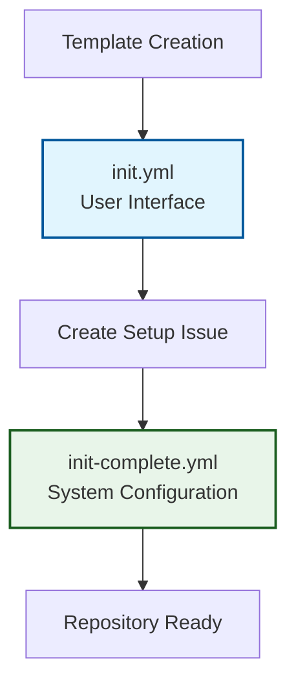
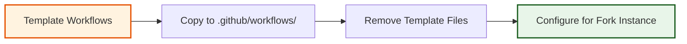

# Repository Initialization Workflow

The initialization workflow provides automated setup and configuration for new fork instances created from the OSDU SPI Fork Management template. This process implements a two-workflow pattern that separates user interaction from system configuration, ensuring a smooth setup experience while maintaining system reliability.

## Two-Workflow Initialization Pattern

### Design Philosophy

The initialization process is deliberately split into two focused workflows to provide optimal user experience and maintainability:



#### **Phase 1: User Interface** (`init.yml`)
- **Purpose**: Create user-friendly initialization experience
- **Scope**: Issue creation, progress communication, basic setup
- **Duration**: < 30 seconds
- **User Experience**: Immediate feedback and clear next steps

#### **Phase 2: System Configuration** (`init-complete.yml`)
- **Purpose**: Complete repository setup and configuration
- **Scope**: Workflow deployment, branch creation, security setup
- **Duration**: 2-5 minutes
- **Automation**: Comprehensive automated configuration

## Initialization Process Overview

### Template Detection and Setup

#### **Template Instance Detection**
The system automatically detects when a new repository is created from the template:

```yaml
# Trigger conditions
on:
  push:
    branches: [main]  # Repository creation detection
```

**Detection Logic**:
1. **Template Check**: Verify if this is the template repository itself
2. **Initialization Status**: Check if repository is already initialized
3. **First Run Detection**: Identify genuine template instantiation

#### **State Management**
The initialization process uses clear state indicators:

- **Uninitialized**: Fresh template instance requiring setup
- **In Progress**: Initialization workflow executing
- **Complete**: Repository fully configured and operational
- **Error**: Initialization failed requiring manual intervention

### Phase 1: User Interface Workflow

#### **Immediate User Feedback**
Upon template instantiation, users immediately receive:

```markdown
# 🚀 Fork Management Template Setup

Welcome to your new OSDU SPI Fork Management repository!

## What's Happening Now
- ✅ Repository created successfully
- 🔄 **Currently**: Setting up workflows and configuration
- ⏱️ **Estimated Time**: 2-5 minutes

## Next Steps
1. **Wait for Setup**: Automated configuration is running
2. **Review Configuration**: Check the setup results below
3. **Configure Secrets**: Add your upstream repository and API keys
4. **Start Syncing**: Begin upstream synchronization

## Setup Progress
- [ ] Deploy production workflows
- [ ] Create branch structure  
- [ ] Configure security settings
- [ ] Set up issue labels
- [ ] Enable automation

*This issue will be updated with progress and results.*
```

#### **Progress Communication**
The issue provides real-time updates throughout the initialization process:

- **Start Notification**: Immediate confirmation of setup initiation
- **Progress Updates**: Step-by-step completion status
- **Error Reporting**: Clear communication of any issues
- **Completion Summary**: Final configuration results and next steps

### Phase 2: System Configuration Workflow

#### **Comprehensive Repository Setup**

##### **Production Workflow Deployment**


**Workflow Deployment Process**:
1. **Copy Production Workflows**: Transfer `.github/template-workflows/` to `.github/workflows/`
2. **Remove Template Files**: Clean up template-specific workflows and configuration
3. **Configure Instance Settings**: Adapt workflows for specific fork instance
4. **Validate Deployment**: Ensure all workflows are properly configured

##### **Branch Structure Creation**
**Three-Branch Strategy Implementation**:

```bash
# Create and configure core branches
git checkout -b fork_upstream
git push origin fork_upstream

git checkout -b fork_integration  
git push origin fork_integration

# Configure branch protection rules
git checkout main
```

**Branch Configuration**:
- **`main`**: Production branch with maximum protection
- **`fork_upstream`**: Upstream tracking with automation-only access
- **`fork_integration`**: Conflict resolution workspace with flexible access

##### **Security Configuration**
**Automated Security Setup**:
- **Branch Protection Rules**: Required reviews, status checks, force push prevention
- **Secret Scanning**: Enable GitHub secret detection and alerting
- **Vulnerability Alerts**: Configure Dependabot security advisories
- **Access Controls**: Set appropriate repository permissions and restrictions

##### **Label and Issue Configuration**
**Repository Organization Setup**:
- **Issue Labels**: Deploy comprehensive label system for workflow tracking
- **Issue Templates**: Configure templates for common workflow scenarios
- **Project Management**: Set up basic project management structure
- **Automation Rules**: Configure automatic labeling and assignment rules

#### **Configuration Validation**

##### **Setup Verification**
The initialization process includes comprehensive validation:

```yaml
# Validation steps
- name: Verify Branch Structure
  run: |
    git branch -r | grep -E "(main|fork_upstream|fork_integration)"
    
- name: Verify Workflow Deployment
  run: |
    ls -la .github/workflows/
    
- name: Verify Security Configuration  
  run: |
    gh api repos/${{ github.repository }}/branches/main/protection
```

##### **Readiness Assessment**
**Completion Criteria**:
- :material-check-circle: All production workflows deployed and functional
- :material-check-circle: Three-branch strategy implemented and protected
- :material-check-circle: Security configuration applied and verified
- :material-check-circle: Labels and issue templates configured
- :material-check-circle: Repository ready for upstream configuration

## Post-Initialization Configuration

### Required User Actions

#### **Upstream Repository Configuration**
Users must configure their specific upstream repository:

```yaml
# Required GitHub Secrets
UPSTREAM_REPO_URL: "https://github.com/your-org/osdu-upstream-repo"
GH_TOKEN: "ghp_xxxxxxxxxxxxxxxxxxxx"  # With repo, workflow, admin:repo_hook scopes
```

#### **Optional AI Enhancement**
For AI-powered capabilities, configure one AI provider:

```yaml
# AI Provider Options (choose one)
ANTHROPIC_API_KEY: "sk-ant-xxxxxxxxxxxxxxxx"    # Recommended
AZURE_API_KEY: "xxxxxxxxxxxxxxxx"               # Enterprise option
OPENAI_API_KEY: "sk-xxxxxxxxxxxxxxxx"           # Fallback option
```

### First Sync Preparation

#### **Manual First Sync**
After configuration, users can initiate their first upstream synchronization:

1. **Verify Configuration**: Ensure all required secrets are configured
2. **Manual Trigger**: Execute the sync workflow manually for first run
3. **Monitor Progress**: Watch the first synchronization through GitHub Issues
4. **Validate Results**: Confirm successful upstream integration

#### **Ongoing Automation**
Once initialized and configured:
- **Daily Sync**: Automatic upstream synchronization at midnight UTC
- **Conflict Management**: Automated detection and resolution guidance
- **Release Coordination**: Semantic versioning aligned with upstream
- **Template Updates**: Automatic propagation of template improvements

## Troubleshooting and Recovery

### Common Initialization Issues

#### **Workflow Deployment Failures**
**Symptoms**: Missing or incomplete workflow files
**Resolution**: 
1. Check repository permissions and GitHub Actions enablement
2. Manually trigger `init-complete.yml` workflow
3. Verify no conflicting branch protection rules

#### **Branch Creation Issues**
**Symptoms**: Missing `fork_upstream` or `fork_integration` branches
**Resolution**:
1. Manually create missing branches from `main`
2. Configure appropriate branch protection rules
3. Validate branch structure matches three-branch strategy

#### **Security Configuration Failures**
**Symptoms**: Missing branch protection or security features
**Resolution**:
1. Verify repository admin permissions
2. Check GitHub Enterprise settings and restrictions
3. Apply security configuration manually if needed

### Recovery Procedures

#### **Re-initialization Process**
If initialization fails or is incomplete:

1. **Delete Initialization Issue**: Remove incomplete initialization tracking
2. **Reset Repository State**: Ensure clean starting state
3. **Trigger Re-initialization**: Push new commit to `main` to restart process
4. **Monitor Progress**: Watch new initialization issue for completion

#### **Manual Configuration Backup**
For organizations requiring manual setup:
1. **Follow Initialization Steps**: Execute each step from workflow manually
2. **Validate Configuration**: Ensure all components are properly configured
3. **Test Functionality**: Execute basic workflow operations to verify setup
4. **Document Customizations**: Record any organization-specific modifications

---

*The initialization workflow provides a robust foundation for OSDU SPI fork management, ensuring consistent setup across all repository instances while maintaining flexibility for organizational requirements.*