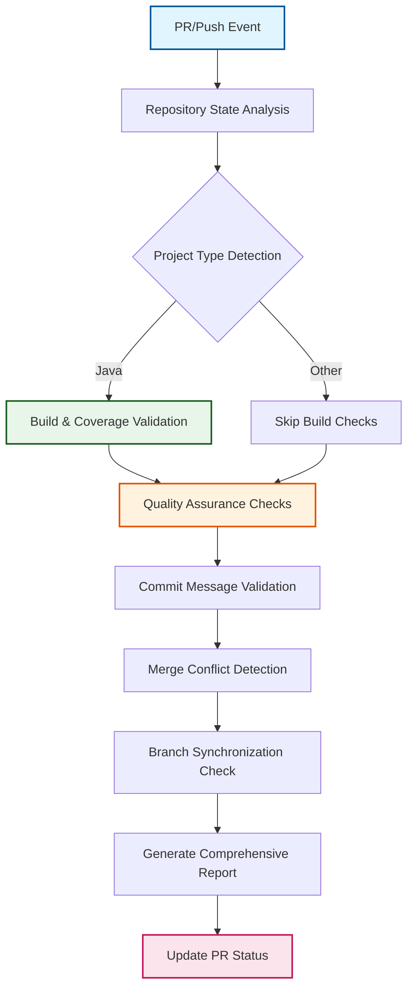
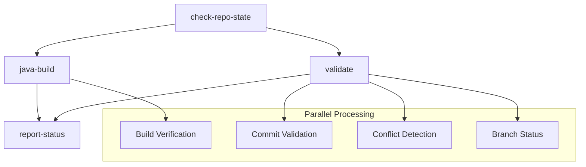

# Pull Request Validation Workflow

:material-shield-check-outline: **Quality gates** | :material-format-text: **Conventional commits** | :material-merge: **Conflict detection** | :material-chart-line: **Build verification**

The pull request validation workflow provides comprehensive quality assurance for all changes entering protected branches. This intelligent system enforces code standards, verifies build integrity, and ensures consistency across the OSDU SPI fork management lifecycle.

## Validation Philosophy

### :material-gate: Comprehensive Quality Gates
Every pull request undergoes systematic validation to ensure code quality, consistency, and readiness before integration into protected branches.

### :material-brain: Intelligent Rule Application
Validation rules adapt based on context - different standards apply to upstream sync PRs, fork management branches, and standard development contributions.

### :material-feedback: Clear Developer Feedback
Detailed status reporting provides actionable feedback, helping developers understand and resolve issues quickly.

## Validation Architecture

### :material-workflow: Multi-Phase Validation Pipeline



### :material-parallel: Parallel Execution Strategy



## Workflow Configuration

### :material-trigger: Event Triggers and Scope
```yaml
on:
  pull_request:
    branches: [main, fork_integration, fork_upstream]  # All protected branches
  push:
    branches: [main, fork_integration, fork_upstream]  # Direct push validation
  workflow_dispatch:
    inputs:
      post_init:
        description: 'Post-initialization validation trigger'
        type: boolean
        default: false

permissions:
  contents: read        # Repository access
  pull-requests: write  # PR status updates
  statuses: write       # Commit status checks
  actions: read         # Workflow context
```

### :material-security: Concurrency Management
```yaml
concurrency:
  group: validate-${{ github.event.pull_request.number || github.ref }}
  cancel-in-progress: true  # Optimize resource usage
```

## Phase 1: Repository State Analysis

### :material-magnify: Intelligent Project Detection

#### **Initialization Status Verification**
```yaml
- name: Verify repository initialization
  run: |
    if [ -f ".github/workflow.env" ]; then
      source .github/workflow.env
      echo "initialized=true" >> $GITHUB_OUTPUT
      echo "Repository fully initialized with upstream: ${UPSTREAM_REPO_URL:-'not configured'}"
    else
      echo "initialized=false" >> $GITHUB_OUTPUT
      echo "::warning::Repository not fully initialized - some validations may be skipped"
    fi
```

#### **Project Type and Build Requirements**
```yaml
- name: Detect project type and build requirements
  run: |
    # Java project detection (Maven/Gradle)
    if [ -f "pom.xml" ]; then
      echo "project_type=java-maven" >> $GITHUB_OUTPUT
      echo "build_required=true" >> $GITHUB_OUTPUT
      echo "📋 Detected Java Maven project"
    elif [ -f "build.gradle" ] || [ -f "build.gradle.kts" ]; then
      echo "project_type=java-gradle" >> $GITHUB_OUTPUT  
      echo "build_required=true" >> $GITHUB_OUTPUT
      echo "📋 Detected Java Gradle project"
    else
      echo "project_type=generic" >> $GITHUB_OUTPUT
      echo "build_required=false" >> $GITHUB_OUTPUT
      echo "📋 Generic project - build validation skipped"
    fi
```

#### **Context-Aware Metadata**
```yaml
outputs:
  initialized: ${{ steps.check.outputs.initialized }}
  project_type: ${{ steps.detect.outputs.project_type }}
  build_required: ${{ steps.detect.outputs.build_required }}
  pr_context: ${{ steps.context.outputs.pr_context }}
```

## Phase 2: Build Verification

### :material-coffee: Java Build Validation

#### **Conditional Build Execution**
```yaml
# Only run for Java projects in initialized repositories
if: |
  needs.check-repo-state.outputs.project_type != 'generic' &&
  needs.check-repo-state.outputs.initialized == 'true'
```

#### **Comprehensive Build Process**
```yaml
- name: Setup Java Environment
  uses: actions/setup-java@v4
  with:
    java-version: '17'
    distribution: 'temurin'
    cache: 'maven'

- name: Configure Maven Settings
  run: |
    # Use community Maven settings if available
    if [ -f ".mvn/community-maven.settings.xml" ]; then
      mkdir -p ~/.m2
      cp .mvn/community-maven.settings.xml ~/.m2/settings.xml
      echo "📋 Using community Maven settings"
    fi

- name: Execute Build and Tests
  run: |
    echo "🔨 Building project with comprehensive validation..."
    mvn clean verify -B -DskipTests=false -DfailIfNoTests=false
    
    # Capture build success
    echo "build_success=true" >> $GITHUB_OUTPUT
```

#### **Test Coverage Analysis for PRs**
```yaml
- name: Generate Test Coverage Report
  if: github.event_name == 'pull_request'
  run: |
    # Generate JaCoCo coverage report
    mvn jacoco:report -q
    
    # Extract coverage percentage
    if [ -f "target/site/jacoco/index.html" ]; then
      COVERAGE=$(grep -o '<counter type="INSTRUCTION".*' target/site/jacoco/index.html | \
                 grep -o 'missed="[0-9]*" covered="[0-9]*"' | \
                 awk -F'"' '{missed+=$2; covered+=$4} END {
                   if(missed+covered > 0) print int(covered/(missed+covered)*100)
                   else print 0
                 }')
      echo "test_coverage=$COVERAGE" >> $GITHUB_OUTPUT
      echo "📊 Test coverage: $COVERAGE%"
    else
      echo "test_coverage=0" >> $GITHUB_OUTPUT
      echo "⚠️ No coverage report generated"
    fi
```

#### **Build Artifact Validation**
```yaml
- name: Validate Build Artifacts
  run: |
    # Verify JAR files were created
    if [ -d "target" ]; then
      JARS=$(find target -name "*.jar" -type f | wc -l)
      echo "artifacts_created=$JARS" >> $GITHUB_OUTPUT
      echo "📦 Created $JARS JAR artifacts"
    fi
    
    # Check for common build issues
    if grep -r "BUILD FAILURE" target/ 2>/dev/null; then
      echo "::error::Build failures detected in artifacts"
      exit 1
    fi
```

## Phase 3: Quality Assurance Checks

### :material-format-text: Intelligent Commit Message Validation

#### **Context-Sensitive Application**
```yaml
# Apply conventional commit validation selectively
if: |
  github.event_name == 'pull_request' &&
  github.event.pull_request.base.ref == 'main' &&
  !contains(github.actor, 'dependabot') &&
  !contains(github.event.pull_request.head.ref, 'fork_') &&
  !startsWith(github.event.pull_request.title, 'chore(sync)')
```

#### **Conventional Commits Enforcement**
```yaml
- name: Validate Conventional Commit Format
  uses: wagoid/commitlint-github-action@v5
  with:
    configFile: .commitlintrc.json
    firstParent: false
    failOnWarnings: false
```

#### **Supported Commit Types Configuration**
```json
{
  "extends": ["@commitlint/config-conventional"],
  "rules": {
    "type-enum": [2, "always", [
      "feat",      "fix",       "docs",      "style",
      "refactor",  "test",      "chore",     "perf", 
      "ci",        "upstream"
    ]],
    "subject-case": [2, "never", ["pascal-case", "upper-case"]],
    "subject-full-stop": [2, "never", "."],
    "header-max-length": [2, "always", 100]
  }
}
```

### :material-merge: Advanced Conflict Detection

#### **Comprehensive Conflict Scanning**
```yaml
- name: Scan for merge conflicts across file types
  run: |
    echo "🔍 Scanning for merge conflict markers..."
    
    # Define file types to scan
    FILE_PATTERNS=(
      "*.java" "*.xml" "*.yml" "*.yaml" "*.json" 
      "*.md" "*.properties" "*.gradle" "*.kt"
    )
    
    # Build find command with all patterns
    FIND_CMD="find . -type f \\( "
    for i in "${!FILE_PATTERNS[@]}"; do
      if [ $i -gt 0 ]; then
        FIND_CMD="$FIND_CMD -o "
      fi
      FIND_CMD="$FIND_CMD -name '${FILE_PATTERNS[$i]}'"
    done
    FIND_CMD="$FIND_CMD \\)"
    
    # Execute scan
    CONFLICTS=$(eval $FIND_CMD | xargs grep -l "^<<<<<<< \\|^======= \\|^>>>>>>> " 2>/dev/null || true)
    
    if [ -n "$CONFLICTS" ]; then
      echo "conflicts_found=true" >> $GITHUB_OUTPUT
      echo "::error::Merge conflicts detected in:"
      echo "$CONFLICTS" | while read file; do
        echo "::error::  📄 $file"
        # Show conflict context
        grep -n "^<<<<<<< \\|^======= \\|^>>>>>>> " "$file" | head -3
      done
    else
      echo "conflicts_found=false" >> $GITHUB_OUTPUT
      echo "✅ No merge conflicts detected"
    fi
```

### :material-source-branch: Branch Synchronization Analysis

#### **Up-to-Date Status Verification**
```yaml
- name: Analyze branch synchronization status
  if: github.event_name == 'pull_request'
  run: |
    BASE_REF="${{ github.event.pull_request.base.ref }}"
    
    # Fetch latest base branch
    git fetch origin $BASE_REF --depth=50
    
    # Calculate divergence
    BEHIND=$(git rev-list --count HEAD..origin/$BASE_REF)
    AHEAD=$(git rev-list --count origin/$BASE_REF..HEAD)
    
    echo "behind_by=$BEHIND" >> $GITHUB_OUTPUT
    echo "ahead_by=$AHEAD" >> $GITHUB_OUTPUT
    
    if [ "$BEHIND" -gt 0 ]; then
      echo "branch_outdated=true" >> $GITHUB_OUTPUT
      echo "🔄 Branch is $BEHIND commits behind $BASE_REF"
      echo "::warning::Consider updating your branch with latest changes"
    else
      echo "branch_outdated=false" >> $GITHUB_OUTPUT
      echo "✅ Branch is up to date with $BASE_REF"
    fi
    
    echo "📊 Branch status: $AHEAD ahead, $BEHIND behind"
```

### :material-file-check: File Change Analysis

#### **Impact Assessment**
```yaml
- name: Analyze file changes and impact
  if: github.event_name == 'pull_request'
  run: |
    # Get changed files
    CHANGED_FILES=$(gh pr view ${{ github.event.pull_request.number }} --json files --jq '.files[].path')
    TOTAL_FILES=$(echo "$CHANGED_FILES" | wc -l)
    
    # Categorize changes
    CONFIG_CHANGES=$(echo "$CHANGED_FILES" | grep -c "\.yml\|\.yaml\|\.json\|\.properties" || echo 0)
    CODE_CHANGES=$(echo "$CHANGED_FILES" | grep -c "\.java\|\.kt\|\.scala" || echo 0)
    DOC_CHANGES=$(echo "$CHANGED_FILES" | grep -c "\.md\|\.txt\|\.adoc" || echo 0)
    
    echo "total_files=$TOTAL_FILES" >> $GITHUB_OUTPUT
    echo "config_changes=$CONFIG_CHANGES" >> $GITHUB_OUTPUT
    echo "code_changes=$CODE_CHANGES" >> $GITHUB_OUTPUT
    echo "doc_changes=$DOC_CHANGES" >> $GITHUB_OUTPUT
    
    echo "📋 Change summary: $TOTAL_FILES files ($CODE_CHANGES code, $CONFIG_CHANGES config, $DOC_CHANGES docs)"
```

## Phase 4: Comprehensive Status Reporting

### :material-chart-box: Intelligent Status Report Generation

#### **Dynamic Report Creation**
```yaml
- name: Generate comprehensive validation report
  uses: actions/github-script@v7
  with:
    script: |
      // Collect all validation results
      const status = {
        initialized: '${{ needs.check-repo-state.outputs.initialized }}',
        projectType: '${{ needs.check-repo-state.outputs.project_type }}',
        buildStatus: '${{ needs.java-build.result }}',
        buildSuccess: '${{ needs.java-build.outputs.build_success }}',
        testCoverage: '${{ needs.java-build.outputs.test_coverage }}',
        validationStatus: '${{ needs.validate.result }}',
        conflicts: '${{ needs.validate.outputs.conflicts_found }}',
        branchOutdated: '${{ needs.validate.outputs.branch_outdated }}',
        behindBy: '${{ needs.validate.outputs.behind_by }}',
        totalFiles: '${{ needs.validate.outputs.total_files }}',
        codeChanges: '${{ needs.validate.outputs.code_changes }}'
      };
      
      let report = '## 📋 Validation Report\n\n';
      
      // Repository Status Section
      report += '### 🏗️ Repository Status\n';
      if (status.initialized === 'true') {
        report += '✅ **Status**: Fully initialized and ready\n';
        report += `🔧 **Project Type**: ${status.projectType}\n`;
      } else {
        report += '⚠️ **Status**: Not fully initialized - limited validation\n';
      }
      
      // Build Status Section  
      report += '\n### 🔨 Build Validation\n';
      if (status.buildStatus === 'success') {
        report += '✅ **Build**: Successful\n';
        if (status.testCoverage && status.testCoverage !== '0') {
          const coverage = parseInt(status.testCoverage);
          const coverageIcon = coverage >= 80 ? '🟢' : coverage >= 60 ? '🟡' : '🔴';
          report += `${coverageIcon} **Test Coverage**: ${coverage}%\n`;
        }
      } else if (status.buildStatus === 'skipped') {
        report += '⏭️ **Build**: Not applicable for this project type\n';
      } else {
        report += '❌ **Build**: Failed - check build logs for details\n';
      }
      
      // Quality Checks Section
      report += '\n### 🛡️ Quality Checks\n';
      
      // Conflicts
      if (status.conflicts === 'true') {
        report += '❌ **Merge Conflicts**: Detected - manual resolution required\n';
      } else {
        report += '✅ **Merge Conflicts**: None detected\n';
      }
      
      // Branch Status
      if (status.branchOutdated === 'true') {
        report += `⚠️ **Branch Status**: ${status.behindBy} commits behind - update recommended\n`;
      } else {
        report += '✅ **Branch Status**: Up to date\n';
      }
      
      // Change Impact
      if (status.totalFiles) {
        report += `📊 **Change Impact**: ${status.totalFiles} files modified`;
        if (status.codeChanges && status.codeChanges !== '0') {
          report += ` (${status.codeChanges} code files)`;
        }
        report += '\n';
      }
      
      // Overall Assessment
      report += '\n### 🎯 Overall Assessment\n';
      const hasIssues = status.conflicts === 'true' || 
                       status.buildStatus === 'failure' ||
                       status.branchOutdated === 'true';
      
      if (!hasIssues) {
        report += '🟢 **Ready for Review**: All validation checks passed\n';
        report += '✨ This PR meets all quality standards and is ready for team review.\n';
      } else {
        report += '🔴 **Action Required**: Please address the issues above\n';
        report += '🔧 Review the validation failures and update your PR accordingly.\n';
      }
      
      // Add helpful links
      report += '\n---\n';
      report += '*💡 Need help? Check the [validation documentation](../docs/workflows/validation.md) or ask in the team chat.*\n';
      
      return report;
```

### :material-comment-processing: Dynamic PR Status Updates

#### **Smart Comment Management**
```yaml
- name: Update PR with validation status
  if: github.event_name == 'pull_request'
  uses: actions/github-script@v7
  with:
    script: |
      const report = ${{ steps.generate-report.outputs.result }};
      
      // Find existing validation comment
      const comments = await github.rest.issues.listComments({
        owner: context.repo.owner,
        repo: context.repo.repo,
        issue_number: context.issue.number
      });
      
      const validationComment = comments.data.find(comment => 
        comment.user.type === 'Bot' && 
        comment.body.includes('📋 Validation Report')
      );
      
      if (validationComment) {
        // Update existing comment
        await github.rest.issues.updateComment({
          owner: context.repo.owner,
          repo: context.repo.repo,
          comment_id: validationComment.id,
          body: report
        });
        console.log('Updated existing validation comment');
      } else {
        // Create new comment
        await github.rest.issues.createComment({
          owner: context.repo.owner,
          repo: context.repo.repo,
          issue_number: context.issue.number,
          body: report
        });
        console.log('Created new validation comment');
      }
```

## Special Context Handling

### :material-robot: Dependabot Integration

#### **Automated Dependency Update Support**
```yaml
- name: Handle Dependabot PRs with relaxed validation
  if: contains(github.actor, 'dependabot')
  run: |
    echo "🤖 Dependabot PR detected - applying relaxed validation rules"
    echo "dependabot=true" >> $GITHUB_OUTPUT
    
    # Skip certain validations for dependency updates
    echo "skip_commit_validation=true" >> $GITHUB_OUTPUT
    echo "auto_merge_eligible=true" >> $GITHUB_OUTPUT
```

**Dependabot Exemptions**:
- :material-skip-next: Commit message validation bypassed
- :material-check-circle: Auto-merge eligible for patch/minor updates  
- :material-chart-bar: Simplified status reporting focused on build success

### :material-source-branch: Fork Branch Handling

#### **Upstream Sync PR Validation**
```yaml
- name: Apply upstream sync validation rules
  if: |
    contains(github.event.pull_request.head.ref, 'fork_') ||
    startsWith(github.event.pull_request.title, 'chore(sync)')
  run: |
    echo "🔄 Fork management branch detected"
    echo "fork_branch=true" >> $GITHUB_OUTPUT
    
    # Apply specialized validation for upstream sync
    echo "skip_conventional_commits=true" >> $GITHUB_OUTPUT
    echo "focus_conflict_detection=true" >> $GITHUB_OUTPUT
```

### :material-initialization: Post-Initialization Validation

#### **Repository Setup Verification**
```yaml
- name: Post-initialization comprehensive validation
  if: inputs.post_init == true
  run: |
    echo "🎯 Running post-initialization validation suite"
    
    # Comprehensive repository state verification
    # - All branches created correctly
    # - Workflow files deployed properly  
    # - Security settings configured
    # - Build system functional
```

## Performance and Optimization

### :material-lightning-bolt: Efficient Resource Management

#### **Intelligent Caching Strategy**
```yaml
- name: Optimize validation performance with caching
  uses: actions/cache@v4
  with:
    path: |
      ~/.m2/repository
      ~/.gradle/caches
      target/
      build/
    key: validation-${{ runner.os }}-${{ hashFiles('**/*.xml', '**/*.gradle*', '**/pom.xml') }}
    restore-keys: |
      validation-${{ runner.os }}-
      validation-
```

#### **Parallel Execution Benefits**
- :material-timer: **Reduced Validation Time**: Build and quality checks run simultaneously
- :material-memory: **Optimized Resource Usage**: Efficient job scheduling and caching
- :material-check-all: **Early Failure Detection**: Quick feedback on critical issues

### :material-tune: Conditional Processing

#### **Smart Execution Logic**
```yaml
# Skip expensive operations when not needed
- name: Conditional expensive validation
  if: |
    needs.check-repo-state.outputs.build_required == 'true' &&
    github.event_name == 'pull_request' &&
    needs.validate.outputs.code_changes > 0
  run: |
    # Only run expensive validations for code changes in PRs
```

## Error Handling and Recovery

### :material-alert: Graceful Degradation

#### **Non-Critical Failure Management**
```yaml
- name: Optional validation with graceful failure
  continue-on-error: true
  run: |
    # Validation that shouldn't block PR if it fails
    echo "🔍 Running optional advanced checks..."
    
    # If this fails, validation continues with warning
```

#### **Clear Error Communication**
```yaml
- name: Provide actionable error guidance
  if: failure()
  run: |
    echo "::error title=Validation Failed::Review the validation report for specific issues"
    echo "::error::Common solutions:"
    echo "::error::  - Fix merge conflicts manually"
    echo "::error::  - Update branch with latest changes"
    echo "::error::  - Ensure conventional commit format"
    echo "::error::  - Resolve build failures"
    
    # Link to documentation
    echo "::notice::See validation docs: https://docs/workflows/validation.md"
```

## Integration and Extensibility

### :material-link: Workflow Integration Points

#### **Build Workflow Coordination**
- **Shared Configuration**: Consistent Java environment and dependency management
- **Artifact Compatibility**: Build outputs usable across workflow systems
- **Performance Optimization**: Shared caching and parallel execution strategies

#### **Release Workflow Support**
- **Conventional Commits**: Ensures proper semantic versioning through validation
- **Quality Gates**: Clean validation required before release creation
- **Change Documentation**: Validation results feed into release notes

#### **Sync Workflow Assistance**
- **Conflict Detection**: Early identification of merge conflicts in upstream sync
- **Branch Status**: Verification of proper branch synchronization
- **Special Rules**: Customized validation for fork management operations

### :material-cog: Customization Framework

#### **Configurable Validation Rules**
```yaml
# Environment-based configuration
env:
  JAVA_VERSION: '17'                    # Java environment version
  VALIDATION_TIMEOUT: '15'              # Maximum validation time (minutes)
  COVERAGE_THRESHOLD: '70'              # Minimum test coverage percentage
  CONVENTIONAL_COMMITS: 'strict'        # Commit validation level
  CONFLICT_DETECTION: 'comprehensive'   # Conflict scanning depth
```

#### **Extensible Validation Framework**
```yaml
# Custom validation hooks
- name: Custom Organization Validation
  if: env.CUSTOM_VALIDATION == 'enabled'
  uses: ./.github/actions/custom-validate
  with:
    validation-config: .github/validation.yml
    severity-level: ${{ env.VALIDATION_SEVERITY }}
```

---

*The pull request validation workflow provides comprehensive quality assurance with intelligent rule application, ensuring code integrity while maintaining developer productivity through clear feedback and efficient execution.*