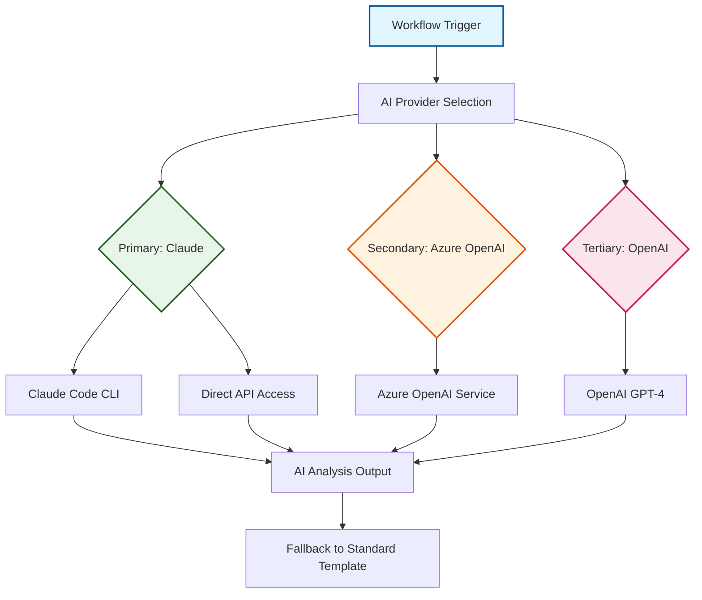
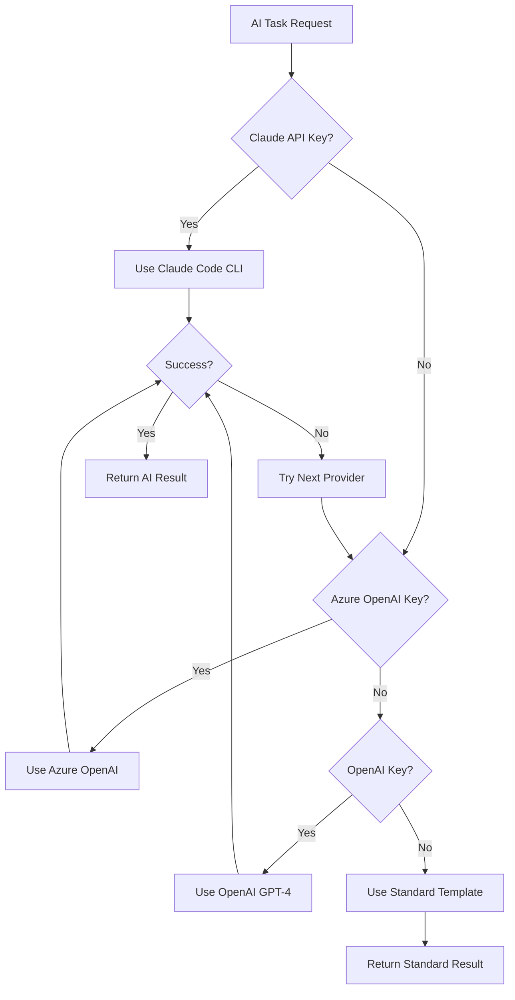

# AI Integration Architecture

The OSDU SPI Fork Management system incorporates sophisticated AI capabilities to enhance development workflows while maintaining reliability and cost-effectiveness. This integration provides intelligent analysis, automated documentation generation, and enhanced decision-making support throughout the fork management lifecycle.

## AI Integration Philosophy

### :material-robot-outline: Enhancement, Not Dependency
AI capabilities enhance existing workflows without creating dependencies. All core functionality operates normally when AI services are unavailable, ensuring system reliability.

### :material-swap-horizontal: Multi-Provider Architecture
Support for multiple AI providers prevents vendor lock-in and enables intelligent provider selection based on availability, cost, and capability requirements.

### :material-shield-star: Secure by Design
API keys and sensitive data are handled through secure GitHub secrets management with proper access controls and audit trails.

### :material-cash-multiple: Cost-Conscious Usage
Intelligent usage patterns, caching, and fallback strategies control API costs while maximizing value from AI capabilities.

## AI Provider Architecture



### Provider Hierarchy

#### :material-brain: **Primary: Claude (Anthropic)**
**Integration**: Claude Code CLI with MCP server support

- **Strengths**: Excellent code analysis, comprehensive reasoning, large context windows
- **Usage**: Primary choice for complex analysis and generation tasks
- **Configuration**: Full MCP integration with specialized development tools
- **Fallback**: Direct API access when CLI unavailable

#### :material-microsoft-azure: **Secondary: Azure OpenAI**  
**Integration**: Azure OpenAI Service with enterprise features

- **Strengths**: Enterprise integration, Microsoft ecosystem alignment, compliance features
- **Usage**: Enterprise environments requiring Microsoft technology alignment
- **Configuration**: Azure API endpoints with managed identity support
- **Benefits**: Cost control, data residency, enterprise SLA support

#### :material-openai: **Tertiary: OpenAI**
**Integration**: Direct OpenAI API access

- **Strengths**: Broad model availability, established performance baselines
- **Usage**: Fallback option ensuring comprehensive provider coverage
- **Configuration**: Standard API key authentication
- **Models**: GPT-4 and GPT-4 Turbo for analysis tasks

## AI-Enhanced Capabilities

### :material-text-box-search: Intelligent Change Analysis

#### **Upstream Change Assessment**
AI analyzes upstream changes to provide structured impact assessment:

- **Change Categorization**: Automatic classification of changes (feat, fix, breaking, etc.)
- **Impact Analysis**: Assessment of potential effects on Azure SPI implementations
- **Risk Evaluation**: Identification of high-risk changes requiring careful review
- **Migration Guidance**: Suggestions for adapting to upstream interface changes

#### **Conflict Analysis**
When merge conflicts occur, AI provides intelligent guidance:

- **Conflict Categorization**: Classification by type (structural, functional, merge artifacts)
- **Resolution Strategy**: Recommendations for conflict resolution approaches
- **Impact Assessment**: Analysis of resolution choices on system functionality
- **Testing Guidance**: Suggestions for validating conflict resolutions

### :material-file-document-edit: Automated Documentation Generation

#### **Pull Request Enhancement**
AI generates comprehensive PR descriptions:

```markdown
# Example AI-Generated PR Description

## Summary
This sync integrates 12 commits from upstream with primarily dependency updates and security fixes.

## Key Changes
- **Security**: Updated Jackson dependency to resolve CVE-2023-35116
- **Enhancement**: Improved error handling in data processing pipeline
- **Dependencies**: Updated Spring Boot to 3.1.5

## Impact Assessment
- **Breaking Changes**: None detected
- **Local Modifications**: No conflicts with Azure SPI implementations
- **Testing**: All upstream tests passing

## Recommended Actions
1. Review dependency updates for compatibility
2. Validate Azure SPI integrations remain functional
3. Execute full test suite before merge
```

#### **Commit Message Generation**
AI creates conventional commit messages that integrate with semantic versioning:

- **Format Compliance**: Adherence to conventional commit standards
- **Scope Detection**: Automatic identification of change scope and impact
- **Breaking Change Identification**: Detection and proper marking of breaking changes
- **Release Note Integration**: Messages designed for automated changelog generation

### :material-security: AI-Enhanced Security Analysis

#### **Vulnerability Triage**
AI analyzes security scan results to provide actionable insights:

- **Severity Assessment**: Contextual analysis of vulnerability impact
- **Exploitability Analysis**: Assessment of actual risk in deployment context
- **Remediation Guidance**: Specific recommendations for vulnerability resolution
- **Priority Ranking**: Intelligent prioritization based on actual risk

#### **Secret Detection Enhancement**
AI improves secret detection accuracy:

- **Pattern Recognition**: Advanced detection of credential patterns
- **False Positive Reduction**: Intelligent filtering of non-sensitive matches
- **Context Analysis**: Understanding of secret usage context
- **Remediation Guidance**: Specific steps for secret rotation and cleanup

## Technical Implementation

### :material-console: Claude Code CLI Integration

#### **Installation and Configuration**
Automated setup in GitHub Actions workflows:

```yaml
# Claude Code CLI Installation
- name: Install Claude Code CLI
  run: npm install -g @anthropic-ai/claude-code

# MCP Configuration for Maven Projects  
- name: Configure MCP Servers
  run: |
    cat > .mcp.json << 'EOF'
    {
      "mcpServers": {
        "mvn-mcp-server": {
          "type": "stdio",
          "command": "uvx",
          "args": ["--from", "git+https://github.com/danielscholl-osdu/mvn-mcp-server@main", "mvn-mcp-server"]
        }
      }
    }
    EOF
```

#### **Model Context Protocol (MCP) Integration**
Specialized tool integration for enhanced AI capabilities:

- **Maven MCP Server**: Dependency analysis and management recommendations
- **Git Integration**: Repository history and change pattern analysis
- **Security Scanning**: Vulnerability database integration and analysis
- **Documentation Tools**: Automated documentation generation and validation

### :material-api: Multi-Provider Fallback Strategy

#### **Provider Selection Logic**


#### **Graceful Degradation**
System behavior when AI services are unavailable:

- **Standard Templates**: Pre-defined templates for PR descriptions and commit messages
- **Basic Analysis**: Rule-based conflict detection and categorization
- **Manual Workflows**: Clear guidance for manual completion of AI-enhanced tasks
- **Error Reporting**: Informative messages about AI service availability

### :material-cache: Performance Optimization

#### **Caching Strategy**
- **Response Caching**: Cache AI responses for similar change patterns
- **Model Selection**: Optimize model choice based on task complexity
- **Batch Processing**: Group related analysis tasks for efficiency
- **Rate Limiting**: Respect API rate limits with intelligent backoff

#### **Cost Management**
- **Usage Monitoring**: Track AI API usage and costs across workflows
- **Intelligent Routing**: Route tasks to most cost-effective capable provider
- **Context Optimization**: Minimize token usage while maintaining quality
- **Budget Controls**: Configurable limits and alerts for cost management

## Security and Compliance

### :material-key: API Key Management

#### **Secure Storage**
- **GitHub Secrets**: Encrypted storage of all AI provider API keys
- **Environment Isolation**: Separate keys for different environments
- **Access Controls**: Limited access to AI capabilities based on repository permissions
- **Audit Logging**: Complete audit trail of AI service usage

#### **Data Handling**
- **Minimal Data Exposure**: Only necessary code changes sent to AI services
- **No Persistent Storage**: AI providers don't retain workflow data
- **Regional Compliance**: Support for data residency requirements through Azure OpenAI
- **Encryption**: All API communications use TLS encryption

### :material-check-circle: Quality Assurance

#### **Output Validation**
- **Format Verification**: Ensure AI outputs meet expected formats
- **Content Filtering**: Validate appropriate content in AI-generated text
- **Consistency Checks**: Verify consistency across related AI outputs
- **Human Review**: Require human approval for critical AI-generated content

#### **Reliability Measures**
- **Timeout Handling**: Appropriate timeouts for AI service calls
- **Error Recovery**: Robust error handling with informative messages
- **Service Monitoring**: Track AI service availability and performance
- **Fallback Testing**: Regular validation of fallback mechanisms

---

*This AI integration architecture enhances the fork management system with intelligent capabilities while maintaining reliability, security, and cost-effectiveness through thoughtful design and implementation.*