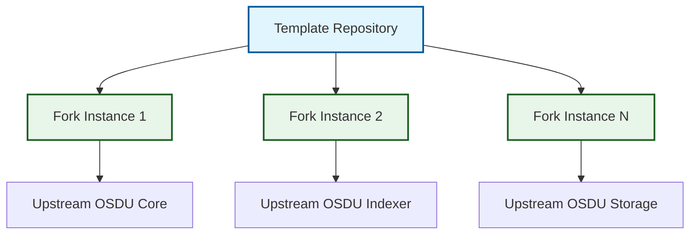
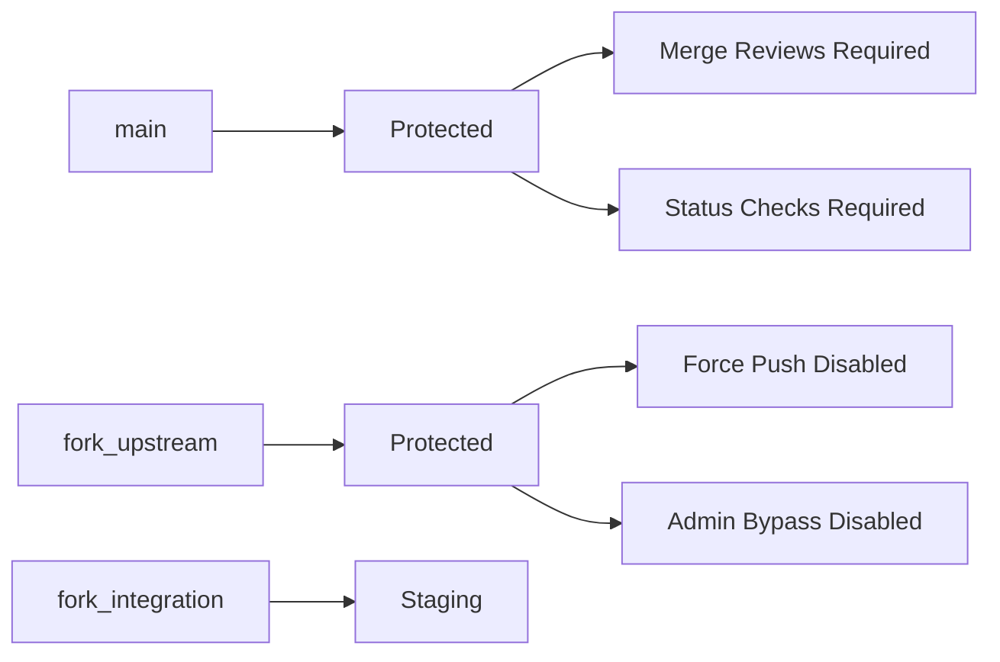

# System Architecture Overview

## Design Philosophy

The OSDU SPI Fork Management system is built on a foundation of **template-driven automation** that prioritizes zero-configuration deployment, intelligent automation, and continuous maintenance. The architecture leverages GitHub's native capabilities to provide enterprise-grade fork management without external dependencies.

### Core Principles

#### :material-github: GitHub Native
Leverage platform features exclusively, ensuring reliable operation without external service dependencies. All automation uses GitHub Actions, GitHub Issues, and native Git operations.

#### :material-cog-clockwise: Self-Configuring  
Template repositories automatically adapt to specific upstream sources through intelligent initialization workflows that detect and configure appropriate settings.

#### :material-shield-check: Safety-First
Multiple validation points prevent unstable code promotion through the three-branch strategy, with branch protection rules and automated security scanning.

#### :material-lightning-bolt: Event-Driven
Automated response to repository changes, schedules, and external triggers enables real-time synchronization and conflict management.

#### :material-trending-up: Scalable
Support unlimited repository deployments with consistent patterns, enabling enterprise-wide adoption across multiple OSDU repository forks.

## Architectural Patterns

### Template Repository Pattern

The system implements a sophisticated template repository pattern that separates concerns:

#### **Template Development Context**
- `.github/workflows/`: Template development and maintenance workflows
- Template-specific documentation and configuration
- Update propagation mechanisms and testing frameworks

#### **Fork Instance Context**  
- `.github/template-workflows/`: Production fork management workflows
- Instance-specific configuration and customization
- Upstream-specific synchronization and integration

### Event-Driven Workflow Architecture

The system uses GitHub's native event system for intelligent triggering:

#### **Scheduled Events**
- Daily upstream synchronization checks
- Weekly template update propagation
- Periodic health monitoring and reporting

#### **Change Events**
- Pull request validation and build verification
- Issue lifecycle tracking and state management
- Cascade workflow triggering and monitoring

#### **Manual Events**
- On-demand synchronization and conflict resolution
- Emergency override and rollback procedures
- Administrative maintenance and configuration updates

## System Components

### Workflow Orchestration Layer

#### **Core Workflows**
- **Initialization**: Bootstrap new fork instances with proper configuration
- **Synchronization**: Daily upstream integration with conflict management
- **Cascade**: Multi-stage integration through the three-branch strategy
- **Validation**: Pull request verification and quality assurance

#### **Supporting Workflows**
- **Release Management**: Semantic versioning and changelog generation
- **Security Scanning**: Automated vulnerability detection and reporting
- **Template Propagation**: Update distribution across fork instances

### AI Integration Layer

#### **Multi-Provider Support**
- **Claude (Anthropic)**: Primary AI provider for analysis and generation
- **Azure OpenAI**: Enterprise-grade alternative with Microsoft integration
- **OpenAI GPT-4**: Fallback option for comprehensive coverage

#### **AI-Enhanced Capabilities**
- Intelligent commit message generation using conventional commit standards
- Pull request description creation with impact analysis
- Conflict categorization and resolution guidance
- Security vulnerability analysis and reporting

### Configuration Management Layer

#### **Centralized Configuration**
- `.github/sync-config.json`: Synchronization behavior and file filtering
- `.github/labels.json`: Issue and PR label definitions
- `.github/branch-protection.json`: Repository security settings

#### **Dynamic Adaptation**
- Instance-specific upstream repository detection
- Automatic branch strategy configuration
- AI provider selection and fallback management

## Security Architecture

### Branch Protection Strategy

#### **Production Branch Security**
- Required pull request reviews for all changes
- Status checks must pass before merging
- Force push prevention and administrator override restrictions

#### **Integration Branch Flexibility**
- Conflict resolution workspace with relaxed restrictions
- Temporary security adjustments during initialization
- Automated restoration of full security posture

### Automated Security Scanning

#### **Vulnerability Detection**
- Trivy security scanning for container and dependency vulnerabilities
- GitHub Security Advisories integration
- Custom security pattern detection and reporting

#### **Compliance Verification**
- Branch protection rule validation
- Secret scanning and leak prevention
- Access control verification and monitoring

## Scalability Considerations

### Template Propagation Architecture

The system supports enterprise-scale deployment through:

#### **Centralized Template Management**
- Single source of truth for workflow definitions
- Automated update distribution to all fork instances
- Version tracking and rollback capabilities

#### **Decentralized Instance Operation**
- Each fork instance operates independently
- No shared infrastructure or single points of failure
- Isolated configuration and customization capabilities

### Performance Optimization

#### **Caching Strategy**
- Upstream repository data caching for faster synchronization
- AI response caching for repeated analysis patterns
- Workflow artifact caching for improved execution times

#### **Resource Management**
- Intelligent scheduling to prevent resource contention
- Parallel execution where appropriate and safe
- Automatic retry mechanisms with exponential backoff

## Integration Points

### GitHub Platform Integration

#### **Native Features**
- GitHub Actions for all automation and workflow execution
- GitHub Issues for tracking, communication, and lifecycle management
- GitHub APIs for repository management and configuration

#### **Advanced Capabilities**
- GitHub Copilot integration through MCP servers
- GitHub Security Advisory integration for vulnerability management
- GitHub Packages integration for artifact management

### External Tool Integration

#### **Development Tools**
- Maven MCP Server for Java project dependency management
- Release Please for semantic versioning and changelog generation
- Various security scanning tools through standardized interfaces

#### **AI Services**
- Multiple AI provider integration with intelligent fallback
- Model Context Protocol (MCP) for enhanced AI tool capabilities
- Structured prompt engineering for consistent, reliable outputs

---

*This architecture provides a robust foundation for enterprise-scale fork management while maintaining simplicity and reliability through proven GitHub-native patterns.*