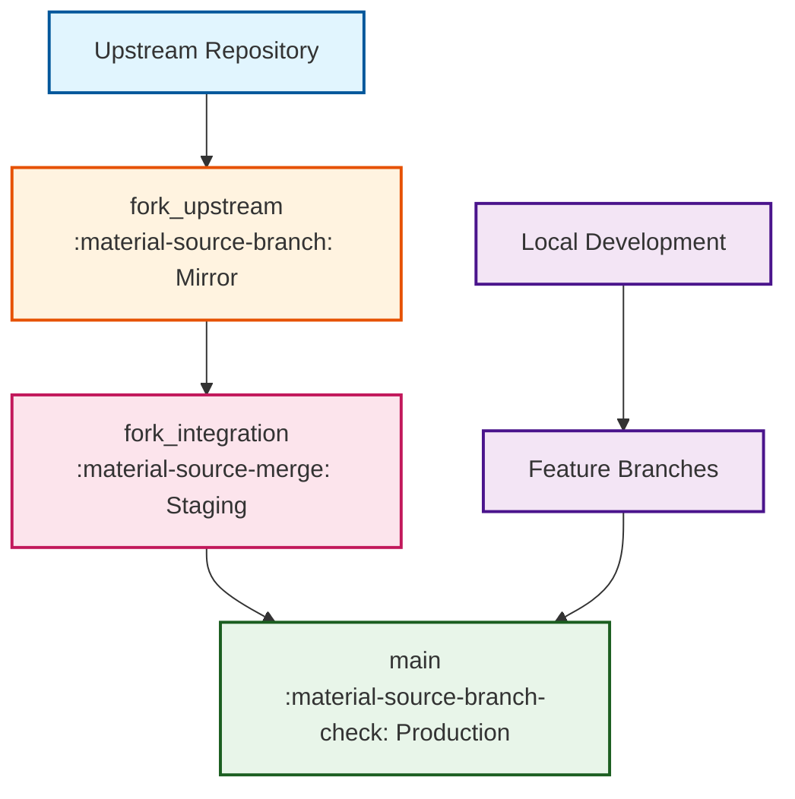
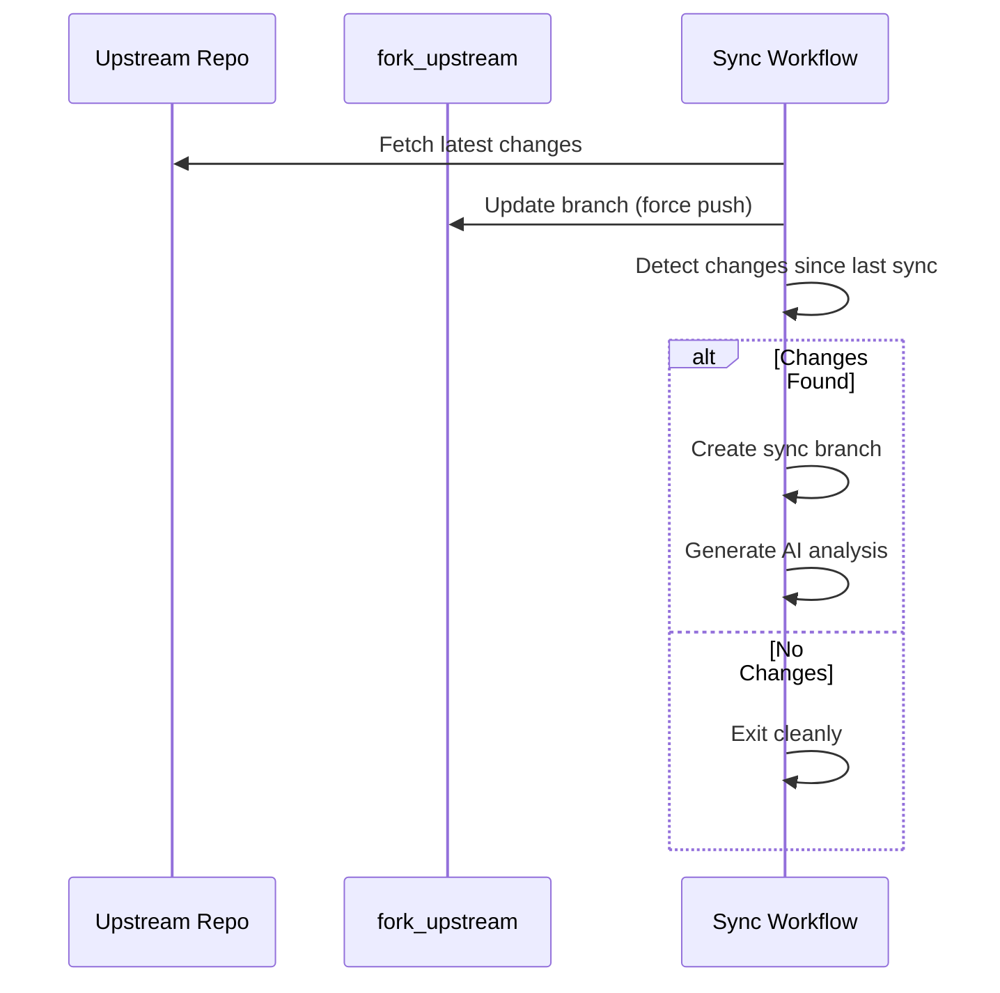
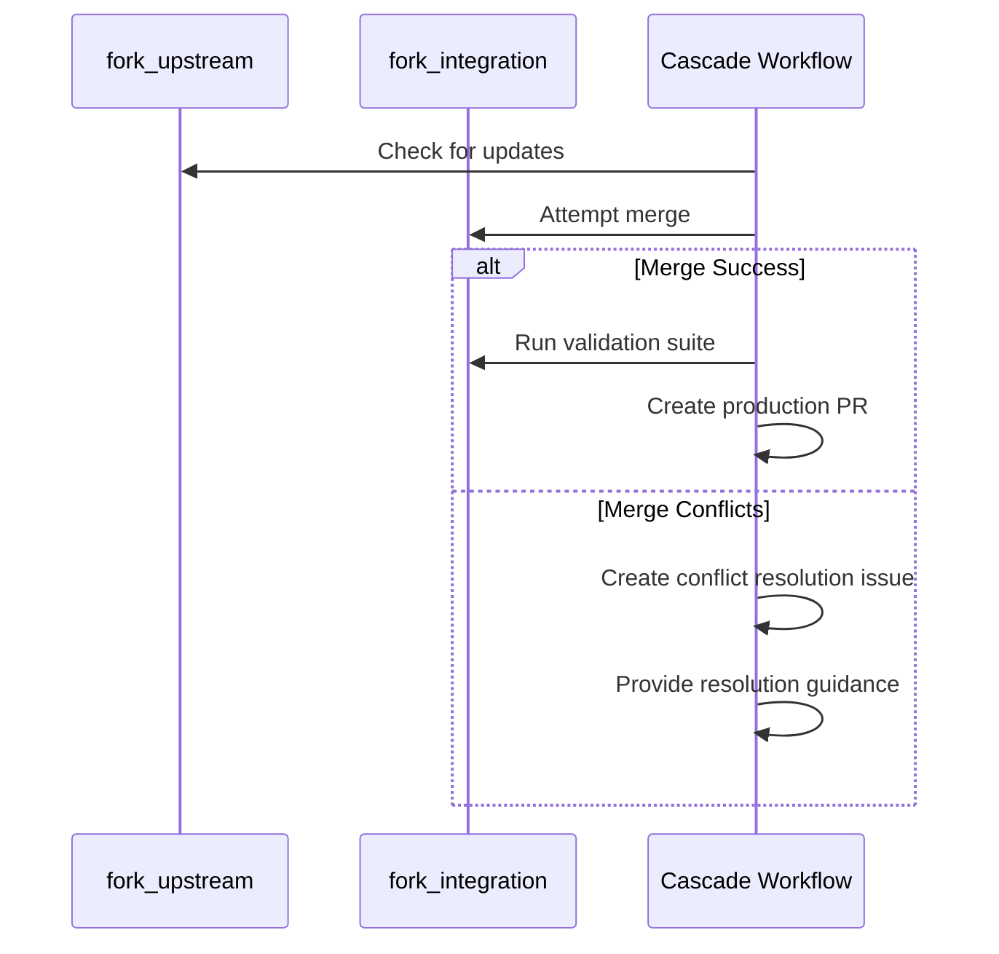
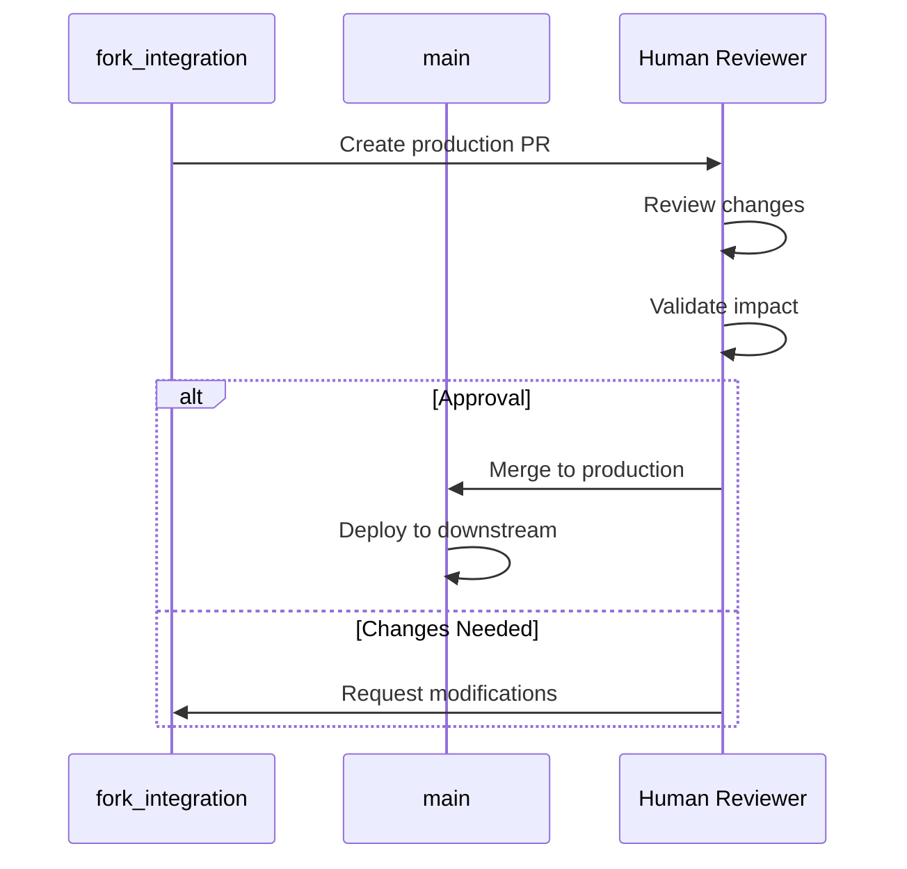

# Three-Branch Strategy

The three-branch strategy forms the cornerstone of safe, systematic fork management in the OSDU SPI Fork Management system. This architectural pattern provides controlled integration checkpoints that prevent cascade failures while enabling continuous upstream synchronization.

## Branch Architecture

### Branch Purposes

#### :material-source-branch: `main` - Production Branch
**Purpose**: Stable production branch containing successfully integrated changes

- **Protection Level**: Maximum security with required PR reviews
- **Content**: Production-ready Azure SPI implementations  
- **Updates**: Only through validated pull requests from `fork_integration`
- **Quality Gate**: All changes must pass comprehensive validation

#### :material-source-commit: `fork_upstream` - Upstream Mirror
**Purpose**: Clean tracking of upstream OSDU repository without local modifications

- **Protection Level**: Automation-only updates to maintain purity
- **Content**: Exact mirror of upstream repository state
- **Updates**: Automated synchronization from upstream repository
- **Analysis**: Enables clear diff analysis and change detection

#### :material-source-merge: `fork_integration` - Integration Workspace  
**Purpose**: Dedicated space for conflict resolution and comprehensive validation

- **Protection Level**: Flexible for conflict resolution workflows
- **Content**: Merge workspace for upstream changes with local modifications
- **Updates**: Automated merges from `fork_upstream` with conflict resolution
- **Validation**: Complete build, test, and security scanning before production

## Integration Flow

### Upstream Change Integration

The system follows a systematic integration pattern that ensures safety at each stage:

#### **Stage 1: Upstream Synchronization**

#### **Stage 2: Integration Preparation**

#### **Stage 3: Production Integration**

## Safety Mechanisms

### Branch Protection Rules

#### **Production Branch (`main`)**
- :material-shield-check: **Required Reviews**: Minimum 1 reviewer for all changes
- :material-checkbox-marked-circle: **Status Checks**: All validation workflows must pass
- :material-source-branch-sync: **Up-to-date Requirement**: Branch must be current before merge
- :material-block-helper: **Force Push Prevention**: Protects against history rewriting

#### **Upstream Mirror (`fork_upstream`)**
- :material-robot: **Automation Only**: Only automated workflows can update
- :material-lock: **Force Push Allowed**: Enables clean upstream mirroring
- :material-account-remove: **Human Push Blocked**: Prevents accidental modifications

#### **Integration Workspace (`fork_integration`)**
- :material-wrench: **Flexible Access**: Allows conflict resolution workflows
- :material-source-commit: **Direct Push Enabled**: Facilitates merge conflict resolution
- :material-test-tube: **Validation Required**: All changes must pass testing

### Quality Gates

#### **Integration Validation**
- **Build Verification**: Complete compilation and dependency resolution
- **Test Execution**: Full test suite including integration tests  
- **Security Scanning**: Automated vulnerability and compliance checks
- **Code Quality**: Linting and code quality metrics verification

#### **Production Validation**
- **Human Review**: Manual approval for all production changes
- **Impact Assessment**: Analysis of changes to Azure SPI implementations
- **Rollback Planning**: Verification of rollback procedures if needed
- **Documentation**: Change documentation and release notes

## Workflow Benefits

### :material-target: Conflict Isolation
Merge conflicts are resolved in the dedicated `fork_integration` branch, preventing disruption to the stable `main` branch during resolution.

### :material-magnify: Clear Change Attribution  
Easy identification of what changes originate from upstream versus local Azure SPI modifications through clean branch separation.

### :material-shield-account: Multi-Stage Validation
Multiple review and validation points ensure problematic changes are caught before reaching production systems.

### :material-history: Upstream Tracking
Pure upstream branch enables accurate diff analysis, change detection, and impact assessment for each synchronization.

### :material-backup-restore: Rollback Capability
Easy reversion of problematic integrations without losing upstream synchronization state or affecting ongoing development.

## Operational Patterns

### Daily Synchronization Cycle

#### **Automated Processing**
1. **Check Upstream**: Daily automated check for new upstream changes
2. **Sync Detection**: AI-enhanced analysis of change scope and impact
3. **Integration Attempt**: Automated merge to integration branch
4. **Validation Execution**: Comprehensive testing and security scanning

#### **Human Intervention Points**
1. **Conflict Resolution**: Manual resolution when automated merge fails
2. **Validation Review**: Assessment of test results and security findings
3. **Production Approval**: Final authorization for changes to reach `main`
4. **Release Coordination**: Alignment with downstream system requirements

### Emergency Procedures

#### **Upstream Rollback**
If upstream changes cause issues:
1. Identify last known good state in `fork_upstream`
2. Create rollback branch from previous stable point
3. Update `fork_integration` with rollback changes
4. Execute normal validation and approval process

#### **Production Hotfix**
For urgent Azure SPI fixes:
1. Create hotfix branch from current `main`
2. Implement and test fix in isolation
3. Fast-track through integration validation
4. Deploy with minimal upstream integration delay

## Branch Preservation Strategy

### :material-database: Permanent Branch Retention
All three branches are permanently preserved and never deleted:

- **`main`**: Production branch requiring continuous availability
- **`fork_upstream`**: Historical upstream state needed for future synchronization
- **`fork_integration`**: Integration state history required for conflict analysis

### :material-source-branch-plus: Temporary Release Branches
For production deployments, temporary release branches (`release/upstream-YYYYMMDD-HHMMSS`) are created from `fork_integration` to `main`, allowing safe cleanup while preserving core architecture.

---

*This three-branch strategy provides the foundation for reliable, systematic fork management that balances automation efficiency with human oversight and safety.*