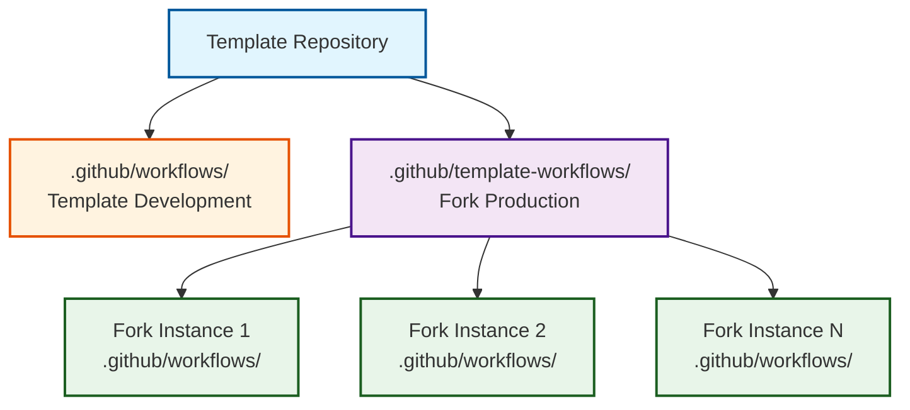
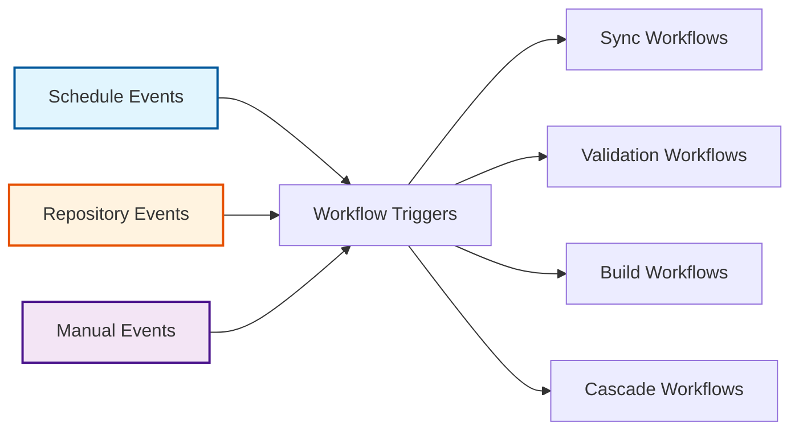

# Workflow System Architecture

The OSDU SPI Fork Management system implements a sophisticated workflow architecture that separates template development concerns from fork production operations. This design enables scalable deployment across multiple fork instances while maintaining centralized template management.

## Workflow Architecture Pattern

### Template-Workflows Separation

The system implements a clean separation between template development and fork production workflows:

#### **Template Development Context** (`.github/workflows/`)
- Repository initialization and bootstrap workflows
- Template testing and validation workflows
- Template versioning and release management
- Development CI/CD pipelines

#### **Fork Production Context** (`.github/template-workflows/`)
- Upstream synchronization workflows
- Build and validation workflows  
- Release management for fork instances
- Monitoring and maintenance workflows

## Core Workflow Categories

### :material-sync: Synchronization Workflows

#### **Daily Upstream Sync** (`sync.yml`)
**Purpose**: Automated daily synchronization with upstream OSDU repositories

- **Trigger**: Scheduled daily at midnight UTC
- **Function**: Fetch upstream changes, detect conflicts, create integration PRs
- **AI Integration**: Intelligent change analysis and PR description generation
- **Safety**: Isolated conflict resolution in `fork_integration` branch

#### **Template Propagation** (`sync-template.yml`)  
**Purpose**: Distribute template updates to all fork instances

- **Trigger**: Weekly scheduled execution
- **Function**: Apply template improvements across fork instances
- **Scope**: Selective synchronization based on configuration files
- **Validation**: Automated testing before deployment

### :material-check-circle: Validation Workflows

#### **Pull Request Validation** (`validate.yml`)
**Purpose**: Comprehensive validation of all pull requests

- **Scope**: Commit message format, branch naming, content validation
- **Integration**: Conflict detection and resolution guidance
- **Quality Gates**: Build verification, test execution, security scanning
- **Reporting**: Detailed status checks and failure analysis

#### **Dependabot Automation** (`dependabot-validation.yml`)
**Purpose**: Automated dependency update validation

- **Function**: Validate dependency updates from Dependabot
- **Testing**: Automated test execution for dependency changes
- **Security**: Vulnerability assessment of new dependencies
- **Integration**: Merge automation for low-risk updates

### :material-hammer-wrench: Build & Release Workflows

#### **Project Build** (`build.yml`)
**Purpose**: Automated build and test execution for supported project types

- **Support**: Java/Maven projects with extensible patterns
- **Testing**: Unit tests, integration tests, coverage reporting
- **Artifacts**: Build artifact generation and publishing
- **Caching**: Intelligent dependency caching for performance

#### **Semantic Release** (`release.yml`)
**Purpose**: Automated semantic versioning and release management

- **Integration**: Release Please with conventional commit standards
- **Correlation**: Upstream version tracking and alignment
- **Documentation**: Automated changelog generation
- **Distribution**: Package publication and release notes

### :material-water-outline: Cascade Workflows

#### **Integration Cascade** (`cascade.yml`)
**Purpose**: Multi-stage integration through the three-branch strategy

- **Trigger**: Manual execution or automated monitoring
- **Flow**: `fork_upstream` → `fork_integration` → `main`
- **Validation**: Comprehensive testing at each stage
- **Monitoring**: Progress tracking through GitHub Issues

#### **Cascade Monitoring** (`cascade-monitor.yml`)
**Purpose**: Automated detection and triggering of cascade operations

- **Detection**: Monitor for completed upstream synchronizations
- **SLA Management**: Ensure cascade operations meet timing requirements  
- **Escalation**: Create alerts for overdue cascade operations
- **Recovery**: Automatic retry mechanisms for failed operations

## Workflow Event Architecture

### Event-Driven Triggers

#### **Scheduled Triggers**
- **Daily Sync**: `0 0 * * *` - Midnight UTC upstream synchronization
- **Weekly Template Sync**: `0 2 * * 1` - Monday 2 AM template updates
- **Periodic Monitoring**: `0 */6 * * *` - 6-hour cascade monitoring

#### **Event-Based Triggers**
- **Pull Request**: Validation workflows on PR creation/updates
- **Issue Creation**: Cascade triggering on sync completion
- **Push Events**: Build workflows on main branch updates
- **Release Creation**: Distribution workflows on tag creation

#### **Manual Triggers**
- **Emergency Sync**: On-demand upstream synchronization
- **Cascade Override**: Manual cascade operation initiation
- **Template Update**: Immediate template propagation
- **Validation Retry**: Re-execution of failed validation workflows

## Workflow Integration Patterns

### AI-Enhanced Automation

#### **Multi-Provider Support**
- **Claude (Anthropic)**: Primary AI provider for analysis and generation
- **Azure OpenAI**: Enterprise alternative with Microsoft integration
- **OpenAI GPT-4**: Fallback option for comprehensive coverage

#### **AI-Powered Capabilities**
- **Change Analysis**: Intelligent assessment of upstream modifications
- **Commit Generation**: Conventional commit message creation
- **PR Descriptions**: Comprehensive pull request documentation
- **Conflict Guidance**: Step-by-step conflict resolution instructions

### Security Integration

#### **Automated Security Scanning**
- **Trivy Scanning**: Container and dependency vulnerability detection
- **Secret Detection**: Automated secret leak prevention
- **Security Advisories**: GitHub security advisory integration
- **Compliance Verification**: Automated compliance rule validation

#### **Branch Protection Integration**
- **Status Checks**: Required workflow completion before merge
- **Review Requirements**: Mandatory human approval for production changes
- **Push Protection**: Prevention of unauthorized direct pushes
- **Emergency Override**: Controlled override procedures for critical issues

## Workflow State Management

### Issue-Based Tracking

#### **Lifecycle Management**
- **State Tracking**: GitHub Issues for workflow state management
- **Progress Updates**: Automated status updates throughout workflow execution
- **Error Reporting**: Detailed failure analysis and resolution guidance
- **Audit Trail**: Complete record of all workflow operations

#### **Label-Based Organization**
- **Workflow Types**: `upstream-sync`, `cascade-active`, `template-update`
- **Status Indicators**: `in-progress`, `completed`, `requires-attention`
- **Priority Levels**: `high-priority`, `critical`, `routine`
- **Assignment Strategy**: `human-required` for manual intervention points

### Performance Optimization

#### **Caching Strategy**
- **Dependency Caching**: Maven dependencies, Node modules, Docker layers
- **Build Artifact Caching**: Compiled assets and test results
- **Repository Data Caching**: Upstream repository metadata
- **AI Response Caching**: Previously generated analysis results

#### **Resource Management**
- **Parallel Execution**: Concurrent workflow execution where safe
- **Queue Management**: Intelligent scheduling to prevent resource contention
- **Timeout Handling**: Appropriate timeouts with graceful degradation
- **Retry Logic**: Exponential backoff for transient failures

## Workflow Extensibility

### Custom Action Integration

#### **Reusable Actions**
- **Enhanced PR Creation**: AI-powered pull request generation
- **Java Build Status**: Specialized build reporting for Maven projects
- **Security Scanning**: Standardized vulnerability assessment
- **Notification Management**: Intelligent alert distribution

#### **Extension Points**
- **Project Type Detection**: Automatic workflow adaptation based on project type
- **Custom Validation**: Project-specific quality gates and testing
- **Integration Hooks**: External system integration capabilities
- **Notification Customization**: Flexible alert and reporting mechanisms

---

*This workflow architecture provides a robust, scalable foundation for enterprise-grade fork management while maintaining flexibility for diverse project requirements and organizational needs.*