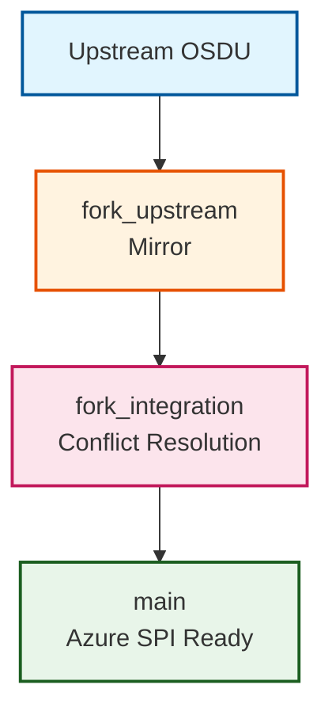

# Concepts

## The OSDU SPI Separation Challenge

The Open Subsurface Data Universe (OSDU) project presents a fundamental architectural challenge for cloud providers who need to maintain both open-source compatibility and proprietary cloud-specific implementations. This challenge centers on the effective separation and management of Cloud Provider Interface (SPI) code.

### Understanding the OSDU Architecture

OSDU defines a layered architecture where:

- **OSDU Core**: Community-defined interfaces, business logic, and data models
- **Community Implementation**: Open-source reference implementations for validation
- **Cloud Provider SPI**: Proprietary implementations leveraging cloud-specific technologies

### The Critical Separation Requirement

Microsoft must maintain clear boundaries between:

#### :material-open-source-initiative: Open Source Components
- OSDU core interfaces and contracts
- Community-validated business logic
- Standard data models and workflows
- Reference implementations for testing

#### :material-microsoft-azure: Azure-Specific Components  
- Azure SPI layer implementations
- Azure-native service integrations
- Proprietary optimization and enhancements
- Microsoft-specific configuration and deployment

## The Fork Management Problem

### Traditional Challenges

Maintaining long-lived forks of upstream OSDU repositories creates several critical challenges:

#### **Integration Complexity**
Manual synchronization with upstream changes requires significant engineering effort, particularly when upstream modifications affect interfaces that Azure SPI implementations depend upon.

#### **Divergence Risk** 
Over time, local modifications can diverge significantly from upstream standards, making integration increasingly difficult and potentially compromising compatibility.

#### **Blocking Dependencies**
Under traditional approaches, compilation or testing failures in any Cloud Provider's SPI implementation could block merging changes to main branches, creating dependencies between unrelated provider implementations.

#### **Release Coordination**
Correlating fork versions with upstream releases becomes complex without systematic tracking and version management.

### The Compounding Effect

These challenges compound in enterprise environments where:

- Quarterly planning cycles cannot accommodate unpredictable upstream changes
- Teams require different development workflows for upstream vs. proprietary code
- Compliance requirements demand complete audit trails
- Multiple downstream systems depend on stable, predictable releases

## The SPI Separation Solution

### Core Principle: Controlled Isolation

The fork management system implements controlled isolation through a three-branch strategy that separates concerns:

### Automated Workflow Benefits

#### **Upstream Synchronization**
- Scheduled pulls from upstream repositories
- Automated conflict detection and categorization
- AI-enhanced analysis of change impacts

#### **Conflict Management**
- Isolated resolution environment in `fork_integration`
- Guided resolution with generated instructions
- Testing validation before production integration

#### **Release Coordination**
- Automatic correlation with upstream version tags
- Semantic versioning aligned with upstream releases
- Clear change documentation and impact analysis

## Development Workflow Optimization

### Context Switching Efficiency

The system addresses the complexity of managing different development contexts:

#### **Upstream Development Context**
- Open-source Community Implementation environment
- Community coding standards and practices
- Public repository collaboration patterns

#### **Azure SPI Development Context**
- Azure-specific technology stack
- Microsoft development practices and tooling
- Proprietary feature development workflow

### AI-Enhanced Development Support

The system leverages AI assistance to reduce friction:

- **MCP Servers**: Model Context Protocol integration for enhanced tooling
- **Intelligent Analysis**: Automated impact assessment of upstream changes  
- **Guided Resolution**: Step-by-step conflict resolution instructions
- **Automated Documentation**: Generated commit messages and PR descriptions

## Operational Benefits

### For Development Teams

#### **Focus on Innovation**
Teams spend time on Azure SPI enhancements rather than integration overhead, accelerating feature delivery and reducing context switching.

#### **Reduced Technical Debt**
Systematic upstream integration prevents accumulation of compatibility issues, maintaining code quality and reducing maintenance burden.

#### **Predictable Planning**
Automated handling of routine integration tasks enables more reliable sprint planning and feature roadmap execution.

### For Operations Teams

#### **Enhanced Compliance**
Complete audit trails and automated security scanning ensure regulatory requirements are consistently met.

#### **Reliable Delivery**
Structured release correlation provides predictable, stable delivery points for downstream systems like Azure Data Manager for Energy (ADME).

#### **Risk Mitigation**
Early conflict detection and isolated resolution prevent integration issues from impacting production systems.

## Strategic Advantages

### **Separation of Concerns**
Clear boundaries between open-source and proprietary development enable teams to optimize for their specific technical contexts without compromising either approach.

### **Scalable Automation**
Template-based deployment supports unlimited fork instances with consistent automation patterns, enabling expansion across multiple OSDU repository forks.

### **Future-Proof Architecture**
The system's design accommodates evolving upstream requirements and changing cloud provider strategies without requiring fundamental architectural changes.

---

*This conceptual foundation enables Microsoft to maintain active participation in the OSDU community while delivering reliable, Azure-optimized implementations to enterprise customers.*