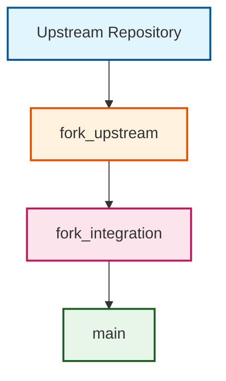

# ADR-001: Three-Branch Fork Management Strategy

:material-source-branch: **Critical Decision** | :material-calendar: **2025-05-28** | :material-check-circle: **Accepted**

## Problem Statement

When maintaining long-lived forks of upstream repositories, teams face significant challenges balancing upstream synchronization with local modifications. Traditional forking approaches often result in complex merge conflicts, difficulty tracking changes, and unstable release branches that impact team productivity and system reliability.

## Context and Requirements

### :material-target: System Requirements

The fork management system must support:

- **Regular Upstream Sync**: Automated synchronization with upstream repositories
- **Modification Isolation**: Clear separation between upstream and local changes  
- **Safe Conflict Resolution**: Controlled workflow for handling merge conflicts
- **Stable Release Management**: Reliable production branch maintenance
- **Change Traceability**: Clear attribution and tracking of all modifications

### :material-alert: Current Challenges

**Traditional Forking Issues**:
- Merge conflicts occur directly on production branches
- Difficulty distinguishing upstream changes from local modifications
- Complex conflict resolution disrupts ongoing development
- No dedicated validation space for upstream changes
- Risk of breaking stable branches during integration

## Decision

Implement a **three-branch strategy** that provides clear separation of concerns and safe integration pathways:



### :material-source-branch: Branch Architecture

#### **`main` - Production Branch**
- **Purpose**: Stable production branch containing successfully integrated changes
- **Protection**: Only receives changes through reviewed pull requests
- **Content**: Fully validated and tested integrated codebase

#### **`fork_upstream` - Upstream Tracking Branch**  
- **Purpose**: Clean mirror of upstream repository's main branch
- **Content**: Pure upstream changes without local modifications
- **Automation**: Updated automatically by sync workflows

#### **`fork_integration` - Validation Workspace**
- **Purpose**: Dedicated space for conflict resolution and comprehensive testing
- **Function**: Safe environment for validating upstream changes before production
- **Validation**: Complete build, test, and quality assurance execution

## Implementation Strategy

### :material-shield-check: Branch Protection Configuration

```yaml
# Branch protection rules
main:
  protection:
    - required_status_checks: strict
    - required_pull_request_reviews: 1
    - dismiss_stale_reviews: true
    - enforce_admins: false
    - allow_force_pushes: false

fork_upstream:
  protection:
    - automation_only: true
    - direct_push_allowed: sync_workflows
    
fork_integration:
  protection:
    - conflict_resolution_access: true
    - validation_required: true
```

### :material-workflow: Integration Workflow

#### **Phase 1: Upstream Synchronization**
1. **Automated Sync**: Sync workflow updates `fork_upstream` with latest upstream changes
2. **Change Detection**: Compare `fork_upstream` with current state to identify new changes
3. **Sync Notification**: Create tracking issue for new upstream changes

#### **Phase 2: Integration Validation**
1. **Branch Preparation**: Merge `main` into `fork_integration` to include latest local changes
2. **Upstream Integration**: Merge `fork_upstream` into `fork_integration`
3. **Conflict Detection**: Identify and isolate any merge conflicts
4. **Comprehensive Validation**: Execute full build, test, and quality checks

#### **Phase 3: Production Release**
1. **Validation Gate**: Block progression if any validation failures detected
2. **Release Branch**: Create temporary release branch from validated `fork_integration`
3. **Production PR**: Submit pull request from release branch to `main`
4. **Manual Review**: Require human approval for all production changes

### :material-cog: Branch Preservation Strategy

#### **Critical Requirement: Permanent Branch Preservation**

All three core branches must be permanently maintained:

- **`main`**: Production branch - never delete
- **`fork_upstream`**: Upstream tracking - required for future synchronization
- **`fork_integration`**: Integration workspace - needed for ongoing conflict resolution

#### **Temporary Branch Pattern**

For production releases, use temporary branches to preserve core architecture:

```bash
# Create temporary release branch from validated integration
git checkout fork_integration
git checkout -b release/upstream-$(date +%Y%m%d-%H%M%S)

# Create PR to main using temporary branch
gh pr create --base main --head release/upstream-...

# After merge, safely delete temporary branch
git branch -d release/upstream-...
```

## Rationale and Benefits

### :material-check-circle: Strategic Advantages

#### **Change Attribution and Clarity**
- **Clear Separation**: Easy identification of upstream vs. local modifications
- **Diff Analysis**: Pure upstream branch enables accurate change detection
- **Audit Trail**: Complete traceability of all changes and their sources

#### **Risk Mitigation and Safety**
- **Conflict Isolation**: Merge conflicts resolved in dedicated workspace
- **Validation Gate**: Comprehensive testing before production integration
- **Stable Main**: Production branch protected from integration issues
- **Rollback Capability**: Easy reversion of problematic integrations

#### **Quality Assurance**
- **Early Detection**: Issues caught during integration validation phase
- **Comprehensive Testing**: Full build, test, and lint validation
- **Systematic Resolution**: Structured approach to conflict and failure resolution

### :material-trending-up: Operational Benefits

#### **Team Productivity**
- **Parallel Development**: Ongoing development unaffected by upstream integration
- **Clear Processes**: Well-defined workflows for different change types
- **Reduced Conflicts**: Proactive conflict detection and resolution

#### **System Reliability**
- **Multiple Validation Points**: Several quality gates before production
- **Automated Monitoring**: Continuous validation and status reporting
- **Failure Recovery**: Systematic handling of integration failures

## Alternative Approaches Considered

### :material-close-circle: Two-Branch Strategy
```
upstream → main
```
- **Pros**: Simpler branch structure with reduced management overhead
- **Cons**: Conflicts occur directly on production branch, no isolation
- **Decision**: Rejected due to unacceptable risk to production stability

### :material-close-circle: Feature Branch per Sync
```
upstream → sync-YYYYMMDD → main
```
- **Pros**: Complete isolation for each sync operation
- **Cons**: Branch proliferation, complex tracking of multiple syncs
- **Decision**: Rejected due to operational complexity

### :material-close-circle: Direct Upstream Merge
```
upstream → main (direct merge)
```
- **Pros**: Simplest possible integration approach
- **Cons**: No conflict isolation, high risk of breaking production
- **Decision**: Rejected due to lack of safety controls

## Consequences and Trade-offs

### :material-plus: Positive Outcomes

#### **Enhanced Stability**
- Production branch maintains stability through controlled integration
- Multiple validation points prevent problematic changes from reaching main
- Clear rollback path for integration issues

#### **Improved Traceability**
- Complete audit trail of upstream changes and local modifications
- Easy identification of change sources and integration points
- Systematic tracking of validation results and resolutions

#### **Operational Excellence**
- Predictable workflows for different types of changes
- Automated validation and quality assurance
- Clear escalation paths for integration failures

### :material-minus: Trade-offs and Limitations

#### **Increased Complexity**
- Three branches require more sophisticated management
- Team training needed for branch strategy and workflows
- Additional automation requirements for effective operation

#### **Automation Dependency**
- Requires robust automated workflows for branch synchronization
- Manual processes become more complex without automation
- Need for monitoring and alerting on automation failures

#### **Resource Requirements**
- Additional CI/CD resources for comprehensive validation
- Storage requirements for maintaining multiple branches
- Operational overhead for monitoring branch health

## Success Metrics

### :material-chart-line: Quantitative Indicators

- **Integration Success Rate**: >95% of upstream syncs complete without manual intervention
- **Conflict Resolution Time**: <48 hours average time to resolve conflicts
- **Production Stability**: Zero unplanned main branch rollbacks due to integration issues
- **Validation Effectiveness**: >90% of issues caught during integration phase

### :material-check-all: Qualitative Indicators

- Teams can safely integrate upstream changes without disrupting ongoing development
- Conflicts are resolved systematically in isolated environment
- Clear audit trail maintained for all changes and their sources
- Reduced stress and improved confidence in upstream integration process

## Related Decisions

- [ADR-002](adr_002_github_actions.md): GitHub Actions automation supports this branch strategy
- [ADR-005](adr_005_conflict_management.md): Conflict management processes built on this foundation
- [ADR-019](adr_019_cascade_monitor.md): Monitoring system for branch synchronization
- [ADR-022](adr_022_issue_tracking.md): Issue tracking for integration lifecycle

---

*This three-branch strategy provides the foundation for safe, reliable upstream integration while maintaining production stability and team productivity.*