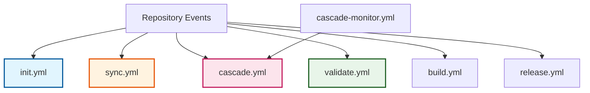

# ADR-002: GitHub Actions-Based Automation Architecture

:material-robot: **Critical Decision** | :material-calendar: **2025-05-28** | :material-check-circle: **Accepted**

## Problem Statement

The fork management system requires extensive automation to handle repository initialization, upstream synchronization, conflict detection, build validation, and release management. The automation must be reliable, maintainable, and integrate seamlessly with GitHub's ecosystem while supporting complex workflows.

## Context and Requirements

### :material-cog: Automation Requirements

The system must provide automated support for:

- **Repository Initialization**: Setup and configuration of new fork instances
- **Upstream Synchronization**: Regular sync with upstream repositories
- **Conflict Management**: Detection and workflow for merge conflicts
- **Quality Assurance**: Build validation, testing, and compliance checks
- **Release Management**: Automated versioning and release publication
- **Security Scanning**: Vulnerability detection and compliance monitoring

### :material-target: System Constraints

**Integration Requirements**:
- Deep integration with GitHub repository features
- Native support for GitHub events and webhooks
- Secure handling of API keys and sensitive data
- Cost-effective solution within GitHub ecosystem

**Operational Requirements**:
- High reliability and availability
- Maintainable by development teams
- Scalable across multiple fork instances
- Clear error handling and debugging capabilities

## Decision

Implement **modular GitHub Actions-based automation** with specialized workflows for each system function:



### :material-workflow: Workflow Architecture

#### **Core Workflows**

| Workflow | Purpose | Trigger | Responsibility |
|----------|---------|---------|----------------|
| **init.yml** | Repository setup | Template creation | Initial configuration and branch structure |
| **sync.yml** | Upstream sync | Schedule + Manual | Issue-tracked upstream synchronization |
| **cascade.yml** | Integration flow | Human trigger | Validation and production integration |
| **validate.yml** | Quality gates | PR events | Code quality and compliance checks |
| **build.yml** | Build/test | Push + PR | Compilation, testing, coverage |
| **release.yml** | Release management | Main branch push | Semantic versioning and publication |

#### **Supporting Workflows**

| Workflow | Purpose | Trigger | Responsibility |
|----------|---------|---------|----------------|
| **cascade-monitor.yml** | Health monitoring | Schedule (6h) | Safety net and conflict escalation |

### :material-puzzle-outline: Modular Design Principles

#### **Separation of Concerns**
- Each workflow has a single, well-defined responsibility
- Minimal overlap between workflow functions
- Clear interfaces for workflow interaction

#### **Event-Driven Architecture**
- Workflows respond to specific GitHub events
- Asynchronous execution with state tracking
- Human-centric triggers for critical operations

#### **Reusable Components**
```yaml
# Composite actions for common patterns
- name: Java Build Process
  uses: ./.github/actions/java-build
  with:
    java-version: '17'
    cache-key: ${{ hashFiles('**/pom.xml') }}

- name: Update PR Status
  uses: ./.github/actions/pr-status
  with:
    status: ${{ job.status }}
    coverage: ${{ steps.test.outputs.coverage }}
```

## Implementation Strategy

### :material-security: Security and Permissions

#### **Minimal Permission Model**
```yaml
# Each workflow uses minimal required permissions
permissions:
  contents: read        # Repository access
  pull-requests: write  # PR management
  issues: write         # Issue tracking
  statuses: write       # Status checks
```

#### **Secrets Management**
- GitHub secrets for API keys and sensitive data
- Environment-specific secret configuration
- Secure token handling for external integrations

### :material-monitor: Error Handling and Reliability

#### **Graceful Degradation**
```yaml
# Optional steps don't block critical workflows
- name: Optional Enhancement
  continue-on-error: true
  run: |
    # Enhancement that shouldn't fail the workflow
```

#### **Human-Centric Recovery**
- Failed workflows create issues with `human-required` labels
- Clear error messages with actionable guidance
- Safety net monitoring for missed operations

#### **Issue Lifecycle Tracking**
- Comprehensive state tracking through GitHub issues
- Complete audit trail for cascade operations
- Automatic status updates and progress reporting

### :material-lightning-bolt: Performance Optimization

#### **Parallel Execution**
- Independent workflows run concurrently
- Conditional execution prevents unnecessary runs
- Efficient caching strategies for build artifacts

#### **Resource Management**
```yaml
# Efficient caching for build dependencies
- name: Cache Dependencies
  uses: actions/cache@v4
  with:
    path: ~/.m2/repository
    key: ${{ runner.os }}-maven-${{ hashFiles('**/pom.xml') }}
```

## Rationale and Benefits

### :material-check-circle: Strategic Advantages

#### **Native GitHub Integration**
- Deep integration with repository features
- Native support for events, webhooks, and API
- Seamless user experience within GitHub interface

#### **Cost Effectiveness**
- Included with GitHub subscriptions
- No additional infrastructure costs
- Efficient resource utilization

#### **Security Model**
- Runs in GitHub's secure environment
- Built-in secrets management
- Controlled access to repository resources

### :material-trending-up: Operational Benefits

#### **Zero Setup Requirements**
- Works immediately upon repository creation
- No external service configuration needed
- Template-based deployment across instances

#### **Maintainability**
- Modular design enables focused updates
- Clear separation of concerns
- Standard YAML configuration format

#### **Reliability**
- GitHub's infrastructure provides high availability
- Built-in retry mechanisms for transient failures
- Comprehensive monitoring and alerting

## Alternative Approaches Considered

### :material-close-circle: External CI/CD Platforms

**Options**: Jenkins, GitLab CI, CircleCI, Travis CI

- **Pros**: More powerful build environments, advanced pipeline features
- **Cons**: External dependencies, additional costs, setup complexity
- **Decision**: Rejected due to complexity and cost considerations

### :material-close-circle: Serverless Functions

**Options**: AWS Lambda, Azure Functions, Google Cloud Functions

- **Pros**: Highly scalable, event-driven architecture
- **Cons**: Platform lock-in, complex setup, additional infrastructure
- **Decision**: Rejected due to vendor lock-in and operational complexity

### :material-close-circle: Monolithic Workflow

**Pattern**: Single large workflow handling all operations

- **Pros**: All logic centralized in one location
- **Cons**: Complex maintenance, unnecessary execution, poor modularity
- **Decision**: Rejected due to maintainability concerns

## Consequences and Trade-offs

### :material-plus: Positive Outcomes

#### **Immediate Deployment**
- Zero configuration required for new repositories
- Automatic activation upon template usage
- Consistent behavior across all fork instances

#### **Integrated Ecosystem**
- Leverages GitHub's security and access controls
- Native support for repository features
- Seamless integration with development workflows

#### **Operational Excellence**
- High availability through GitHub's infrastructure
- Automated error handling and recovery
- Comprehensive monitoring and alerting

### :material-minus: Trade-offs and Limitations

#### **Platform Dependency**
- Tied specifically to GitHub platform
- Migration complexity if platform change needed
- Limited by GitHub Actions feature set

#### **Execution Constraints**
- Subject to GitHub Actions usage limits
- Limited control over execution environment
- Timeout constraints for long-running operations

#### **YAML Complexity**
- Complex workflows can become difficult to maintain
- Debugging requires understanding of GitHub Actions
- Version control needed for workflow changes

## Success Metrics

### :material-chart-line: Quantitative Indicators

- **Initialization Success**: >99% of repositories initialize successfully within 5 minutes
- **Sync Reliability**: >95% of scheduled upstream syncs complete without intervention
- **Cascade Response**: >90% of sync merges followed by cascade within 2 hours
- **Build Performance**: Build workflows complete within 15 minutes for typical projects
- **Safety Net Coverage**: 100% of missed cascade triggers detected within 6 hours

### :material-check-all: Qualitative Indicators

- Development teams can maintain workflows without specialized GitHub Actions expertise
- Clear audit trail provided through issue lifecycle tracking
- Failed workflows create actionable issues with recovery guidance
- Security scanning effectively prevents vulnerabilities from reaching production

## Related Decisions

- [ADR-001](adr_001_three_branch_strategy.md): Three-branch strategy supported by these workflows
- [ADR-019](adr_019_cascade_monitor.md): Monitoring workflow provides safety net capabilities
- [ADR-014](adr_014_ai_integration.md): AI enhancement integrated into workflow system
- [ADR-020](adr_020_human_labels.md): Human-required label strategy for workflow failures

---

*This GitHub Actions-based automation architecture provides reliable, maintainable workflow automation while leveraging GitHub's native capabilities and security model.*