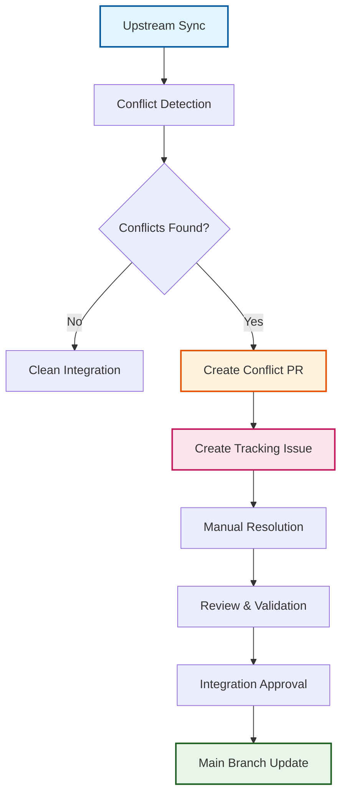

# ADR-005: Automated Conflict Management Strategy

:material-star: **Critical Decision** | :material-calendar: **2025-05-28** | :material-check-circle: **Accepted**

## Problem Statement

When synchronizing with upstream repositories, merge conflicts are inevitable due to local modifications in the fork. Traditional conflict management approaches often result in conflicts being resolved directly on main branches (causing instability) or conflicts being ignored (leading to drift from upstream). A systematic approach is needed to handle conflicts safely while maintaining productivity.

## Context and Requirements

### :material-alert-circle: Conflict Management Challenges

**Stability Requirements**:
- Prevent automatic merging of conflicted code into production branches
- Maintain main branch stability during conflict resolution processes
- Enable systematic resolution without blocking other development activities

**Visibility and Tracking**:
- Provide clear visibility into conflicts and resolution requirements
- Track conflict resolution decisions for future reference and learning
- Maintain complete audit trail of conflict handling activities

**Process Reliability**:
- Ensure conflicts are detected immediately during synchronization
- Prevent conflicted code from reaching production environments
- Enable multiple conflicts to be resolved independently

## Decision

Implement a **comprehensive automated conflict management strategy** with multi-stage safety controls:



### :material-radar: Automated Conflict Detection

#### **Immediate Detection System**
```yaml
# Conflict detection during sync process
conflict_detection:
  trigger: Automatic during upstream merge attempts
  scope: All file types and merge scenarios
  reporting: Immediate notification through GitHub Issues
  isolation: Conflicts contained in fork_integration branch
```

#### **Comprehensive Conflict Analysis**
```yaml
# AI-enhanced conflict categorization
conflict_analysis:
  structural: Directory/file reorganization conflicts
  functional: Logic changes affecting local modifications
  merge_artifacts: Git markers from complex three-way merges
  recommendation: Resolution strategy suggestions
```

### :material-source-branch: Fork Integration Branch Strategy

#### **Conflict Isolation Workspace**
```yaml
# Dedicated conflict resolution environment
integration_branch:
  purpose: Safe conflict resolution without affecting main
  protection: No direct integration to main until resolution complete
  testing: Full validation required before progression
  rollback: Easy abandonment of problematic resolutions
```

#### **Resolution Workflow**
```yaml
# Systematic conflict resolution process
resolution_process:
  detection: Automatic conflict identification
  pr_creation: Separate PR for conflict resolution
  issue_tracking: GitHub Issue for coordination and documentation
  manual_resolution: Human review and resolution required
  validation: Comprehensive testing before integration
```

## Implementation Strategy

### :material-issue-tracker: Issue-Driven Resolution Process

#### **Conflict Issue Creation**
```yaml
# Automatic issue creation for each conflict
conflict_issue:
  title: "🚨 Upstream Sync Conflict - [Date]"
  labels: ["conflict", "upstream-sync", "human-required", "high-priority"]
  content: |
    - Conflict details and affected files
    - Step-by-step resolution instructions
    - Links to conflict PR and documentation
    - Resolution strategy recommendations
```

#### **Resolution Tracking**
```yaml
# Comprehensive conflict tracking
tracking_system:
  status: Real-time resolution progress updates
  assignments: Clear ownership of resolution tasks
  discussion: Platform for resolution strategy discussion
  documentation: Permanent record of resolution decisions
  patterns: Historical pattern analysis for future conflicts
```

### :material-pull-request: Pull Request Workflow

#### **Conflict Pull Request**
```yaml
# Dedicated PR for conflict resolution
conflict_pr:
  source: Conflict branch with merge markers
  target: fork_integration branch
  labels: ["conflict", "needs-resolution", "cascade-blocked"]
  content: |
    - Detailed conflict analysis
    - Resolution instructions
    - Testing requirements
    - Review checklist
```

#### **Integration Safeguards**
```yaml
# Multiple validation points
safety_controls:
  manual_review: Human approval required for all resolutions
  testing_required: Comprehensive test suite execution
  validation_gates: Build and quality checks before integration
  final_approval: Team review before main branch update
```

## Conflict Resolution Framework

### :material-cog-outline: Resolution Categories and Strategies

#### **Structural Conflicts** (40% of conflicts)
```yaml
# Directory/file reorganization conflicts
structural_resolution:
  risk_level: Low
  strategy: Preserve local structure while adopting upstream organization
  automation: Often auto-resolvable with clear patterns
  testing: Verify build and deployment compatibility
```

#### **Functional Conflicts** (35% of conflicts)
```yaml
# Logic changes affecting local enhancements
functional_resolution:
  risk_level: High
  strategy: Preserve local enhancement intent while adopting upstream improvements
  analysis: Deep code analysis and impact assessment required
  testing: Comprehensive functionality validation required
```

#### **Merge Artifacts** (25% of conflicts)
```yaml
# Git markers from complex merges
artifact_resolution:
  risk_level: Medium
  strategy: Manual cleanup with functionality preservation
  validation: Focus on functionality testing over compilation
  documentation: Clear rationale for resolution choices
```

### :material-check-all: Resolution Quality Assurance

#### **Validation Requirements**
```yaml
# Comprehensive validation before integration
quality_gates:
  compilation: Code must compile successfully
  testing: All tests must pass
  functionality: Core functionality preserved
  performance: No significant performance regressions
  security: No security vulnerabilities introduced
```

#### **Review Process**
```yaml
# Multi-stage review requirements
review_process:
  technical_review: Code quality and correctness assessment
  functionality_review: Feature preservation validation
  security_review: Security impact analysis
  documentation_review: Resolution decision documentation
```

## Benefits and Rationale

### :material-shield-check: Safety and Stability

#### **Production Protection**
- Main branch remains stable throughout conflict resolution
- Multiple validation points prevent problematic code from reaching production
- Easy rollback capability for problematic resolutions
- Clear separation between conflict resolution and integration

#### **Risk Mitigation**
- Automated detection prevents conflicts from being overlooked
- Systematic process ensures consistent handling regardless of complexity
- Human review prevents automated incorrect resolutions
- Complete audit trail enables issue analysis and prevention

### :material-trending-up: Process Efficiency

#### **Systematic Workflow**
- Consistent handling of all conflicts using established patterns
- Clear ownership and accountability for resolution tasks
- Parallel resolution capability for multiple conflicts
- Knowledge transfer through documented resolution patterns

#### **Quality Assurance**
- Human judgment ensures appropriate conflict resolution
- Multiple review stages catch potential issues early
- Testing requirements ensure functionality preservation
- Documentation enables learning from resolution decisions

## Alternative Approaches Considered

### :material-close-circle: Automatic Conflict Resolution

**Approach**: AI-powered automatic resolution of detected conflicts

- **Pros**: No manual intervention required, faster integration cycles
- **Cons**: Risk of incorrect resolutions, loss of context, potential data loss
- **Decision**: Rejected due to safety and quality concerns requiring human judgment

### :material-close-circle: Main Branch Resolution

**Approach**: Resolve conflicts directly on main branch

- **Pros**: Simpler workflow with direct resolution path
- **Cons**: Destabilizes main branch, blocks other development, high risk
- **Decision**: Rejected due to stability requirements and development velocity impact

### :material-close-circle: Feature Branch per Conflict

**Approach**: Create separate feature branch for each conflict

- **Pros**: Complete isolation of individual conflicts
- **Cons**: Branch proliferation, complex tracking overhead, management complexity
- **Decision**: Rejected due to operational complexity and maintenance burden

### :material-close-circle: Manual Detection Process

**Approach**: Rely on developers to detect and report conflicts

- **Pros**: Human judgment in conflict identification
- **Cons**: Inconsistent detection, delays, human error prone, lacks systematic approach
- **Decision**: Rejected due to reliability requirements and automation benefits

## Consequences and Trade-offs

### :material-plus: Positive Outcomes

#### **Enhanced Stability**
- Main branch protected from conflicts during resolution activities
- Multiple safety gates prevent unstable code from reaching production
- Clear rollback path for problematic conflict resolutions
- Reduced risk of production incidents due to poor conflict resolution

#### **Improved Visibility**
- Complete tracking of all conflicts and resolution status
- Clear accountability and ownership for resolution activities
- Permanent record of resolution decisions for future reference
- Pattern analysis enables improvement of resolution processes

#### **Quality Assurance**
- Human review ensures appropriate and context-aware resolutions
- Multiple validation points catch potential issues before integration
- Systematic approach ensures consistent quality across all resolutions
- Documentation enables knowledge sharing and process improvement

### :material-minus: Trade-offs and Limitations

#### **Process Overhead**
- Manual resolution required for all conflicts adds time to integration
- Multiple review stages can slow down urgent fixes
- Issue creation and tracking adds administrative overhead

#### **Resource Requirements**
- Human expertise required for conflict resolution activities
- Time investment needed for proper resolution and validation
- Training required for team members on resolution procedures

#### **Complexity Management**
- Multiple branches and PRs require careful coordination
- Resolution process workflow requires team understanding and adoption
- Troubleshooting resolution issues requires process knowledge

## Success Metrics

### :material-chart-line: Quantitative Indicators

- **Resolution Time**: <48 hours average for conflict resolution
- **Main Branch Stability**: Zero unplanned rollbacks due to conflict resolution
- **Detection Rate**: 100% of conflicts detected automatically
- **Resolution Quality**: <5% of resolutions require rework

### :material-check-all: Qualitative Indicators

- Team confidence in conflict resolution process
- Clear understanding of resolution decision rationale
- Effective knowledge transfer through resolution documentation
- Reduced stress and improved predictability in upstream integration

## Related Decisions

- [ADR-001](adr_001_three_branch_strategy.md): Three-branch strategy provides foundation for conflict isolation
- [ADR-019](adr_019_cascade_monitor.md): Monitoring system ensures conflict resolution completion
- [ADR-020](adr_020_human_labels.md): Human-required labeling coordinates resolution activities
- [ADR-022](adr_022_issue_tracking.md): Issue lifecycle tracking supports conflict management

---

*This automated conflict management strategy provides systematic, safe handling of merge conflicts while maintaining production stability and enabling continuous learning from resolution patterns.*