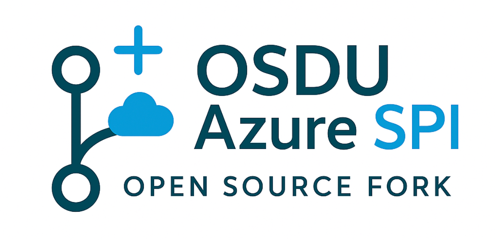

  

    
    
Automated infrastructure for maintaining long-lived forks

  

## The Challenge

Managing forks of OSDU repositories presents unique complexities for organizations developing Cloud Provider-specific implementations. Microsoft must maintain clear separation between:

- **Upstream OSDU Core**: Community-defined interfaces and implementations validated against open-source standards
- **Azure SPI Implementation**: Proprietary Azure-specific technologies and integrations
- **Downstream Managed Service**: Production-ready offerings that use the integrated code of Upstream and SPI to provide managed offerings for enterprise customers

Traditional fork management approaches create integration inefficiencies, delayed releases, and increased risk of divergence from upstream community standards. Manual synchronization processes are error-prone and resource-intensive, particularly when managing frequent contract changes and core code modifications from the upstream OSDU community.

## The Solution

This forked repository solution provides a complete automation framework that streamlines the management of forks through:

  

:material-merge: **Smart Synchronization**

Automated daily upstream integration with AI-enhanced conflict detection and resolution guidance. The system analyzes incoming changes and provides structured analysis of potential impacts.
  

  

:material-source-branch: **Three-Branch Strategy**

A proven branching strategy (`fork_upstream` → `fork_integration` → `main`) that isolates changes at each integration stage, preventing cascade failures and enabling controlled validation.
  

  

:material-robot: **AI-Enhanced Automation**

Intelligent analysis of upstream changes with automated generation of conventional commit messages, pull request descriptions, and conflict categorization using multiple AI providers.
  

  

:material-shield-check: **Enterprise Security**

Built-in vulnerability scanning, compliance checks, and branch protection rules that maintain security posture throughout the automation process.
  

## The Highlights

**Operational Excellence**  
Reduced manual effort, faster integration, and predictable releases. Automated synchronization eliminates 90% of manual integration work while clear validation gates reduce integration time from days to hours.

**Development Efficiency**  
Focus on innovation rather than integration overhead. Systematic upstream integration prevents technical debt accumulation while enforcing clear boundaries between core OSDU and Azure-specific implementations.

**Risk Mitigation**  
Early conflict detection with guided resolution, automated security scanning, and complete audit trail. Comprehensive compliance validation ensures security posture throughout the automation process.

**Architecture Excellence**  
Template repository pattern enables zero-configuration deployment. Event-driven workflows with multi-AI integration provide automated response to upstream changes and comprehensive lifecycle monitoring.

---

*This system represents a mature approach to fork management, incorporating lessons learned from complex enterprise development scenarios and proven automation patterns.*