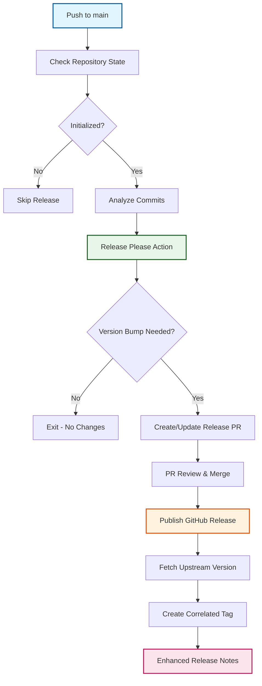

# Release Management Workflow

:material-rocket-launch: **Automated versioning** | :material-file-document-edit: **Intelligent changelogs** | :material-link-variant: **Upstream correlation**

The release management workflow implements sophisticated automated version management using Google's Release Please, providing seamless semantic versioning, comprehensive changelog generation, and upstream version correlation for OSDU SPI fork management.

## Release Philosophy

### :material-auto-fix: Fully Automated Versioning
Release Please analyzes conventional commit history to automatically determine appropriate version bumps, eliminating manual version management while ensuring semantic versioning compliance.

### :material-source-repository: Upstream Integration
Every release maintains correlation with upstream versions, providing clear traceability between fork releases and their corresponding upstream versions for compliance and auditing.

### :material-timeline: Comprehensive Documentation
Automatically generated changelogs categorize changes by type, include relevant links, and provide complete release documentation without manual intervention.

## Release Architecture

### :material-workflow: Automated Release Pipeline



### :material-git: Semantic Version Determination

**Conventional Commit Analysis**:

| Commit Type | Version Impact | Example |
|-------------|----------------|---------|
| `feat!:` or `BREAKING CHANGE:` | **Major** (1.0.0 → 2.0.0) | Complete API redesign |
| `feat:` | **Minor** (1.0.0 → 1.1.0) | New user authentication |
| `fix:` | **Patch** (1.1.0 → 1.1.1) | Bug fixes and patches |
| `upstream:` | **Patch** (1.1.0 → 1.1.1) | Upstream synchronization |
| `chore:`, `docs:`, `style:` | **No Release** | Maintenance tasks |

## Workflow Configuration

### :material-cog: Trigger Configuration
```yaml
on:
  push:
    branches: [main]    # Automatic on main branch changes
  workflow_dispatch:    # Manual trigger capability

permissions:
  contents: write       # Repository content and tags
  pull-requests: write  # Release PR management

env:
  RELEASE_TYPE: 'simple'  # Non-library project versioning
```

### :material-shield-check: Repository State Validation
```yaml
# Ensure repository is properly initialized
- name: Check initialization status
  run: |
    if [ ! -f ".github/workflow.env" ]; then
      echo "::warning::Repository not initialized - skipping release"
      exit 0
    fi
    
    # Verify upstream configuration for correlation
    source .github/workflow.env
    if [ -z "$UPSTREAM_REPO_URL" ]; then
      echo "::warning::Upstream repository not configured"
    fi
```

## Release Please Integration

### :material-robot: Advanced Configuration
```yaml
- name: Run Release Please
  uses: googleapis/release-please-action@v4
  with:
    release-type: simple
    package-name: ${{ github.event.repository.name }}
    
    # Comprehensive changelog configuration
    changelog-types: |
      [
        {"type": "feat", "section": "🚀 Features", "hidden": false},
        {"type": "fix", "section": "🐛 Bug Fixes", "hidden": false},
        {"type": "perf", "section": "⚡ Performance Improvements", "hidden": false},
        {"type": "revert", "section": "🔄 Reverts", "hidden": false},
        {"type": "docs", "section": "📚 Documentation", "hidden": false},
        {"type": "style", "section": "💎 Style", "hidden": false},
        {"type": "refactor", "section": "♻️ Code Refactoring", "hidden": false},
        {"type": "test", "section": "🧪 Tests", "hidden": false},
        {"type": "build", "section": "🏗️ Build System", "hidden": false},
        {"type": "ci", "section": "🤖 CI/CD", "hidden": false},
        {"type": "chore", "section": "🧹 Miscellaneous", "hidden": false},
        {"type": "upstream", "section": "⬆️ Upstream Updates", "hidden": false}
      ]
    
    # Release PR configuration
    pull-request-title-pattern: "chore: release ${version}"
    version-file: "version.txt"
```

### :material-tag: Version Correlation System

#### **Upstream Version Detection**
```yaml
- name: Get upstream version correlation
  if: steps.release.outputs.release_created
  run: |
    # Source repository configuration
    source .github/workflow.env
    
    # Configure upstream remote
    if ! git remote | grep -q upstream; then
      git remote add upstream "$UPSTREAM_REPO_URL"
    fi
    
    # Fetch latest upstream tags
    git fetch upstream --tags --quiet
    
    # Determine latest upstream version
    UPSTREAM_VERSION=$(git describe --tags --abbrev=0 upstream/main 2>/dev/null || echo "unknown")
    UPSTREAM_VERSION=${UPSTREAM_VERSION#v}  # Remove 'v' prefix
    
    echo "upstream_version=$UPSTREAM_VERSION" >> $GITHUB_OUTPUT
    echo "Detected upstream version: $UPSTREAM_VERSION"
```

#### **Correlated Tag Creation**
```yaml
- name: Create upstream-correlated tag
  if: steps.release.outputs.release_created
  run: |
    RELEASE_TAG="${{ steps.release.outputs.tag_name }}"
    UPSTREAM_VERSION="${{ steps.get-upstream.outputs.upstream_version }}"
    
    # Create comprehensive correlation tag
    CORRELATED_TAG="${RELEASE_TAG}-upstream-${UPSTREAM_VERSION}"
    
    # Tag the release commit with correlation
    git tag "$CORRELATED_TAG" "${{ github.sha }}"
    git push origin "$CORRELATED_TAG"
    
    echo "Created correlated tag: $CORRELATED_TAG"
```

### :material-note-edit: Enhanced Release Documentation

#### **Automated Release Notes Enhancement**
```yaml
- name: Update release with upstream correlation
  if: steps.release.outputs.release_created
  uses: actions/github-script@v7
  with:
    script: |
      const releaseId = ${{ steps.release.outputs.id }};
      const upstreamVersion = '${{ steps.get-upstream.outputs.upstream_version }}';
      const correlatedTag = '${{ steps.create-tag.outputs.correlated_tag }}';
      
      // Get current release data
      const { data: release } = await github.rest.repos.getRelease({
        owner: context.repo.owner,
        repo: context.repo.repo,
        release_id: releaseId
      });
      
      // Enhance with upstream correlation information
      const enhancedBody = release.body + `
      
      ## 📌 Upstream Correlation
      
      - **Upstream Version**: \`${upstreamVersion}\`
      - **Correlated Tag**: \`${correlatedTag}\`
      - **Upstream Repository**: ${{ env.UPSTREAM_REPO_URL }}
      
      This release includes all changes from upstream version ${upstreamVersion}.
      `;
      
      // Update the GitHub release
      await github.rest.repos.updateRelease({
        owner: context.repo.owner,
        repo: context.repo.repo,
        release_id: releaseId,
        body: enhancedBody
      });
```

## Changelog Management

### :material-format-list-bulleted: Professional Changelog Format

**Generated CHANGELOG.md Structure**:
```markdown
# Changelog

## [1.2.0](https://github.com/org/repo/compare/v1.1.0...v1.2.0) (2025-05-28)

### 🚀 Features

* Add OAuth2 authentication system ([#123](https://github.com/org/repo/issues/123)) ([abc1234](https://github.com/org/repo/commit/abc1234))
* Implement data export functionality ([#125](https://github.com/org/repo/issues/125)) ([def5678](https://github.com/org/repo/commit/def5678))

### 🐛 Bug Fixes

* Resolve authentication timeout issue ([#124](https://github.com/org/repo/issues/124)) ([ghi9012](https://github.com/org/repo/commit/ghi9012))
* Fix data validation in user service ([#126](https://github.com/org/repo/issues/126)) ([jkl3456](https://github.com/org/repo/commit/jkl3456))

### ⬆️ Upstream Updates

* Sync upstream changes from v2.3.4 ([#127](https://github.com/org/repo/issues/127)) ([mno7890](https://github.com/org/repo/commit/mno7890))

### 🧹 Miscellaneous

* Update development dependencies ([#128](https://github.com/org/repo/issues/128)) ([pqr1234](https://github.com/org/repo/commit/pqr1234))
```

### :material-message: Conventional Commit Examples

**Effective Commit Messages for Release Management**:

```bash
# Feature addition (minor version bump)
feat: implement advanced user search functionality

# Bug fix (patch version bump)  
fix: resolve null pointer exception in data processor

# Breaking change (major version bump)
feat!: redesign authentication API with OAuth2

BREAKING CHANGE: The authentication API now requires OAuth2 tokens
instead of API keys. Existing integrations must be updated.

# Upstream integration (patch version bump)
upstream: sync security fixes from upstream v2.3.4

# Maintenance (no version bump)
chore: update CI/CD pipeline configuration
docs: improve API documentation with examples
style: format code with prettier
```

## Advanced Configuration

### :material-cog-outline: Release Please Configuration Files

#### **.release-please-config.json**
```json
{
  "packages": {
    ".": {
      "release-type": "simple",
      "bump-minor-pre-major": true,
      "bump-patch-for-minor-pre-major": true,
      "include-component-in-tag": false,
      "changelog-sections": [
        {"type": "feat", "section": "🚀 Features"},
        {"type": "fix", "section": "🐛 Bug Fixes"},
        {"type": "upstream", "section": "⬆️ Upstream Updates"},
        {"type": "perf", "section": "⚡ Performance"},
        {"type": "docs", "section": "📚 Documentation"},
        {"type": "chore", "section": "🧹 Maintenance"}
      ]
    }
  }
}
```

#### **version.txt**
```
1.2.0
```

#### **.release-please-manifest.json**
```json
{
  ".": "1.2.0"
}
```

## Error Handling and Reliability

### :material-alert-circle: Common Scenarios and Resolutions

#### **No Releasable Commits Detection**
```yaml
- name: Validate commit history for releases
  run: |
    COMMITS=$(git log --format=%s ${{ github.event.before }}..${{ github.sha }})
    if ! echo "$COMMITS" | grep -qE '^(feat|fix|perf|revert)(\(.+\))?!?:'; then
      echo "::notice::No releasable commits found - skipping release"
      echo "Commits must use 'feat:', 'fix:', 'perf:', or 'revert:' for releases"
    fi
```

#### **Upstream Connectivity Issues**
```yaml
- name: Handle upstream fetch failures gracefully
  continue-on-error: true
  run: |
    if ! git fetch upstream --tags --timeout=30; then
      echo "::warning::Could not fetch upstream tags - using fallback"
      echo "upstream_version=unavailable" >> $GITHUB_OUTPUT
    fi
```

#### **Release PR Conflicts**
```yaml
- name: Resolve release PR conflicts automatically
  if: steps.release.outputs.pr && steps.release.outputs.pr_has_conflicts
  run: |
    # Checkout release PR branch
    gh pr checkout ${{ steps.release.outputs.pr }}
    
    # Attempt automatic rebase
    git pull origin main --rebase
    
    # Force push if successful
    git push --force-with-lease
```

### :material-shield-check: Release Validation

#### **Release Integrity Verification**
```yaml
- name: Validate release integrity
  if: steps.release.outputs.release_created
  run: |
    # Verify tag creation
    git fetch --tags
    if ! git tag -l | grep -q "^${{ steps.release.outputs.tag_name }}$"; then
      echo "::error::Release tag not found after creation"
      exit 1
    fi
    
    # Verify changelog update
    if ! git diff HEAD^ HEAD -- CHANGELOG.md | grep -q "+## "; then
      echo "::warning::Changelog may not have been updated properly"
    fi
    
    # Verify version file update
    if [ -f "version.txt" ]; then
      if ! grep -q "${{ steps.release.outputs.version }}" version.txt; then
        echo "::warning::Version file not updated correctly"
      fi
    fi
```

## Performance Optimization

### :material-lightning-bolt: Efficient Execution Strategies

#### **Conditional Release Processing**
```yaml
- name: Optimize execution based on change detection
  run: |
    # Skip if no commits since last release
    LAST_RELEASE=$(git describe --tags --abbrev=0 2>/dev/null || echo "")
    if [ -n "$LAST_RELEASE" ]; then
      CHANGES=$(git rev-list --count $LAST_RELEASE..HEAD)
      if [ "$CHANGES" -eq 0 ]; then
        echo "::notice::No commits since last release - skipping"
        exit 0
      fi
    fi
```

#### **Caching Strategy**
```yaml
- name: Cache Release Please data
  uses: actions/cache@v4
  with:
    path: |
      .release-please/
      .release-please-manifest.json
    key: release-please-${{ github.ref }}-${{ hashFiles('**/*.md', '**/*.json') }}
    restore-keys: |
      release-please-${{ github.ref }}-
      release-please-
```

## Monitoring and Analytics

### :material-chart-line: Release Metrics Collection

#### **Release Quality Metrics**
```yaml
- name: Collect comprehensive release metrics
  if: steps.release.outputs.release_created
  run: |
    # Calculate time since last release
    LAST_RELEASE_DATE=$(git log -1 --format=%ai $(git describe --tags --abbrev=0 HEAD^ 2>/dev/null || echo HEAD))
    DAYS_SINCE_RELEASE=$(( ($(date +%s) - $(date -d "$LAST_RELEASE_DATE" +%s)) / 86400 ))
    
    # Count commits included in release
    LAST_TAG=$(git describe --tags --abbrev=0 HEAD^ 2>/dev/null || echo "")
    COMMIT_COUNT=$(git rev-list --count ${LAST_TAG:+$LAST_TAG..}HEAD)
    
    # Categorize changes by type
    FEAT_COUNT=$(git log --format=%s ${LAST_TAG:+$LAST_TAG..}HEAD | grep -c "^feat:" || echo 0)
    FIX_COUNT=$(git log --format=%s ${LAST_TAG:+$LAST_TAG..}HEAD | grep -c "^fix:" || echo 0)
    UPSTREAM_COUNT=$(git log --format=%s ${LAST_TAG:+$LAST_TAG..}HEAD | grep -c "^upstream:" || echo 0)
    
    echo "📊 Release Metrics:"
    echo "- Days since last release: $DAYS_SINCE_RELEASE"
    echo "- Total commits: $COMMIT_COUNT"
    echo "- Features: $FEAT_COUNT"
    echo "- Bug fixes: $FIX_COUNT"  
    echo "- Upstream updates: $UPSTREAM_COUNT"
```

### :material-notification: Release Notifications

#### **Team Communication Integration**
```yaml
- name: Notify team of new release
  if: steps.release.outputs.release_created
  run: |
    # Create comprehensive release summary
    RELEASE_URL="${{ steps.release.outputs.html_url }}"
    VERSION="${{ steps.release.outputs.version }}"
    CORRELATED_TAG="${{ steps.create-tag.outputs.correlated_tag }}"
    
    echo "🎉 New release published: v$VERSION"
    echo "📋 Release URL: $RELEASE_URL"
    echo "🔗 Correlated tag: $CORRELATED_TAG"
    echo "⬆️ Upstream version: ${{ steps.get-upstream.outputs.upstream_version }}"
```

## Troubleshooting Guide

### :material-help-circle: Common Issues and Solutions

#### **Release Please PR Not Created**
- **Cause**: No conventional commits found in history
- **Solution**: Ensure commits follow conventional commit format
- **Debug**: Check recent commits with `git log --format="%s" -10`

#### **Version Not Incrementing**
- **Cause**: Only non-release commit types present
- **Solution**: Use `feat:`, `fix:`, or `perf:` for version bumps
- **Debug**: Verify commit types match Release Please configuration

#### **Upstream Version Correlation Missing**
- **Cause**: Upstream remote not accessible or no tags
- **Solution**: Verify `UPSTREAM_REPO_URL` configuration and network access
- **Debug**: Test with `git ls-remote --tags upstream`

#### **Changelog Generation Issues**
- **Cause**: Commit format not matching changelog configuration
- **Solution**: Update changelog-types configuration or commit format
- **Debug**: Review Release Please configuration against commit history

### :material-console: Debug Commands

```bash
# Verify conventional commit format
git log --format="%s" | grep -E "^(feat|fix|docs|style|refactor|test|chore)(\(.+\))?:"

# Check Release Please state
cat .release-please-manifest.json

# Test upstream connectivity  
git ls-remote --tags upstream

# Review recent release history
git tag --sort=-version:refname | head -5

# Analyze commit types since last release
git log --format="%s" $(git describe --tags --abbrev=0)..HEAD
```

---

*The release management workflow provides automated, reliable version management with comprehensive documentation and upstream correlation, ensuring professional release processes for OSDU SPI fork management.*